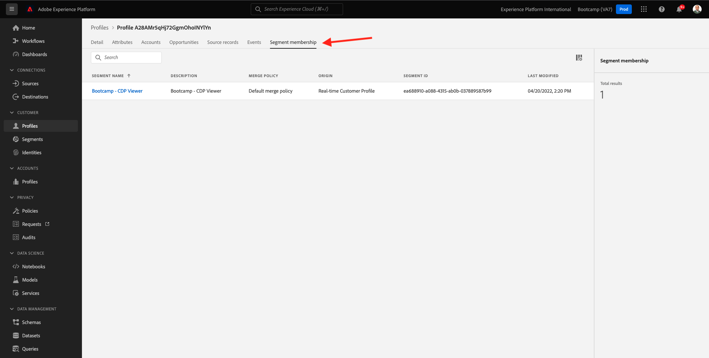

# 1.2 Visualize seu próprio perfil de cliente em tempo real - UI

Neste exercício, você irá fazer login na Adobe Experience Platform e visualizar seu próprio Perfil de cliente em tempo real na UI.
 
## História

No Perfil do cliente em tempo real, todos os dados do perfil são exibidos juntamente com os dados do evento, além das associações de segmentos existentes. Os dados mostrados podem vir de qualquer lugar, de aplicativos da Adobe e soluções externas. Essa é a exibição mais poderosa da Adobe Experience Platform, o verdadeiro local do sistema de experiência.

## 1.2.1 Use a visualização do perfil do cliente na Adobe Experience Platform

Acesse [Adobe Experience Platform](https://experience.adobe.com/platform). Depois de fazer login, você irá acessar a página inicial da Adobe Experience Platform.

Antes de continuar, você precisa selecionar um **sandbox**. O nome do sandbox a ser selecionado é Bootcamp. É possível fazer isso clicando no texto **[!UICONTROL Production Prod]** na linha azul na parte superior da tela. Depois de selecionar o sandbox apropriado, você verá a tela mudando e agora você está em seu [!UICONTROL sandbox] dedicado. 

No menu à esquerda, acesse **Profiles** e **Browse**.

No painel Visualizador de perfil no seu site, você pode encontrar a visão geral da identidade. Cada identidade está vinculada a um namespace. 

No painel Visualizador de perfil, agora você pode ver uma identidade semelhante a seguinte:

| Namespace     | Identity       |
|:-------------:| :---------------:|
| Experience Cloud ID (ECID)          | 19428085896177382402834560825640259081 |

Com a Adobe Experience Platform, todos os IDs são igualmente importantes. Anteriormente, o ECID era o ID mais importante no contexto da Adobe e todos os outros IDs estavam vinculados ao ECID em uma relação hierárquica. Com a Adobe Experience Platform, isso mudou e cada ID pode ser considerado um identificador primário.

Normalmente, o identificador primário depende do contexto. Se você perguntar ao seu Call Center: **Qual é o ID mais importante?** Eles provavelmente responderão: **o número de telefone!** Mas se você perguntar à sua equipe de CRM, eles responderão: **o endereço de e-mail!** A Adobe Experience Platform entende essa complexidade e gerencia isso para você. Cada aplicativo, seja um aplicativo da Adobe ou não, se comunicará com a Adobe Experience Platform referindo-se ao ID que consideram principal. E simplesmente funciona. 

Para o campo **Identity namespace**, selecione **ECID** e para o campo **Identity Value** insira o ECID que você pode encontrar no painel Visualizador de perfil do site do Bootcamp. Clique em **View**. Você verá seu perfil na lista. Clique no **Profile ID** para abrir seu perfil. 

Agora você tem uma visão geral de alguns **Atributos de perfil** importantes do seu perfil de cliente. 

Acesse **Events**, onde você pode ver as entradas de cada evento de experiência vinculado ao seu Perfil.    

Por fim, acesse a opção de menu **Segment membership**. Agora você verá todos os segmentos que se qualificam para este perfil. 

Agora vamos criar um novo segmento que permitirá que você personalize a experiência do cliente para um cliente anônimo ou conhecido. 

Próxima etapa: [1.3 Crie um segmento - UI](./ex3.md)

[Retornar para Fluxo de Usuário 1](./uc1.md)

[Retornar para Todos os Módulos](../../overview.md)
