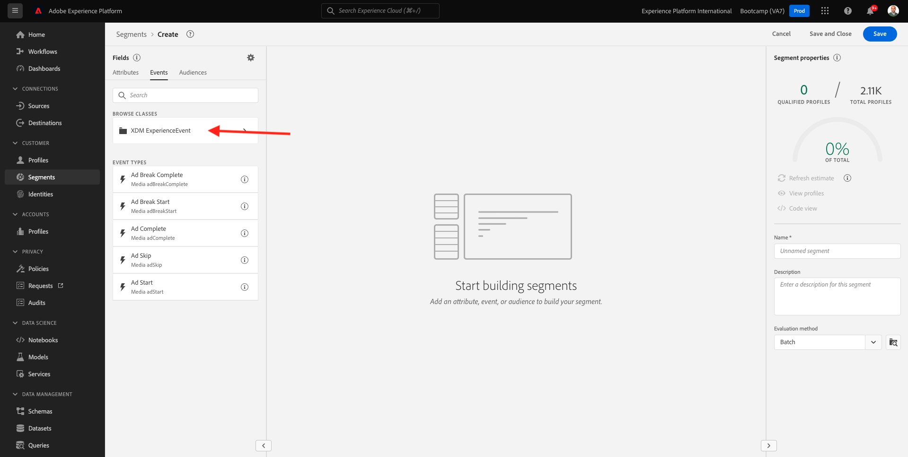
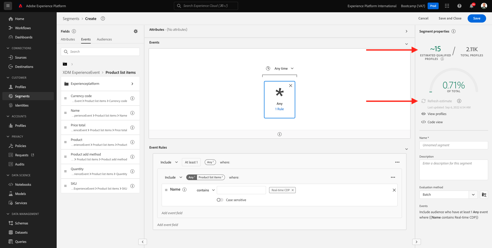
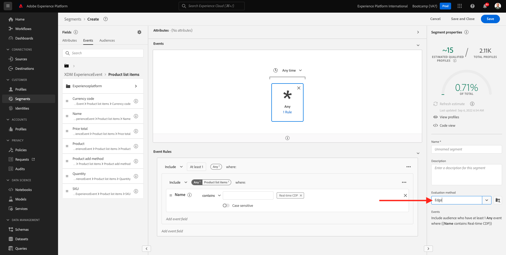

# 1.3 Create a segment - UI

In this exercise, you'll create a segment by making use of Adobe Experience Platform's Segment Builder.

## Story

Go to [Adobe Experience Platform](https://experience.adobe.com/platform). After logging in, you'll land on the homepage of Adobe Experience Platform.

Before you continue, you need to select a **sandbox**. The sandbox to select is named ``Bootcamp``. You can do this by clicking the text **[!UICONTROL Production Prod]** in the blue line on top of your screen. After selecting the appropriate [!UICONTROL sandbox], you'll see the screen change and now you're in your dedicated [!UICONTROL sandbox].

In the menu on the left side, go to **Segments**. On this page, you can see an overview of all existing segments. Click on the **+ Create segment** button to start creating a new segment.

Once you're in the new segment builder, you immediately notice the **Attributes** menu option and the **XDM Individual Profile** reference.

Since XDM is the language that powers the experience business, XDM is also the foundation for the segment builder. All data that is ingested in Platform should be mapped against XDM, and as such, all data becomes part of the same data model regardless of where that data comes from. This gives you a big advantage when building segments, as from this one segment builder UI, you can combine data from any origin in the same workflow. Segments built within Segment Builder can be sent to solutions like Adobe Target, Adobe Campaign and Adobe Audience Manager for activation.

You now need to create a segment of all customers that have viewed the product **Real-Time CDP**.

To build out this segment, you need to add an Experience Event. You can find all Experience Events by clicking on the **Events** icon in the **Fields** menu bar.

Next, you'll see the top-level, **XDM ExperienceEvents** node. Click on **XDM ExperienceEvent**.

Go to **Product List Items**.

Select **Name** and drag and drop the **Name** object from the left menu onto the segment builder canvas into the **Events** section. You'll then see this:

The comparison parameter should be **equals** and in the input field, enter **Real-time CDP**.

Every time you add an element to the segment builder, you can click the **Refresh Estimate** button to get a new estimate of the population in your segment.

As **Evaluation Method**, select **Edge**.

Finally, let's give your segment a name and save it.

As a naming convention, use:

- `yourLastName - Interest in Real-Time CDP`

Then, click the **Save and Close** button to save your segment.

You'll be taken back to the segment overview page now, where you'll see a sample preview of customer profiles that qualify for your segment.

You can now continue to the next exercise and use your segment with Adobe Target.

Next Step: [1.4 Take Action: send your segment to Adobe Target](./ex4.md)

[Go Back to User Flow 1](./uc1.md)

[Go Back to All Modules](../../overview.md)
