# 1.4 Ação: envie seu segmento para o Adobe Target

Acesse [Adobe Experience Platform](https://experience.adobe.com/platform). Depois de fazer login, você irá acessar a página inicial da Adobe Experience Platform.

Antes de continuar, você precisa selecionar um **sandbox**. O nome do sandbox a ser selecionado é Bootcamp. É possível fazer isso clicando no texto **[!UICONTROL Production Prod]** na linha azul na parte superior da tela. Depois de selecionar o sandbox apropriado, você verá a tela mudando e agora você está em seu [!UICONTROL sandbox] dedicado. 

## 1.4.1 Ative seu segmento para o destino do Adobe Target

O Adobe Target está disponível como um destino do CDP em tempo real. Para configurar sua integração com o Adobe Target, acesse **Destinations** e **Catalog**. 

Clique em **Personalization** no menu **Categories**. Você verá o cartão de destino do **Adobe Target**. Clique em **Activate Segments**. 

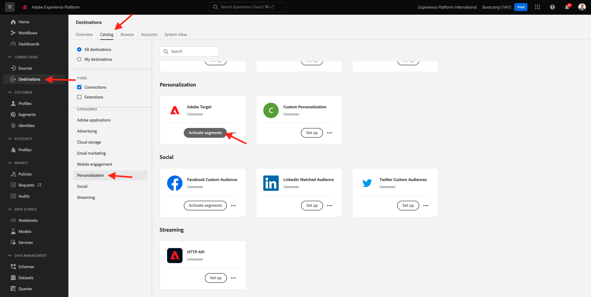

Selecione o destino ``Bootcamp Target`` e clique **Next**.

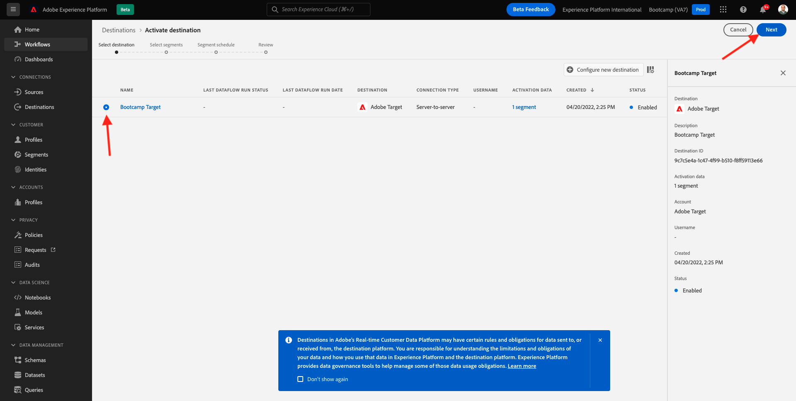

Na lista de segmentos disponíveis, selecione o segmento que você criou em [1.3 Crie um segmento](./ex3.md), com o nome `yourLastName - Interest in Real-Time CDP`. Em seguida, clique em **Next**. 

Na próxima página, clique em **Next**.

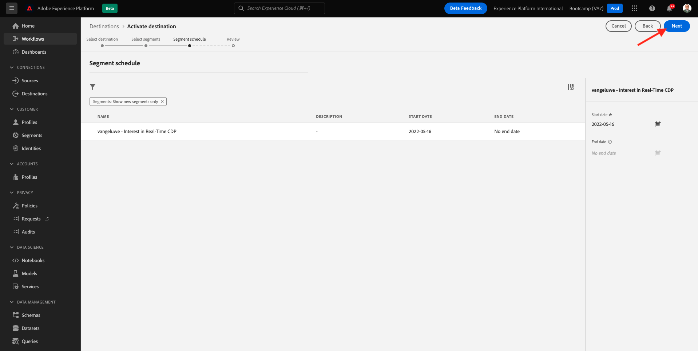

Clique em **Finish**. 

Seu segmento agora está ativado para o Adobe Target.

>[!IMPORTANT]
>
>Imediatamente após criar seu destino do Adobe Target no Real-Time CDP, pode levar até uma hora para que o destino seja ativado. Este é um tempo de espera único devido à definição da configuração de back-end. Depois que o tempo de espera inicial de 1 hora e a configuração do back-end forem concluídos, os segmentos de borda recém-adicionados que são enviados ao destino do Adobe Target estarão disponíveis para segmentação em tempo real.

## 1.4.2 Configure sua atividade baseada em formulário do Adobe Target 

Agora que seu segmento Real-Time CDP está configurado para ser enviado ao Adobe Target, é possível configurar sua atividade de Segmentação por experiência no Adobe Target. Neste exercício, você irá configurar uma atividade baseada no Visual Experience Composer.

Acesse a página inicial da Adobe Experience Cloud acessando [https://experiencecloud.adobe.com/](https://experiencecloud.adobe.com/). Clique em **Target** para abrir.

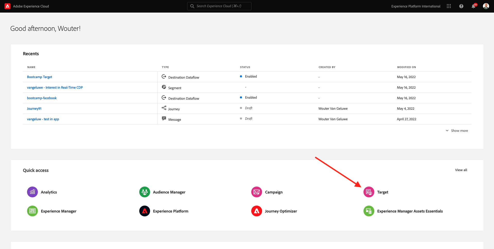

On the **Adobe Target** homepage, you'll see all existing Activities.
Click **+ Create Activity** to create a new Activity.
Na página inicial do **Adobe Target**, você verá todas as atividades existentes. 
Clique em **+ Create Activity** para criar uma nova atividade. 

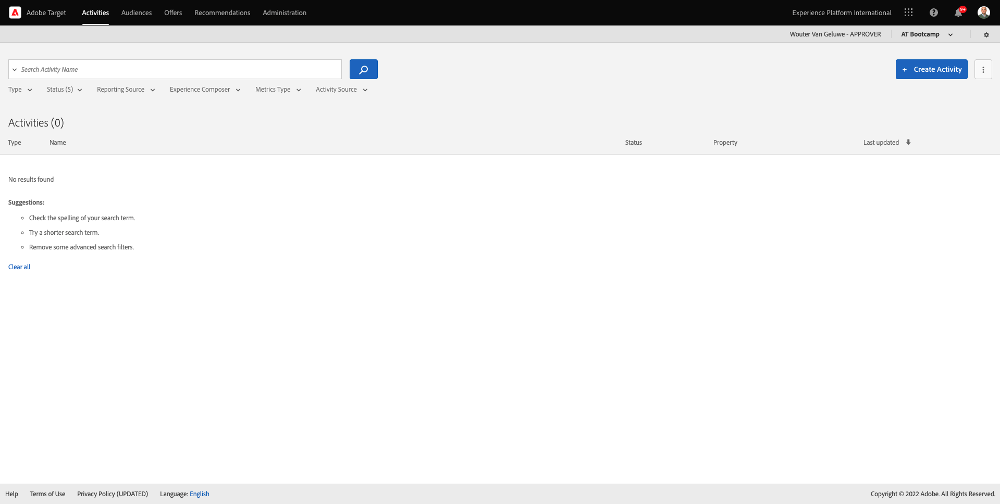

Selecione **Experience Targeting**.

Selecione **Visual** e defina a **Activity URL** como `https://bootcamp.aepdemo.net/content/aep-bootcamp-experience/language-masters/en/exercises/particpantXX.html`,  mas, antes disso, substitua XX por um número entre 01 e 30.

>[!IMPORTANT]
>
>Cada participante da capacitação deve usar uma página da Web separada para evitar a colisão de várias experiências do Adobe Target. É possível escolher uma página da Web e encontrar a URL acessando: [https://bootcamp.aepdemo.net/content/aep-bootcamp-experience/language-masters/en/exercises.html](https://bootcamp.aepdemo.net/content/aep-bootcamp-experience/language-masters/en/exercises.html). 
>
>Todas as páginas compartilham a mesma URL base e terminam com o número do participante. 
>
>Por exemplo, o participante 1 deve usar a URL `https://bootcamp.aepdemo.net/content/aep-bootcamp-experience/language-masters/en/exercises/particpant01.html`, o participante 30 deve usar a URL `https://bootcamp.aepdemo.net/content/aep-bootcamp-experience/language-masters/en/exercises/particpant30.html`.

Selecione o workspace **AT Bootcamp**.

Clique em **Next**. 

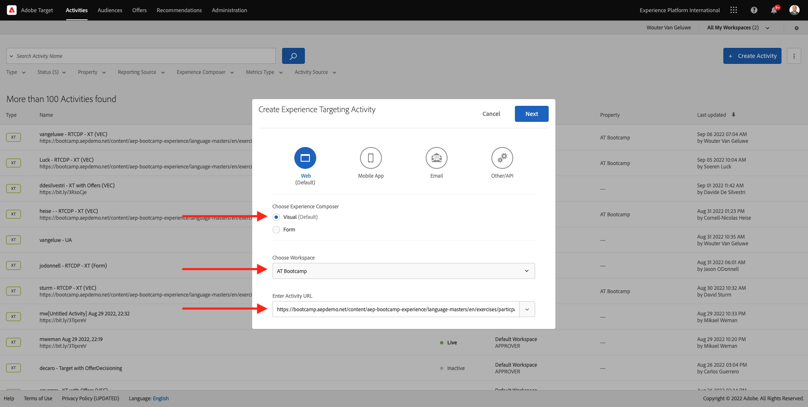

Agora você está no Visual Experience Composer. Pode levar de 20 a 30 segundos até que o site esteja completamente carregado. 

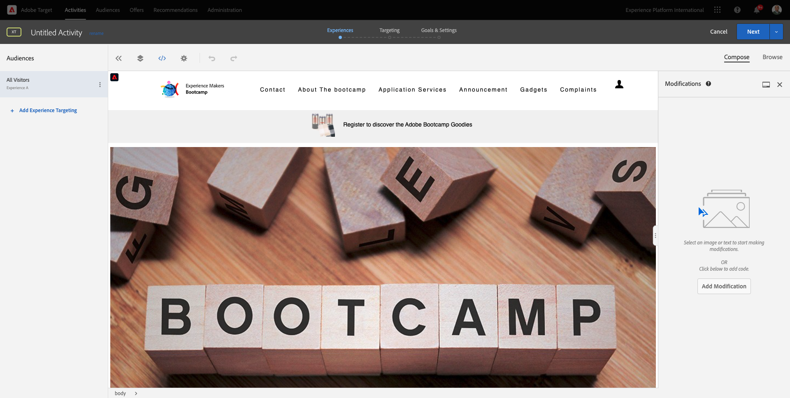

Atualmente, o público padrão são **All Visitors**. Clique nos **3 dots** ao lado de **All Visitors** e clique em **Change Audience**.

Agora você está vendo a lista de públicos disponíveis, e o segmento da Adobe Experience Platform que você criou anteriormente e enviou ao Adobe Target agora faz parte dessa lista. Selecione o segmento que você criou anteriormente na Adobe Experience Platform. Clique em **Assign Audience**. 

Seu segmento da Adobe Experience Platform agora faz parte dessa Atividade de segmentação por experiência.

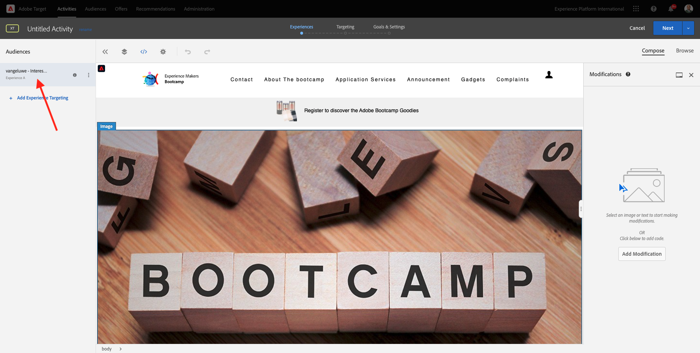

Antes de alterar a imagem principal, você deve clicar em **Allow All** no banner de cookies. 

Para isso, vá para **Browse**

Em seguida, clique em **Allow All**.

Em seguida, retorne para **Compose**.

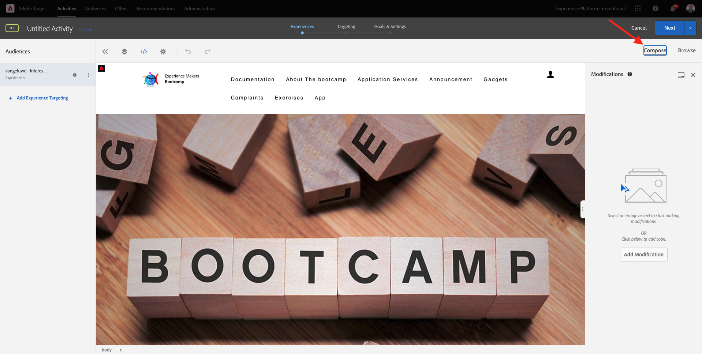

Agora vamos mudar a imagem principal na página inicial do site. Clique na imagem principal padrão no site, clique em **Replace Content** e selecione **Image**. 

Pesquise o arquivo de imagem **rtcdp.png**. Selecione e clique em **Save**.

Você verá a nova experiência com a nova imagem para o seu Público selecionado

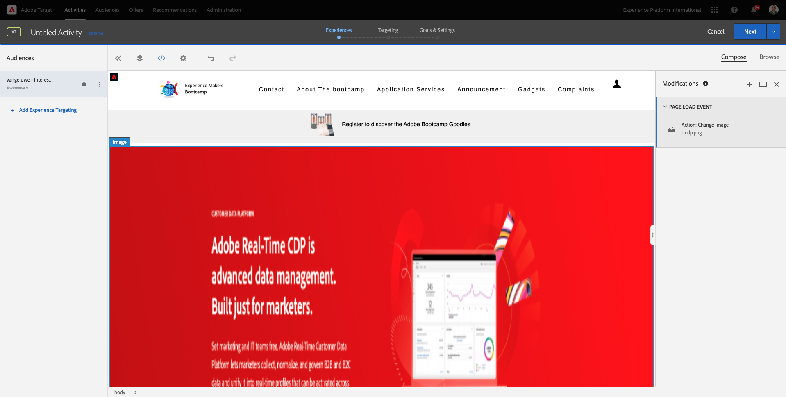

Clique no título da sua atividade no canto superior esquerdo para renomeá-la.

Para o nome, use:

- `yourLastName - RTCDP - XT (VEC)`

Clique em **Next**.

Clique em **Next**.

Na página **Goals & Settings**, acesse **Goal Metrics**. 

Defina a Meta principal como **Engagement** - **Time On Site**. Clique em **Save & Close**. 

Agora você está na página **Activity Overview**. Você ainda precisa ativar sua Atividade. 

Clique no campo **Inactive** e selecione **Activate**. 

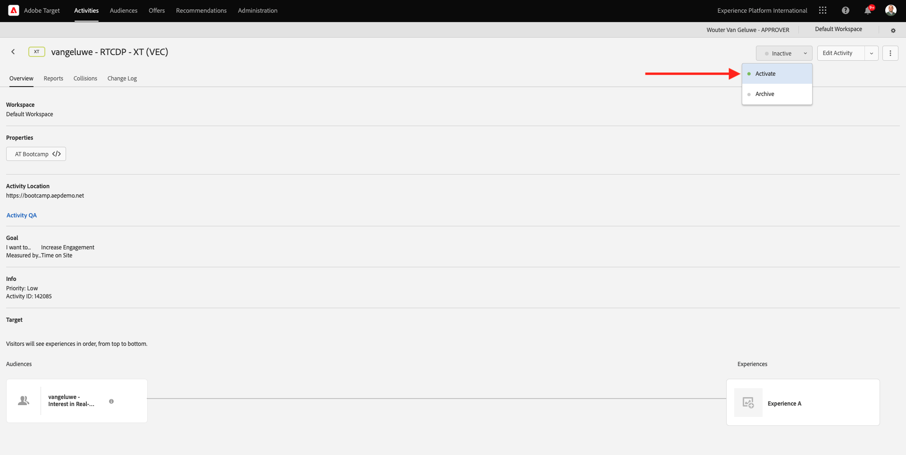

Você receberá uma confirmação visual de que sua atividade agora está ativa.

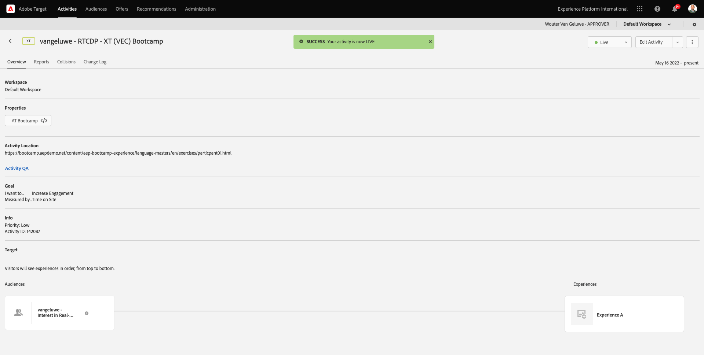

Agora sua atividade está ativa e pode ser testada no site do bootcamp. 

Se agora você voltar ao seu site de demonstração e visitar a página do produto para **Real-Time CDP**, você se qualificará instantaneamente para o segmento que criou e verá a atividade do Adobe Target exibida na página inicial em tempo real. 

>[!IMPORTANT]
>
>Cada participante da capacitação deve usar uma página da Web separada para evitar a colisão de várias experiências do Adobe Target. É possível escolher uma página da Web e encontrar a URL acessando ao link: [https://bootcamp.aepdemo.net/content/aep-bootcamp-experience/language-masters/en/exercises.html](https://bootcamp.aepdemo.net/content/aep-bootcamp-experience/language-masters/en/exercises.html). 
>
>Todas as páginas compartilham a mesma URL base e terminam com o número do participante.
>
>Por exemplo, o participante 1 deve usar a `https://bootcamp.aepdemo.net/content/aep-bootcamp-experience/language-masters/en/exercises/particpant01.html`, o participante 30 deve usar a URL `https://bootcamp.aepdemo.net/content/aep-bootcamp-experience/language-masters/en/exercises/particpant30.html`.

Próxima etapa: [1.5 Take Action: send your segment to Facebook](./ex5.md)

[Retornar para Fluxo de Usuário 1](./uc1.md)

[Retornar para Todos os Módulos](../../overview.md)
