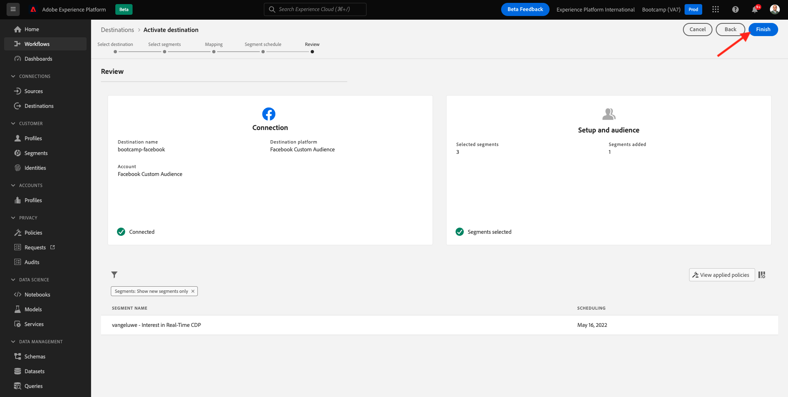
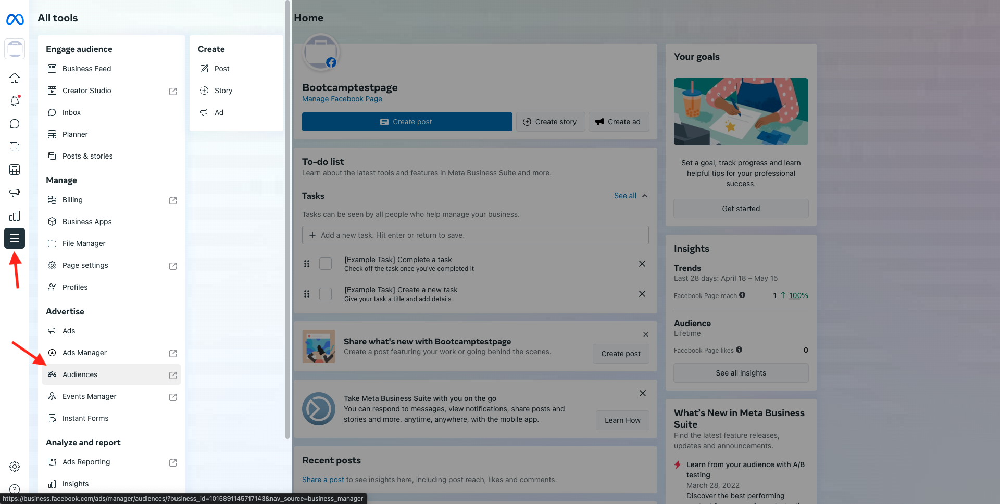
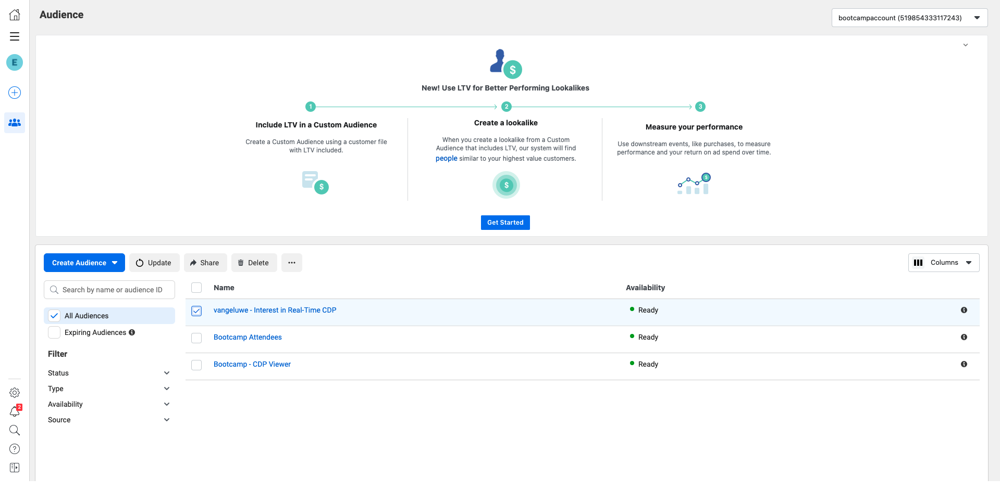

# 1.5 Ação: envie seu segmento para o Facebook

Acesse [Adobe Experience Platform](https://experience.adobe.com/platform). Depois de fazer login, você irá acessar a página inicial da Adobe Experience Platform.

Antes de continuar, você precisa selecionar um **sandbox**. O nome do sandbox a ser selecionado é Bootcamp. É possível fazer isso clicando no texto **[!UICONTROL Production Prod]** na linha azul na parte superior da tela. Depois de selecionar o sandbox apropriado, você verá a tela mudando e agora você está em seu [!UICONTROL sandbox] dedicado. 

No menu à esquerda, vá para **Destinations** e, em seguida, vá para **Catalog**. Você verá o **Destinations Catalog**. Em **Destinations**, clique em **Activate Segments** no cartão **Facebook Custom Audience**. 

Selecione o **bootcamp-facebook** e clique em **Next**. 

Na lista de segmentos disponíveis, selecione o segmento que você criou no exercício anterior. Clique em **Next**. 

Na página **Mapping**, verifique se a caixa de seleção **Apply Transformation** está marcada. Clique em **Next**. 

Na página **Segment Schedule**, selecione a **Origin of your audience** e defina como **Directly from customers**. Clique em **Next**. 

Por fim, na página **Review**, clique em **Finish**. 

Seu segmento agora está vinculado aos Públicos Personalizados do Facebook. Sempre que um cliente se qualificar para esse segmento, um sinal será enviado ao lado do servidor (server-side) do Facebook para incluir esse cliente no Público Personalizado no lado do Facebook. 

No Facebook, você encontrará seu segmento da Adobe Experience Platform em Públicos Personalizados:

Agora você pode ver seu público personalizado aparecer no Facebook:

[Retornar para Fluxo de Usuário 1](./uc1.md)

[Retornar para Todos os Módulos](../../overview.md)
