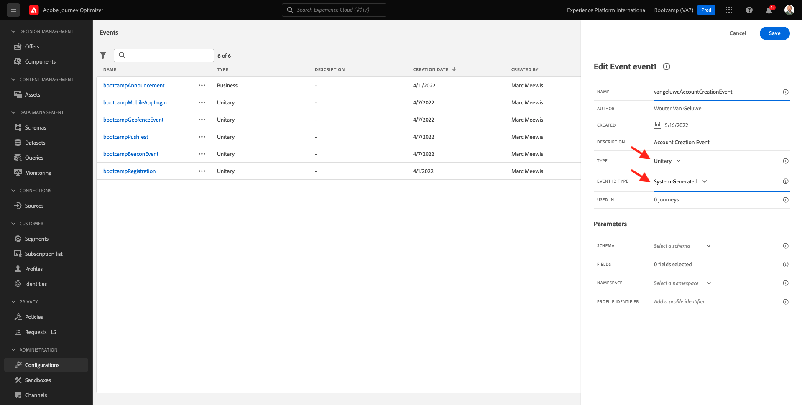
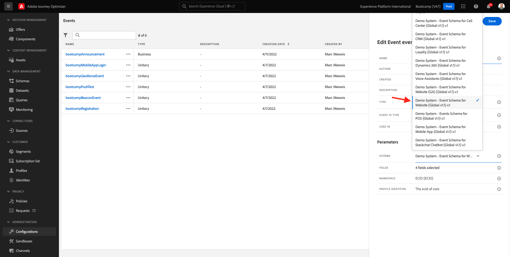
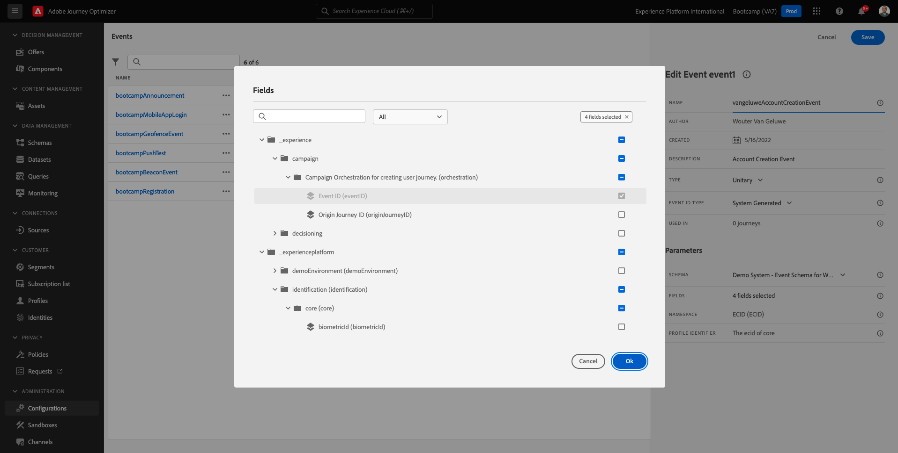
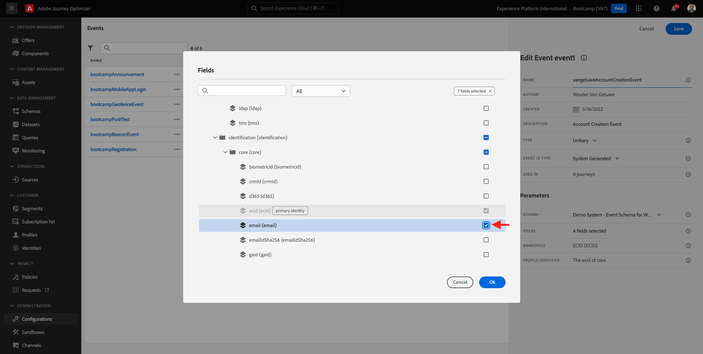
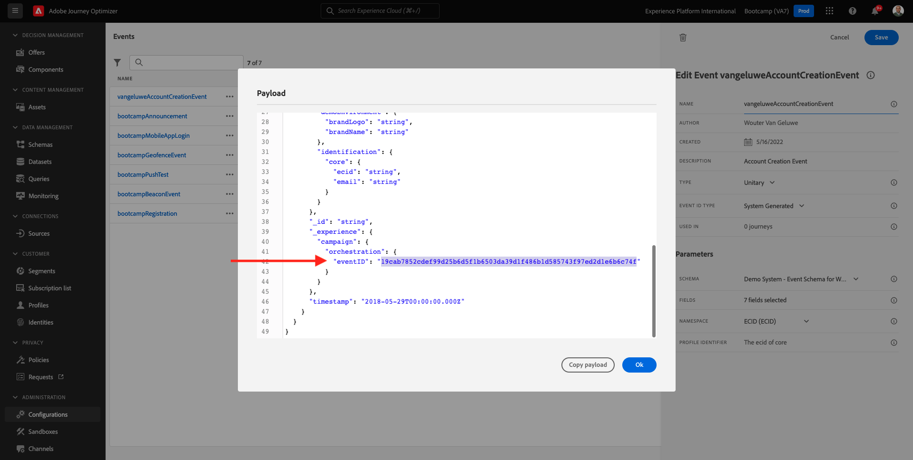

# 2.2 Crie seu evento

Faça login no Adobe Journey Optimizer acessando a [Adobe Experience Cloud](https://experience.adobe.com). Clique em **Journey Optimizer**.

Você será redirecionado para a visualização da **Home** no Journey Optimizer. Primeiro, verifique se você está usando o sandbox correto. O nome do sandbox que deve ser usado é `Bootcamp`. Para alternar de um sandbox para outro, clique em Prod e selecione o sandbox na lista. Neste exemplo, o nome do sandbox é **Bootcamp**. Você estará na visualização da **Home** do seu sandbox `Bootcamp`. 

No menu à esquerda, role para baixo e clique em **Configurations**. Em seguida, clique no botão **Manage** abaixo de **Events**. 

Você verá uma visão geral de todos os eventos disponíveis. Clique em **Create Event** para começar a criar seu próprio evento. 

Uma nova janela de evento vazia irá aparecer.

Em primeiro lugar, dê um nome ao seu evento como, por exemplo: `seuSobrenomeAccountCreationEvent` e adicione uma descrição como, por exemplo: `Account Creation Event`.

Em seguida, certifique-se de que **Type** está definido como **Unitary** e, para a seleção de **Event ID Type**, selecione **System Generated**. 

A etapa seguinte é a seleção do schema. Um schema foi preparado para este exercício. Use o schema `Demo System - Event Schema for Website (Global v1.1) v.1`.

Depois de selecionar o Schema, você verá vários campos sendo selecionados na seção **Fields**. Agora você deve passar o mouse sobre a seção **Fields** e três ícones pop-up serão exibidos. Clique no ícone **Edit**. 

Você verá uma janela pop-up de **Fields**, onde você deve selecionar alguns dos campos que precisamos para personalizar o e-mail. Escolheremos outros atributos de perfil posteriormente, utilizando os dados já existentes na Adobe Experience Platform. 

No objeto `_experienceplatform.demoEnvironment`, pcertifique-se de selecionar os campos **brandLogo** e **brandName**.

No objeto `_experienceplatform.identification.core`, certifique-se de selecionar o campo **email**.

Clique em **Ok** to para salvar suas alterações.

Em seguida, a tela abaixo deve ser exibida. Clique em **Save**  mais uma vez para salvar suas alterações..

Seu evento agora está configurado e salvo.

Clique no seu evento novamente para abrir mais uma vez a tela **Edit Event**. Passe o mouse sobre **Fields** para ver os 3 ícones outra vez. Clique no ícone **View Payload**. 

Agora você verá um exemplo da carga útil esperada. 
Seu evento tem um eventID de orquestração único, que você pode encontrar rolando para baixo nessa carga útil (payload) até visualizar `_experience.campaign.orchestration.eventID`.

O eventID é o que deve ser enviado à Adobe Experience Platform para acionar a jornada que você construirá em um dos próximos exercícios. Lembre-se deste eventID, você pode precisar dele posteriormente.
`"eventID": "19cab7852cdef99d25b6d5f1b6503da39d1f486b1d585743f97ed2d1e6b6c74f"`

Clique em **Ok** e, em seguida, clique em **Cancel**. 

Agora você terminou este exercício. 

Próxima etapa: [ 2.3 Crie sua mensagem de e-mail](./ex3.md)

[Retornar para Fluxo de Usuário 2](./uc2.md)

[Retornar para Todos os Módulos](../../overview.md)
