# 2.3 Crie sua jornada e mensagem de e-mail

Neste exercício, você irá configurar a jornada que precisa ser acionada quando alguém criar uma conta no site de demonstração. 

Faça login no Adobe Journey Optimizer acessando a [Adobe Experience Cloud](https://experience.adobe.com). Clique em **Journey Optimizer**.

Você será redirecionado para a visualização da **Home**  no Journey Optimizer. Primeiro, verifique se você está usando o sandbox correto. O nome do sandbox que deve ser usado é `Bootcamp`. Para alternar de um sandbox para outro, clique em **Prod** e selecione o sandbox na lista. Neste exemplo, o nome do sandbox é **Bootcamp**. Você estará na visualização da **Home** do seu sandbox `Bootcamp`. 

## 2.3.1 Crie a sua jornada

No menu à esquerda, clique em **Journeys**. Em seguida, clique em **Create Journey** para criar uma nova jornada. 

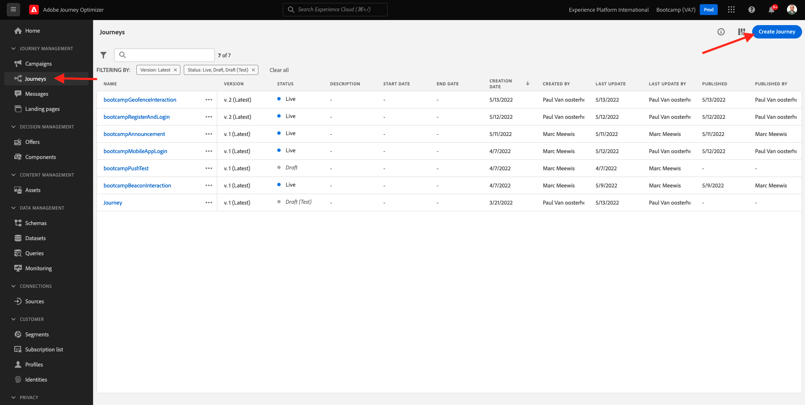

Você verá uma tela de jornada vazia.

No exercício anterior, você criou um novo **Event**. Você nomeou o evento `seuSobrenomeAccountCreationEvent` e substituiu `seuSobrenome` pelo seu sobrenome. Este foi o resultado da criação do Evento: 

Agora você deve considerar este evento como o início desta Jornada. Você pode fazer isso indo para o lado esquerdo da tela e procurando pelo seu evento na lista de eventos.

Selecione seu evento, arraste e solte o evento na tela de Jornada. Sua Jornada agora deve ser semelhante ao seguinte:

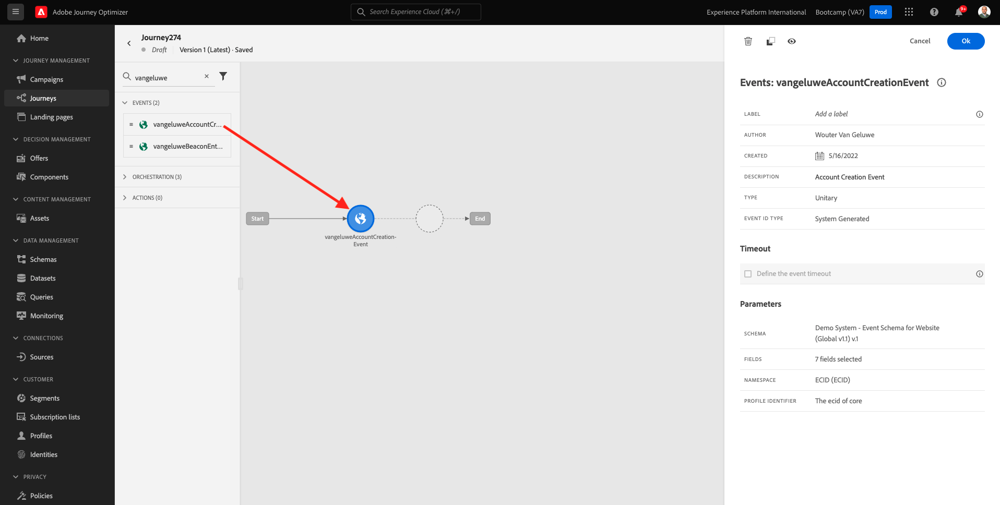

Como segunda etapa da jornada, você deve adicionar uma etapa curta de **Wait**. Vá para o lado esquerdo da tela até a seção **Orchestration** para encontrar isso. Você usará atributos de perfil e precisará garantir que eles sejam preenchidos no Perfil do Cliente em tempo real.

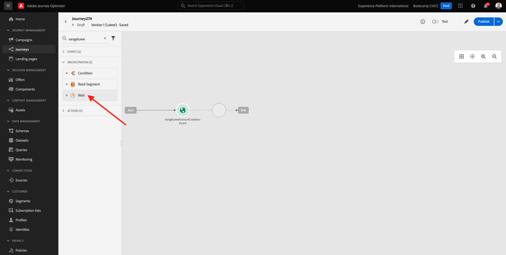

Sua jornada agora deve ser semelhante ao seguinte. No lado direito da tela você precisa configurar o tempo de espera. Defina como 1 minuto. Isso dará bastante tempo para que os atributos do perfil estejam disponíveis após o disparo do evento.

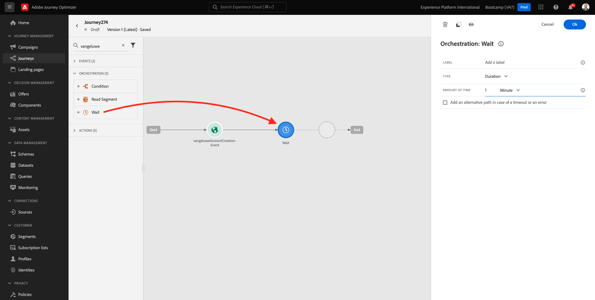

Clique em **Ok** para salvar suas alterações.

Como terceira etapa da jornada, você deve adicionar uma ação **Email**. Vá para o lado esquerdo da tela para **Actions**, selecione a ação **Email** e arraste e solte a ação no segundo nó da sua jornada. Agora o seguinte será exibido. 

Defina a **Category** como **Marketing** e selecione uma **e-mail surface** que permita o envio de e-mail. Nesse caso, a **e-mail surface** a ser selecionada é E-mail. Certifique-se de que as caixas de seleção **Clicks on email** e **email opens** estejam marcadas. 

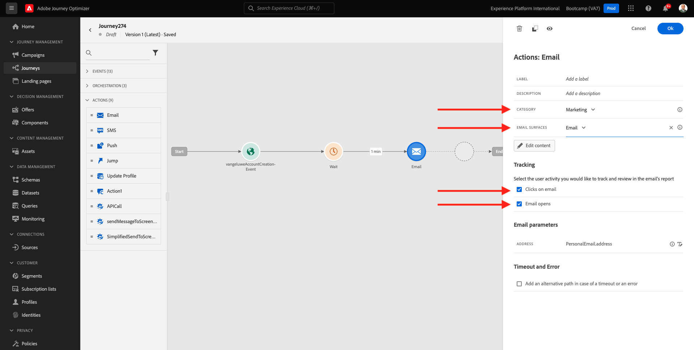

A próximo etapa é criar sua mensagem. Para isso, clique em **Edit content**.

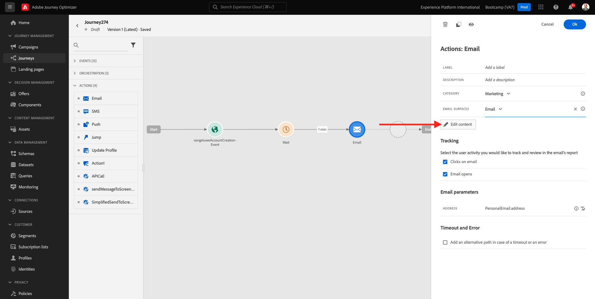

## 2.3.2 Crie a sua mensagem

Para criar sua mensagem, clique em **Edit content**.

O seguinte será exibido.

Clique no campo de texto **Subject line**.

Na área de texto, comece **Olá**

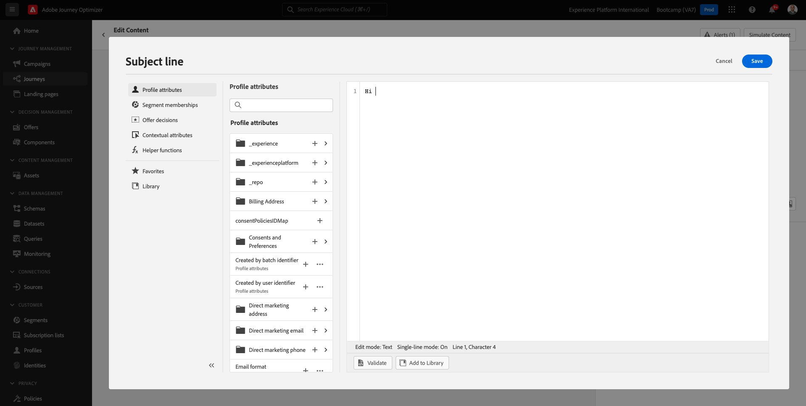

A linha de assunto ainda não está pronta. Em seguida, você precisa trazer o token de personalização para o **First name** que está armazenado em `profile.person.name.firstName`. No menu à esquerda, role para baixo para encontrar o elemento **Person** e clique na seta para visualizar mais campos

Agora encontre o elemento **Full name** e clique na seta para visualizar mais campos.

Por fim, localize o campo **First name** e clique no símbolo **+**  ao lado dele. Você verá o token de personalização aparecer no campo de texto.

Em seguida, adicione o texto, **agradecemos a sua inscrição!**. Clique em **Save**.

Então, você irá retornar para esta tela. Clique em **Email Designer**  para criar o conteúdo do e-mail. 

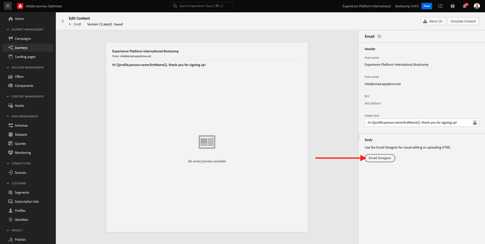

Na próxima tela, será solicitado que você forneça o conteúdo do e-mail através de 3 métodos diferentes: 

- **Design from scratch**: Comece com uma tela em branco e use o editor WYSIWYG para arrastar e soltar a estrutura e os componentes de conteúdo para criar visualmente o conteúdo do e-mail. 
- **Code your own**: Crie seu próprio modelo de e-mail codificando usando HTML 
- **Import HTML**: Importe um modelo HTML existente, que você poderá editar. 

Clique em **Import HTML**. 

Arraste e solte o arquivo **mailtemplatebootcamp.html**, que você pode baixa [aqui](../../assets/html/mailtemplatebootcamp.html.zip). Clique em Importar.

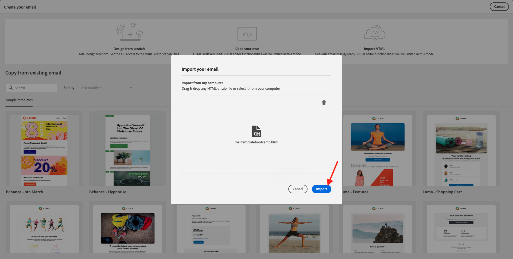

Você verá este modelo de e-mail padrão:

Vamos personalizar o e-mail. Clique ao lado do texto **Olá** e, em seguida, clique no ícone **Add Personalization**.

Em seguida, você precisa trazer o token de personalização **First name** que está armazenado em `profile.person.name.firstName`. No menu, localize o elemento **Person**, faça uma busca detalhada no elemento **Full Name** e clique no ícone **+** para adicionar o campo **First Name** ao editor.

Clique em **Save**. 

Agora você verá como o campo de personalização foi adicionado ao seu texto. 

Clique em **Save** para salvar sua mensagem.

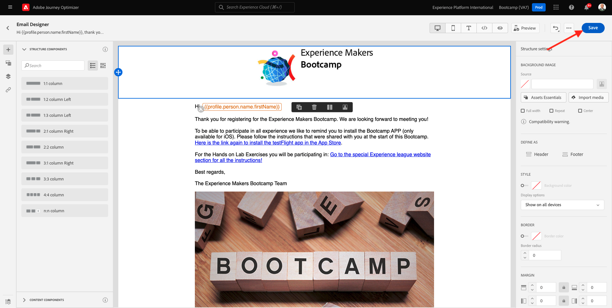

Retorne para o painel de mensagens clicando na seta ao lado do texto da linha de assunto no canto superior esquerdo. 

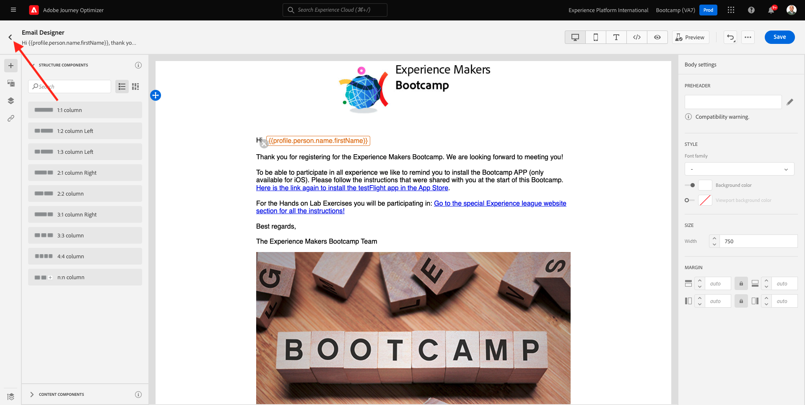

Agora você concluiu a criação do seu e-mail de cadastro. Clique na seta no canto superior esquerdo para retornar à sua jornada. 

Clique em **Ok**.

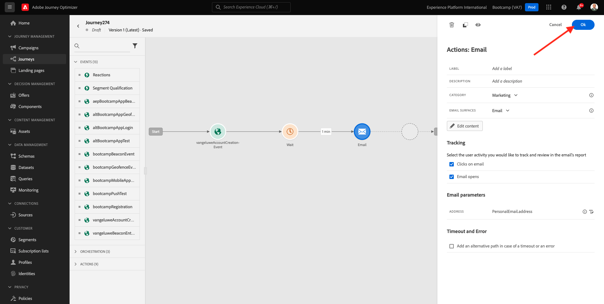

## 2.3.3 Publique a sua jornada

Você ainda precisa dar um Nome à sua jornada. Você pode fazer isso clicando no ícone **Properties** no canto superior direito da tela.

Você pode fazer isso clicando no item clicar no item “Name” e inserindo o seguinte nome `yourLastName - Account Creation Journey`. Clique em **OK** para salvar as mudanças.

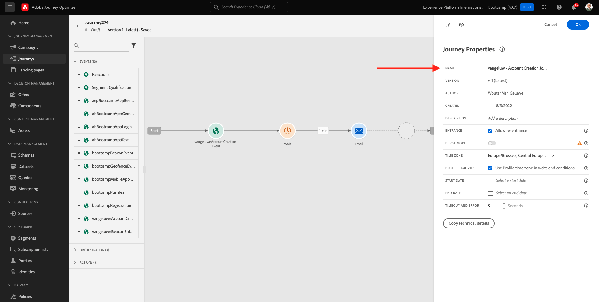

Agora você pode publicar sua jornada clicando em **Publish**.

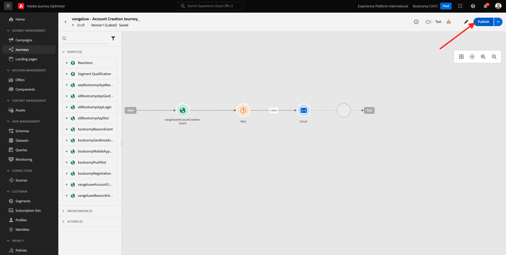

Clique em **Publish**  novamente. 

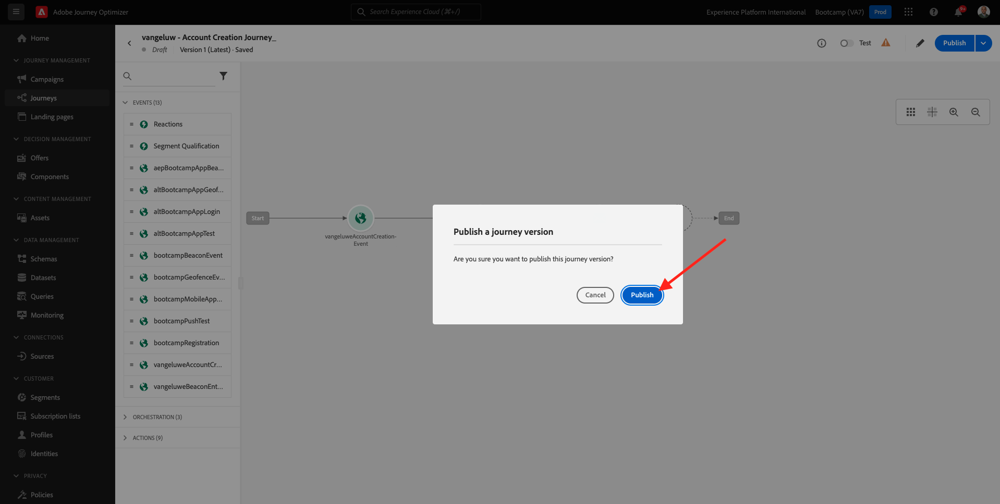

Você verá uma barra de confirmação verde informando que sua jornada agora está Publicada. 

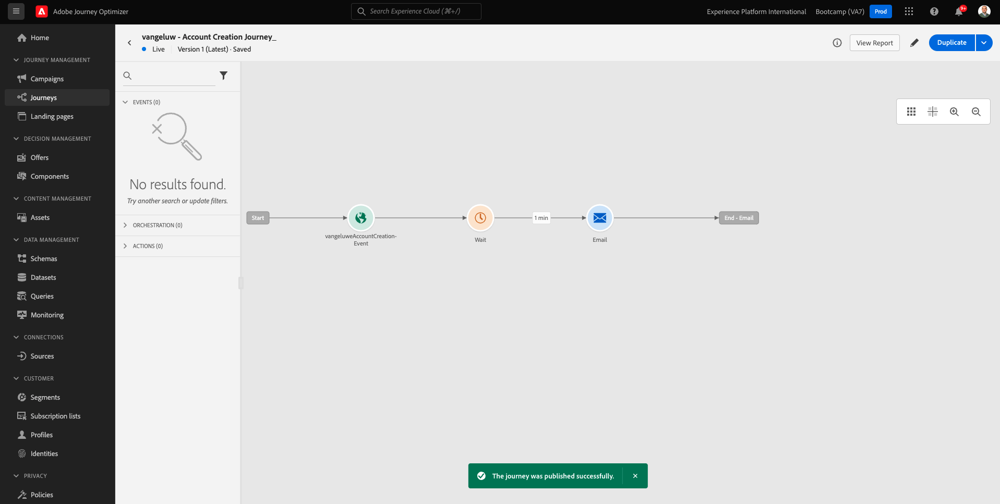

Você terminou este exercício.

Próxima etapa: [2.4 Teste sua jornada](./ex4.md)

[Retornar para Fluxo de Usuário 2](./uc2.md)

[Retornar para Todos os Módulos](../../overview.md)
