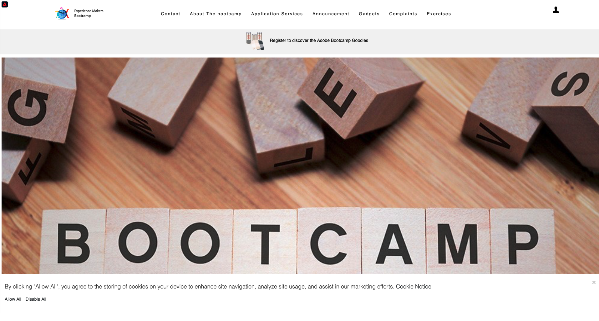
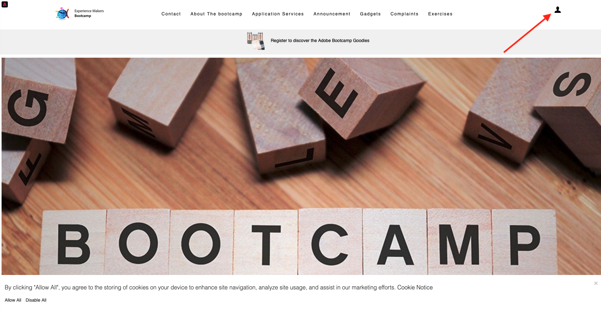
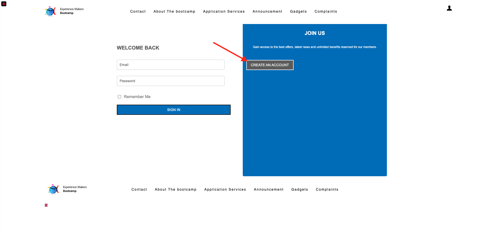
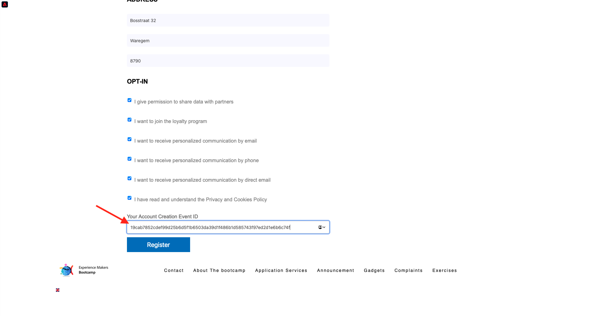
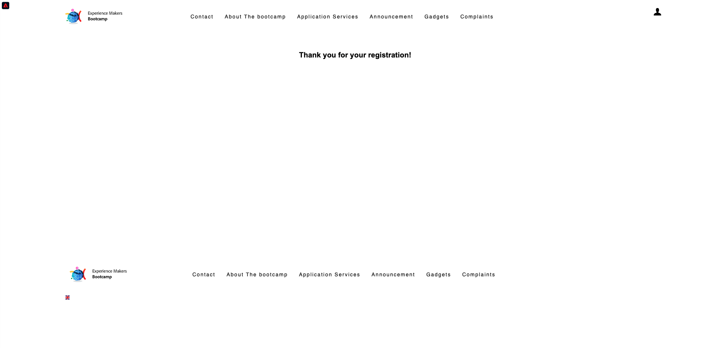

# 2.4 Teste sua jornada

## Fluxo da jornada do cliente 

Abra uma nova janela e anônima do navegador e vá para [https://bootcamp.aepdemo.net](https://bootcamp.aepdemo.net). Clique em **Allow All**. Com base no seu comportamento de navegação no fluxo de usuário anterior, você verá a personalização acontecer na página inicial do site.

Clique no ícone **Profile** no canto superior direito da tela. 

Clique em **Create an account**.
  

  
Preencha todos os campos do formulário. Use um valor real para endereço de e-mail e número de telefone, pois será usado em exercícios posteriores para envio de e-mail e SMS.
  

  
Role para baixo. Agora você deve inserir o eventID do seu evento personalizado que você criou no exercício 2.2. Você pode encontrá-lo aqui: 

O eventID é o que precisa ser enviado à Adobe Experience Platform para acionar a jornada que você construiu. Este é o eventID neste exemplo:
`19cab7852cdef99d25b6d5f1b6503da39d1f486b1d585743f97ed2d1e6b6c74f`

Preencha o eventID no campo **Your Account Creation Event ID** e clique em **Register**.
  

Em seguida, a tela abaixo será exibida:

Você também receberá este e-mail, que é o e-mail que você mesmo criou como parte deste exercício.

Você terminou este exercício.

Próxima etapa: [2.5 Instale e use o aplicativo móvel](./ex5.md)

[Retornar para Fluxo de Usuário 2](./uc2.md)

[Retornar para Todos os Módulos](../../overview.md)
