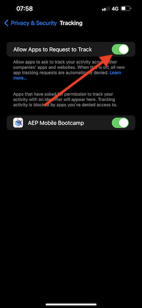
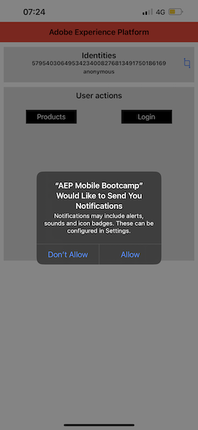
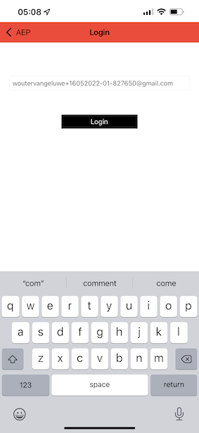
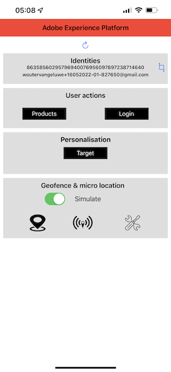

# 2.5 Instale e use o aplicativo móvel

## Instale o aplicativo móvel

Antes de instalar o aplicativo, é necessário habilitar Rastreamento no seu dispositivo iOS. Para isso, acesse Configurações > Privacidade e segurança > Rastreamento e confirme a opção Permitir que os aplicativos solicitem o rastreamento.

Acesse a App Store da Apple e pesquise `aepmobile-bootcamp`.  
Clique em **Instalar** ou **Download**.

Depois que o aplicativo estiver instalado, clique em **Abrir**.

Clique em **OK**.

Clique em **Permitir**.

Clique em **Concordo**. 

Clique em **Permitir enquanto uso o app**. 

Clique em **Permitir**.

Agora você está no aplicativo, na página inicial, pronto(a) para verificar toda a jornada do cliente. 

## Fluxo da jornada do cliente 

Primeiramente, é necessário fazer o login. Clique em **Login**.

Depois de criar sua conta nos exercícios anteriores, isso é exibido no site. Agora é necessário reutilizar o endereço de e-mail da conta que você criou no aplicativo para fazer o login.
  

Digite o endereço de e-mail que você usou no site e clique em **Login**. 

Você receberá uma confirmação de que está conectado e receberá uma notificação push. 

Retorne para a página inicial do aplicativo e os recursos adicionais irão aparecer. 

Acesse **Products**. Clique em qualquer produto, neste exemplo: **Coffee to go**. 

Você verá a página do produto **Coffee to go** no aplicativo. Clique em **Buy**. 

Agora você terminou este exercício e está pronto para as próximas atividades.

Próxima etapa: [ 2.6 Personalização no call center](./ex6.md)

[Retornar para Fluxo de Usuário 2](./uc2.md)

[Retornar para Todos os Módulos](../../overview.md)
