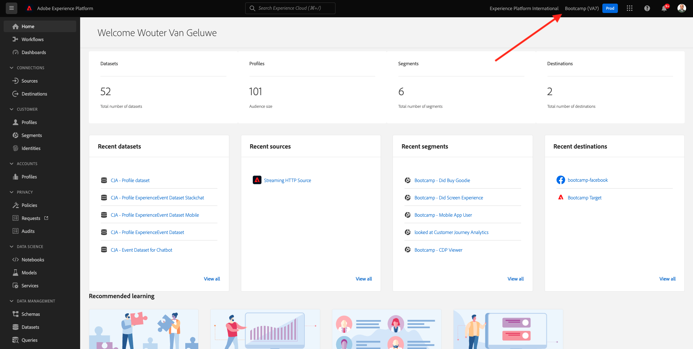
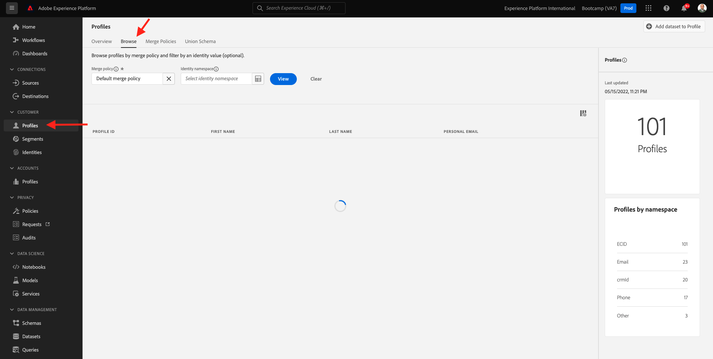
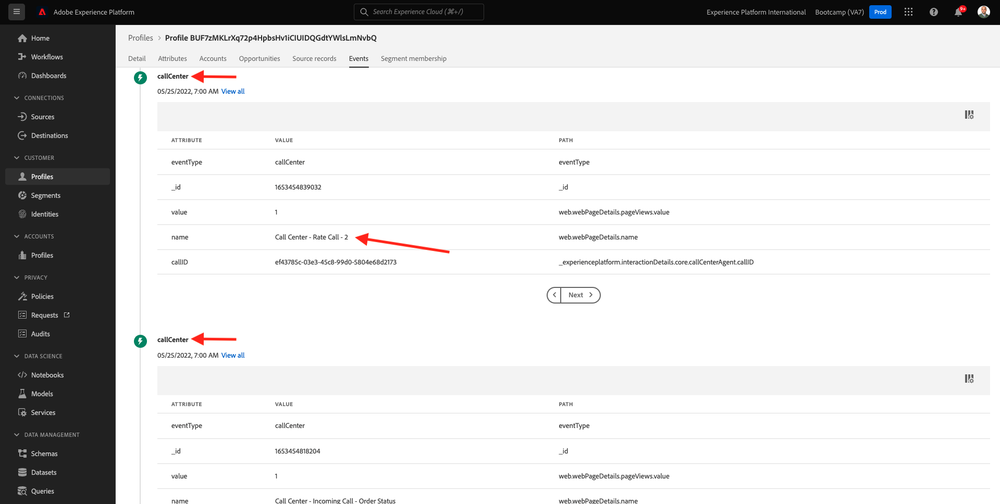

# 2.6 Personalização no call center

As discussed multiple times during the bootcamp already, personalizing the customer experience is something that should happen in an omnichannel way. A call center is often quite disconnected from the rest of the customer journey and that often leads to frustrating customer experiences, but it doesn't need to be. Let's show you an example of how the call center can easily be connected to Adobe Experience Platform, in real-time.

## Fluxo da jornada do cliente

No exercício anterior, usando o aplicativo móvel, você comprou um produto clicando no botão **Buy**. 

Vamos supor que você tenha uma pergunta sobre o status do seu pedido, o que você faria? Normalmente, você ligaria para o call center. 

Antes de ligar para o call center, você precisa saber seu **Loyalty ID**. Você pode encontrar seu ID de fidelidade no Visualizador de Perfil do site.

Nesse caso, o **Loyalty ID** é **5863105**. Como parte de nossa implementação personalizada do recurso de call center no ambiente de demonstração, você deve adicionar um prefixo ao seu **Loyalty ID**. O prefixo é **11373**, portanto, o ID de fidelidade a ser usado neste exemplo é **11373 5863105**. 

Vamos fazer isso agora. Use seu telefone e ligue para o número **+1 (323) 745-1670**. 

Será solicitado que você insira seu ID de fidelidade, seguido de **#**. Digite seu ID de fidelidade. 

Você ouvirá **Hello, seu nome**, nome. Esse nome é retirado do Perfil do Cliente em tempo real na Adobe Experience Platform. Você tem 3 escolhas. Pressione o número **1**, **Order Status**. 

Depois de ouvir o status do seu pedido, você terá a opção de pressionar **1** para voltar ao menu principal ou pressionar 2. Pressione **2**.

Em seguida, será solicitado que você avalie sua experiência de call center, selecionando um número entre 1 e 5, sendo 1 baixo e 5 alto. Faça a sua escolha. 

Sua chamada para o call center será encerrada. 

Acesse [Adobe Experience Platform](https://experience.adobe.com/platform). Depois de fazer login, você irá acessar a página inicial da Adobe Experience Platform.

Antes de continuar, você precisa selecionar um **sandbox**. O nome do sandbox a ser selecionado é ``Bootcamp``. É possível fazer isso clicando no texto **[!UICONTROL Production Prod]** na linha azul na parte superior da tela. Depois de selecionar o [!UICONTROL sandbox] apropriado, você verá a tela mudando e agora você está em seu [!UICONTROL sandbox] dedicado. 

No menu à esquerda, acesse **Profiles** e **Browse**.

Selecione o **Identity namespace** **Email** e insira o endereço de e-mail do seu perfil de cliente. Clique em **View**. Clique para abrir seu perfil. 

Você verá seu perfil de cliente novamente. Acesse **Events**.

Em eventos, você verá 2 eventos com um eventType de **callCenter**. O primeiro evento é o resultado da sua resposta à pergunta Avalie o seu n**Rate your call satisfaction**. 

Role um pouco para baixo e você verá o evento que foi registrado quando você selecionou a opção de verificar o **Order Status**.

Acesse **Segment membership**. Agora você verá que 2 segmentos se qualificam em seu perfil, em tempo real, com base nas interações que você teve por meio do call center. Essas associações de segmento podem e devem ser usadas para impactar qual comunicação e personalização acontece em qualquer outro canal. 

Você terminou este exercício.

[Retornar para Fluxo de Usuário 2](./uc2.md)

[Retornar para Todos os Módulos](../../overview.md)
