# 3.3 Crie sua jornada e notificação push

Neste exercício, você irá configurar a jornada e a mensagem que precisa ser acionada quando alguém inserir uma sinalização (beacon) usando o aplicativo móvel. 

Faça login no Adobe Journey Optimizer acessando a [Adobe Experience Cloud](https://experience.adobe.com). Clique em **Journey Optimizer**. 

Você será redirecionado para a visualização da **Home** no Journey Optimizer. Primeiro, verifique se você está usando o sandbox correto. O nome do sandbox que deve ser usado é `Bootcamp`. Para alternar de um sandbox para outro, clique em **Prod** e selecione o sandbox na lista. Neste exemplo, o nome do sandbox é **Bootcamp**. Você estará na visualização da **Home**  do seu sandbox `Bootcamp`. 

## 3.3.1 Crie a sua jornada

No menu à esquerda, clique em **Journeys**. Em seguida, clique em **Create Journey** para criar uma nova jornada. 

Você verá uma tela de jornada vazia.

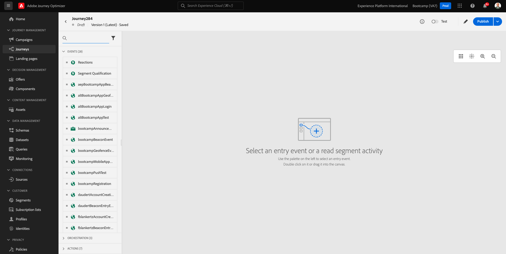

No exercício anterior, você criou um novo **Event**. Você nomeou o evento `yourLastNameBeaconEntryEvent` e substituiu `yourLastName` pelo seu sobrenome. Este foi o resultado da criação do Evento: 

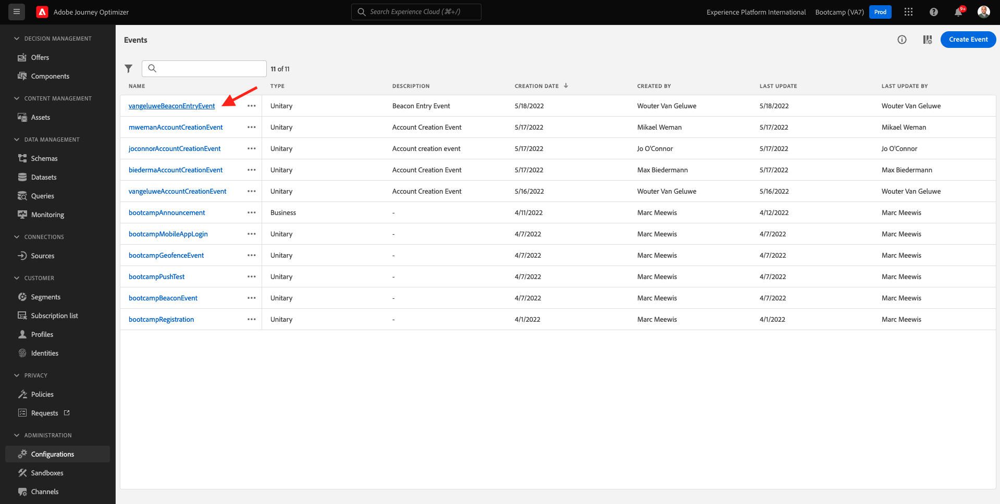

Agora você deve considerar este evento como o início desta Jornada. Você pode fazer isso indo para o lado esquerdo da tela e procurando pelo seu evento na lista de eventos.

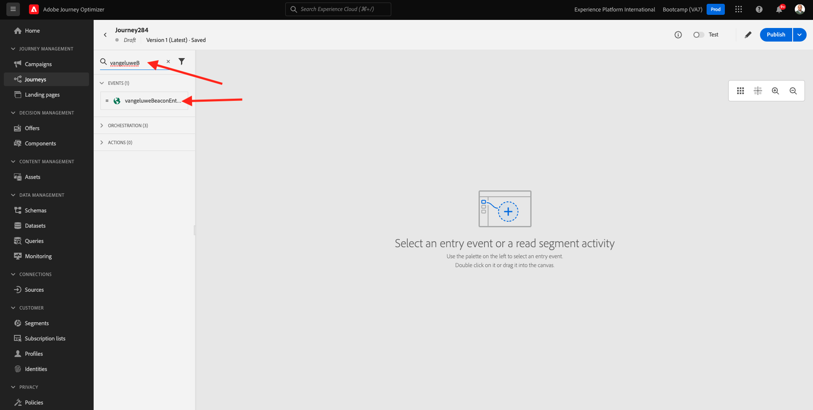

Selecione seu evento, arraste e solte o evento na tela de jornada. Sua jornada agora deve ser semelhante ao seguinte. Clique em **Ok** para salvar suas alterações. 

Como segunda etapa da jornada, você deve adicionar uma ação **Push**. Vá para o lado esquerdo da tela para **Actions**, selecione a ação **Push** e arraste e solte a ação no segundo nó da sua jornada. 

No lado direito da tela, agora você deve criar sua notificação push. 

Defina a **Category** como **Marketing** e selecione uma superfície push que permite enviar notificações push. Nesse caso, a superfície push a ser selecionada é **mmeeewis-app-mobile-bootcamp**. 

## 3.3.2 Crie a sua mensagem

Clique em **Edit Content**.

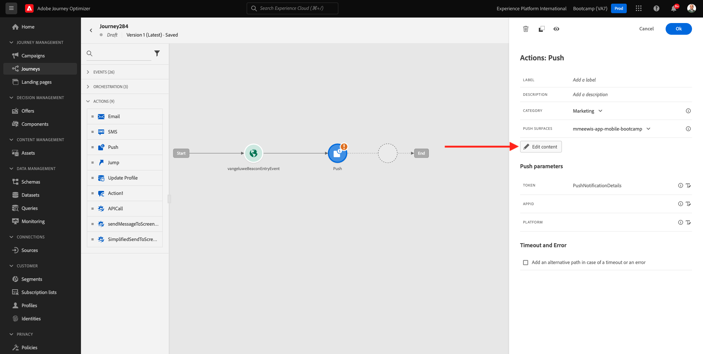

Em seguida, a tela abaixo será exibida:

Vamos definir o conteúdo da notificação push. 

Clique no campo de texto **Title**. 

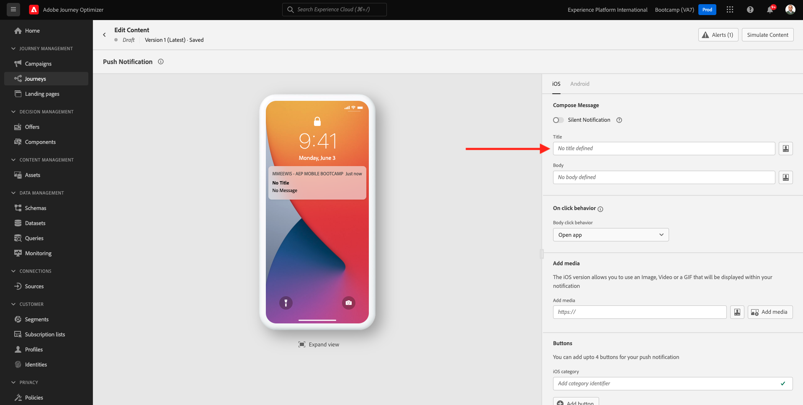

Na área de texto, comece **Olá**. Clique no ícone de personalização.

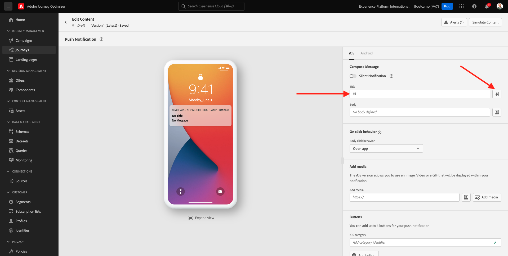

Agora você precisa trazer o token de personalização para o campo **First name** que está armazenado em `profile.person.name.firstName`. No menu à esquerda, selecione **Profile Attributes**, role para baixo/navegue para encontrar o elemento **Person** e clique na seta para avançar um nível até chegar ao campo `profile.person.name.firstName`. Clique no ícone **+** para adicionar o campo à tela. Clique em **Save**. 

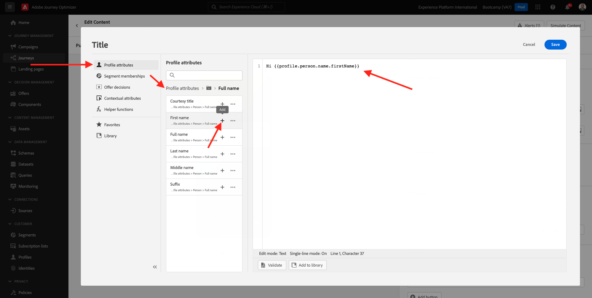

Então, você irá retornar para esta tela. Clique no ícone de personalização ao lado do campo **Body**. 

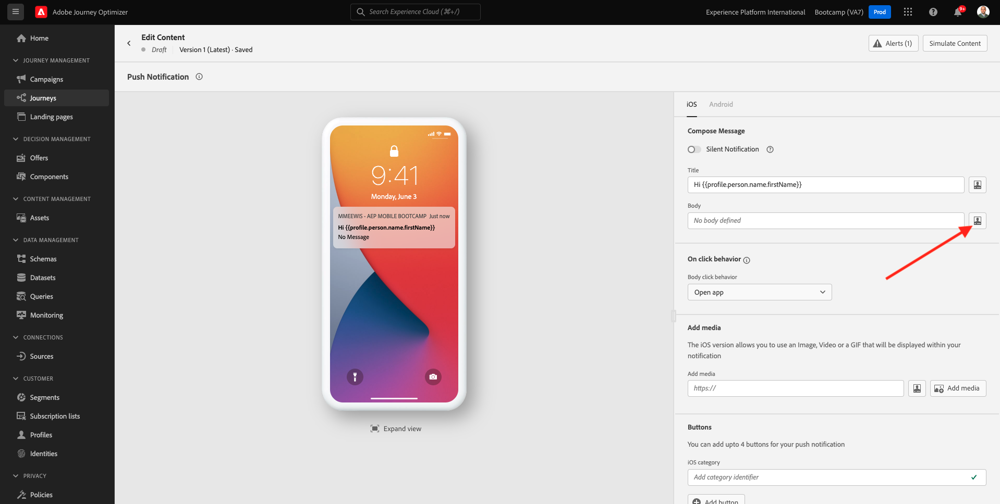

Na área de texto, escreva `Bem-vindo(a)`. 

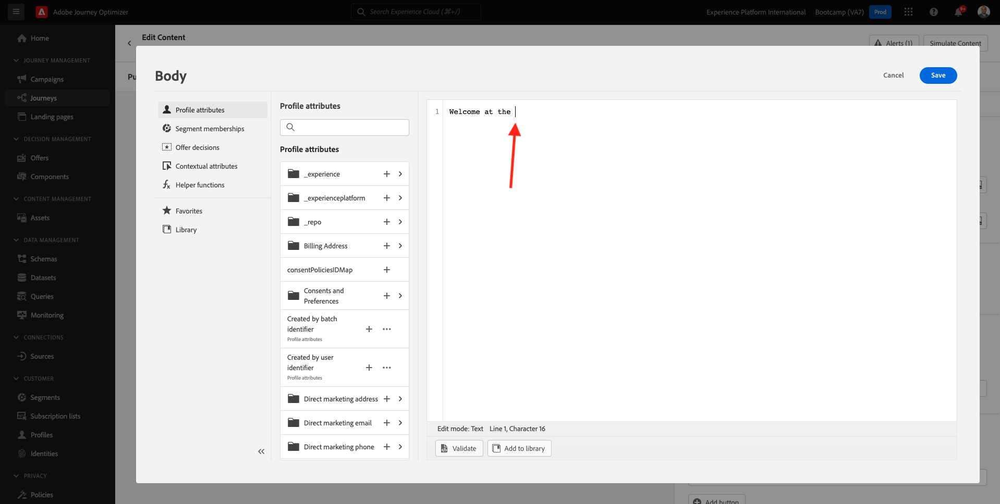

Em seguida, clique em  **Contextual Attributes** and then **Journey Orchestration**.

Clique em **Events**.

Clique no nome do seu evento, que deve ser semelhante ao seguinte: **yourLastNameBeaconEntryEvent**.

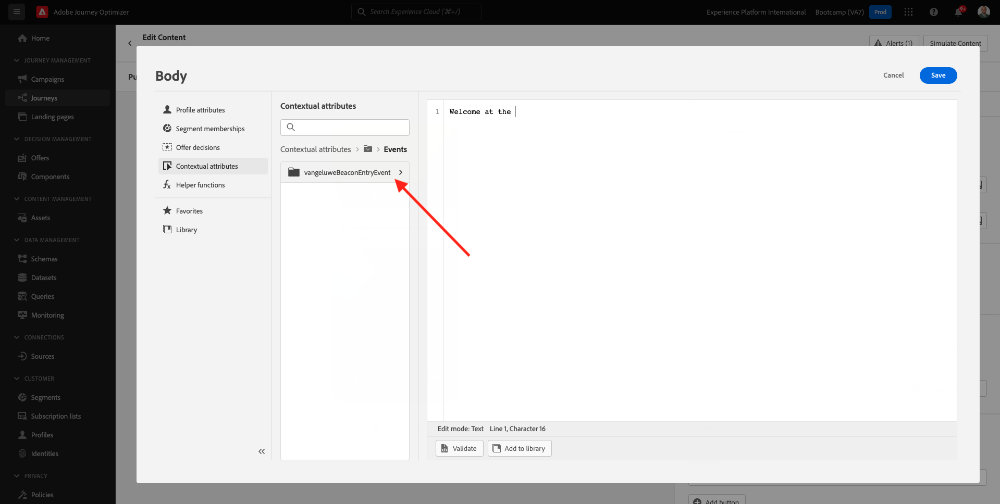

Clique em **Place context**.

Clique em **POI Interaction**.

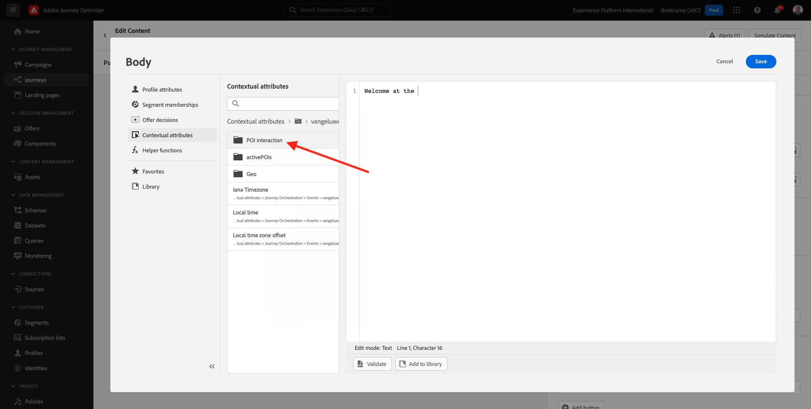

Clique em **POI Detail**.

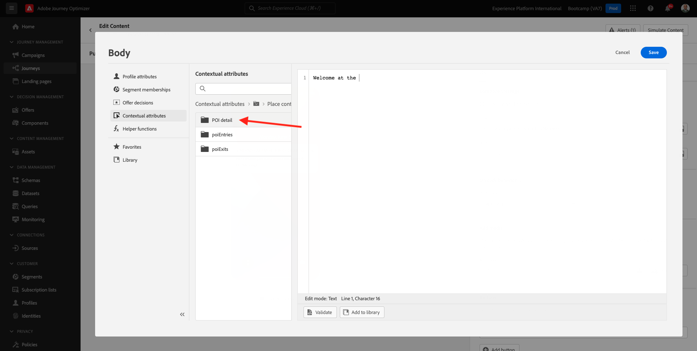

Clique no **+** icon no **POI Name**.
Em seguida, o seguinte será exibido. Clique em **Save**.

Sua mensagem agora está pronta. Clique na seta no canto superior esquerdo para retornar à sua jornada. 

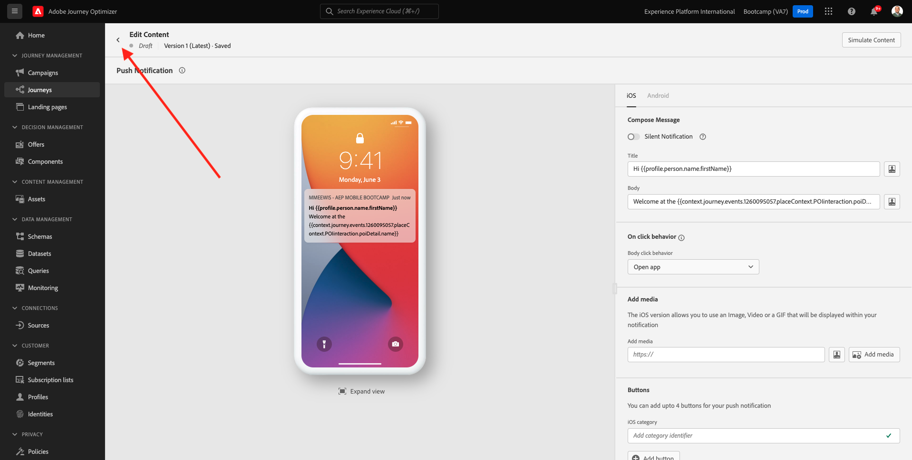

Clique em **Ok**.

## 3.3.2 Envie uma mensagem para uma tela

Como terceira etapa da jornada, você deve adicionar uma ação  **sendMessageToScreen** action. Vá para o lado esquerdo da tela para **Actions**, selecione a ação **sendMessageToScreen** e arraste e solte a ação no terceiro nó da sua jornada. Em seguida, você verá a tela abaixo.

**sendMessageToScreen** é uma ação personalizada que irá publicar uma mensagem no ponto de extremidade usado pela exibição na loja. A ação **sendMessageToScreen** espera que múltiplas variáveis sejam definidas. Você pode visualizar essas variáveis rolando para baixo até ver **Action Parameters**.

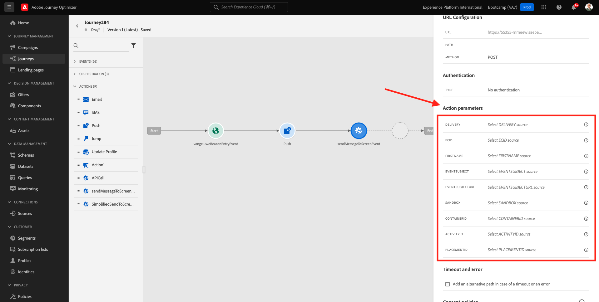

Agora você precisa definir os valores para cada parâmetro de ação. Siga esta tabela para entender quais valores são necessários e onde.

| Parameter     | value       |
|:-------------:| :---------------:|
|DELIVERY|`'image'`|
|ECID|`@{yourLastNameBeaconEntryEvent._experienceplatform.identification.core.ecid}`|
|FIRST NAME |`#{ExperiencePlatform.ProfileFieldGroup.profile.person.name.firstName}`|
|EVENTSUBJECT|`#{ExperiencePlatform.ProductListItems.experienceevent.first(currentDataPackField.eventType == "commerce.productViews").productListItems.first().name}`|
| EVENTSUBJECTURL |`#{ExperiencePlatform.ProductListItems.experienceevent.first(currentDataPackField.eventType == "commerce.productViews").productListItems.first()._experienceplatform.core.imageURL}`|
| SANDBOX         |`'bootcamp'` |
| CONTAINERID         | `''` |
| ACTIVITYID         |`''` |
| PLACEMENTID         | `''` |

{style="table-layout:auto"}

Para definir esses valores, clique no ícone **Edit**.

Em seguida, selecione **Advanced Mode**.

Em seguida, cole o valor com base na tabela acima. Clique em **Ok**.

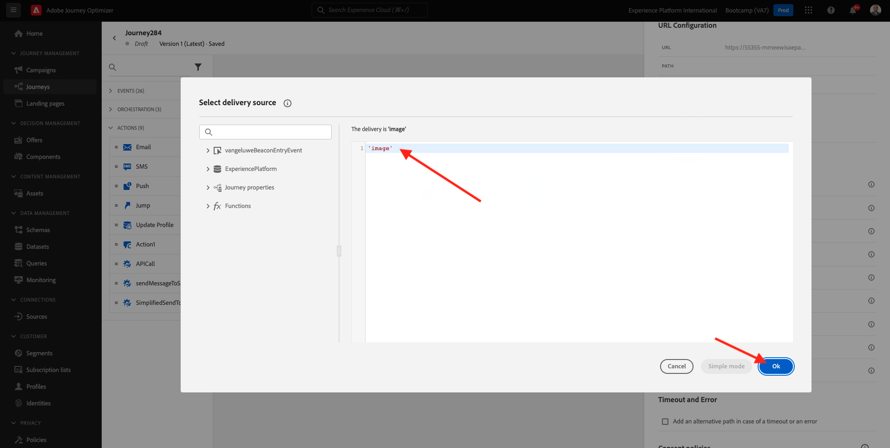

Repita esse processo para adicionar valores para cada campo.

>[!IMPORTANTE]
>
>Para o campo ECID, há uma referência ao evento`yourLastNameBeaconEntryEvent`. Lembre-se de substituir  `yourLastName` pelo seu sobrenome. 

O resultado final deve ser semelhante ao seguinte:

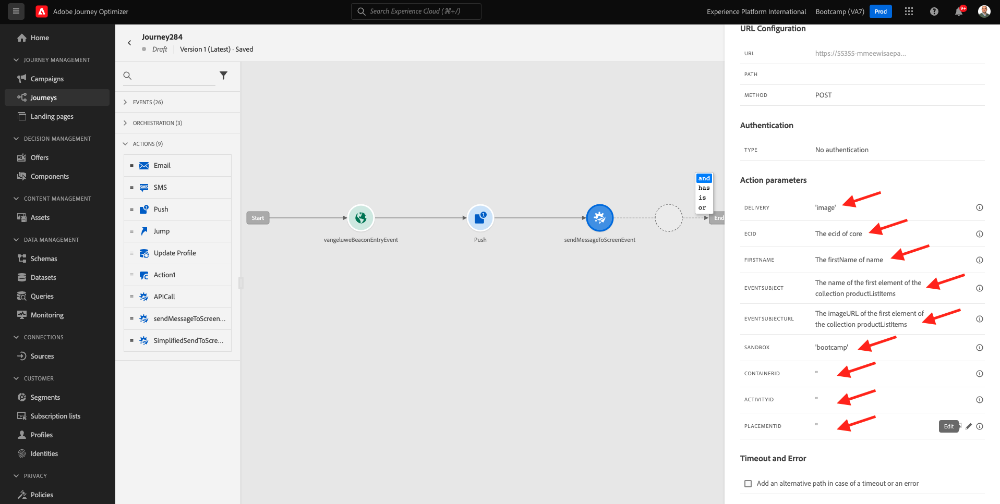

Role para cima e clique em **Ok**.

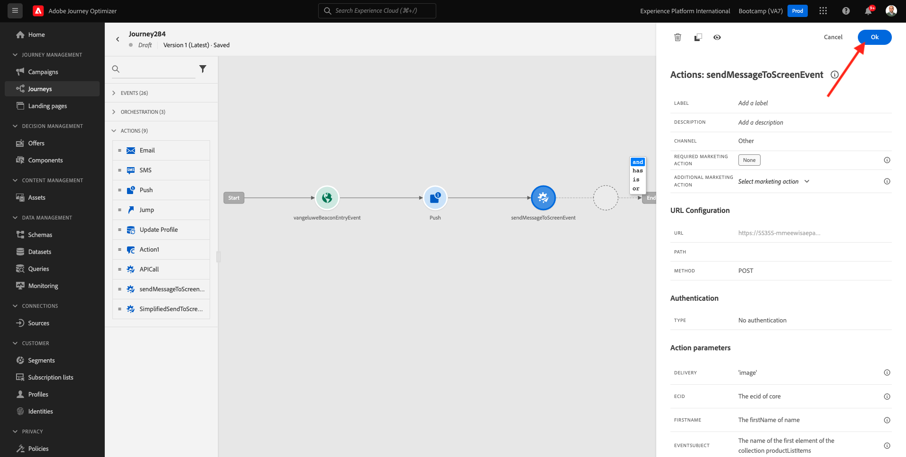

You still need to give your journey a Name. You can do that by clicking the **Properties** icon in the top right side of your screen.

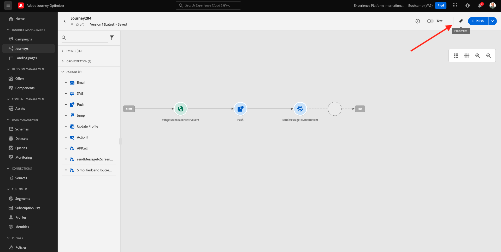

Você pode inserir o nome da jornada aqui. Use `yourLastName - Beacon Entry Journey`. Clique em **OK** para salvar suas alterações. 

Agora você pode publicar sua jornada clicando em **Publish**.

Clique em **Publish** novamente.

Você verá uma barra de confirmação verde informando que sua jornada agora está Publicada.

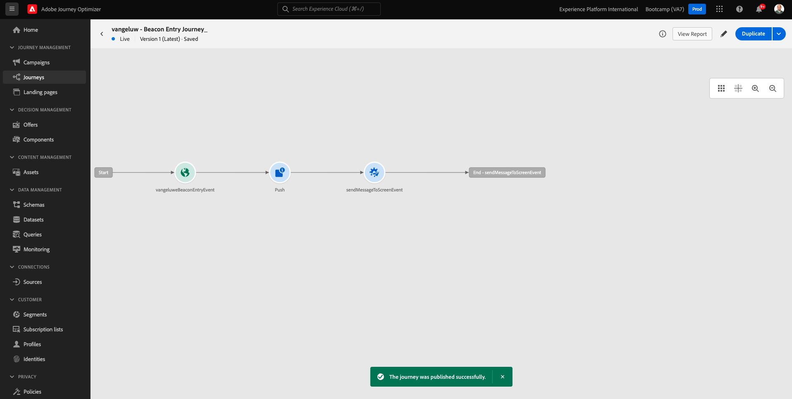

Sua jornada agora está ativa e pode ser acionada.

Você terminou este exercício.

Próxima etapa: [3.4 Teste sua jornada](./ex4.md)

[Retornar para Fluxo de Usuário 3](./uc3.md)

[Retornar para Todos os Módulos](../../overview.md)
