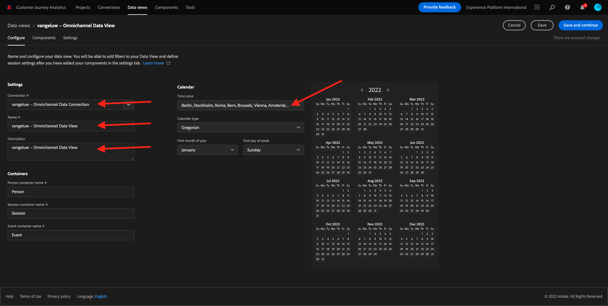
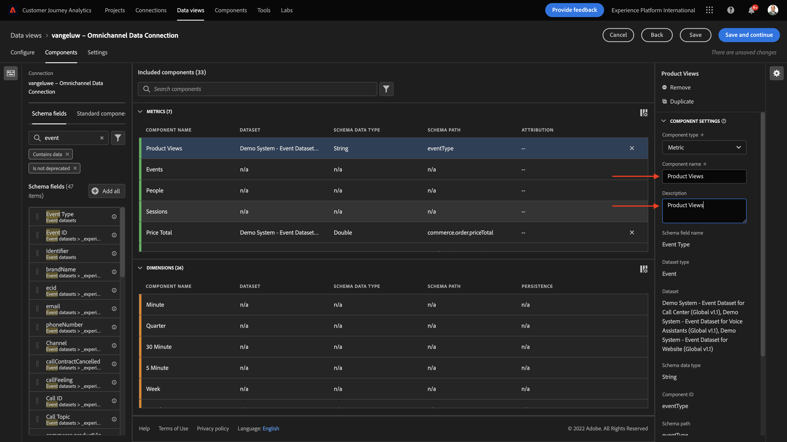
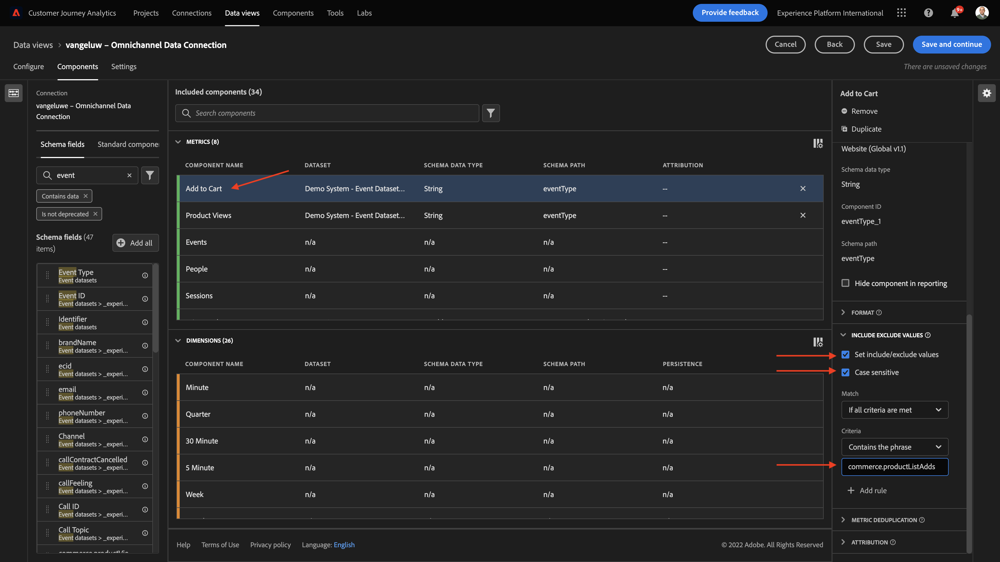

# 4.3 Crie uma Visualização de Dados

## Objetivos

- Entenda a UI de Visualização de Dados 
- Compreenda as configurações básicas de definição de visita 
- Compreenda a atribuição e a Persistência em uma Visualização de

## 4.3.1 Visualização de Dados

Agora, com sua conexão concluída, é possível progredir para influenciar a visualização. Uma diferença entre o Adobe Analytics e o CJA é que o CJA precisa de uma visualização de dados para limpar e preparar os dados antes da visualização. 

Uma Visualização de Dados é semelhante ao conceito de Virtual Report Suites no Adobe Analytics, onde você estabelece as definições de visita com reconhecimento de contexto, filtragem e também como os componentes são chamados. 

Será necessário, no mínimo, uma Visualização de Dados por conexão. No entanto, para alguns casos de uso, é ótimo ter múltiplas Visualizações de Dados para a mesma conexão, com o objetivo de fornecer insights diferentes para equipes distintas. Se você deseja que sua empresa seja orientada por dados, deve adaptar a forma como os dados são vistos em cada equipe. Alguns exemplos: 

- Métricas de UX apenas para a equipe de UX Design 
- Use os mesmos nomes para KPIs e métricas para o Google Analytics e para o Customer Journey Analytics, para que a equipe de análise digital fale apenas 1 idioma. 
- Visualização de Dados filtrada para mostrar, por exemplo, dados para apenas um mercado, ou uma marca, ou apenas para Dispositivos móveis.

Na tela de **Connections** marque a caixa de seleção da conexão que você acabou de criar. Clique em  **Create Data View**.

Você será redirecionado para o fluxo de trabalho **Create Data View** workflow.

## 4.3.2 Definição de Visualização de Dados

Agora você pode configurar as definições básicas para sua Visualização de dados.

A **Connection** que você criou no exercício anterior já está selecionada. Sua conexão se chama `yourLastName – Omnichannel Data Connection`.

Em seguida, dê um nome à sua Visualização de Dados seguindo este modelo de nomenclatura: `yourLastName – Omnichannel Data View`. 

Insira o mesmo valor para a descrição: `yourLastName – Omnichannel Data View`.

| Name         | Description|    
| ----------------- |-------------| 
| `yourLastName – Omnichannel Data View` | `yourLastName – Omnichannel Data View`         |  

Para **Time Zone**, selecione o fuso horário **Berlim, Estocolmo, Roma, Berna, Bruxelas, Viena, Amsterdã GMT+01:00**. Este é um cenário realmente interessante, pois algumas empresas operam em diferentes países e geografias. Alocar o fuso horário certo para cada país evitará erros típicos de dados, como, por exemplo, acreditar que a maioria das pessoas compra camisetas às 4h no Peru.

Você também pode modificar a nomenclatura das métricas principais (Pessoa, Sessão e Evento). Isso não é obrigatório, mas alguns clientes gostam de usar Pessoas, Visitas e Acessos em vez de Pessoa, Sessão e Eventos (convenção de nomenclatura padrão do Customer Journey Analytics). 

Agora você deve ter as seguintes configurações definidas:

Clique em **Save and Continue**.

## 4.3.3 Componentes da Visualização de Dados

Neste exercício, você irá configurar os componentes necessários para analisar os dados e visualizá-los usando o Analysis Workspace. Nesta IU, há três áreas principais: 

- Lado esquerdo: Componentes disponíveis dos datasets selecionados 
- Meio: Componentes adicionados à Visualização de Dados 
- Lado direito: Configurações do componente 

>[!IMPORTANTE]
>
>Se você não encontrar uma métrica ou dimensão específica, verifique se o campo `Contains data` foi removido de sua visualização de dados. Caso contrário, exclua esse campo.
>
>

Agora você precisa arrastar e soltar os componentes necessários para a análise nos **Components Added**. Para isso, você deve selecionar os componentes no menu à esquerda e arrastá-los e soltá-los na tela no meio.

Vamos começar com o primeiro componente: **Name (web.webPageDetails.name)**. Pesquise esse componente e arraste-o e solte-o na tela.

Esse componente é o nome da página, como você pode derivar da leitura do campo do schema `(web.webPageDetails.name)`. 

No entanto, usar **Name** como o nome não é a melhor convenção de nomenclatura para um usuário corporativo compreender rapidamente essa dimensão. 

Vamos mudar o nome para **Page Name**. Clique no componente e o renomeie na área **Component Settings**.

As Configurações de persistência são **Persistence settings**. Os conceitos de eVars e prop não existem no CJA, mas as configurações de Persistência possibilitam um comportamento semelhante. 

Se você não alterar essas configurações, o CJA irá interpretar a dimensão como um **Prop** (nível de ocorrência). Além disso, podemos alterar a Persistência para tornar a dimensão uma **eVar** (persistir o valor ao longo da jornada). 

Se você não estiver familiarizado com eVars e Props, [leia mais sobre isso na documentação](https://experienceleague.adobe.com/docs/analytics/landing/an-key-concepts.html).. 

Vamos deixar o Nome da Página como Prop. Dessa forma, você não precisa alterar nenhuma **Persistence Settings**. 

| Component Name to Search           | New Name   | Persistence Settings  | 
| ----------------- |-------------| --------------------| 
| Name (web.webPageDetails.name) | Page Name          |          | 

Em seguida, escolha a dimensão **phoneNumber** e solte-a na tela. O novo nome deve ser **Phone Number**. 

Por fim, vamos alterar as Configurações de persistência, pois o Número do Celular deve persistir no nível do usuário. 

Para alterar a Persistência, role para baixo no menu à direita e abra a aba **Persistence**:

Marque a caixa de seleção para modificar as configurações de persistência. Selecione **Most Recent** e o escopo **Person (Reporting window)**, pois nos preocupamos apenas com o último número de celular da pessoa. Se o cliente não preencher o celular em visitas futuras, você ainda verá esse valor preenchido. 

| Component Name to Search           | New Name    | Persistence Settings  | 
| ----------------- |-------------| --------------------| 
| phoneNumber | Phone Number          |    Most Recent, Person (reporting window)     | 

O próximo componente é `web.webPageDetails.pageViews.value`.

No menu à esquerda, pesquise `web.webPageDetails.pageViews.value`. Arraste e solte essa métrica na tela. 

Altere o nome para **Page Views** under the **Component settings**.

| Component Name to Search           | New Name    | Attribution Settings  | 
| ----------------- |-------------| --------------------| 
| web.webPageDetails.pageViews.value | Page Views          |         | 

Para as configurações de atribuição, deixaremos em branco. 

Observação: As configurações de persistência nas métricas também podem ser alteradas no Analysis Workspace. Em alguns casos, você pode optar por configurá-las aqui para evitar que os usuários de negócios tenham que pensar qual é o melhor modelo de persistência. 

Em seguida, você terá que configurar várias Dimensões e Métricas, conforme indicado na tabela abaixo.

### DIMENSÕES

| Component Name to Search           | New Name      | Persistence Settings  | 
| ----------------- |-------------| --------------------| 
| brandName | Brand Name          | Most Recent, Session         | 
| callfeeling | Call Feeling          |          | 
| call ID | Call Interaction Type          |          | 
| callTopic | Call Topic          | Most Recent, Session   | 
| ecid  | ECID          | Most Recent, Person (reporting window)       | 
| email | Email ID          | Most Recent, Person (reporting window)        | 
| Payment Type | Payment Type          |          | 
| Product add method | Product add method          | Most Recent, Session         | 
| Event Type | Event Type         |         | 
| Name (productListItems.name) | Product Name          |         | 
| SKU | SKU (Session)          | Most Recent, Session         | 
| Transaction ID | Transaction ID          |         | 
| URL (web.webPageDetails.URL) | URL          |         | 
| User Agent | User Agent          | Most Recent, Session         |

### MÉTRICA

| Component Name to Search           | New Name    | Attribution Settings  | 
| ----------------- |-------------| --------------------| 
| Quantity | Quantity          |          | 
| commerce.order.priceTotal | Revenue          |         | 

Sua configuração deve ser semelhante ao seguinte: 

Não se esqueça de Salvar sua Visualização de Dados. Então clique em **Save**.

## 4.3.4 Métricas calculadas

Embora tenhamos organizado todos os componentes na Visualização de dados, você ainda deve adaptar alguns deles para que os usuários de negócios estejam prontos para iniciar suas análises. 

Se você se lembra, não trouxemos especificamente Métricas como Adicionar ao Carrinho, Visualização do produto ou Compras para a Visualização de dados. No entanto, temos uma dimensão chamada: **Event Type**. Então, vamos derivar esses tipos de interação criando 3 métricas calculadas. 

Vamos começar com a primeira Métrica: **Product Views**. 

No lado esquerdo, pesquise **Event Type** e selecione a dimensão. Em seguida, arraste-o e solte-o na tela **Included Components**. 

Clique para selecionar a nova métrica **Event Type**.

Agora altere o nome e a descrição do componente para os seguintes valores:

| Component Name         | Component Description|    
| ----------------- |-------------| 
| Product Views | Product Views     |  

Agora vamos contar apenas eventos de **Product Views**. Para fazer isso, role para baixo em **Component Settings** até ver Valores de **Include Exclude Values**. Certifique-se de habilitar a opção **Set include/exclude values**. 

Como queremos contar apenas **Product Views**, especifique **commerce.productViews** nos critérios. 

Agora a sua métrica calculada está pronta! 

Em seguida, repita o mesmo processo para os eventos **Add to Cart** e **Purchase**.

### Add to Cart

Primeiro, arraste e solte a mesma dimensão **Event Type**.

Você verá um alerta pop-up de um Campo Duplicado, pois estamos usando a mesma variável. Clique em **Add Anyway**: 

Agora, siga o mesmo processo que fizemos para a métrica Visualizações de produto: 
- Primeiro altere o nome e a descrição. 
- Por fim, adicione **commerce.productListAdds** como critério para contar apenas Add To Cart

| Name | Descritpion         | Criteria| 
| ----------------- |-------------| -------------|
| Add to Cart|Add to Cart | commerce.productListAdds     |

### Purchases

Primeiro, arraste e solte a mesma dimensão **Event Type** como fizemos para as duas métricas anteriores. 

Você verá um alerta pop-up de um Campo Duplicado, pois estamos usando a mesma variável. Clique em **Add Anyway**: 

Agora, siga o mesmo processo que fizemos para as métricas Product Views e Add to cart:
- Primeiro altere o nome e a descrição. 
- Por fim, adicione **commerce.purchases** como critérios para contabilizar apenas as Compras 

| Name | Descritpion         | Criteria| 
| ----------------- |-------------| -------------|
| Purchases|Purchases | commerce.purchases     |

Sua configuração final deve ser semelhante ao seguinte. Clique em **Save and continue**.

## 4.3.5 Componentes da Configuração de Dados

Você deve ser redirecionado para esta tela: 

Nesta aba, você pode modificar algumas configurações importantes para alterar a forma como os dados são processados. Vamos começar definindo o **Session Timeout** como 30 min. Graças ao registro de data e hora de cada evento de experiência, você pode estender o conceito de uma sessão em todos os canais. Por exemplo, o que acontece se um cliente ligar para o call center depois de visitar o site? Usando Tempos Limite de Sessão personalizados, você tem muita flexibilidade para decidir o que é uma sessão e como essa sessão irá mesclar os dados. 

Nesta aba você pode modificar outras coisas como filtrar os dados usando um segmento/filtro. Você não precisará fazer isso neste exercício. 

Quando terminar, clique em **Save and finish**.

>[!NOTA]
>
>Você pode voltar a esta Visualização de dados posteriormente e alterar as configurações e os componentes a qualquer momento. As alterações afetarão a forma como os dados históricos são mostrados. 

Agora você pode continuar com a parte de visualização e análise! 

Próxima etapa: [4.4 Preparação de dados em Customer Journey Analytics](./ex4.md)

[Retornar para Fluxo de Usuário 4](./uc4.md)

[Retornar para Todos os Módulos](./../../overview.md)
