# 4.6 Dos insights à ação

## Objetivos

- Entenda como criar um público com base em uma visão coletada no Customer Journey Analytics
- Use esse público no CDP em tempo real e no Adobe Journey Optimizer

## 4.6.1 Crie uma audiência e publique-a

Em seu projeto, você criou um filtro chamado **Call Feelings** e conseguiu visualizar a quantidade de usuários que tiveram suas ligações ao call center classificadas como **positivas**. Agora, você poderá criar um segmento com esses usuários e ativação-los em jornadas ou em canais de comunicação.

O primeiro passo é: No painel criado no último exercício, selecione a linha **1. Call Feeling - Positive**, clique com o botão direito de seu mouse e selecione a opção **Create audience from selection**:

Em seguida, dê um nome para a sua audiência seguindo o modelo **yourLastName - cia audience call feeling positive**:

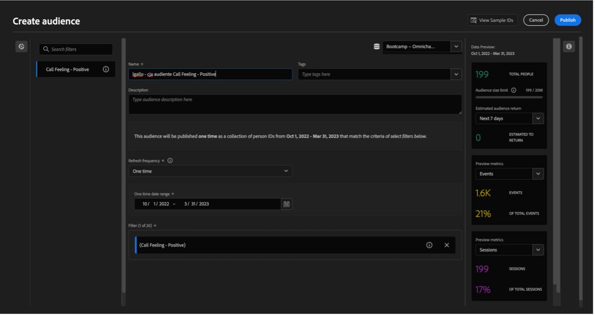

Note que é possível ter um preview da audiência que está sendo criada:

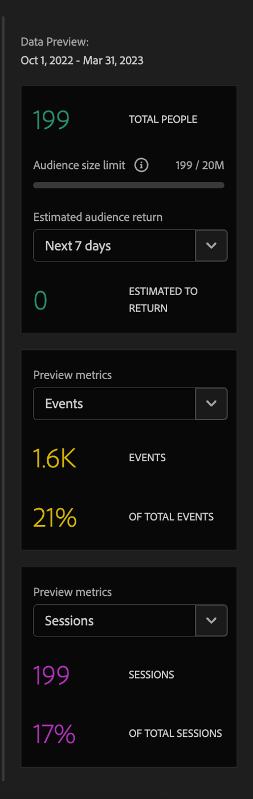

Para finalizar, clique em **Publicar**:

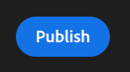

## 4.6.2 Use sua audiência como parte de um segmento

Voltando para a Adobe Experience Platform, vá em **Segments > Browse** e você conseguirá visualizar o seu segmento criado no CJA pronto e disponível para ser usado nas suas ativações e jornadas!

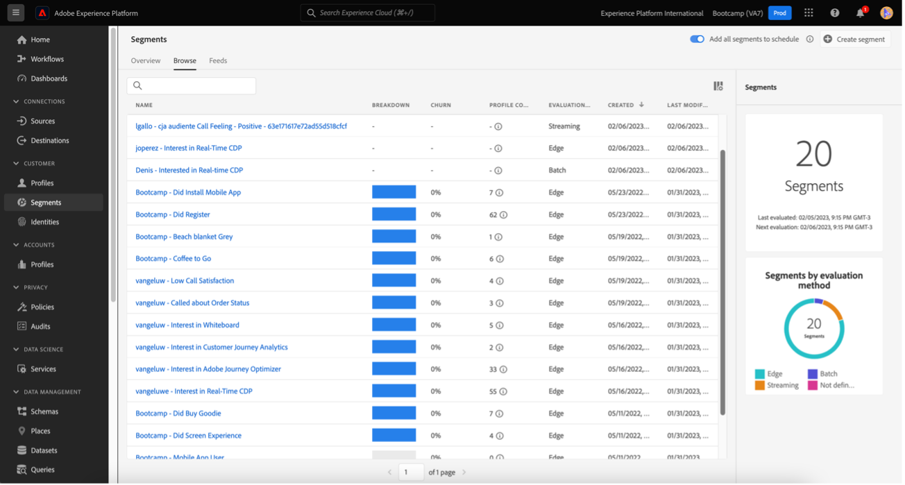

Vamos agora usar esse segmento em uma ativação no Facebook e em uma jornada do cliente!

## 4.6.3 Use seu segmento na Real-Time CDP em tempo real

Na Adobe Experience Platform, vá em **Segments > Browse** e encontre a audiência que você criou no CJA:

Clique no seu segmento e, em seguida, clique em **Activate to Destination**:

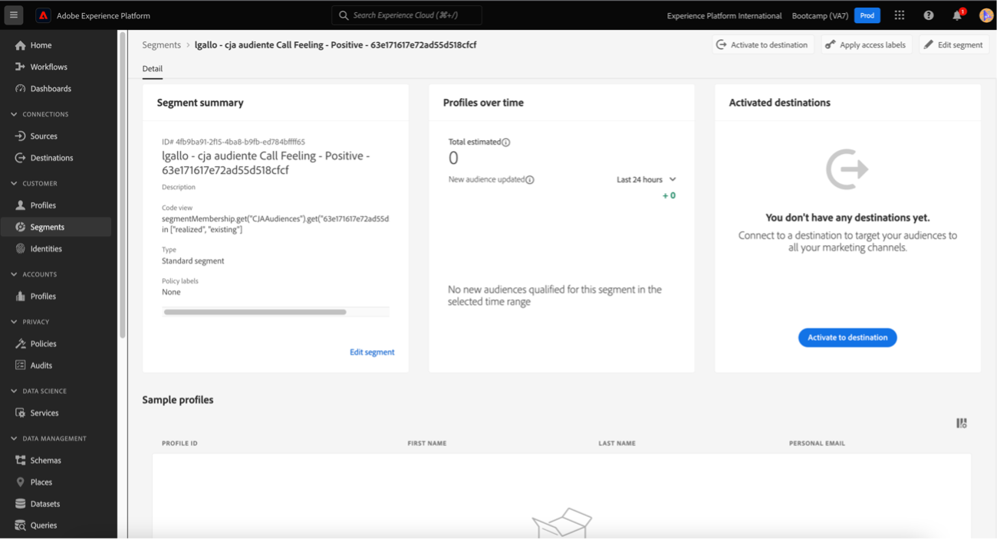

Selecione a destination chamada bootcamp-facebook e, em seguida, clique em Next:

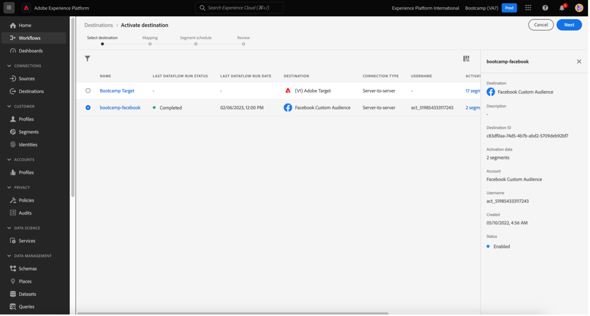

Em seguida, clique em Next novamente:

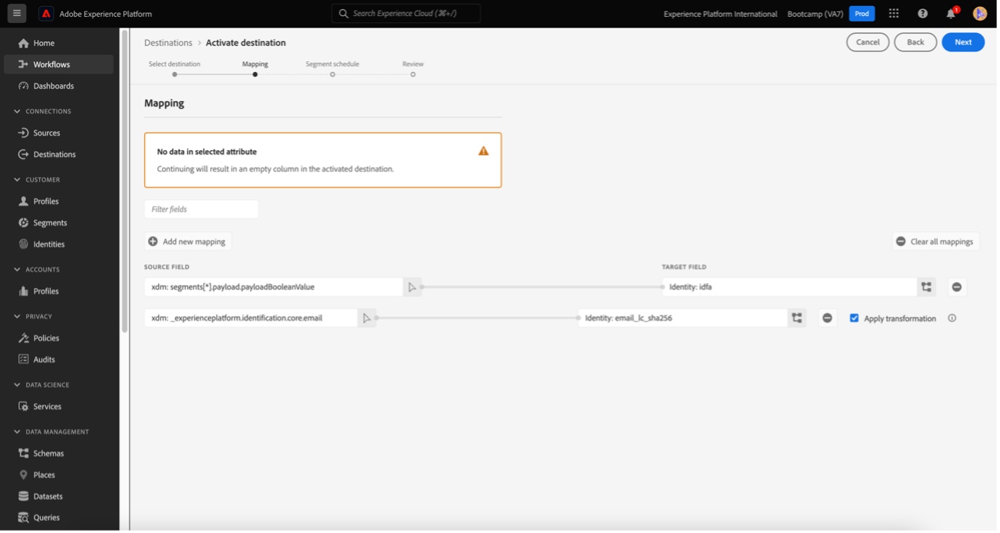

Selecione a opção **Origin of your audience** e defina como **Directly from customers** e clique em Next:

Por fim, na página **Review** clique em Finish!

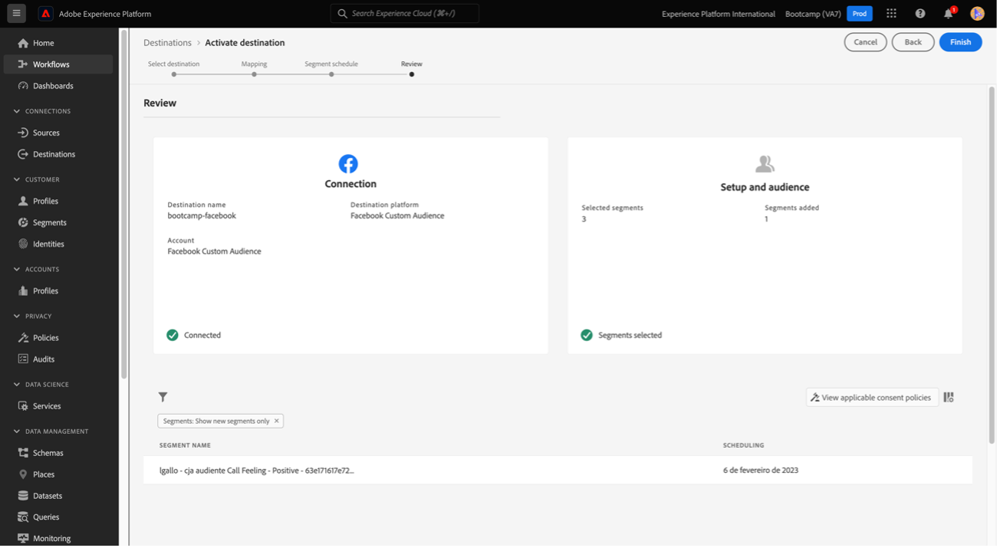

Pronto! Agora o seu segmento está vinculado aos públicos personalizados do Facebook.
Agora, vamos utilizar esse segmento no AJO!

## 4.6.4 Use seu segmento no Adobe Journey Optimizer

Na interface da Adobe Experience Platform clique em Journey Optimizer e, em seguida, no menu lateral esquerdo, clique em **Journeys** e comece a criar uma jornada clicando em **Create Journey**:

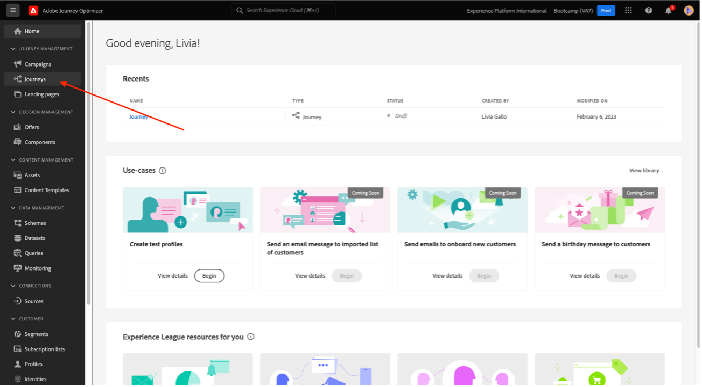

Em seguida, no menu lateral esquerdo, em Eventos, selecione **Segment Qualification** e arraste-o até a jornada:

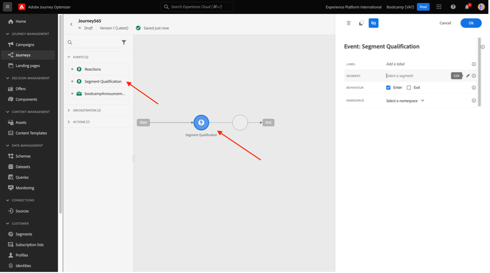

Em seguida, em **Segment** clique em **Edit** para selecionar um segmento:

Selecione a audiência que você criou no CJA e clique em **Save**:

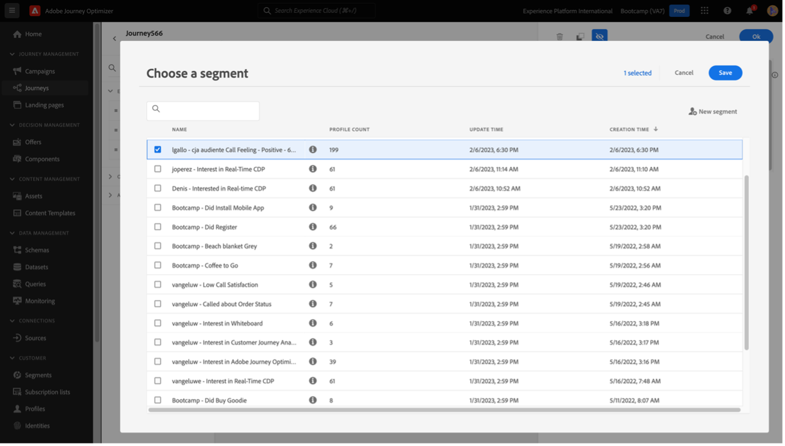

Pronto! A partir daí você pode criar uma jornada para clientes que se qualificam para esse segmento!

[Go Back to User Flow 4](./uc4.md)

[Voltar para todos os módulos](./../../overview.md)
