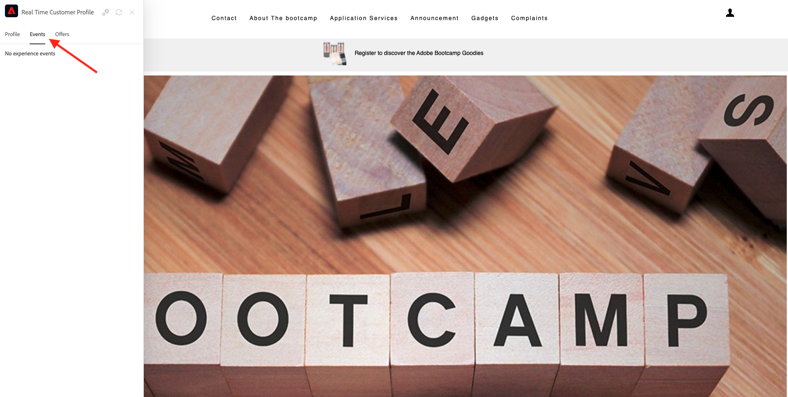
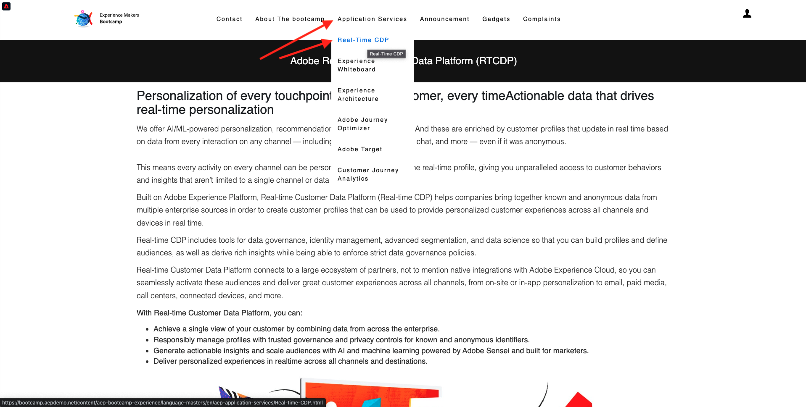
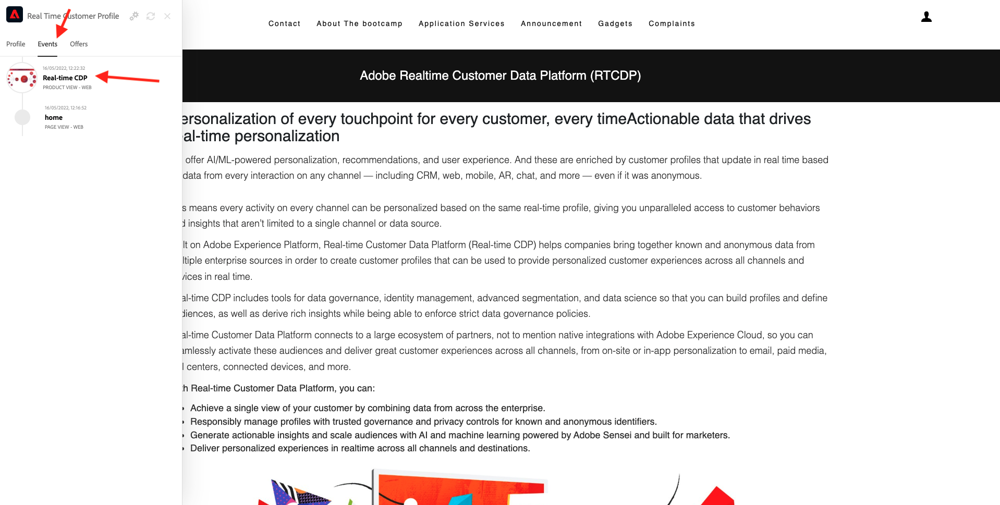
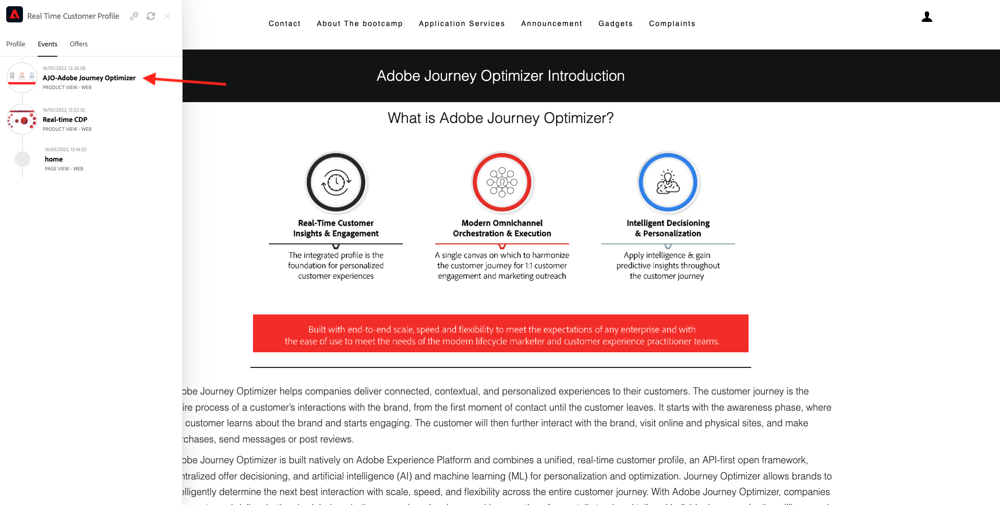

# 1.1 From unknown to known on the website

## Context

The journey from unknown to known is one of the most important topics amongst brands these days, as is the customer journey from acquisition to retention. 

Adobe Experience Platform plays a huge role in this journey. Platform is the brains for communication, the **experience system of record**.

Platform is an environment in which the word customer is broader than just the known customers. An unknown visitor on the website is also a customer from Platform's perspective and as such, all of the behavior as an unknown visitor is also sent to Platform. Thanks to that approach, when this visitor eventually becomes a known customer, a brand can visualize what happened before that moment as well. This helps from an attribution and experience optimization perspective.

## Customer journey flow

Go to [https://bootcamp.aepdemo.net](https://bootcamp.aepdemo.net). Click **Allow All**.

Click the Adobe logo icon in the top left corner of your screen to open the Profile Viewer.
  

Have a look at the Profile Viewer panel and the Real-time Customer Profile with the **Experience Cloud ID** as the primary identifier for this currently unknown customer.
      

You can also see all the Experience Events that were collected based on the customer's behaviour. The list is currently empty but that will change soon.

Go to the **Application Services** menu option and click on the product **Real-Time CDP**.

You'll then see the product detail page. An Experience Event of type **Product View** has now been sent to Adobe Experience Platform using the Web SDK implementation that you reviewed in Module 1. Open the Profile Viewer panel and have a look at your **Experience Events**.
  

  
Go to the **Application Services** menu option and click on the product **Adobe Journey Optimizer**. Another Experience Event has been sent to Adobe Experience Platform. 
  

  
Open the Profile Viewer panel. You'll now see 2 Experience Events of type **Product View**. While the behavior is anonymous, every click is tracked and stored in Adobe Experience Platform. Once the anonymous customer becomes known, we'll be able to merge all anonymous behavior automatically to the know profile.
  

Let's now analyze your customer profile and then use your behavior to personalize your customer experience on the website.

Next Step: [1.2 Visualize your own real-time customer profile - UI](./ex2.md)

[Go Back to User Flow 1](./uc1.md)

[Go Back to All Modules](../../overview.md)
