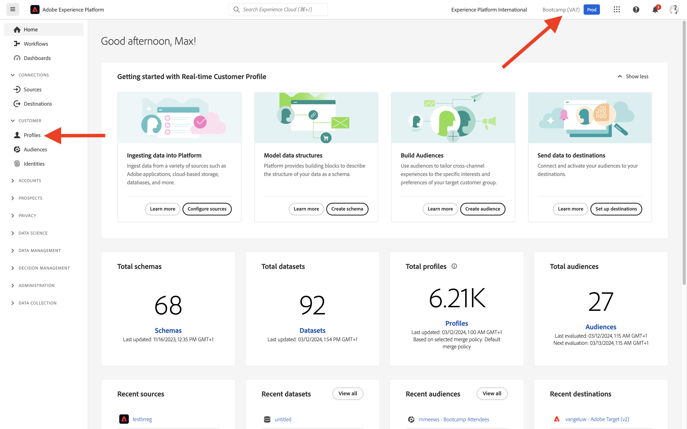
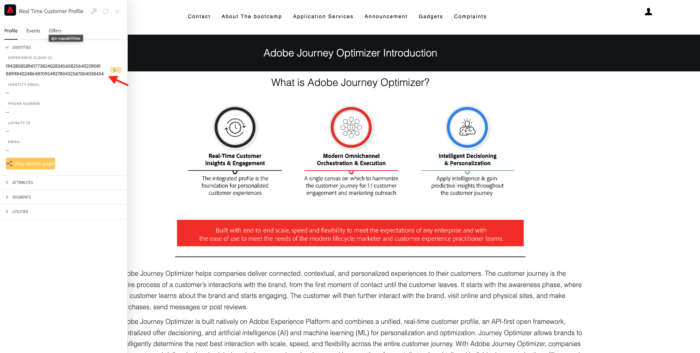
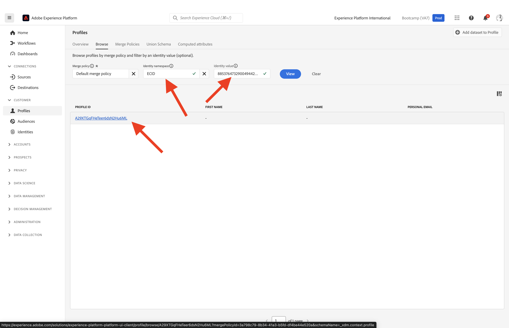
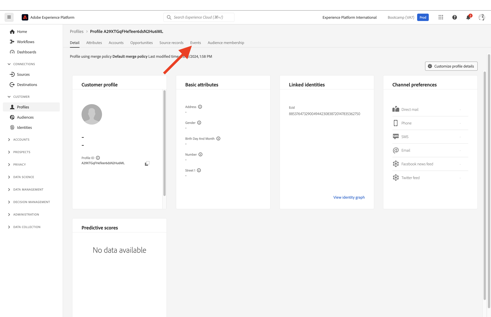
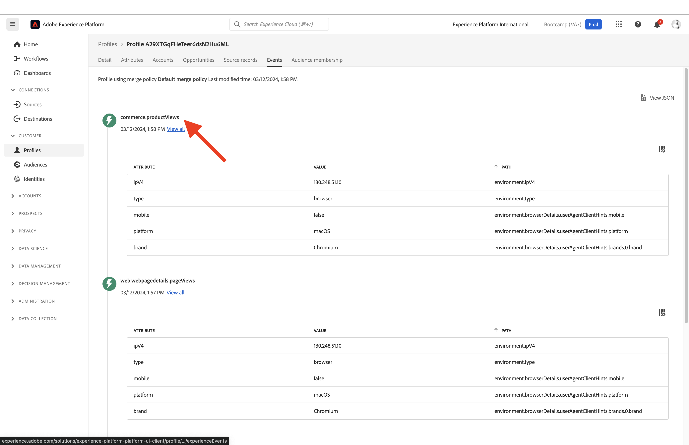
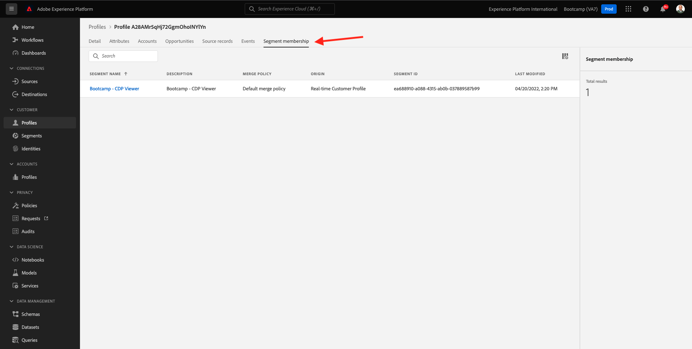

# 1.2 Visualize your own Real-time Customer Profile - UI

In this exercise, you'll login to Adobe Experience Platform and view your own Real-time Customer Profile in the UI.
 
## Story

In the Real-time Customer Profile, all profile data is shown alongside event data, as well as existing audience memberships. The data shown can come from anywhere, from Adobe applications and external solutions. This is the most powerful view in Adobe Experience Platform, the true experience system of record.

## 1.2.1 Use the Customer Profile View in Adobe Experience Platform

Go to [Adobe Experience Platform](https://experience.adobe.com/platform). After logging in, you'll land on the homepage of Adobe Experience Platform.

Before you continue, you need to select a **sandbox**. The sandbox to select is named ``Bootcamp``. You can do this by clicking the text **[!UICONTROL Production Prod]** in the blue line on top of your screen. After selecting the appropriate [!UICONTROL sandbox], you'll see the screen change and now you're in your dedicated [!UICONTROL sandbox].

In the left menu, go to **Profiles** and to **Browse**.

On the Profile Viewer panel on your website, you can find the identity overview. Every identity is linked to a namespace. 

On the Profile Viewer panel, you can currently see this identity:

| Namespace     | Identity       |
|:-------------:| :---------------:|
| Experience Cloud ID (ECID)          | 19428085896177382402834560825640259081 |

With Adobe Experience Platform, all IDs are equally important. Previously, the ECID was the most important ID in the Adobe context and all other IDs were linked to the ECID in a hierarchical relation. With Adobe Experience Platform this is no longer the case, and every ID can be considered a primary identifier. 

Typically, the primary identifier depends on the context. If you ask your Call Center, **What is the most important ID?** they will probably answer, **the phone number!** But if you ask your CRM team, they will answer, **The email address!**  Adobe Experience Platform understands this complexity and manages it for you. Every application, whether an Adobe application or non-Adobe application, will speak with Adobe Experience Platform by referring to the ID they consider primary. And it simply works.

For the field **Identity namespace**, select **ECID** and for the field **Identity Value** enter the ECID you can find on the Profile Viewer panel of the bootcamp website. Click **View**. You'll then see your profile in the list. Click the **Profile ID** to open your profile.

You now see an overview of a couple of important **Profile Attributes** of your customer profile.

Go to **Events**, where you can see entries for every experience event that is linked to your Profile.    

Finally, go to the menu option **Audience membership**. You'll now see all audiences that qualify for this profile.

Let's now create a new audience that will allow you to personalize the customer experience for an anonymous or know customer.

Next Step: [1.3 Create an audience - UI](./ex3.md)

[Go Back to User Flow 1](./uc1.md)

[Go Back to All Modules](../../overview.md)
