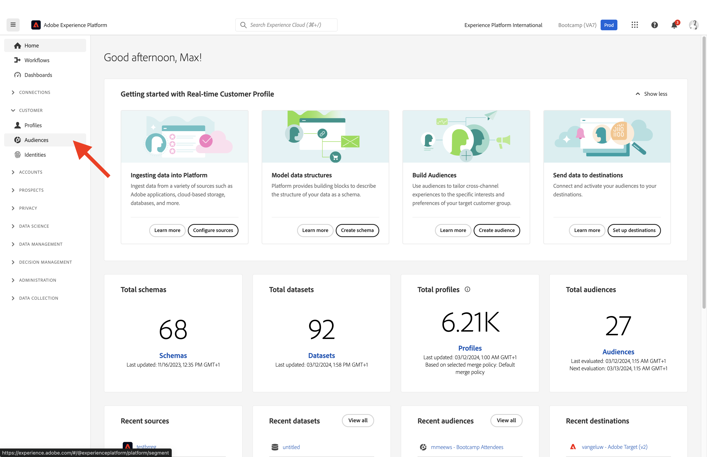
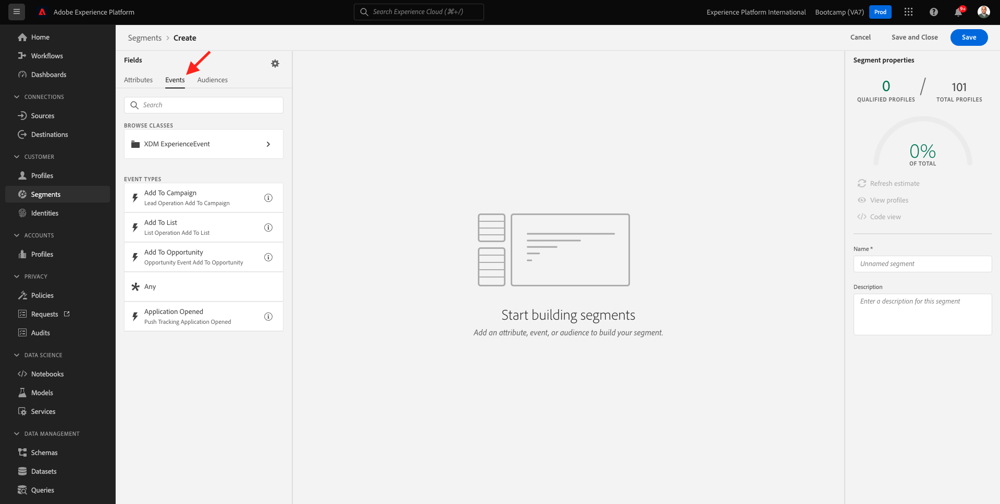
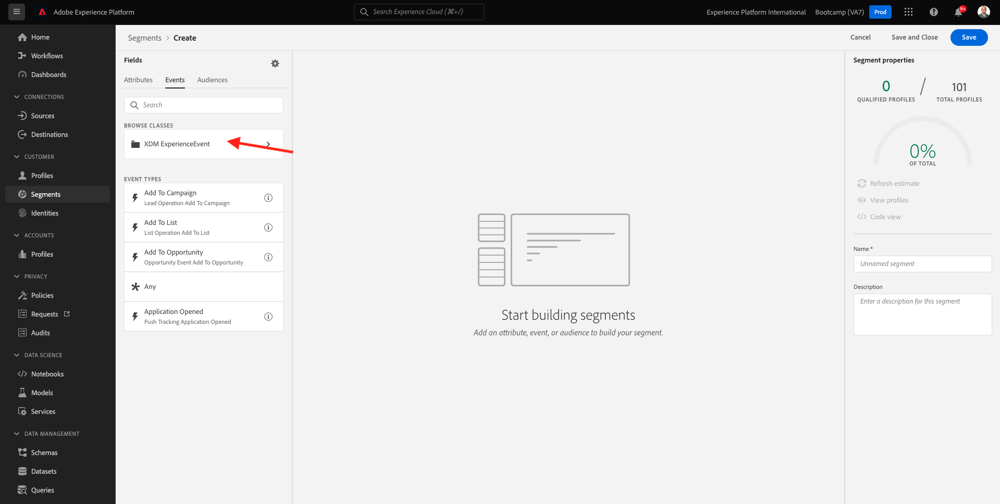
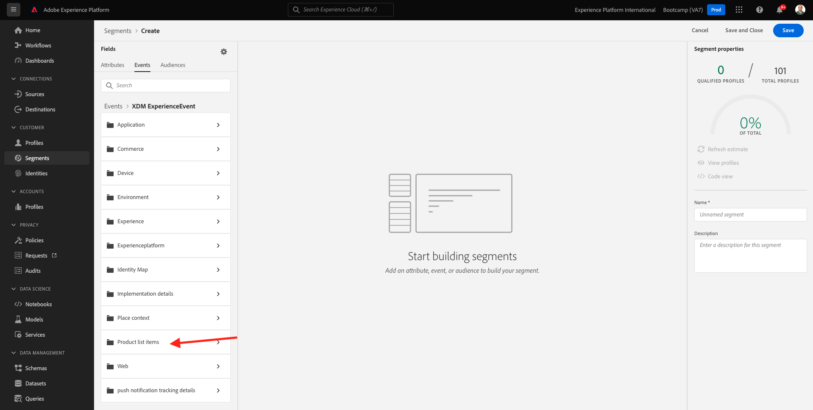
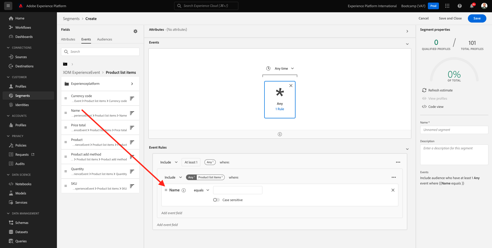
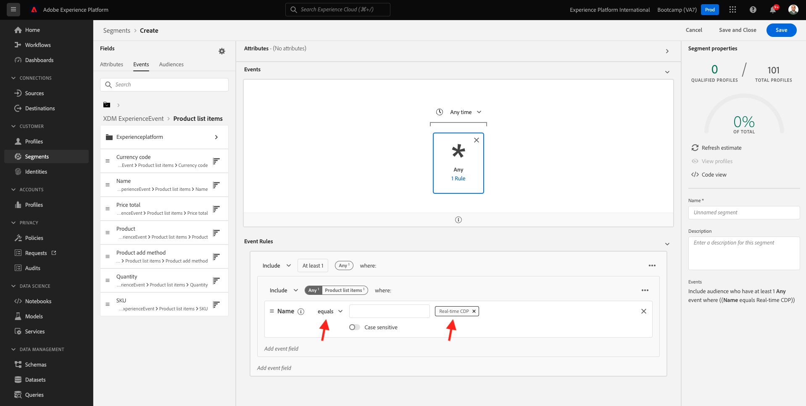
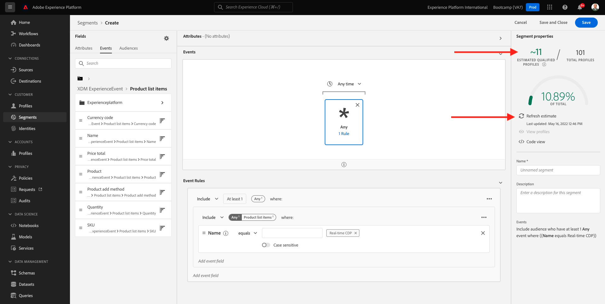
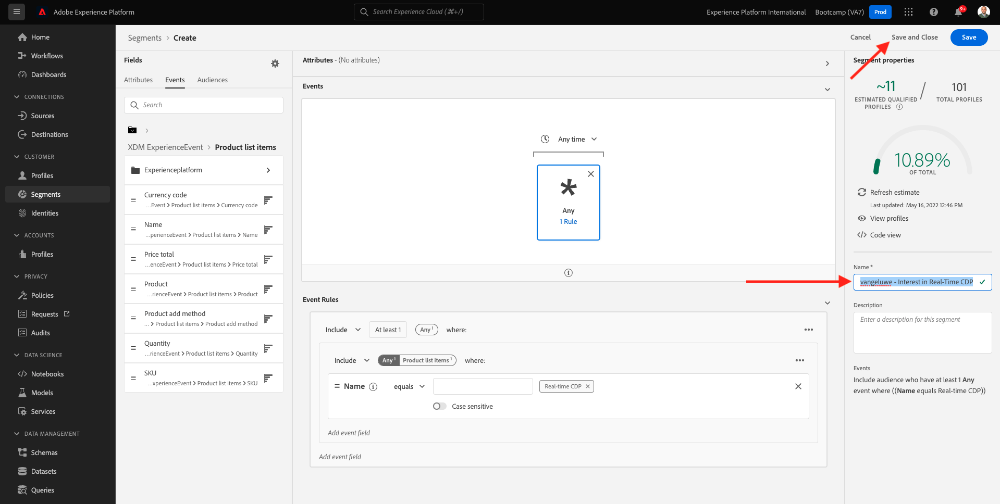
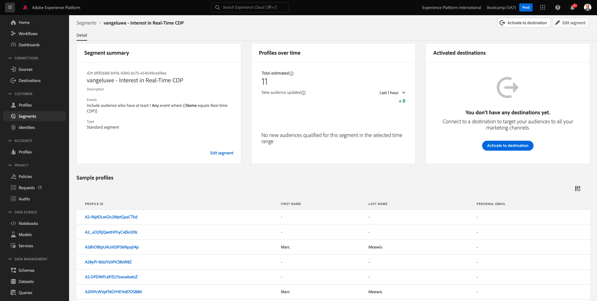

# 1.3 Create an audience - UI

In this exercise, you'll create an audience by making use of Adobe Experience Platform's Audience Builder.

## Story

Go to [Adobe Experience Platform](https://experience.adobe.com/platform). After logging in, you'll land on the homepage of Adobe Experience Platform.

Before you continue, you need to select a **sandbox**. The sandbox to select is named ``Bootcamp``. You can do this by clicking the text **[!UICONTROL Production Prod]** in the blue line on top of your screen. After selecting the appropriate [!UICONTROL sandbox], you'll see the screen change and now you're in your dedicated [!UICONTROL sandbox].

In the menu on the left side, go to **Audiences**. On this page, you will see Dashboards with essential information about **Audience** performance. 

Click on **Browse** to see an overview of all existing audiences. Click on the **+ Create audience** button to start creating a new audience.

A Pop-Ip will appear that will ask you whether you want to **'Compose audience'** or **'Build rule'**. Choose **'Build rule'** to continue and click **create**.

![Segmentation][def]

Once you're in the audience builder, you immediately notice the **Attributes** menu option and the **XDM Individual Profile** reference.

Since XDM is the language that powers the experience business, XDM is also the foundation for the audience builder. All data that is ingested in Platform should be mapped against XDM, and as such, all data becomes part of the same data model regardless of where that data comes from. This gives you a big advantage when building audiences, as from this one audience builder UI, you can combine data from any origin in the same workflow. Audiences built within Audience Builder can be sent to solutions like Adobe Target, Adobe Campaign or any other activation channel.

You now need to create a audience of all customers that have viewed the product **Real-Time CDP**.

To build out this audience, you need to add an Experience Event. You can find all Experience Events by clicking on the **Events** icon in the **Fields** menu bar.

Next, you'll see the top-level, **XDM ExperienceEvents** node. Click on **XDM ExperienceEvent**.

Go to **Product List Items**.

Select **Name** and drag and drop the **Name** object from the left menu onto the audience builder canvas into the **Events** section. You'll then see this:

The comparison parameter should be **equals** and in the input field, enter **Real-time CDP**.

Every time you add an element to the audience builder, you can click the **Refresh Estimate** button to get a new estimate of the population in your audience.

As **Evaluation Method**, select **Edge**.

Finally, let's give your audience a name and save it.

As a naming convention, use:

- `yourLastName - Interest in Real-Time CDP`

Then, click the **Save and Close** button to save your audience.

You'll be taken back to the audience overview page now, where you'll see a sample preview of customer profiles that qualify for your audience.

You can now continue to the next exercise and use your audience with Adobe Target.

Next Step: [1.4 Take Action: send your audience to Adobe Target](./ex4.md)

[Go Back to User Flow 1](./uc1.md)

[Go Back to All Modules](../../overview.md)

[def]: ./images/segmentationpopup.png