# 1.4 Take Action: send your segment to Adobe Target

Go to [Adobe Experience Platform](https://experience.adobe.com/platform). After logging in, you'll land on the homepage of Adobe Experience Platform.

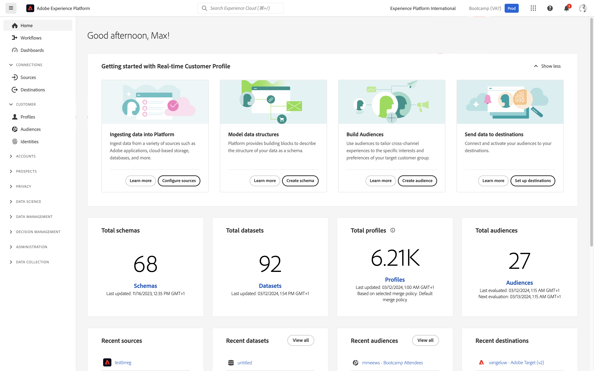

Before you continue, you need to select a **sandbox**. The sandbox to select is named ``Bootcamp``. You can do this by clicking the text **[!UICONTROL Production Prod]** in the blue line on top of your screen. After selecting the appropriate [!UICONTROL sandbox], you'll see the screen change and now you're in your dedicated [!UICONTROL sandbox].

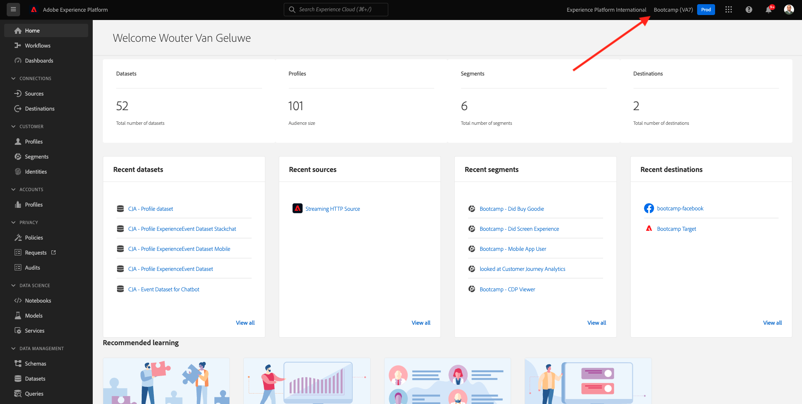

## 1.4.1 Activate your segment to your Adobe Target destination

Adobe Target is available as a destination from Real-Time CDP. To setup your Adobe Target integration, go to **Destinations**, to **Catalog**.

Click **Personalization** in the **Categories** menu. You'll then see the **Adobe Target** destination card. Click **Activate Segments**.

Select the destination ``Bootcamp Target`` and click **Next**.

In the list of available segments, select the segment you created in [1.3 Create a segment](./ex3.md), which is named `yourLastName - Interest in Real-Time CDP`. Then, click **Next**.

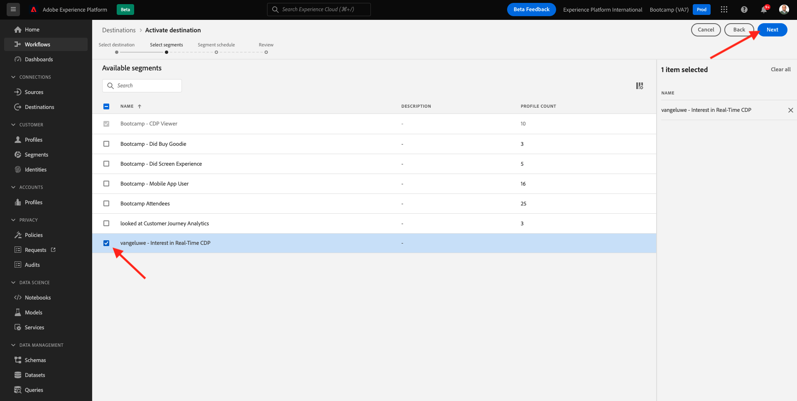

On the next page, click **Next**.

Click **Finish**. 

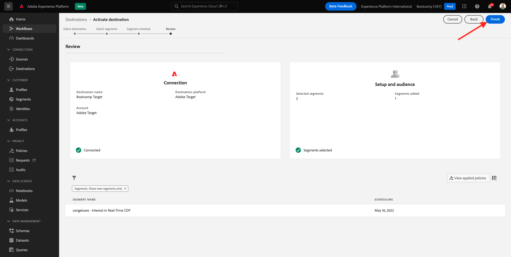

Your segment is now activated towards Adobe Target.

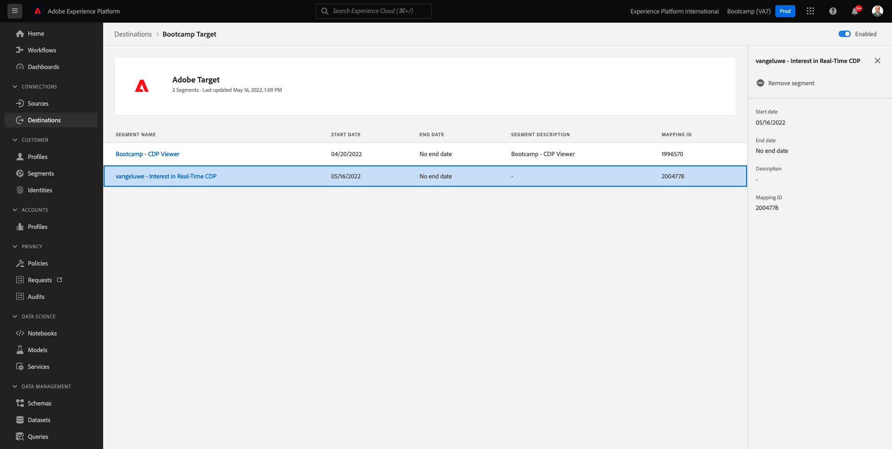

>[!IMPORTANT]
>
>When you've just created your Adobe Target destination in Real-Time CDP, it may take up to an hour for the destination to be live. This is a one-off wait time, due to the setup of the backend configuration. Once the initial 1 hour wait time and backend configuration is done, newly added edge segments that are sent to the Adobe Target destination will be available for targeting in real-time.

## 1.4.2 Configure your Adobe Target form-based activity 

Now that your Real-Time CDP segment is configured to be sent to Adobe Target, you can configure your Experience Targeting activity in Adobe Target. In this exercise you'll configre a Visual Experience Composer-based activity.

Go to the Adobe Experience Cloud homepage by going to [https://experiencecloud.adobe.com/](https://experiencecloud.adobe.com/). Click **Target** to open it.

On the **Adobe Target** homepage, you'll see all existing Activities.
Click **+ Create Activity** to create a new Activity.

Select **Experience Targeting**.

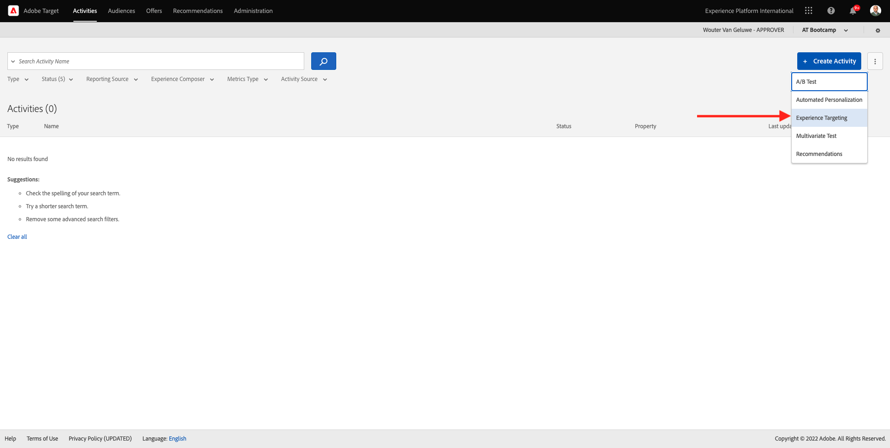

Select **Visual** and set the **Activity URL** to `https://bootcamp.aepdemo.net/content/aep-bootcamp-experience/language-masters/en/exercises/particpantXX.html`, but before you do that, replace XX by a number between 01 and 30.

>[!IMPORTANT]
>
>Every participant of the enablement should use a separate web page to avoid collision of various Adobe Target experiences. You can pick a web page and find the URL by going here: [https://bootcamp.aepdemo.net/content/aep-bootcamp-experience/language-masters/en/exercises.html](https://bootcamp.aepdemo.net/content/aep-bootcamp-experience/language-masters/en/exercises.html). 
>
>Pages all share the same base URL, and end in the number of the participant. 
>
>As an example, participant 1 should use URL `https://bootcamp.aepdemo.net/content/aep-bootcamp-experience/language-masters/en/exercises/particpant01.html`, participant 30 should use URL `https://bootcamp.aepdemo.net/content/aep-bootcamp-experience/language-masters/en/exercises/particpant30.html`.

Select the workspace **AT Bootcamp**.

Click **Next**. 

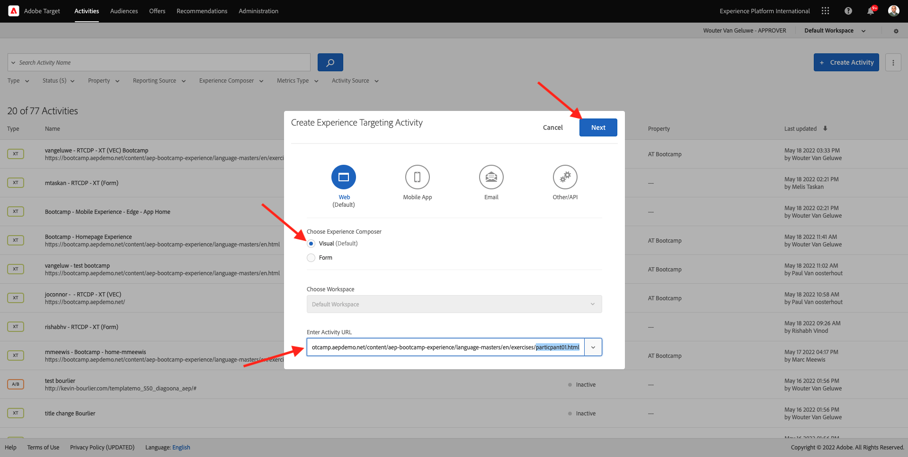

You're now in the Visual Experience Composer. It may take 20-30sec until the website is fully loaded.

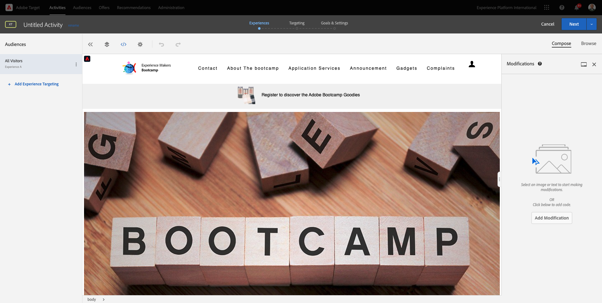

The default audience is currently **All Visitors**. Click on the **3 dots** next to **All Visitors** and click **Change Audience**.

You're now seeing the list of available audiences, and the Adobe Experience Platform segment that you created earlier and sent to Adobe Target is now part of this list. Select the segment you previously created in Adobe Experience Platform. Click **Assign Audience**.

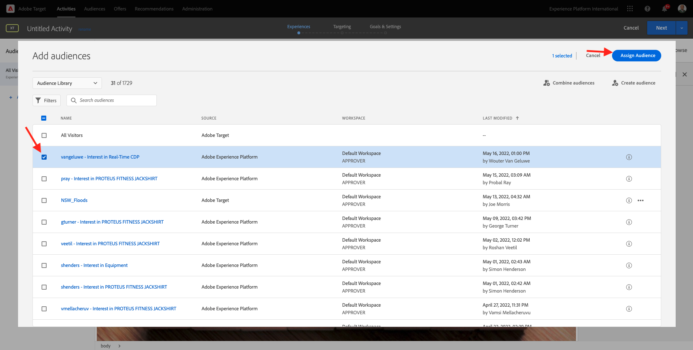

Your Adobe Experience Platform segment is now part of this Experience Targeting Activity.

Before you can change the hero image, you'll need to click **Allow All** on the cookie banner. 

To do so, go to **Browse**

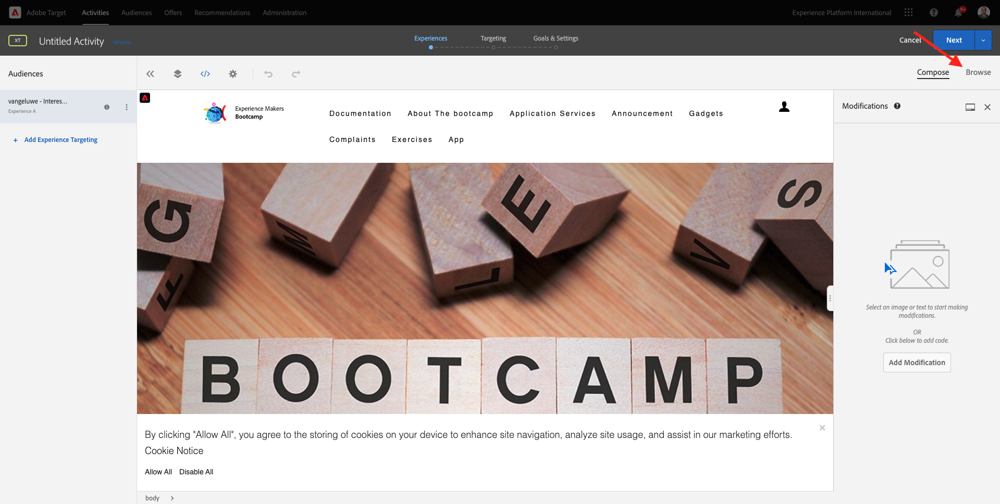

Next, click **Allow All**.

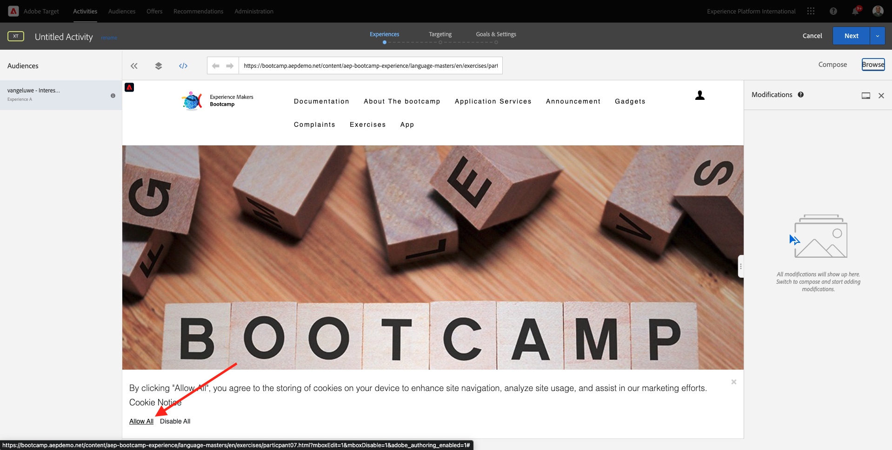

Next, go back to **Compose**.

Let's now change the hero image on the homepage of the website. Click the default hero image on the website, click **Replace Content** and then select **Image**.

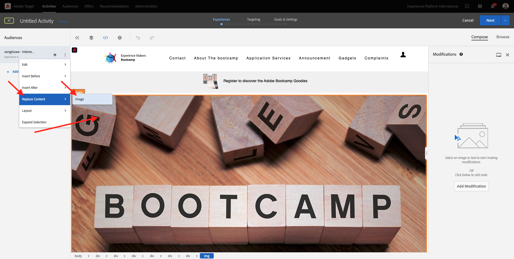

Search for the image file **rtcdp.png**. Select it and then click **Save**.

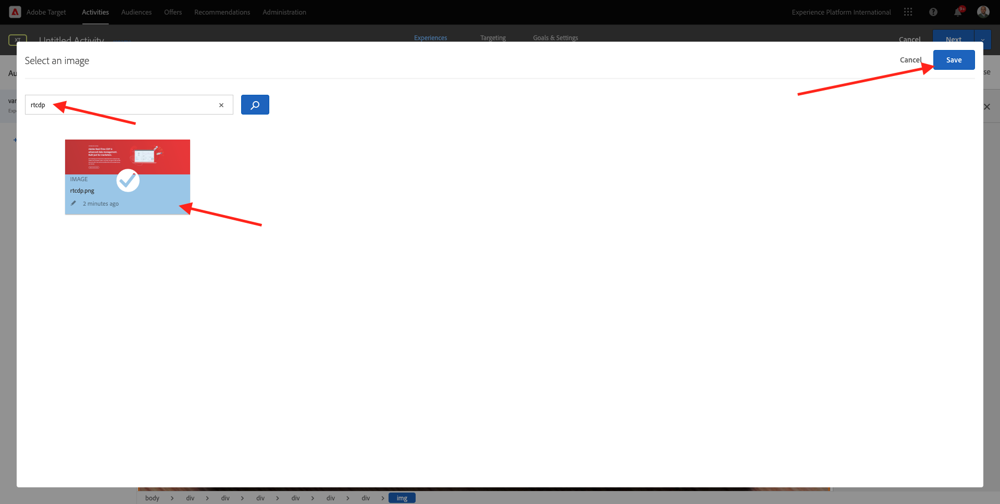

You'll then see the new experience with the new image, for your selected Audience.

Click the title of your activity in the upper left corner to rename it.

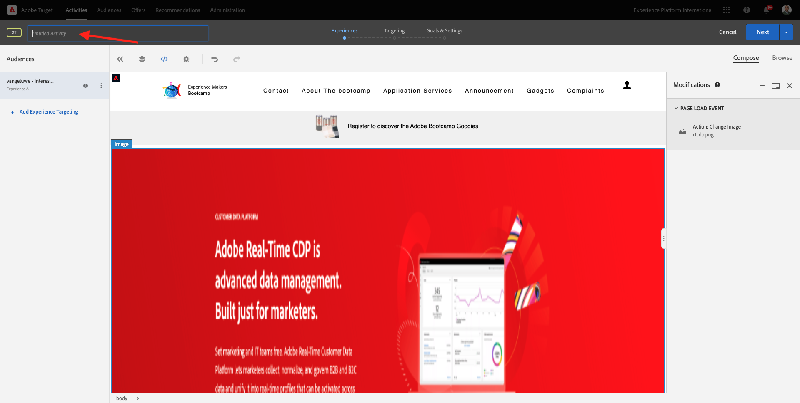

For the name, please use:

- `yourLastName - RTCDP - XT (VEC)`

Click **Next**.

Click **Next**.

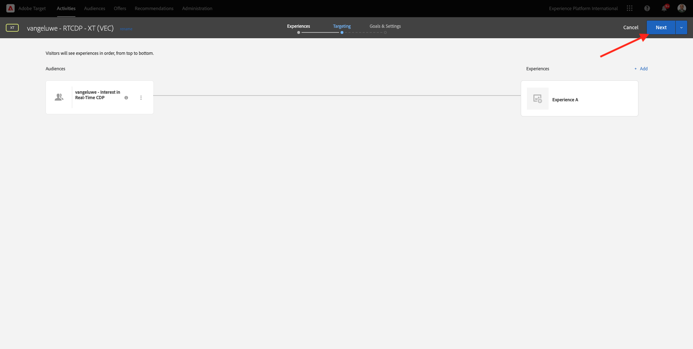

On the **Goals & Settings** - page, go to **Goal Metrics**.

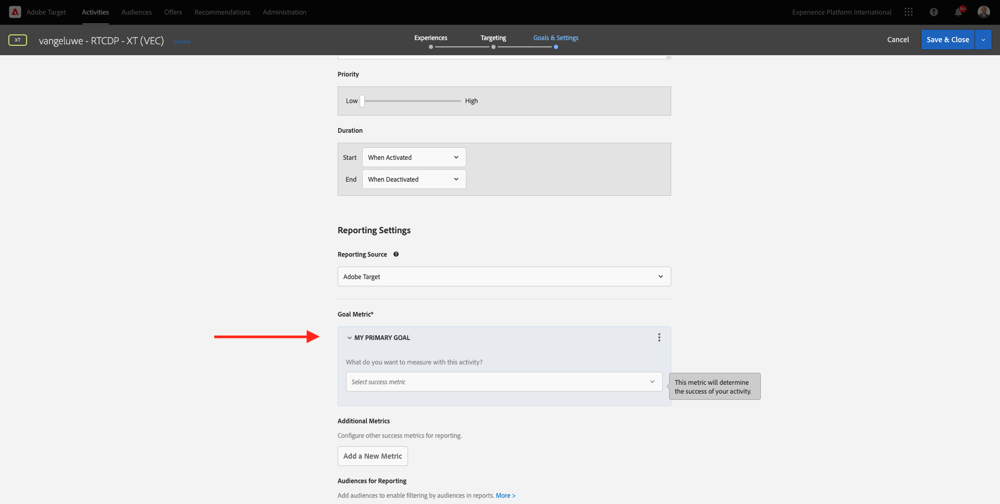

Set the Primary Goal to **Engagement** - **Time On Site**. Click **Save & Close**.

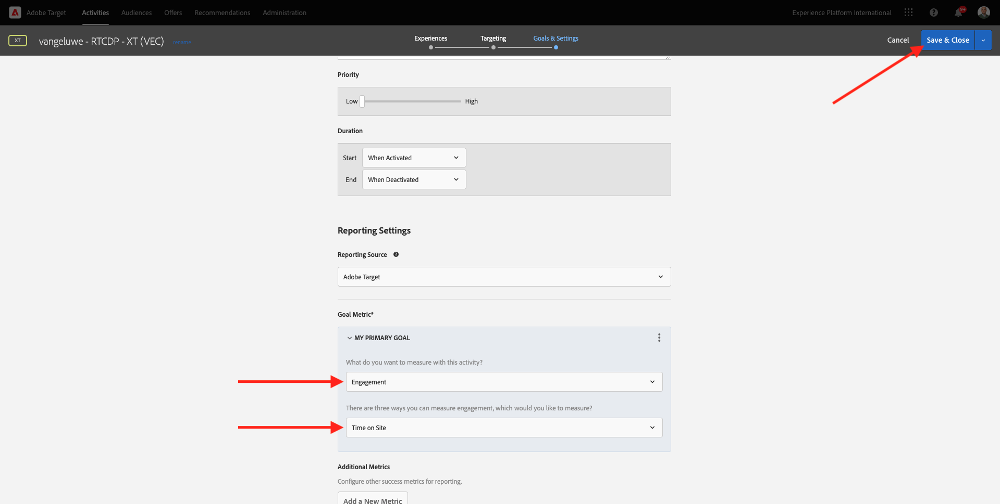

You're now on the **Activity Overview** page. You still need to activate your Activity.

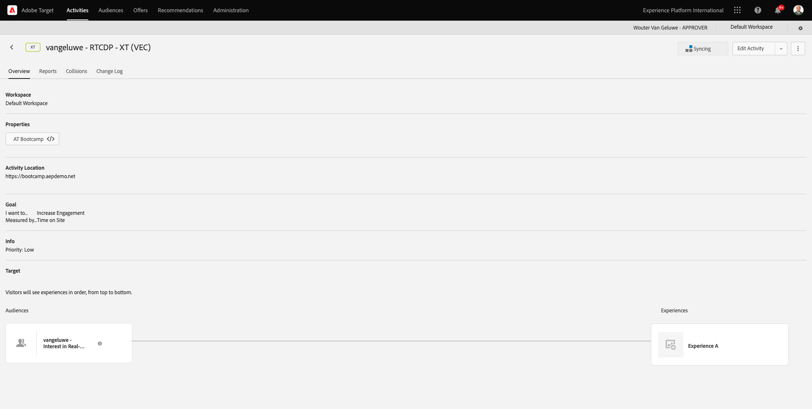

Click on the field **Inactive** and select **Activate**.

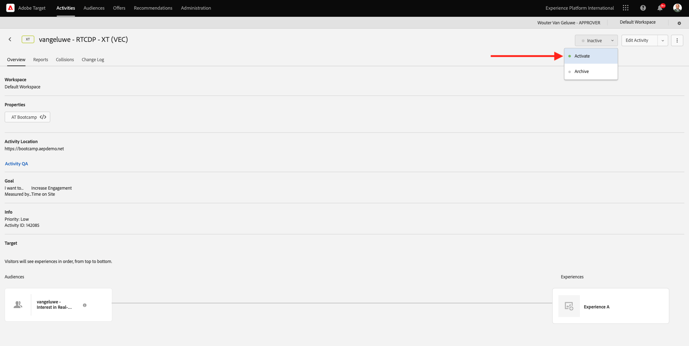

You'll then get a visual confirmation that your activity is now live.

Your activity is now live and can be tested on the bootcamp website.

If you now go back to your demo website and visit the product page for **Real-Time CDP**, you'll then instantly qualify for the segment that you created, and you'll see the Adobe Target activity be displayed on the home page in real-time.

>[!IMPORTANT]
>
>Every participant of the enablement should use a separate web page to avoid collision of various Adobe Target experiences. You can pick a web page and find the URL by going here: [https://bootcamp.aepdemo.net/content/aep-bootcamp-experience/language-masters/en/exercises.html](https://bootcamp.aepdemo.net/content/aep-bootcamp-experience/language-masters/en/exercises.html). 
>
>Pages all share the same base URL, and end in the number of the participant. 
>
>As an example, participant 1 should use URL `https://bootcamp.aepdemo.net/content/aep-bootcamp-experience/language-masters/en/exercises/particpant01.html`, participant 30 should use URL `https://bootcamp.aepdemo.net/content/aep-bootcamp-experience/language-masters/en/exercises/particpant30.html`.

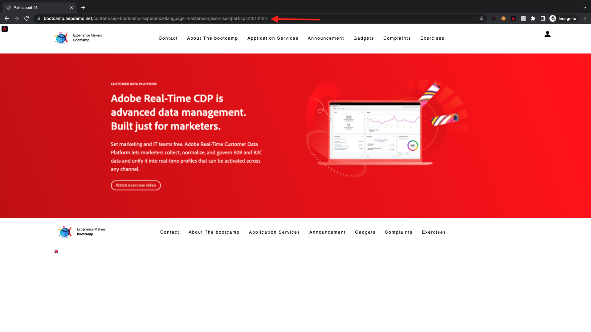

Next Step: [1.5 Take Action: send your segment to Facebook](./ex5.md)

[Go Back to User Flow 1](./uc1.md)

[Go Back to All Modules](../../overview.md)
