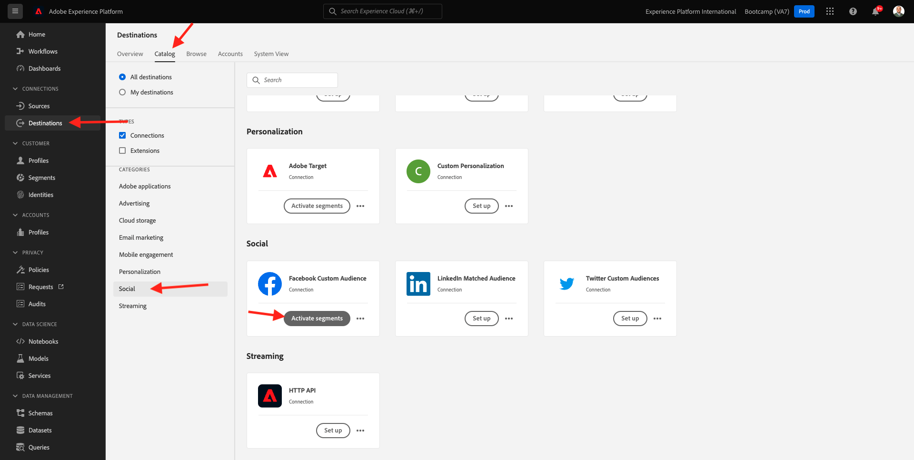
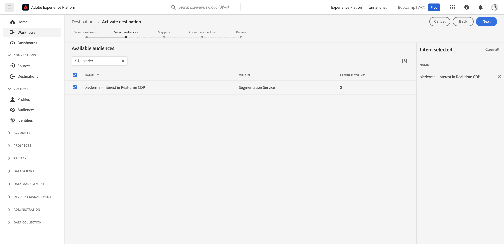
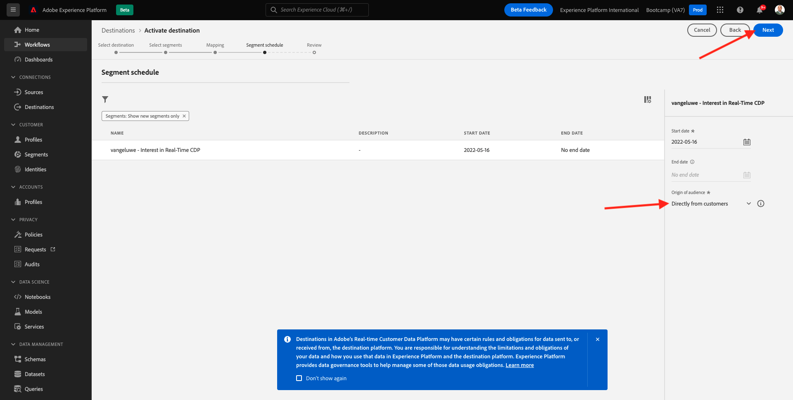
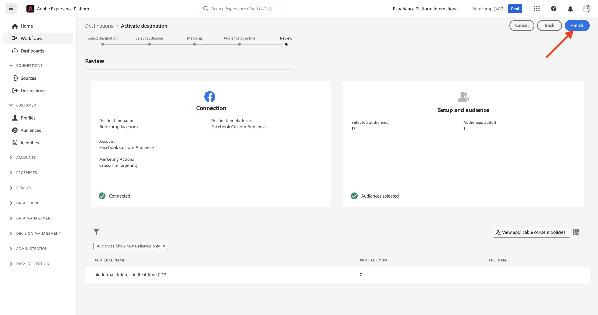

# 1.5 Take Action: send your audience to Facebook

Go to [Adobe Experience Platform](https://experience.adobe.com/platform). After logging in, you'll land on the homepage of Adobe Experience Platform.

Before you continue, you need to select a **sandbox**. The sandbox to select is named ``Bootcamp``. You can do this by clicking the text **[!UICONTROL Production Prod]** in the blue line on top of your screen. After selecting the appropriate [!UICONTROL sandbox], you'll see the screen change and now you're in your dedicated [!UICONTROL sandbox].

In the left menu, go to **Destinations**, then go to **Catalog**. You'll then see the **Destinations Catalog**. In **Destinations**, click **Activate audiences** on the **Facebook Custom Audience** card.

Select the destination **bootcamp-facebook** and click **Next**.

In the list of available audiences, select the audience you created in the previous exercise. Click **Next**.

On the **Mapping** page, make sure that the **Apply Transformation** checkbox is enabled. Click **Next**.

On the **Audience Schedule** page, select the **Origin of your audience** and set it to **Directly from customers**. Click **Next**.

Finally, on the **Review** page, click **Finish**.

Your audience is now linked to Facebook Custom Audiences. Every time a customer qualifies for this audience, a signal will be sent to Facebook server-side to include that customer in the Custom Audience at Facebook side.

In Facebook, you'll find your audience from Adobe Experience Platform under Custom Audiences :

You can now see your custom audience appear in Facebook:

[Go Back to User Flow 1](./uc1.md)

[Go Back to All Modules](../../overview.md)
