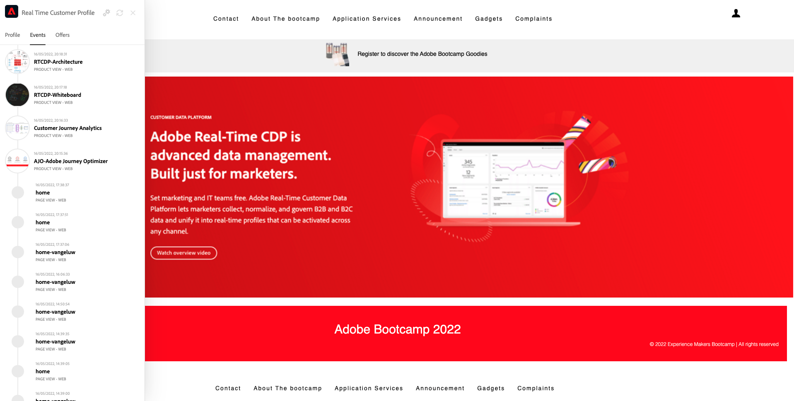

# 2.1 Visit the website and create your account

## Context

The journey from unknown to known is one of the most important topics amongst brands these days, as is the customer journey from acquisition to retention. 

Adobe Experience Platform plays a huge role in this journey. Platform is the brains for communication, the **experience system of record**.

Platform is an environment in which the word customer is broader than just the known customers. An unknown visitor on the website is also a customer from Platform's perspective and as such, all of the behavior as an unknown visitor is also sent to Platform. Thanks to that approach, when this visitor eventually becomes a known customer, a brand can visualize what happened before that moment as well. This helps from an attribution and experience optimization perspective.

## Customer journey flow

Go to [https://bootcamp.aepdemo.net](https://bootcamp.aepdemo.net). Click **Allow All**. Based on your browsing behaviour in the previous user flow, you'll see personalization happen on the homepage of the website.

Click the Adobe logo icon in the top left corner of your screen to open the Profile Viewer. Have a look at the Profile Viewer panel and the Real-time Customer Profile with the **Experience Cloud ID** as the primary identifier for this currently unknown customer.
  

You can also see all the Experience Events that were collected based on the customer's behaviour.

Click the **Profile** icon in the top right corner of your screen.

Click **Create an account**.
  

  
Fill out all the fields of the form.
  

  
Scroll down and clik **Register**.
  

You'll then see this.

You'll also receive this email:

And a couple of minutes later, you'll also receive this email:

Let's see how this onboarding journey was configured next.

Next Step: [2.2 Create your event](./ex2.md)

[Go Back to User Flow 2](./uc2.md)

[Go Back to All Modules](../../overview.md)
