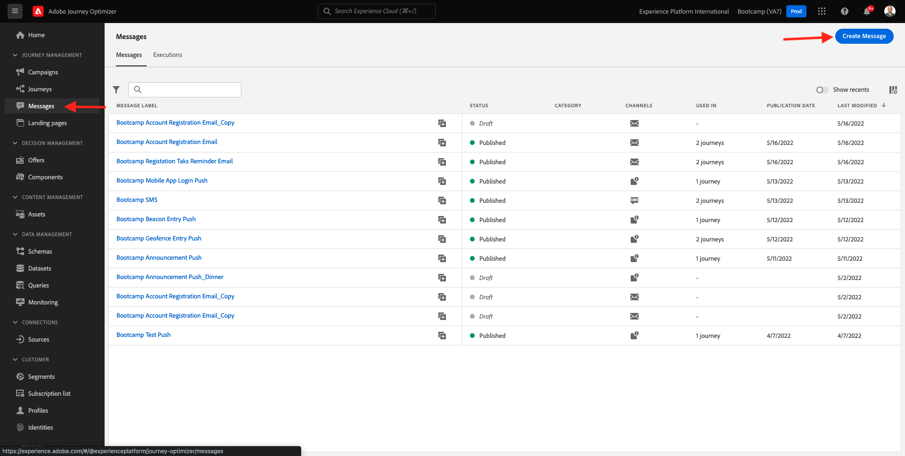
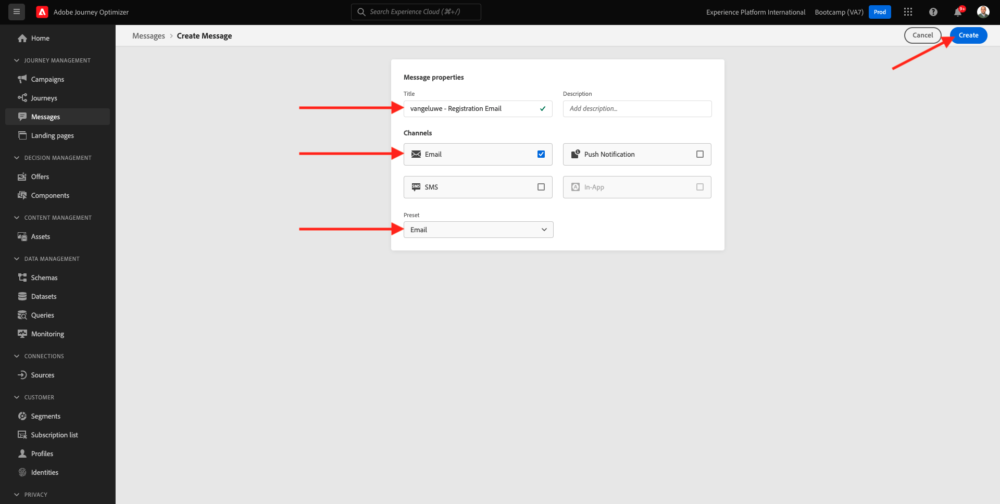
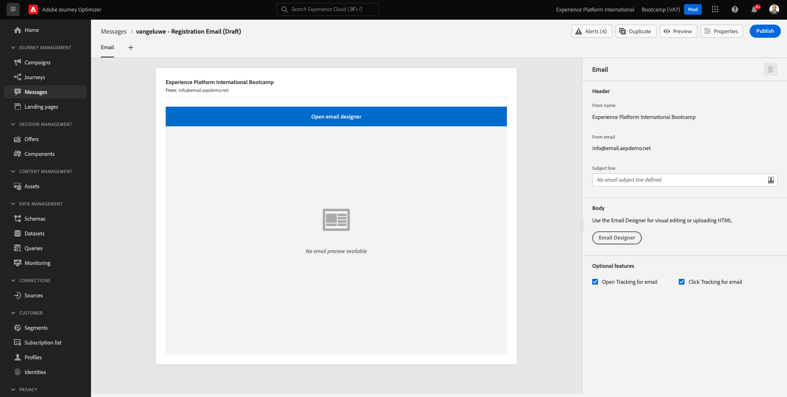
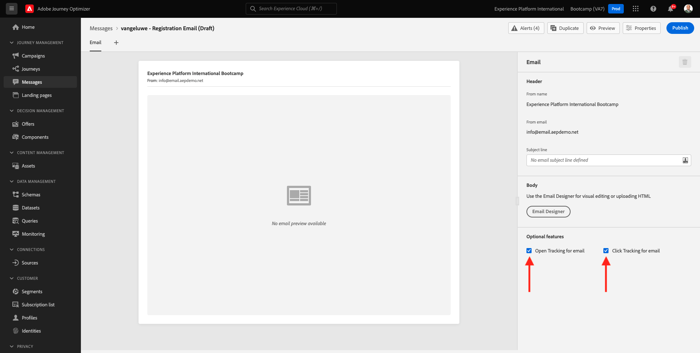
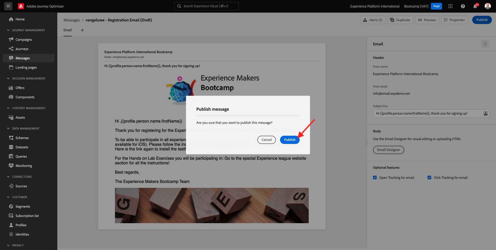
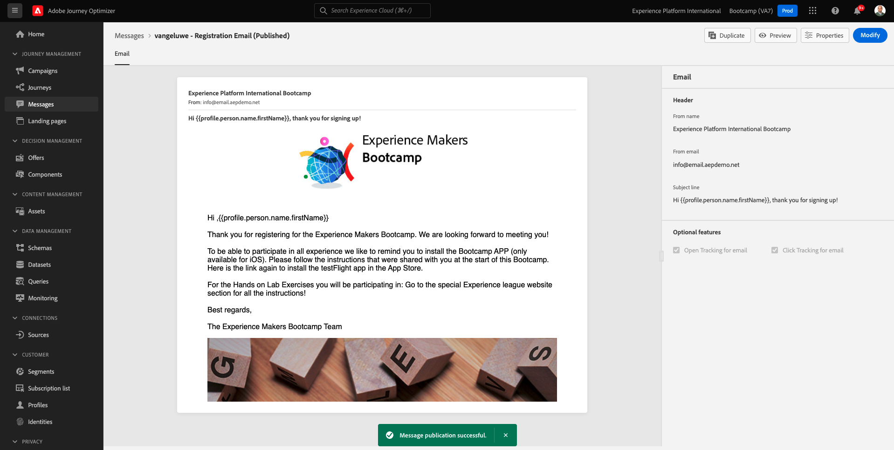

# 2.3 Create your email message

In this exercise, you'll configure the journey that needs to be triggered when someone creates an account on the demo website.

Login to Adobe Journey Optimizer by going to [Adobe Experience Cloud](https://experience.adobe.com). Click **Journey Optimizer**.

You'll be redirected to the **Home**  view in Journey Optimizer. First, make sure you're using the correct sandbox. The sandbox to use is called `Bootcamp`. To change from one sandbox to another, click on **Prod** and select the sandbox from the list. In this example, the sandbox is named **Bootcamp**. You'll then be in the **Home** view of your sandbox `Bootcamp`.

In the left menu, click **Messages**. 

On the Messages screen, you’ll see a view similar to this. Click **Create Message**.

Give your Message a title following this naming convention `yourLastName - Registration Email` and select the **Email Preset** and enable the **Email** channel. Click on the **Create** button to create your Registration Email message.

The next screen is the message dashboard, from there you will be able to see the email thumbnail when the content will be provided.

On the right-hand side are the Email properties:

- **From email**: the email address from whom the recipient will receive email message. Note that this value is specified by the **preset** given in the previous step and is read-only.
- **From name**: the sender name  from whom the recipient will receive email message. Note that this value is specified by the **preset** given in the previous step and is read-only.
- **Subject line**: the mandatory subject of the message which will be edited in the next step. 
- **Body**: a button brings you to the Email Designer to create and edit the email content.
- **Optional features**: these two checkboxes allow to disable the tracking of the email's opens and email's clicks and therefore, prevent the message from measuring metrics like open rate, click-through rate,...

First, make sure that the 2 checkboxes under **Optional features** are checked. If not, please **make sure they are both activated**. 

Click the **Subject line** text field.

In the text area start writing **Hi**.

The subject line is not done yet. Next you need to bring in the personalization token for the field **First name** which is stored under `profile.person.name.firstName`. In the left menu, scroll down to find the **Person** element and click on the arrow to go a level deeper.

Now find the **Full name** element and click on the arrow to go a level deeper.

Finally, find the **First name** field and click on the **+** sign next to it. You'll then see the personalization token appear in the text field.

Next, add the text **, thank you for signing up!**. Click **Save**.

You'll then be back here. Click **Email Designer** to create the email's content. 

In the next screen you will be prompted with 3 different methods to provide the email's content:

- **Design from scratch**: Start with a blank canvas and use the WYSIWYG-editor to drag and drop structure and content components to visually build up the email's content.
- **Code your own**: Create your own email template by coding it using HTML
- **Import HTML**: Import an existing HTML template, which you'll be able to edit.

Click **Import HTML**.

Drag and drop the file **mailtemplatebootcamp.html**, which you can download [here](./../../assets/html/mailtemplatebootcamp.html.zip). Click **Import**.

You'll then see this default email template:

Let's personalize the email. Click next to the text **Hi** and then click the **Add Personalization** icon.

Next, you need to bring the **First name** personalization token which is stored under `profile.person.name.firstName`. In the menu, find the **Person** element, drill down to the **Full Name** element, and then click the **+** icon to add the First Name field onto to expression editor.

Click **Save**.

You'll now notice how the personalization field has been added to your text. 

Click **Save** to save your message.

Go back to the message dashboard by clicking the **arrow** next to the subject line text in the top-left corner.

You've now completed the draft version of your registration email. Click **Publish** to publish your message so you can use it in a journey.

Click **Publish** again.

Wait until you see a green confirmation pop-up at the bottom of the screen indicating that the message is published. 

You have finished this exercise.

Next Step: [2.4 Create your journey](./ex4.md)

[Go Back to User Flow 2](./uc2.md)

[Go Back to All Modules](../../overview.md)
