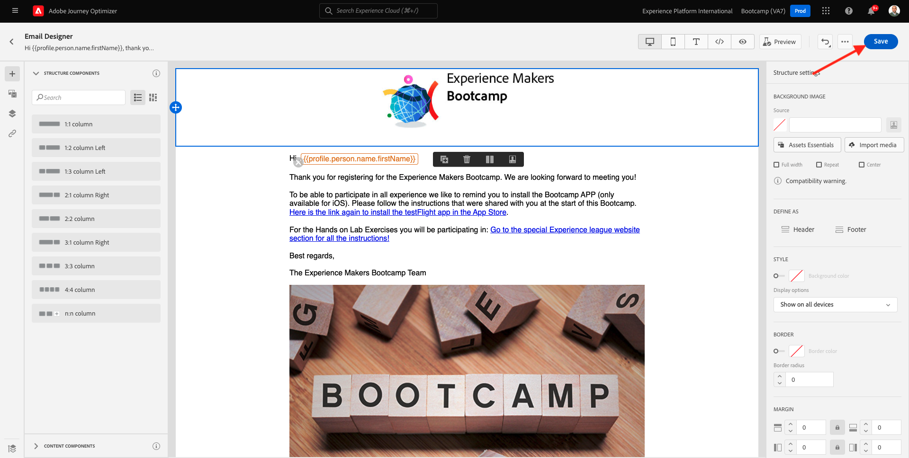

# 2.3 Create your journey and email message

In this exercise, you'll configure the journey that needs to be triggered when someone creates an account on the demo website.

Login to Adobe Journey Optimizer by going to [Adobe Experience Cloud](https://experience.adobe.com). Click **Journey Optimizer**.

You'll be redirected to the **Home**  view in Journey Optimizer. First, make sure you're using the correct sandbox. The sandbox to use is called `Bootcamp`. To change from one sandbox to another, click on **Prod** and select the sandbox from the list. In this example, the sandbox is named **Bootcamp**. You'll then be in the **Home** view of your sandbox `Bootcamp`.

## 2.3.1 Create your journey

In the left menu, click **Journeys**. Next, click **Create Journey** to create a new journey.

You'll then see an empty journey screen.

In the previous exercise, you created a new **Event**. You named it like this `yourLastNameAccountCreationEvent` and replaced `yourLastName` with your last name. This was the result of the Event creation:

You now need to take this event as the start of this Journey. You can do this by going to the left side of your screen and searching for your event in the list of events.

Select your event, drag and drop it on the Journey canvas. Your Journey now looks like this:

As the second step in the journey, you need to add a short **Wait** step. Go to the left side of your screen to the **Orchestration** section to find this. You'll be using profile attributes and need to make sure they are populated into the Real-time Customer Profile.

Your journey now looks like this. On the right side of the screen you need to configure the wait time. Set it to 1 minute. This will give plenty of time for the profile attributes to be available after the event fires.

Click **Ok** to save your changes.

As the third step in the journey, you need to add an **Email** action. Go to the left side of your screen to **Actions**, select the **Email** action, then drag and drop it on the second node in your journey. You now see this.

Set the **Category** to **Marketing** and select an email surface that enables you to send email. In this case, the email surface to select is **Email**. Ensure that the checkboxes for **Clicks on email** and **email opens** are both enabled.

The next step is to create your message. To do that, click **Edit content**.

## 2.3.2 Create your message

To create your message, click **Edit content**.

You now see this.

Click the **Subject line** text field.

In the text area start writing **Hi**

The subject line is not done yet. Next you need to bring in the personalization token for the field **First name** which is stored under `profile.person.name.firstName`. In the left menu, scroll down to find the **Person** element and click on the arrow to go a level deeper.

Now find the **Full name** element and click on the arrow to go a level deeper.

Finally, find the **First name** field and click on the **+** sign next to it. You'll then see the personalization token appear in the text field.

Next, add the text **, thank you for signing up!**. Click **Save**.

You'll then be back here. Click **Email Designer** to create the email's content. 

In the next screen you will be prompted with 3 different methods to provide the email's content:

- **Design from scratch**: Start with a blank canvas and use the WYSIWYG-editor to drag and drop structure and content components to visually build up the email's content.
- **Code your own**: Create your own email template by coding it using HTML
- **Import HTML**: Import an existing HTML template, which you'll be able to edit.

Click **Import HTML**. Alternatively, you can click **Saved Templates** and select the template **Bootcamp - Email Template**.

If you selected **Import HTML**, you can now drag and drop the file **mailtemplatebootcamp.html**, which you can download [here](../../assets/html/mailtemplatebootcamp.html.zip). Click Import.

You'll then see this default email template:

Let's personalize the email. Click next to the text **Hi** and then click the **Add Personalization** icon.

Next, you need to bring the **First name** personalization token which is stored under `profile.person.name.firstName`. In the menu, find the **Person** element, drill down to the **Full Name** element, and then click the **+** icon to add the First Name field onto to expression editor.

Click **Save**.

You'll now notice how the personalization field has been added to your text. 

Click **Save** to save your message.

Go back to the message dashboard by clicking the **arrow** next to the subject line text in the top-left corner.

You've now completed creating your registration email. Click the arrow in the top left corner to go back to your journey.

Click **Ok**.

## 2.3.3 Publish your journey

You still need to give your journey a Name. You can do that by clicking the **Pencil** icon in the top left side of your screen.

You can then enter the journey's name here. Please use `yourLastName - Account Creation Journey`. Click **OK** to save your changes.

You can now publish your journey by clicking **Publish**.

Click **Publish** again.

You'll then see a green confirmation bar saying that your journey is now Published.

You've now finished this exercise.

Next Step: [2.4 Test your journey](./ex4.md)

[Go Back to User Flow 2](./uc2.md)

[Go Back to All Modules](../../overview.md)