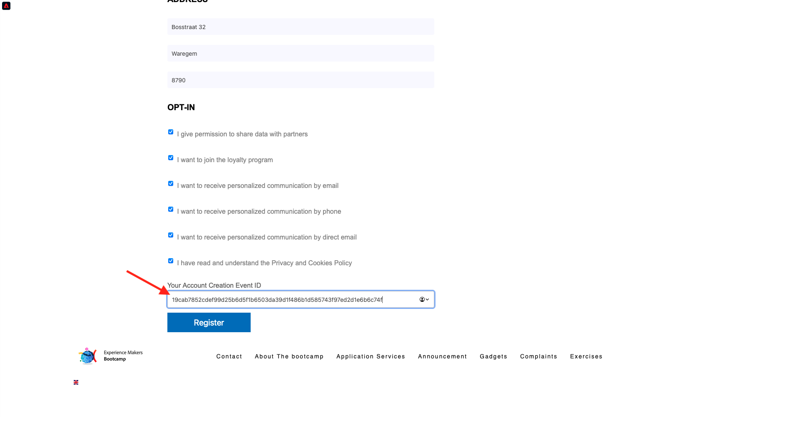

# 2.5 Test your journey

## Customer journey flow

Open a new, clean, incognito browser window and go to [https://bootcamp.aepdemo.net](https://bootcamp.aepdemo.net). Click **Allow All**. Based on your browsing behaviour in the previous user flow, you'll see personalization happen on the homepage of the website.

Click the **Profile** icon in the top right corner of your screen.

Click **Create an account**.
  

  
Fill out all the fields of the form. Use a real value for email address and phonenumber, as it will be used in later exercises for delivery of email and SMS.
  

  
Scroll down. You now need to input the eventID of your custom event that you created in exercise 2.2. You can find it here:

The event ID is what needs to be sent to Adobe Experience Platform in order to trigger the journey that you've built. This is the eventID in this example: `19cab7852cdef99d25b6d5f1b6503da39d1f486b1d585743f97ed2d1e6b6c74f`

Fill out the eventID in the field **Your Account Creation Event ID** and click **Register**.
  

You'll then see this.

You'll also receive this email, which is the email you created yourself as part of this exercise.

You've now finished this exercise.

Next Step: [2.6 Install & use the mobile app](./ex6.md)

[Go Back to User Flow 2](./uc2.md)

[Go Back to All Modules](../../overview.md)
