# 2.6 Personalization in the call center

As discussed multiple times during the bootcamp already, personalizing the customer experience is something that should happen in an omnichannel way. A call center is often quite disconnected from the rest of the customer journey and that often leads to frustrating customer experiences, but it doesn't need to be. Let's show you an example of how the call center can easily be connected to Adobe Experience Platform, in real-time.

## Customer Journey Flow

In the previous exercise, using the mobile application, you purchased a product by clicking the **Buy** button.

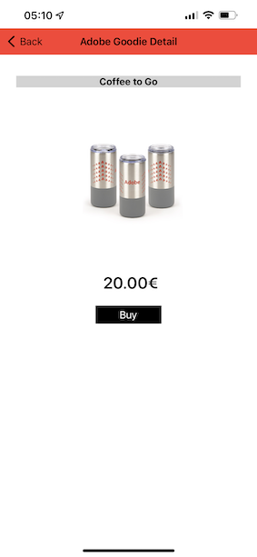

Let's assume you have a question on the status of your order, what would you do? Typically you would call the call center.

Before calling the call center, you need to know your **Loyalty ID**. You can find your Loyalty ID on the Profile Viewer of the website.

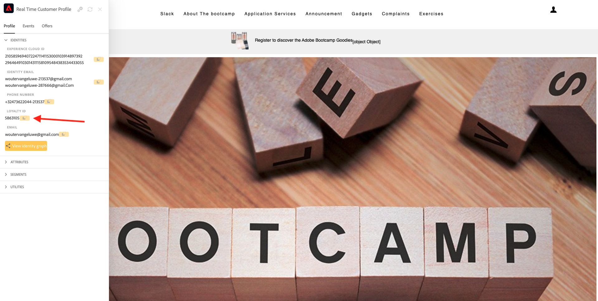

In this case, the **Loyalty ID** is **5863105**. As part of our custom implementation of the call center feature in the demo environment, you need to add a prefix to your **Loyalty ID**. The prefix is **11373**, so the Loyalty ID to use in this example is **11373 5863105**.

Let's do that now. Use your phone and call the number **+1 (323) 745-1670**.

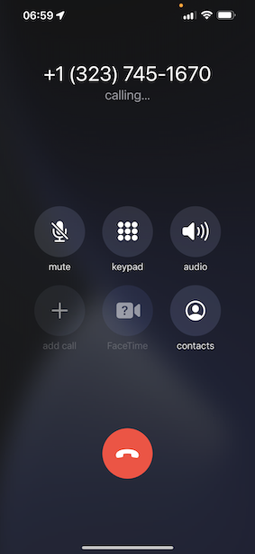

You'll be asked to enter your Loyalty ID, followed by **#**. Enter your Loyalty ID.

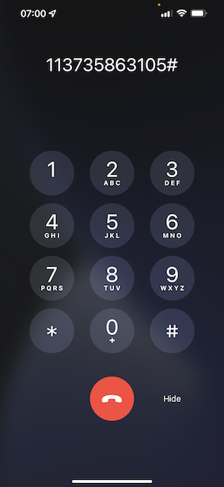

You'll then hear **Hello, first name**. That first name is taken from the Real-Time Customer Profile in Adobe Experience Platform. You then have 3 choices. Press number **1**, **Order Status**.

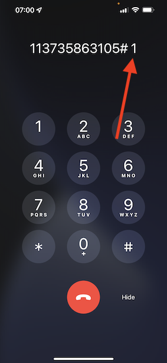

After hearing your order status, you'll be given a choice to press **1** to go back to the main menu or else, press 2. Press **2**.

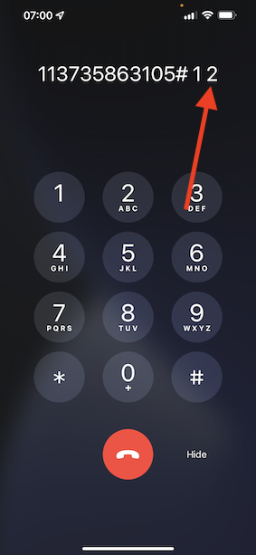

You'll then be asked to rate your call center experience, by selecting a number between 1 and 5, with 1 being low and 5 being high. Make your choice.

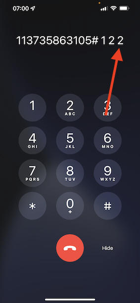

Your call to the call center will now end.

Go to [Adobe Experience Platform](https://experience.adobe.com/platform). After logging in, you'll land on the homepage of Adobe Experience Platform.

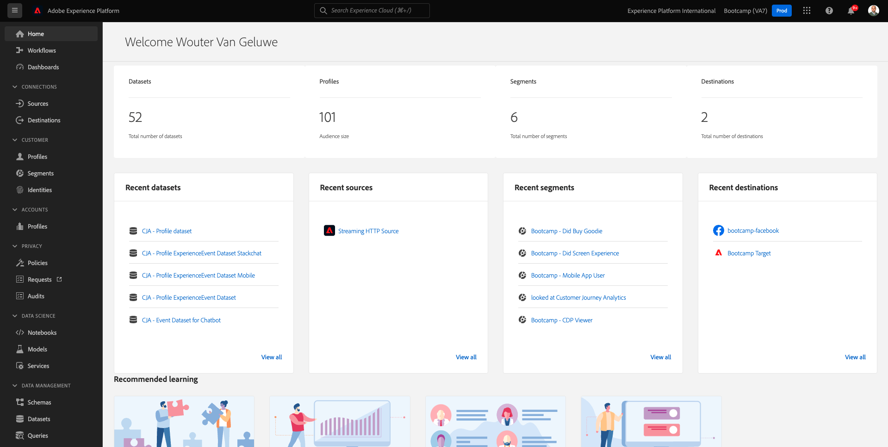

Before you continue, you need to select a **sandbox**. The sandbox to select is named ``Bootcamp``. You can do this by clicking the text **[!UICONTROL Production Prod]** in the blue line on top of your screen. After selecting the appropriate [!UICONTROL sandbox], you'll see the screen change and now you're in your dedicated [!UICONTROL sandbox].

In the left menu, go to **Profiles** and to **Browse**.

Select the **Identity namespace** **Email** and enter the email address of your customer profile. Click **View**. Click to open your profile.

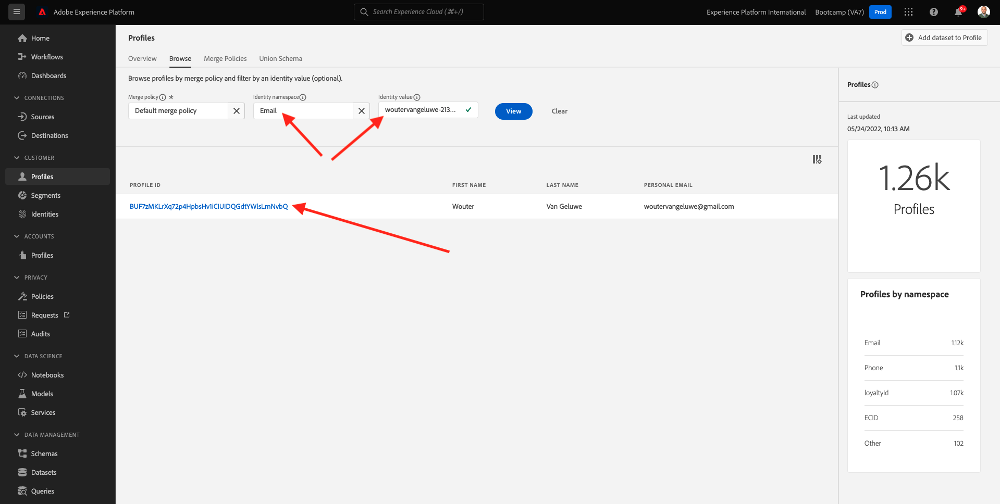

You'll see your customer profile again. Go to **Events**.

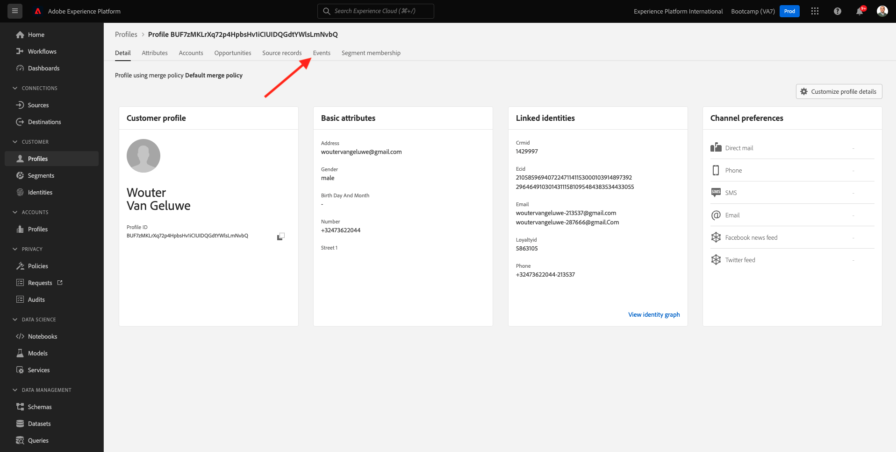

Under events, you'll see 2 events with an eventType of **callCenter**. The first event is a result of your answer to the question **Rate your call satisfaction**.

Scroll down a bit, and you'll see the event that was recorded when you selected the option to check your **Order Status**.

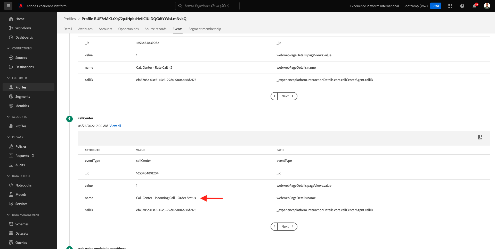

Go to **Segment membership**. You'll now see that 2 segments qualify on your profile, in real-time, based on the interactions you had through the call center. These segment memberships can and should then be used to impact what communication and personalization happens across any other channel.

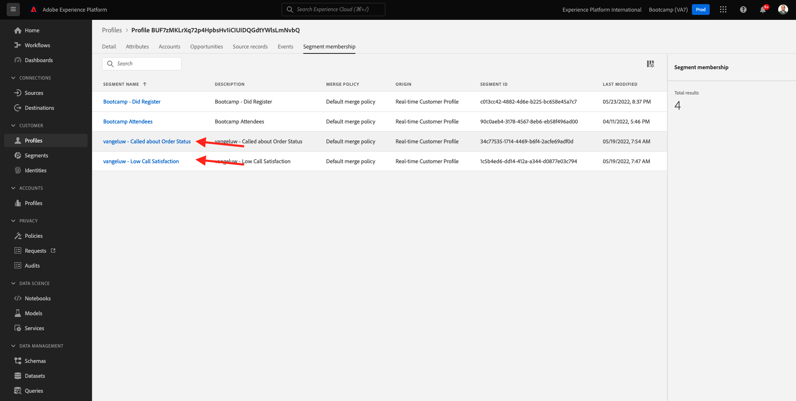

You've now finished this exercise.

[Go Back to User Flow 2](./uc2.md)

[Go Back to All Modules](../../overview.md)
