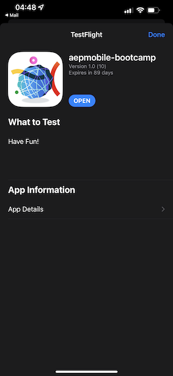

# 2.6 Install & use the mobile app

## Install the mobile app

Before you install the app, you need to enable **Tracking** on your iOS device. To do so, go to **Settings** > **Privacy & Security** > **Tracking** and ensure that the option **Allow Apps to Request to Track**.

Go to the Apple App Store and search for `aepmobile-bootcamp`. Click **Install** or **Download**.

Once the app is installed, click **Open**.

Click **OK**.

Click **Allow**.

Click **I agree**.

Click **Allow While Using App**.

Click **Allow**.

You're now in the app, on the homepage, ready to go through the customer journey.

## Customer journey flow

First of all, you need to login. Click **Login**.

After creating your account in the previous exercises, you saw this on the website. You now need to reuse the email address of the account you created in the app to login.
  

Enter the email address you used on the website here and click **Login**.

You'll then get a confirmation that you're logged in, and you'll receive a push notification.

Go back to the homepage in the app, and you'll see additional capabilities appear.

Go to **Products**. Click on any product, in this example **Coffee to go**.

You'll see the **Coffee to go** product page in the app. Click **Buy**.

You've now finished this exercise and you're ready for the next exercises.

Next Step: [2.7 Personalization in the call center](./ex7.md)

[Go Back to User Flow 2](./uc2.md)

[Go Back to All Modules](../../overview.md)
