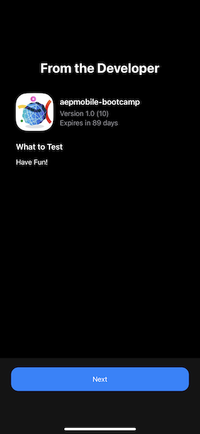
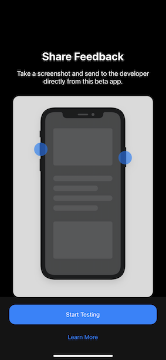

# 2.6 Install & use the mobile app

## Install the mobile app

Ask your Adobe representative to get access to the mobile application. The mobile application is available only for iOS and is available through Apple's Testflight app, so you need to install the TestFlight app first. Your Adobe representative will then provide you with access to the mobile app, after which you'll receive an invite like this one to accept an invitiation to join App Store Connect:

Next, go to your mobile device. You'll receive a second invitation to start testing the app. Click **View in TestFlight**.

In TestFlight, click **Accept**.

Click **Install**.

Click **Open**.

Click **Allow While Using App**.

Click **Allow**.

Click **OK**.

Click **Next**.

Click **Start Testing**.

You're now in the app, on the homepage, ready to go through the customer journey.

## Customer journey flow

First of all, you need to login. Click **Login**.

After creating your account in the previous exercises, you saw this on the website. You now need to reuse the email address of the account you created in the app to login.
  

Enter the email address you used on the website here and click **Login**.

You'll then get a confirmation that you're logged in, and you'll receive a push notification.

Go back to the homepage in the app, and you'll see additional capabilities appear.

You've now finished this exercise and you're ready for the next exercises.

[Go Back to User Flow 2](./uc2.md)

[Go Back to All Modules](../../overview.md)
