# 3.1 Use the mobile app and trigger a beacon entry

## Install the mobile app

Ask your Adobe representative to get access to the mobile application. The mobile application is available only for iOS and is available through Apple's Testflight app, so you need to install the TestFlight app first. Your Adobe representative will then provide you with access to the mobile app, after which you'll receive an invite like this one to accept an invitiation to join App Store Connect:

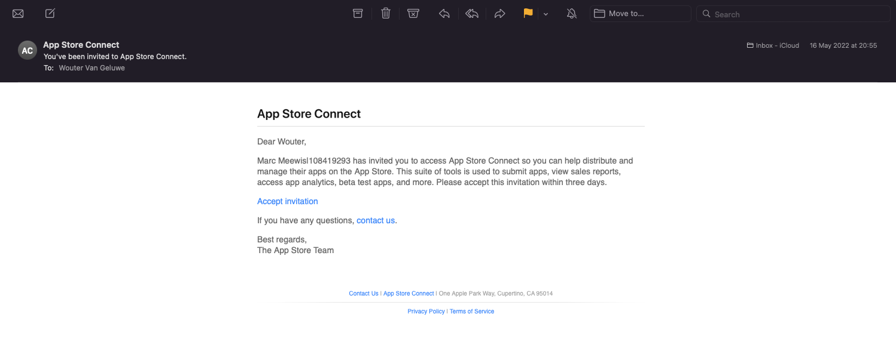

Next, go to your mobile device. You'll receive a second invitation to start testing the app. Click **View in TestFlight**.

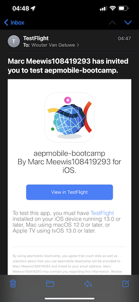

In TestFlight, click **Accept**.

Click **Install**.

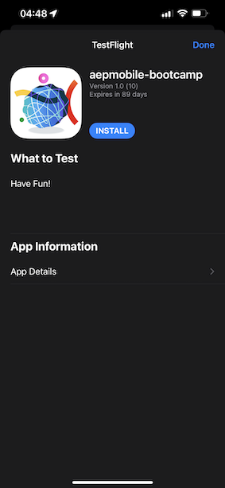

Click **Open**.

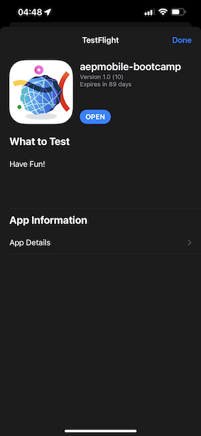

Click **Allow While Using App**.

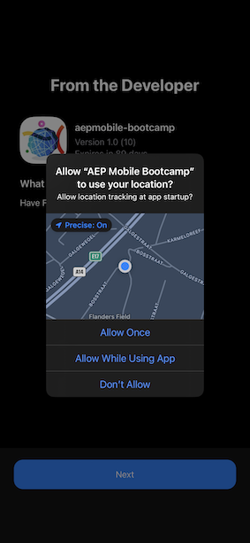

Click **Allow**.

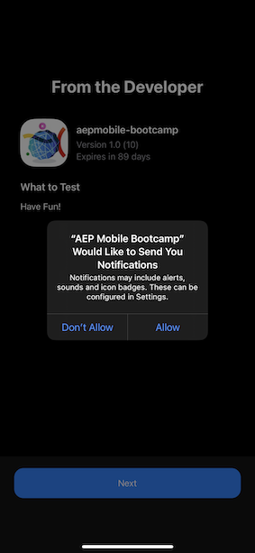

Click **OK**.

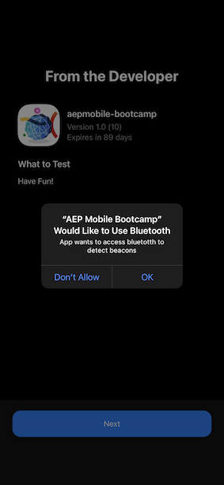

Click **Next**.

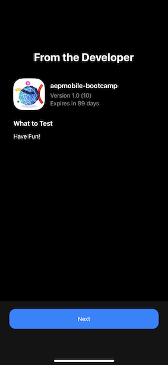

Click **Start Testing**.

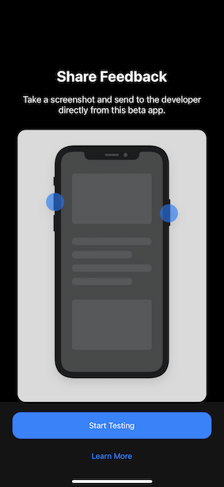

You're now in the app, on the homepage, ready to go through the customer journey.

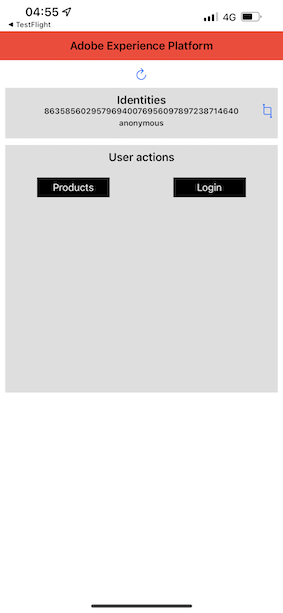

## Customer journey flow

First of all, you need to login. Click **Login**.

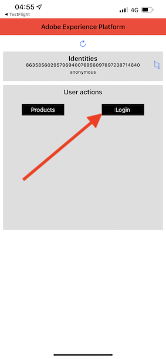

After creating your account in the previous exercises, you saw this on the website. You now need to reuse the email address of the account you created in the app to login.
  
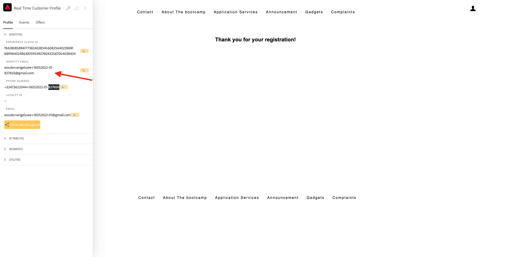

Enter the email address you used on the website here and click **Login**.

You'll then get a confirmation that you're logged in, and you'll receive a push notification.

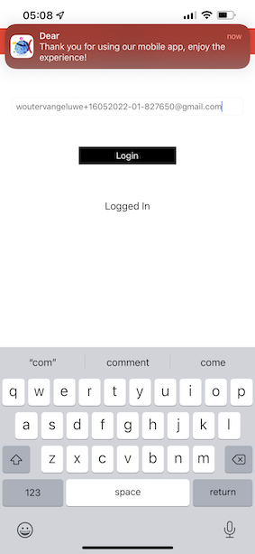

Go back to the homepage in the app, and you'll see additional capabilities appear.

First, go to **Products**. Click on any product, in this example **Coffee to go**.

You'll see the **Coffee to go** product page in the app.

You'll now simulate a beacon entry event in an offline store location. The goal of simulating this is to personalize the customer experience on the in-store screens. To visualize the in-store experience, a page has been created that will dynamically show the information that is relevant to the customer that just entered the store. 

Before continuing, please open this web page on your computer: [https://bootcamp.aepdemo.net/content/aep-bootcamp-experience/language-masters/en/screen.html](https://bootcamp.aepdemo.net/content/aep-bootcamp-experience/language-masters/en/screen.html)

You'll then see this:

Next, go back to the homepage. Click the **beacon** icon.

You'll then see this. First, select **Bootcamp Screen Beacon** and then click the **entry** button. This will allow you to simulate a beacon entry.

Now, have a look at the in-store screen. You'll see the last product you viewed appear there within 5 seconds.

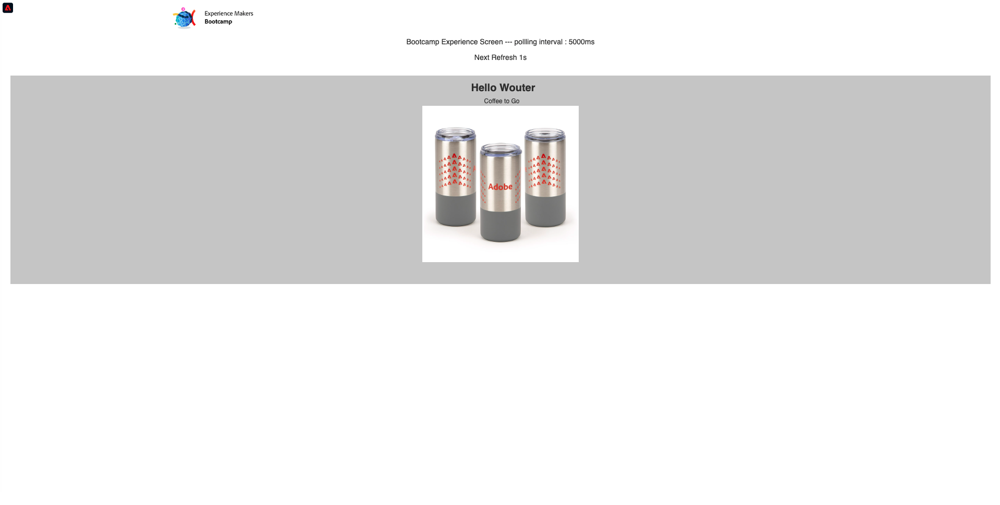

Then, go back to **Products**. Click on any product, in this example **Beach blanket Tan**.

Next, go back to the homepage. Click the **beacon** icon.

You'll then see this. First, select **Bootcamp Screen Beacon** and then click the **entry** button again. This will allow you to simulate a beacon entry.

Now, have a look at the in-store screen again. You'll see the last product you viewed appear there within 5 seconds.

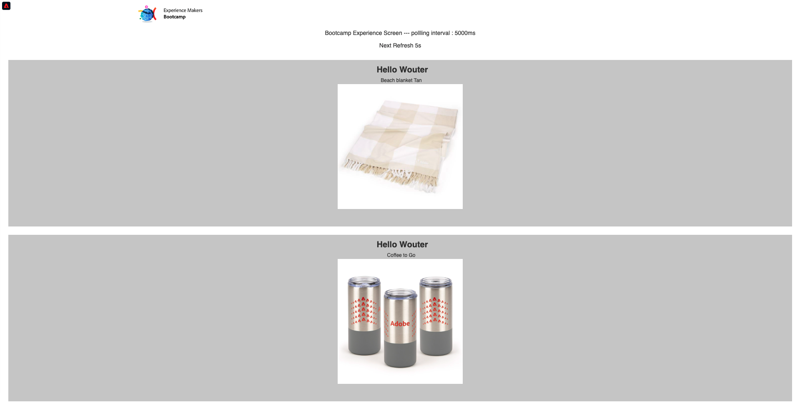

Let's also have a look at your Profile Viewer on the website now. You'll see a lot of events that were added there, just to show that any interaction with a customer is collected and stored in Adobe Experience Platform.

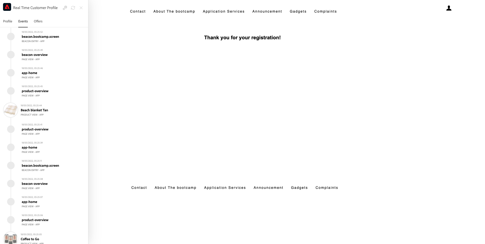

In the next exercises, you'll configure and test your own beacon entry journey.

Next Step: [3.2 Create your event](./ex2.md)

[Go Back to User Flow 3](./uc3.md)

[Go Back to All Modules](../../overview.md)
