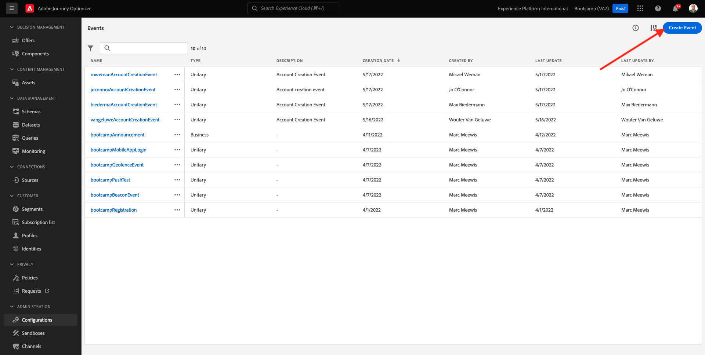
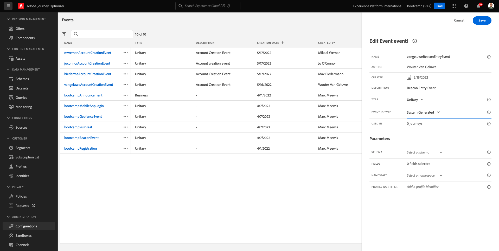
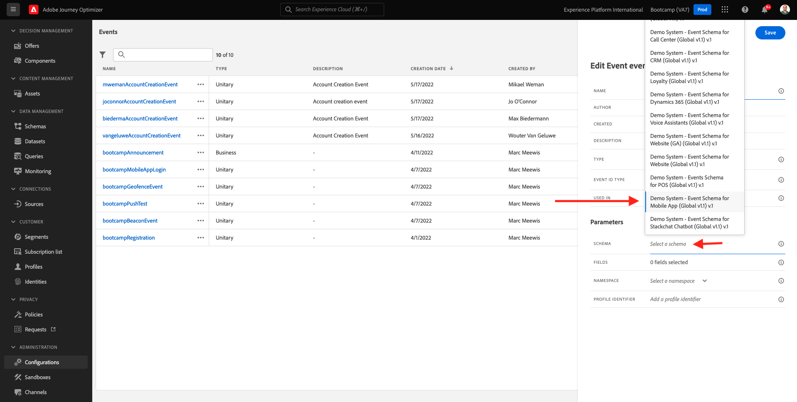
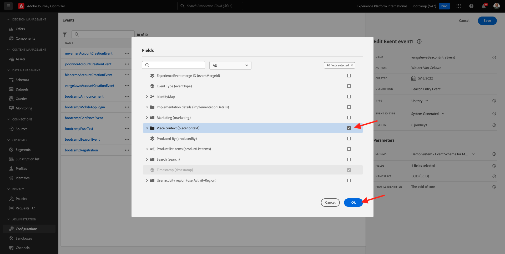
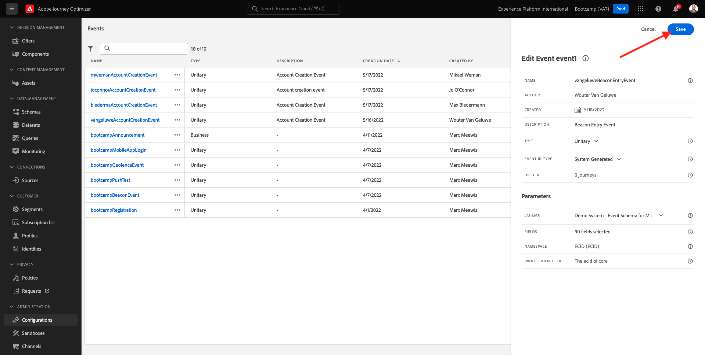
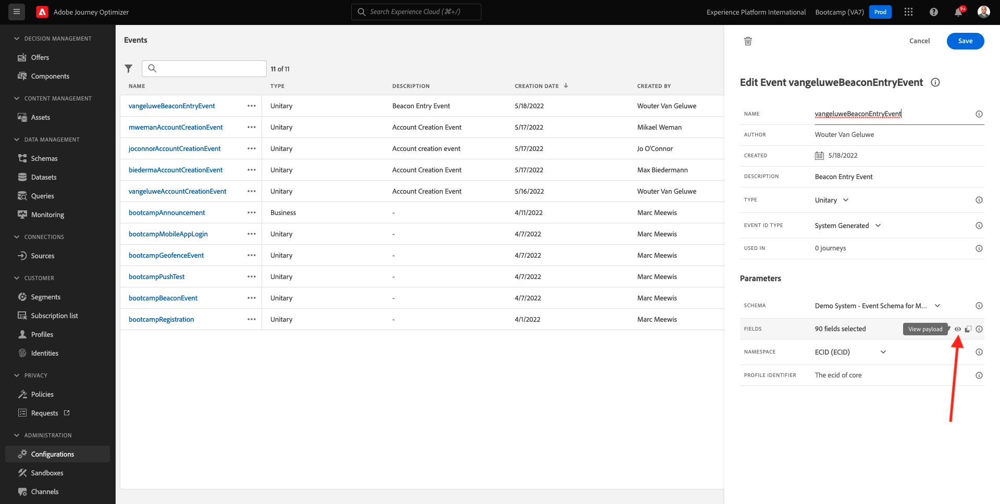

# 3.2 Create your event

Login to Adobe Journey Optimizer by going to [Adobe Experience Cloud](https://experience.adobe.com). Click **Journey Optimizer**.

You'll be redirected to the **Home**  view in Journey Optimizer. First, make sure you're using the correct sandbox. The sandbox to use is called `Bootcamp`. To change from one sandbox to another, click on **Prod** and select the sandbox from the list. In this example, the sandbox is named **Bootcamp2**. You'll then be in the **Home** view of your sandbox `Bootcamp`.

In the left menu, scroll down and click **Configurations**. Next, click the **Manage** button under **Events**.

You'll then see an overview of all available events. Click **Create Event** to start creating your own event.

A new, empty event window will then pop up.

First of all, give your Event a Name like this: `yourLastNameBeaconEntryEvent` and add a description like this `Beacon Entry Event`.

Next, make sure the **Type** is set to **Unitary**, and for the **Event ID Type** selection, select **System Generated**.

Next is the Schema selection. A schema was prepared for this exercise. Please use the schema `Demo System - Event Schema for Mobile App (Global v1.1) v.1`.

After selecting the Schema, you'll see a number of fields being selected in the **Fields** section. You should now hover over the **Fields** section and you'll see 3 icons popup. Click on the **Edit** icon.

You'll see a **Fields** window popup, in which you need to select some of the fields that we need to personalize the journey.  We will choose other profile attributes later, using the data already in Adobe Experience Platform.

Scroll down until you see the object `Place context` and check the checkbox. With this, all the context of the location of the customer will be made available to the journey. Click **Ok** to save your changes.

You should then see this. Click **Save** once more to save your changes.

Your event is now configured and saved.

Click your event again to open up the **Edit Event** screen again. Hover over **Fields** again to see the 3 icons. Click on the **View** icon. 

You'll now see an example of the expected payload.
Your event has a unique orchestration eventID, which you can find by scrolling down in that payload until you see `_experience.campaign.orchestration.eventID`.

The event ID is what needs to be sent to Adobe Experience Platform in order to trigger the journey that you'll build in one of the next exercises. Remember this eventID, as you may need it later.
`"eventID": "e76c0bf0c77c3517e5b6f4c457a0754ebaf5f1f6b9357d74e0d8e13ae517c3d5"`

Click **Ok**, followed by clicking **Cancel**.

You've now finished this exercise.

Next Step: [3.3 Create your journey and push notification](./ex3.md)

[Go Back to User Flow 3](./uc3.md)

[Go Back to All Modules](../../overview.md)
