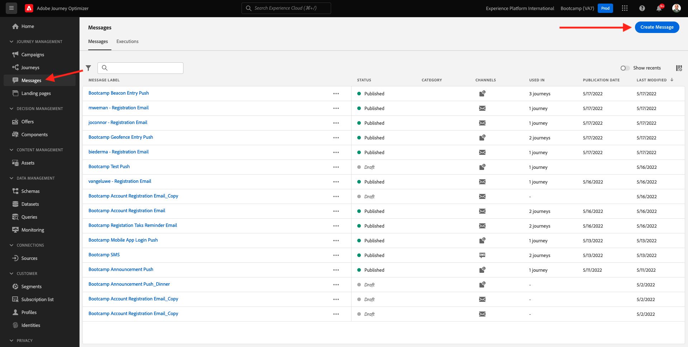
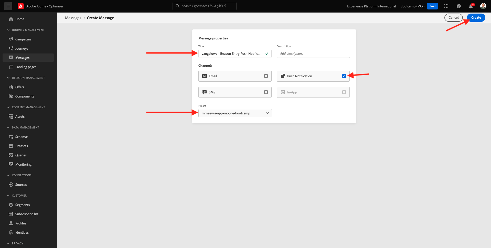

# 3.3 Create your push notification

In this exercise, you'll configure the journey that needs to be triggered when someone creates an account on the demo website.

Login to Adobe Journey Optimizer by going to [Adobe Experience Cloud](https://experience.adobe.com). Click **Journey Optimizer**.

You'll be redirected to the **Home**  view in Journey Optimizer. First, make sure you're using the correct sandbox. The sandbox to use is called `Bootcamp`. To change from one sandbox to another, click on **Prod** and select the sandbox from the list. In this example, the sandbox is named **Bootcamp**. You'll then be in the **Home** view of your sandbox `Bootcamp`.

In the left menu, click **Messages**. 

On the Messages screen, you’ll see a view similar to this. Click **Create Message**.

Give your Message a title following this naming convention `yourLastName - Beacon Entry Push Notification`. Select the preset **mmeeewis-app-mobile-bootcamp** and enable the **Push Notification** channel. Click on the **Create** button to create your push notification.

The next screen is the message dashboard, from there you will be able to see the push notification preview when the content will be provided.

Let's define the content of the push notification.

Click the **Title** text field.

In the text area start writing **Hi**.

The title is not done yet. Next you need to bring in the personalization token for the field **First name** which is stored under `profile.person.name.firstName`. In the left menu, scroll down to find the **Person** element and click on the arrow to go a level deepern until you reach the field `profile.person.name.firstName`. Click **Save**.

You'll then be back here. Click the field **Body**. 

In the text area, write `Welcome at the `. Then, click **Save**. You'll come back to this message later to add more context.

You've now completed the draft version of your push notification. Don't publish your message yet, you'll do that at a later stage.

You have finished this exercise.

Next Step: [3.4 Create your journey](./ex4.md)

[Go Back to User Flow 3](./uc3.md)

[Go Back to All Modules](../../overview.md)
