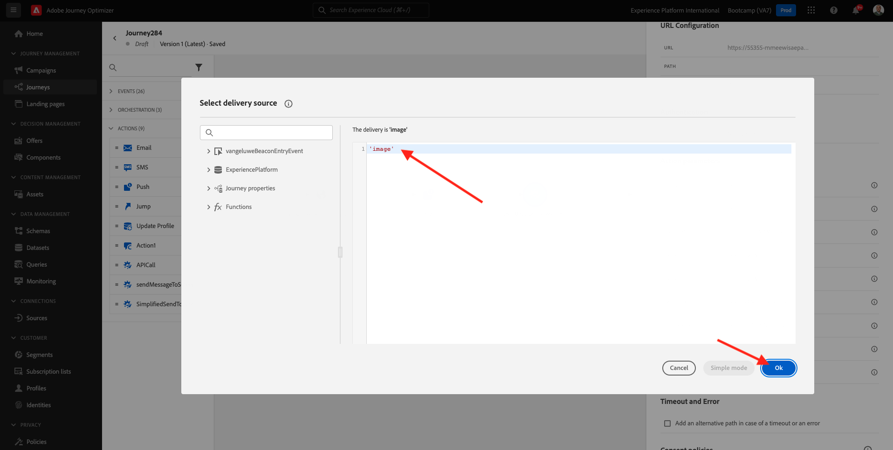

# 3.3 Create your journey and push notification

In this exercise, you'll configure the journey and message that needs to be triggered when someone enters a beacon using the mobile app.

Login to Adobe Journey Optimizer by going to [Adobe Experience Cloud](https://experience.adobe.com). Click **Journey Optimizer**.

You'll be redirected to the **Home**  view in Journey Optimizer. First, make sure you're using the correct sandbox. The sandbox to use is called `Bootcamp`. To change from one sandbox to another, click on **Prod** and select the sandbox from the list. In this example, the sandbox is named **Bootcamp**. You'll then be in the **Home** view of your sandbox `Bootcamp`.

## 3.3.1 Create your journey

In the left menu, click **Journeys**. Next, click **Create Journey** to create a new journey.

You'll then see an empty journey screen.

In the previous exercise, you created a new **Event**. You named it like this `yourLastNameBeaconEntryEvent` and replaced `yourLastName` with your last name. This was the result of the Event creation:

You now need to take this event as the start of this Journey. You can do this by going to the left side of your screen and searching for your event in the list of events.

Select your event, drag and drop it on the journey canvas. Your journey now looks like this. Click **Ok** to save your changes.

As the second step in the journey, you need to add a **Push** action. Go to the left side of your screen to **Actions**, select the **Push** action, then drag and drop it on the second node in your journey.

On the right side of your screen, you now need to create your push notification. 

Set the **Category** to **Marketing** and select a push surface that enables you to send push notifications. In this case, the push surface to select is **mmeeewis-app-mobile-bootcamp**. 

## 3.3.2 Create your message

Click **Edit Content**.

You'll then see this:

Let's define the content of the push notification.

Click the **Title** text field.

In the text area start writing **Hi**. Click the personalization icon.

You now need to bring in the personalization token for the field **First name** which is stored under `profile.person.name.firstName`. In the left menu, select **Profile Attributes**, scroll down/navigate to find the **Person** element and click on the arrow to go a level deeper until you reach the field `profile.person.name.firstName`. Click the **+** icon to add the field to the canvas. Click **Save**.

You'll then be back here. Click the personalization icon next to the field **Body**. 

In the text area, write `Welcome at the `. 

Next, click **Contextual Attributes** and then **Journey Orchestration**.

Click **Events**.

Click the name of your event, which should look like this: **yourLastNameBeaconEntryEvent**.

Click **Place context**.

Click **POI Interaction**.

Click **POI Detail**.

Click the **+** icon on **POI Name**.
You'll then see this. Click **Save**.

Your message is now ready. Click the arrow in the top left corner to go back to your journey.

Click **Ok**.

## 3.3.2 Send a message to a screen

As the third step in the journey, you need to add a **sendMessageToScreen** action. Go to the left side of your screen to **Actions**, select the **sendMessageToScreen** action, then drag and drop it on the third node in your journey. You'll then see this.

The **sendMessageToScreen** action is a custom action that will publish a message to the endpoint that is used by the in-store display. The **sendMessageToScreen** action expects a number of variables to be defined. You can see those variables by scrolling down until you see **Action Parameters**.

You now need to set the values for every action parameter. Follow this table to understand what values are required where.

| Parameter     | value       |
|:-------------:| :---------------:|
|DELIVERY|`'image'`|
|ECID|`@{yourLastNameBeaconEntryEvent._experienceplatform.identification.core.ecid}`|
|FIRST NAME |`#{ExperiencePlatform.ProfileFieldGroup.profile.person.name.firstName}`|
|EVENTSUBJECT|`#{ExperiencePlatform.ProductListItems.experienceevent.first(currentDataPackField.eventType == "commerce.productViews").productListItems.first().name}`|
| EVENTSUBJECTURL |`#{ExperiencePlatform.ProductListItems.experienceevent.first(currentDataPackField.eventType == "commerce.productViews").productListItems.first()._experienceplatform.core.imageURL}`|
| SANDBOX         |`'bootcamp'` |
| CONTAINERID         | `''` |
| ACTIVITYID         |`''` |
| PLACEMENTID         | `''` |

{style="table-layout:auto"}

To set those values, click the **Edit** icon.

Next, select **Advanced Mode**.

Then, paste the value based on the table above. Click **Ok**.

Repeat this process to add values for each field.

>[!IMPORTANT]
>
>For the field ECID, there's a reference to the event `yourLastNameBeaconEntryEvent`. Please ensure to replace `yourLastName` by your last name.

The end result should look like this:

Scroll up and click **Ok**.

You still need to give your journey a Name. You can do that by clicking the **Properties** icon in the top right side of your screen.

You can then enter the journey's name here. Please use `yourLastName - Beacon Entry Journey`. Click **OK** to save your changes.

You can now publish your journey by clicking **Publish**.

Click **Publish** again.

You'll then see a green confirmation bar saying that your journey is now Published.

Your journey is now live and can be triggered. 

You've now finished this exercise.

Next Step: [3.4 Test your journey](./ex4.md)

[Go Back to User Flow 3](./uc3.md)

[Go Back to All Modules](../../overview.md)
