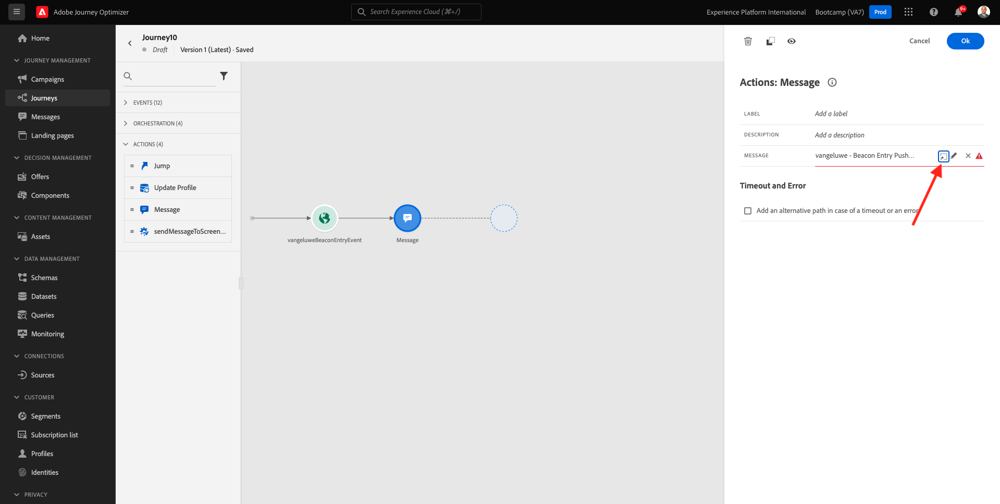
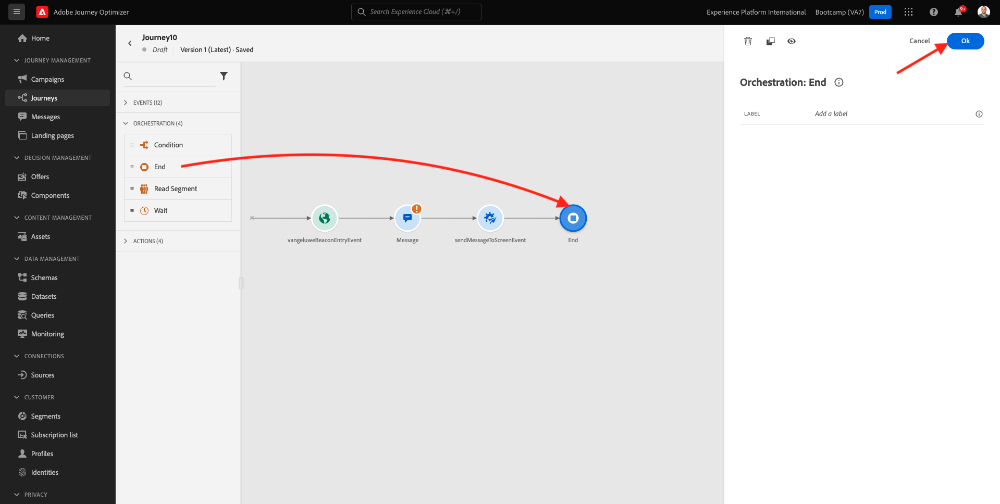

# 3.4 Create your journey

In this exercise, you'll configure the journey that needs to be triggered when someone creates an account on the demo website.

Login to Adobe Journey Optimizer by going to [Adobe Experience Cloud](https://experience.adobe.com). Click **Journey Optimizer**.

You'll be redirected to the **Home**  view in Journey Optimizer. First, make sure you're using the correct sandbox. The sandbox to use is called `Bootcamp`. To change from one sandbox to another, click on **Prod** and select the sandbox from the list. In this example, the sandbox is named **Bootcamp**. You'll then be in the **Home** view of your sandbox `Bootcamp`.

In the left menu, click **Journeys**. Next, click **Create Journey** to create a new journey.

You'll then see an empty journey screen.

In the previous exercise, you created a new **Event**. You named it like this `yourLastNameBeaconEntryEvent` and replaced `yourLastName` with your last name. This was the result of the Event creation:

You now need to take this event as the start of this Journey. You can do this by going to the left side of your screen and searching for your event in the list of events.

Select your event, drag and drop it on the journey canvas. Your journey now looks like this. Click **Ok** to save your changes.

As the second step in the journey, you need to add a **Message** action. Go to the left side of your screen to **Actions**, select the **Message** action, then drag and drop it on the second node in your journey.

On the right side of your screen, you now need to select the push notification. Click the **Edit** icon.

You'll then see the **Select a message** popup. In that list, you need to select the template with the name `yourLastName - Beacon Entry Push Notification`. Click **Select**.

You'll then see this. The message you created earlier is now connected to this journey. After adding a message in a journey, you can take the journey context and add it to your push notification template. To do that, click **Open the message**.

For this exercise, your journey is fine like it is now.

Let's add an Orchestration Event to **End** the Journey. In the left side of the screen, go to **Orchestration** and select **End**. Drag and Drop this onto the 3rd step of the Journey.

You still need to give your journey a Name. You can do that by clicking the **Properties** icon in the top right side of your screen.

You can then enter the journey's name here. Please use `yourLastName - Account Creation Journey`. Click **OK** to save your changes.

You can now publish your journey by clicking **Publish**.

Click **Publish** again.

You'll then see a green confirmation bar saying that your Journey is now Published.

You've now finished this exercise.

Next Step: [3.5 Test your journey](./ex5.md)

[Go Back to User Flow 3](./uc3.md)

[Go Back to All Modules](../../overview.md)
