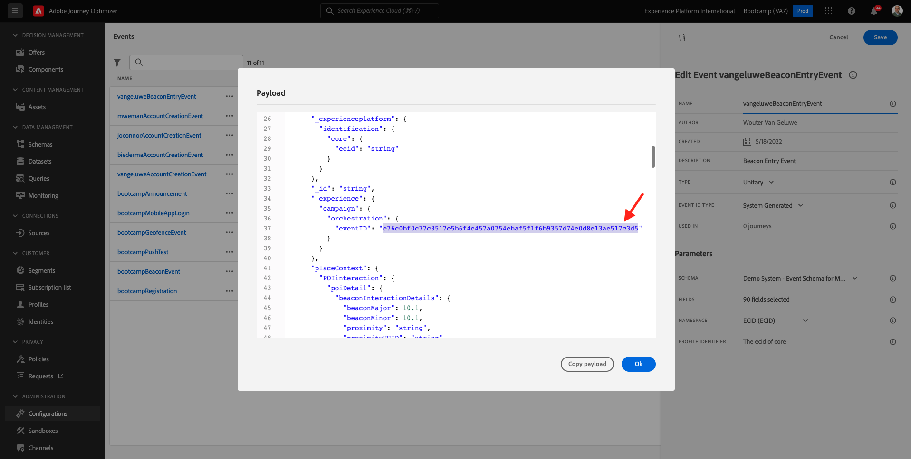
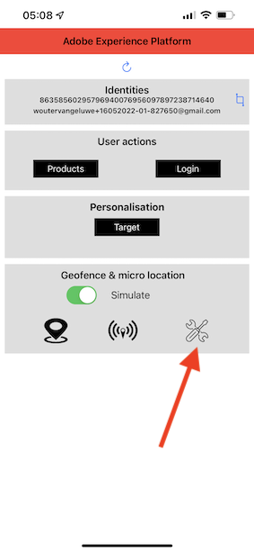
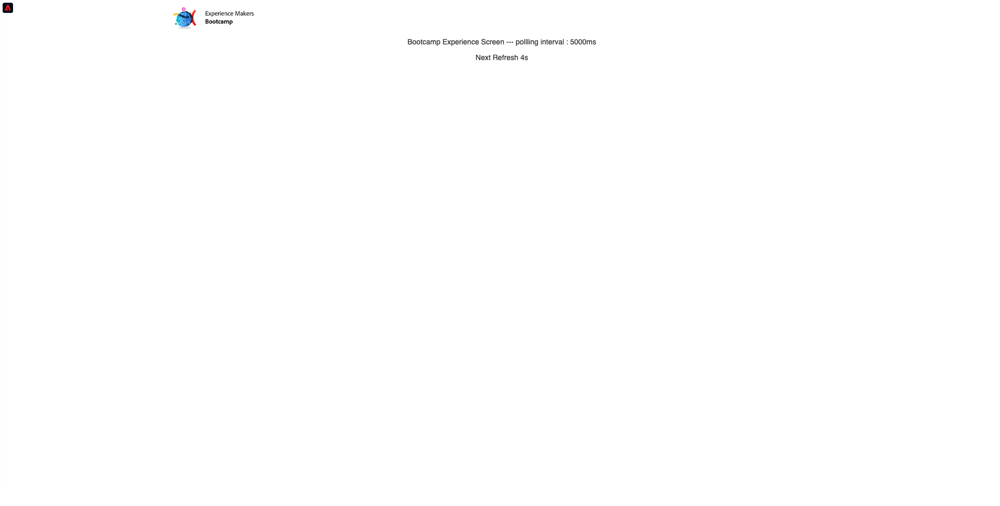
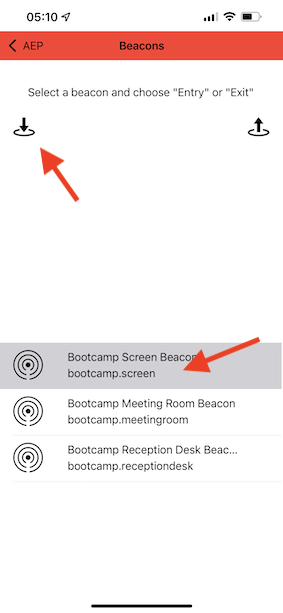
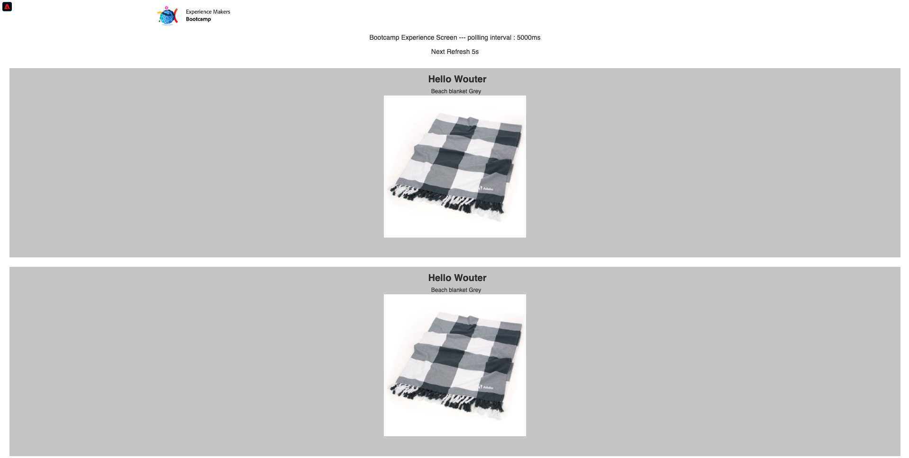
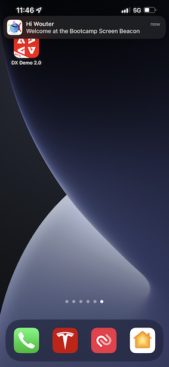

# 3.4 Test your journey

To test your journey, you'll need to use the event ID of the event you created in exercise 3.2, which looks like this.

The event ID is what needs to be sent to Adobe Experience Platform in order to trigger the journey. In this example, the eventID is:
`e76c0bf0c77c3517e5b6f4c457a0754ebaf5f1f6b9357d74e0d8e13ae517c3d5`.

Open the mobile app and go to the homepage. Click the **Settings** icon.

Paste your eventID in the field **Beacon EventID** and click **Save**.

Before continuing, please open this web page on your computer: [https://bootcamp.aepdemo.net/content/aep-bootcamp-experience/language-masters/en/screen.html](https://bootcamp.aepdemo.net/content/aep-bootcamp-experience/language-masters/en/screen.html)

You'll then see this:

Next, go back to the homepage. Click the **beacon** icon.

You'll then see this. First, select **Bootcamp Screen Beacon** and then click the **entry** button. This will allow you to simulate a beacon entry.

Now, have a look at the in-store screen. You'll see the last product you viewed appear there within 5 seconds.

You'll also have received your push notification.

You've now finished this exercise.

[Go Back to User Flow 3](./uc3.md)

[Go Back to All Modules](../../overview.md)
