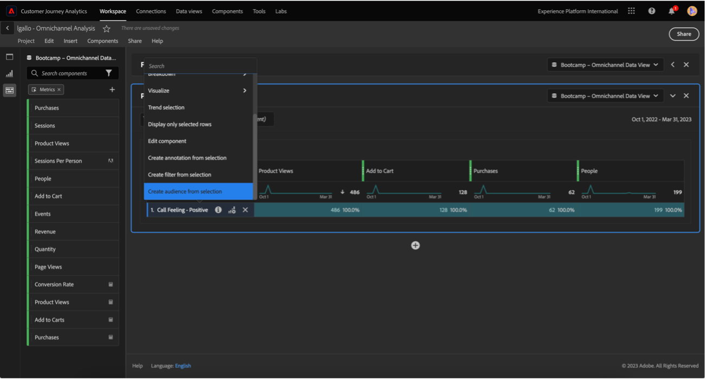
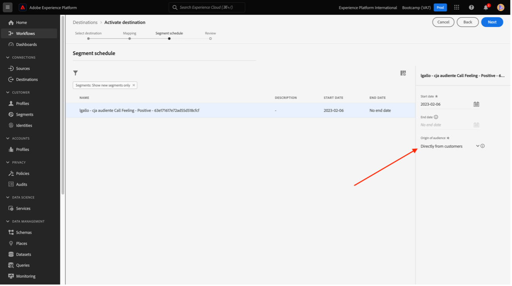
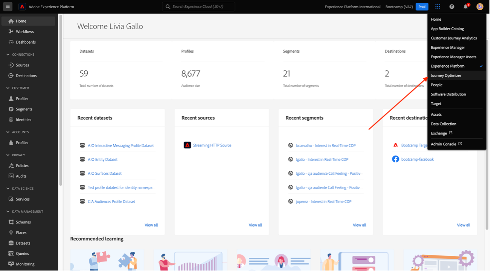
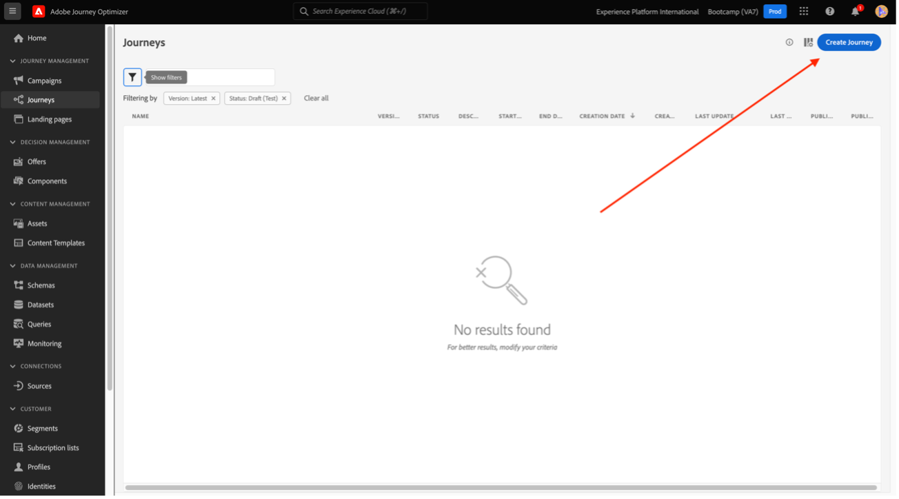
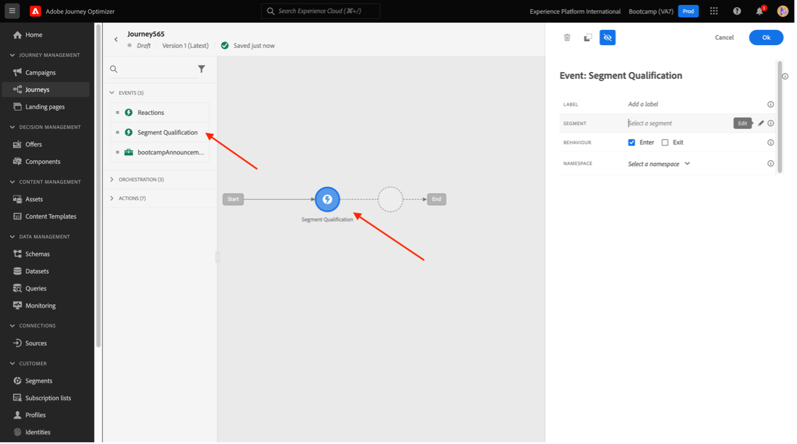

# 4.6 From insights to action

## Goals

- Understand how to build an audience based on a view collected in Customer Journey Analytics
- Use this audience in Real-Time CDP and Adobe Journey Optimizer

## 4.6.1 Create an audience and publish it

In your project, you created a filter called **Call Feelings** and were able to view the number of users who had their calls to the call center classified as **positive**. You will now be able to create a segment with these users and activate them in journeys or communication channels.

The first step is: In the panel created in the last exercise, select line **1. Call Feeling - Positive**, right-click and select the **Create audience from selection** option:

Next, give a name to your audience following the model **yourLastName - CJA audience call feeling positive**:

Note that it is possible to have a preview of the audience being created:

Finally, click **Publish**.

## 4.6.2 Use your audience as part of a segment

Go back to the Adobe Experience Platform, go to **Segments > Browse** and you'll be able to see your segment created in CJA ready and available to be used in your activations and journeys!

Let's now use this segment in a Facebook activation and in a customer journey!

## 4.6.3 Use your segment in Real-Time CDP in real time

In Adobe Experience Platform, go to **Segments > Browse** and find the audience you've created in CJA:

Click your segment, and then click **Activate to Destination**:

Select the destination named **bootcamp-facebook**, and then click **Next**.

Click **Next** again.

Select the **Origin of your audience** option and set it to **Directly from customers**, click **Next**.

Click **Finish**.

Your segment is now connected to Facebook's Custom Audiences. Let's use that same segment in Adobe Journey Optimizer now.

## 4.6.4 Use your segment in Adobe Journey Optimizer

In Adobe Experience Platform, click **Journey Optimizer**, and then in the left side menu, click **Journeys** and start creating a journey by clicking **Create Journey**.

Then, in the left side menu, under **Events**, select **Segment Qualification** and drag it to the journey:

Under Segment, click **Edit** to select a segment:

Select the audience you created earlier in CJA and click  **Save**.

Ready! From here you can create a journey for customers who qualify for this segment.

[Go Back to User Flow 4](./uc4.md)

[Voltar para todos os módulos](./../../overview.md)
