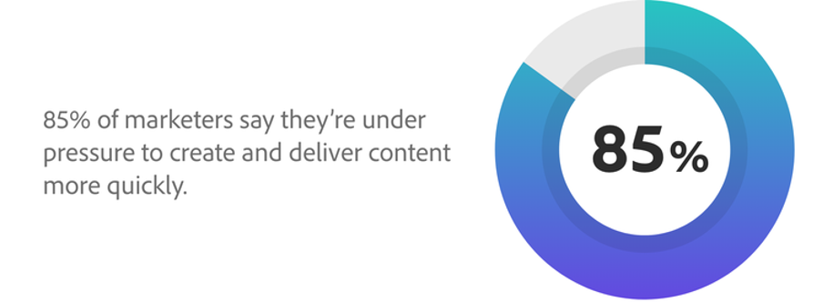
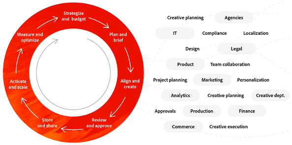
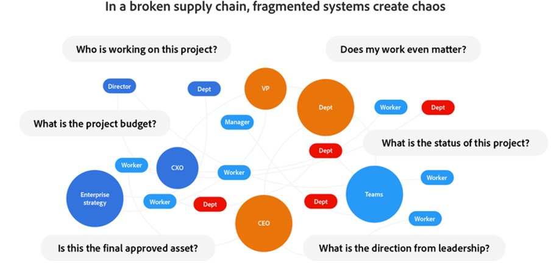
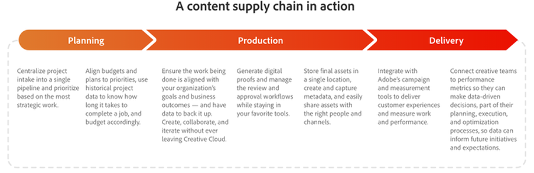

# Content Supply Chain in 4 phases

The world is now digital first. It's a reality that businesses have been forced to come to terms with, and it's not going away anytime soon. As part of this digital world, we're facing [a huge surge of content](https://www.prnewswire.com/news-releases/content-marketing-market-size-to-grow-by-usd-487-24-billion--by-objective-platform-end-user-and-geography---forecast-and-analysis-2022-2026--301562808.html) propelled by more people browsing social media, spending time in digital spaces, and working remotely.

What this means for you is that there are more channels, markets, and formats to deliver content — and there's a greater need for that content to be dynamic and optimized.

_Source:_ [_Deloitte Digital_](https://www2.deloitte.com/content/dam/Deloitte/uk/Documents/consultancy/deloitte-uk-future-of-experience-time-to-market.pdf)

The good news is, as challenging as it can be to keep up with the demand for content, there's a way to plan, produce, and deliver content more quickly and easily. It's called a  **content supply chain**. And if you can get one up and running with smooth processes, strong strategy, and solid practices, you can streamline the entire content lifecycle.

## Collaboration is key to a smooth content supply chain

A content supply chain is the process that brings together people, tools, and workstreams to effectively plan, create, manage, and deliver content. With customers demanding more and better experiences at an increasingly faster pace, you'll need to get your content right at this moment rather than later. Doing so will keep pressure off all your teams by breaking down silos and unifying workflows. And you'll also get more value from your technology investment, helping you boost efficiency and value.

Theoretically, it's a process that should help businesses everywhere get their content out the door faster. But in practice, most supply chains are broken because of how cross-functional content lifecycles naturally are. Unfortunately, when these chains break, they can create internal misalignment, run down budgets, wear out employees, and slow down the velocity of delivering key messages into the market.

### What's breaking your content supply chain?

- [**70%**](https://business.adobe.com/resources/reports/future-creative-experiences.html) of time is spent on non-core work, managing manual tasks in disparate systems across roles.
- [**21%**](https://business.adobe.com/resources/reports/future-creative-experiences.html) of creatives identified bottlenecks throughout the content process as a challenge to creating effective experiences.
- [**31%**](https://www.fotoware.com/blog/dam-industry-trends-by-fotoware) of creatives and marketers say their top challenge is the inability to share assets with multiple stakeholders.

To get an even better look at common culprits behind broken content supply chains, it helps to look at each of the three high-level phases:

1. In the  **planning**  phase, a lack of a uniform project process or central way to track resources leads to multiple revisions, excessive costs, pricey delays, and inability to balance work. Plus, disconnects between team members result in wasted cycles and slow priority changes.
2. During  **production** , siloed systems and disconnected workflows limit live collaboration, asset findability, delays, and burnout. And because creatives must manually track tasks and assets as well as perform repetitive tasks manually, there ends up being higher costs and more errors.
3. When it's time for  **delivery** , not having a central asset management system — as well as limited automation to scale content — reduces teams' ability to launch cohesive, personalized experiences across channels. On top of that, fragmented delivery tools and data limit accurate measurement of asset performance.

## It's time to wrangle your content supply chain

As with anything that suffers from missteps and miscommunication, there's always a way to improve the process. Sticking with those same three phases, let's dive into what a great content supply chain might look like for your business.

### Optimize operations through streamlined planning

Ideally, your marketing team should be using a work management solution that allows cross-functional collaboration and connects projects to planned, data-driven outcomes. It should also empower the marketing team to strategically prioritize work and announce those priorities to your creative team. From there, the creative brief, content versions, and feedback should be tied together within each project so your team doesn't have to search through old emails to find what they're looking for.

Your creative team should be set up with [a great digital asset management](https://business.adobe.com/products/experience-manager/assets/digital-asset-management.html)[(DAM)](https://business.adobe.com/products/experience-manager/assets/digital-asset-management.html)[ system](https://business.adobe.com/products/experience-manager/assets/digital-asset-management.html) that's integrated with your creative and work management tools. That way, it's easy for them to find, use, update, or repurpose relevant assets. By doing all this, you can improve your go-to-market speed and simplify internal operations and processes.

### Boost efficiency in production with seamless workflows

With your planning in place, a great production phase centers around a unified asset management solution that, together with your work management application, syncs metadata across all your systems. This helps you automate repetitive formatting tasks so you can speed up output without compromising quality. And when your work management solution integrates with creative tools, your creative teams can not only manage requests, workflows, and reviews, they can even approve and finalize content all within the tools they're already working in.

If you then add artificial intelligence (AI) into your content workflows, you can create personalized content that's aligned with customer interests, all automatically at scale. This means your teams can all do what they do best — your creatives can build engaging content and your marketers can use insights to customize that content. All so you can start delivering amazing experiences.

### Deliver assets and measure content efficiency

When it's time to deliver your content, it's important that all critical users or teams involved have access to the content they need. Be sure that your DAM is built to serve your needs and that your teams can catalog, track, and locate assets by type or any other tags you choose. Customers move fast, and your teams need to move even faster, finding videos, infographics, photos, messaging, and more in a flash.

On top of all this, a truly great content supply chain uses a DAM that can automatically resize images, manage version control, and avoid duplication across geos. It should also integrate across your entire tech stack, including your creative tools, work management solution, and content management system so your teams can quickly and easily create new content and deliver it to any channel. And with AI, you can automatically generate relevant content that adapts to customers' locations, interests, and actions.

## At Adobe, we're building a best-in-class content supply chain

Our very own [Adobe Experience Cloud business](https://business.adobe.com/) is focused on following the steps outlined previously to bring our campaigns to life and support multiple segments. Our vision has been to deliver compelling content globally that aligns with our campaign framework and messaging.

Key to our end-to-end content creation process is the pairing of [Adobe Workfront](https://business.adobe.com/products/workfront/main.html/) and [Adobe Experience Manager Assets](https://business.adobe.com/products/experience-manager/assets/aem-assets.html). Let's take a look at how we've approached our process with those same three high-level phases.

We start with  **planning** , where we intake hundreds of content requests from across the business and then prioritize them against our quarterly priorities. We then use a content proposal dashboard in Workfront to provide transparency so we can align with our stakeholders and quickly get sign-off across our marketing, creative, web, and sales teams. By doing this, we create a record of what we're committing to for the quarter, and we also give our creative and web teams visibility into the total request volume so they can plan for resourcing. Plus, managers can easily monitor workloads for their teams.

As we move into  **production** , approved requests turn into projects that provide more detail to our creative team — things like creative briefs, web landing locations, promotional requirements, and more. Our content strategists then work collaboratively with stakeholders and creatives in Workfront to review content and meet deadlines. Because we do all this in Workfront, we've eliminated duplicative steps, unnecessary emails, and multiple form fills, and we're even starting to track production cycles by asset type. This lets us balance staff resourcing and reprioritize when needed, all by getting an in-depth look at project data.

And when our content is ready for  **delivery** , we [publish our offers, assets, and promotional content](https://business.adobe.com/customer-success-stories/adobe-content-hub-case-study.html) to Experience Manager Assets. Specifically, it all goes into our internal Marketing Hub, where anyone in the company can quickly find the exact piece of content they need, right when they need it.

We've seen some major payoffs from building a working content supply chain. Specifically, we've cut our duplicative data entry in half by migrating to a single work management system. And even though there's always room for improvement, we know we're on the path to a process that will help us stay one step ahead of customer expectations.

>[!NOTE]
>
> This article was originally published on the [_Adobe Experience Cloud blog_](https://business.adobe.com/blog/how-to/create-a-content-supply-chain-that-will-stand-the-test-of-time).

## The fourth phase: Insights

Content Supply Chain is not a magical solution to all your problems. It's a way of working that allows you to be more efficient and manage all the experiences you want to bring to your customers. You need to crawl, before you can walk and eventually run.

And once you're finally up and running, there's an additional thing you can get out of your end-to-end Content Supply Chain: insights. Indeed, after a while you can start exploring how certain actions influence time, budget, ... We'll also cover this at the end of the bootcamp.

Next Step: [Creative Brief](./creative-brief.md)

[Go Back to All Modules](./overview.md)
