# Verify mobile app

## Android

- Download the mobile app from [here](https://tinyurl.com/CSCBootcampApp) on your Android device. You can download it on an [Android Emulator](https://developer.android.com/studio/run/emulator) or your physical Android device.

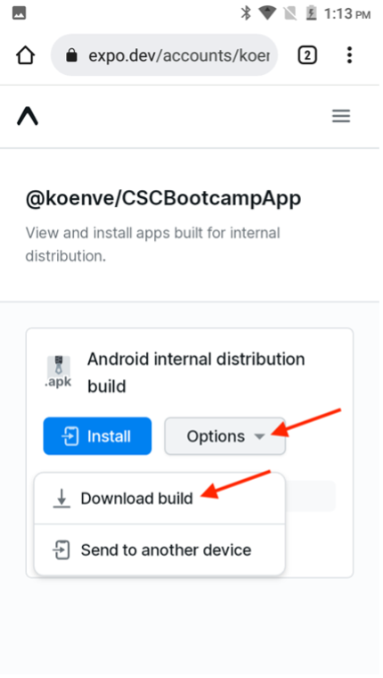

- Open the downloaded file by tapping it.

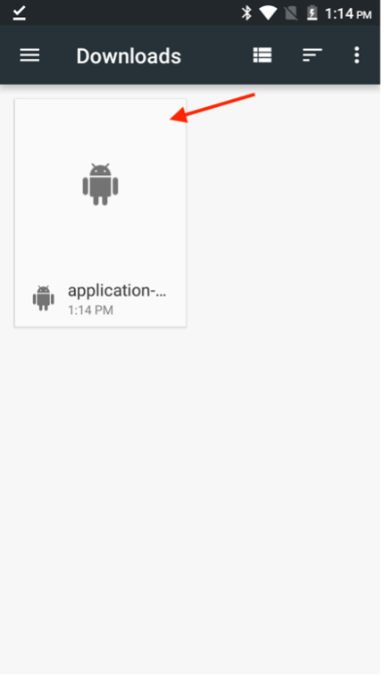

- In the pop-up, click the install button, then confirm by clicking "Install Anyway".

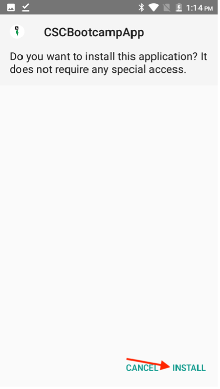 

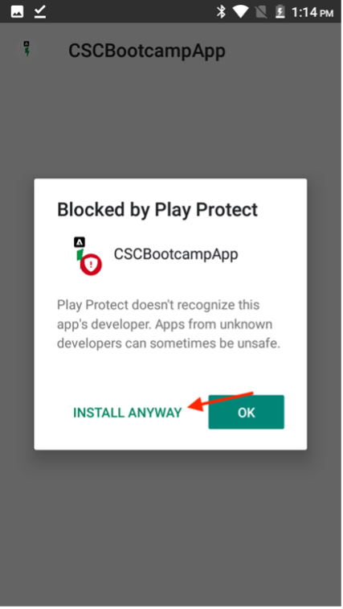

- Once the app is successfully installed, open it by clicking the "Open" button.

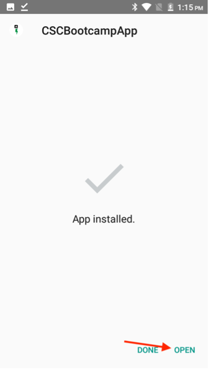

## iOS

>[!WARNING]
>
> Ensure that you are connected to the Bootcamp Wifi network. This is essential, as the app will only work if you are on the same Wifi network.

Since this is not an officially distributed app, the set-up for iOS is somewhat different than what you're used to.

- Download the Expo Go app from the [App Store](https://itunes.apple.com/app/apple-store/id982107779).

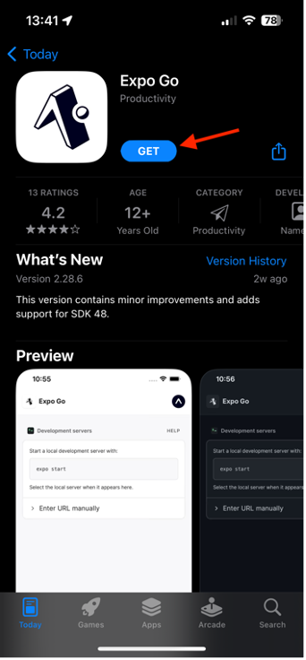

- In the iPhone Camera app, scan the QR Code that the Adobe team will be projecting at the bootcamp. When prompted, click the button that shows up.

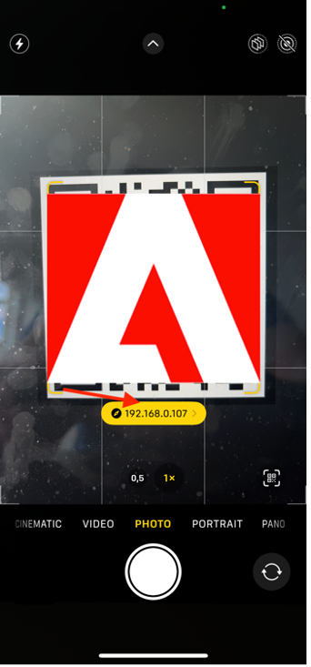

- This will load a webpage that allows you to open the app on your iPhone. Click the "Expo Go" button to open it in the app you just downloaded.

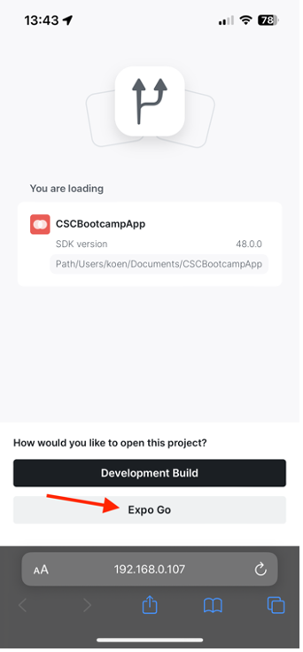

- In the dialog that pops up, select "Open" so the Expo Go app can be loaded with the correct information.

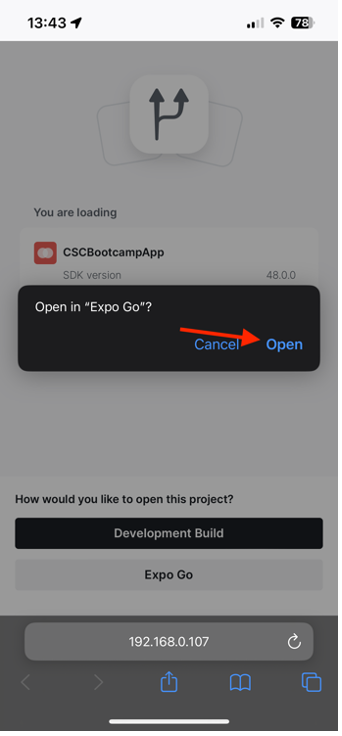

- Once the Expo Go app has opened, it will prompt you to find devices on the local network. As mentioned previously, this is necessary so we can download the app from our Adobe devices to your phone. Click "Allow" to load this.

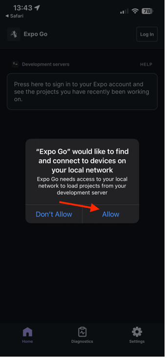

- You might get an error page at first. Simply click the "Try Again" button to finally load the app on your device. Please do note that closing the Expo Go app or disconnecting your device from the Wifi network will cause the app to no longer respond.

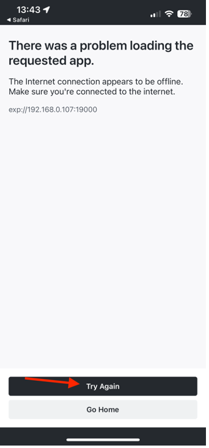

## Navigating the app

In the app, you can select your team from the dropdown. This will dynamically load in the content that you authored in AEM. If you're not happy with the content, you can always update it in the content fragment we authored earlier, then republish the content. You will then see the changes reflected in the app.

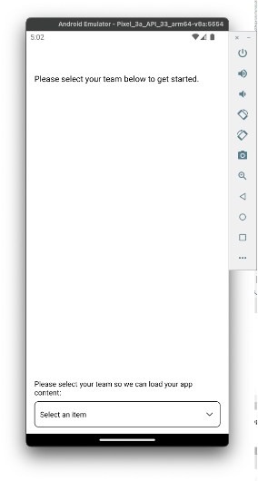 
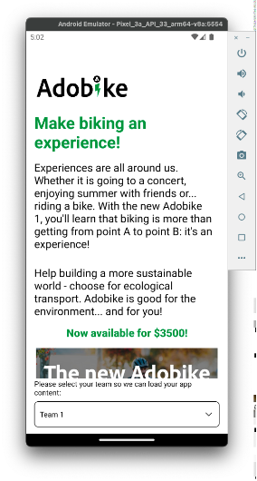

Next Step: [Phase 3 - Delivery: Create page in AEM](./page-in-aem.md)

[Go Back to Phase 2 - Production: Create mobile app content](../production/app.md)

[Go Back to All Modules](../../overview.md)
