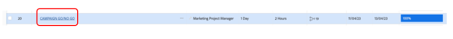
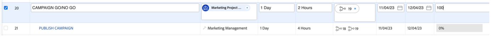
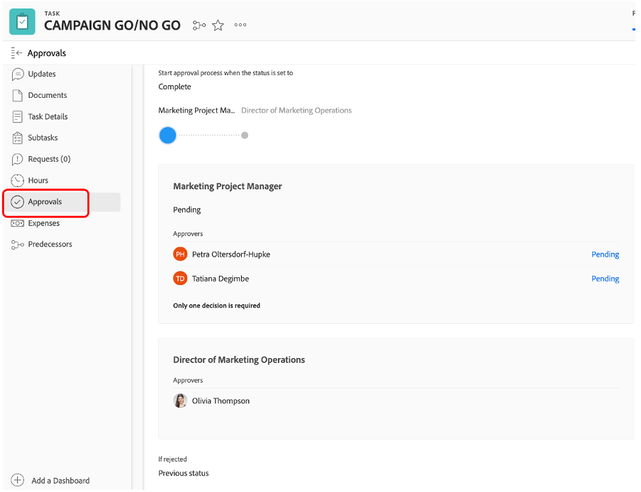
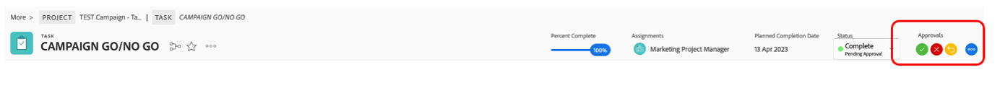
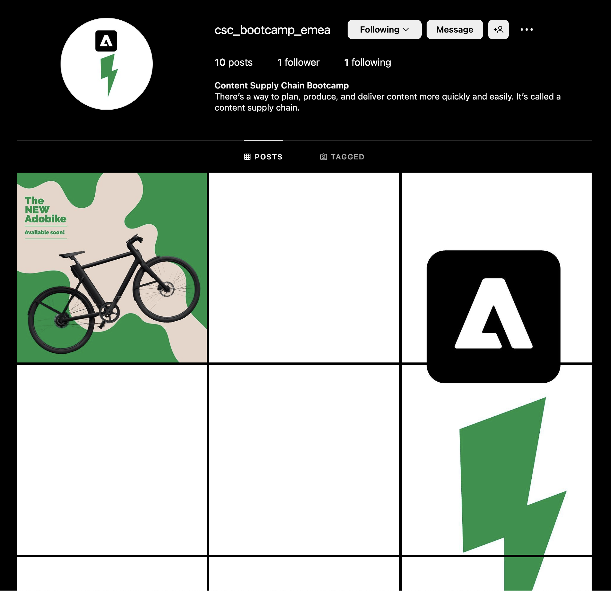

# Campaign GO/NO-GO

## Approving the campaign in Adobe Workfront

As we've now completed all tasks, and as a result set all tasks to 100%, we only need the 'Campaign go/no go' – which is a review and approval task – to be able to publish the campaign.

We are of course approving our campaign, so set task 20 'CAMPAIGN GO/NO GO' to 100% complete. This will automatically trigger a review and approval process:

Let's look at the process we have in place. Click on task 20's name 'CAMPAIGN GO/NO GO':

Let's now look at the approvals section:

We can see that it is a 2 steps process whereby either myself, Petra, or any of you need to review and/or approve this go/no go as a first step, and then Olivia (which is our Director of Marketing Operations) can give her final go.

Therefore, on the top right, my approval buttons appeared and I can now approve this 'Go No/Go' for the first step. Click on the Green tick to approve:

All of our projects are now pending on the approval of Olivia. Once she approved - which of course she will -, our Campaign can be published.

## Start the social media campaign

As we've now verified that our campaign is ready to launch, and we're ready to start selling our bikes, it's time to make a buzz. And what better way to do that, then with a social media post? 

Since we've already created and approved a social media post, we can now post it to our demo Instagram account. 

>[!WARNING]
> A few housekeeping rules
> 
> This is an account made only to complete the story of our bootcamp. It is **not intended to be shared, followed or made public**. Please keep your post **respectful and professional**. **Do not share the credentials** with anyone outside of the bootcamp, and please note **all devices will get logged out** after this exercise.

- You will get the password of an Instagram account called "csc_bootcamp_emea". 
- Create a new post, in which you add as last part of the caption the location you're joining from, as well as the date and your team number.
- Feel free to scroll to all different posts, to see how other teams have taken some artistic freedom with the same material.

## Congratulations, your campaign has been published!

Next Step: [Phase 4 - Insights: Overview](../insights/overview.md)

[Go Back to Phase 3 - Delivery: Create page in AEM](./app.md)

[Go Back to All Modules](../../overview.md)
