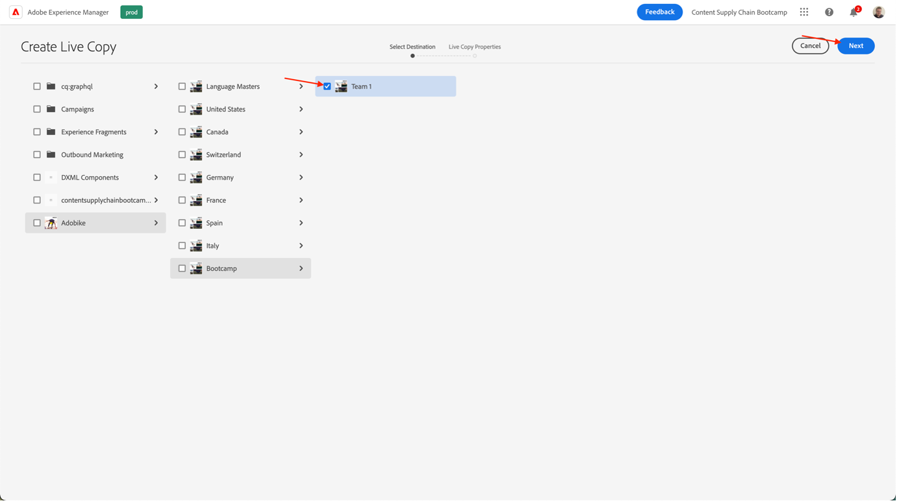

# Create page in AEM

AEM provides you with two environments: the Author Environment and the Publish Environment. These interact to enable you to make content available on your website - so that your visitors can experience it.

The author environment provides the mechanisms for creating, updating and reviewing this content before actually publishing it:

- An author creates and reviews the content (this can be of several types; for example, pages, assets, publications, etc)
- which will, at some point, be published to your website.

As an author you will need to organize your website within AEM. This involves creating and naming your content pages so that:

- You can easily find them on the author environment
- Visitors to your site can easily browse them on the publish environment

The structure of a website can be thought of as a tree structure that holds your content pages. The names of these content pages are used to form the URLs, whereas the title is shown when the page content is viewed. In the below example, the accessible URL for the page will be /content/adobike/language-masters/en.html

Let's review how to add some new pages to an existing website, as well as how to reuse some content.

## Creating the home page

As explained in the previous section, AEM's page hierarchy works as a tree structure. This means that we will start with the page on the highest level: the home page.

-   Go to the AEM author on [https://author-p71057-e991028.adobeaemcloud.com/](https://author-p71057-e991028.adobeaemcloud.com/) and log in with the credentials we provided.

-   From the AEM Start Menu, select Navigation \> Sites

- First, let's navigate the existing tree structure to the location where we would like to create our home page. Navigate the tree structure by selecting "Adobike" in the first column, then "Bootcamp" in the second column. Then, to create a page under this page, click the "Create" button and select "Page" in the menu that pops up.

- This will open a new screen the configure our new page. First off, we get to select a page template. Page templates in AEM allow you to define the structure of a page, as well as define which content can be used on this page. As we want to make the homepage, which is a landing page, we'll select the Landing Page Template, then click the "Next" button to continue.

- In the next screen, you'll be able to populate your page with some initial information. The most important piece of information is the title (a mandatory property, indicated with a \* ), which is meant for you to give your page a meaningful name. If you don't fill in the "Name", AEM will automatically generate the URL on which your page will be available, following SEO best practices. In this case, you can leave this field empty. Some other properties can be filled in as well, you may explore the other tabs, but for the purpose of this bootcamp don't fill out any other properties just yet. When you're ready to create your page, simply click the "Create" button.

- AEM will now create your page. Once it's done, you will get a pop-up, that allows you to open the newly created page by clicking the "Open" button.

-   You will now arrive in the AEM Editor. This is a "what you see is what you get" (or WYSIWYG) editor, in which you can drag and drop components to a page to build your page. Let's have a look at the navigation:

    - On the left-hand side, you have the side panel with the assets you can use on your pages, the components (or building blocks) that you can use on this page, and a handy tree view that shows you how your page is structured. Click any of these icons to open their view.
    - On the right-hand side, you'll see the "layout container". This is an area in which you can drop the desired components. 
    - Let's populate our page with some content. Feel free to populate the home page as you see fit. In the below example, we used an image component linking to the product page, as well as two teaser components.
    

## Re-use experiences by leveraging Experience Fragments

We've now authored the homepage, which is fully ready for our Adobike launch. However, some of the content on there, for example the unique selling points of our bike, can be re-used on multiple pages.

Ideally, we'd want to create this unique selling points experience only once so we can centrally manage it and ensure a personalized yet consistent experience. In AEM, we can do this with "Experience Fragments". An Experience Fragment is a group of one or more components including content and layout that can be referenced within pages. They can contain any component.

Let's put this to use straight away:

-   Go to the AEM author on [https://author-p71057-e991028.adobeaemcloud.com/](https://author-p71057-e991028.adobeaemcloud.com/) and log in with the credentials we provided.

-   From the AEM Start Menu, select Navigation \> Experience Fragments

- In the following screen, let's create a folder that your team can use to store their reusable experiences. In the column view, navigate to Adobike \> Bootcamp, then, click the Create \> Folder buttons.

- In the modal pops up, give your folder the name of your team. You can leave the name field empty, AEM will automatically generate it for you. Once you've given the folder a name, click the Create button to create your folder.

- You should now see your folder pop up. Click it, then click the Create \> Experience Fragment buttons.

- First, let's select an Experience Fragment Template. Just like pages, Experience Fragments can be based on multiple templates, each foreseeing a predefined experience. In our case, since we want to re-use our content in our website, let's choose an "Experience Fragment Web Variation Template" by selecting the checkbox on the left top, then clicking the "Next" button.

- Give your experience fragment a meaningful title, e.g. "Adobike USPs", then click the create button.

- Once your experience fragment is created, click the "Open" button in the modal so we can add some content in our experience fragment.

- Just like when editing a page, you can see a layout container in which you can add some content.

- What we'll do is copy over the components from the home page. In a new tab, navigate to the homepage as explained in the previous chapter, select the component that you want to copy over, then click the copy icon.

- Then, back in your experience fragment, click the layout container and click the paste button.

>[!NOTE]
>
> Tip: AEM lets you use "layout mode" in any page or experience fragment. This allows you to resize the components and optimize experiences for any device.

- From the top menu, open the dropdown and select "Layout" to enter layout mode.

- Then, you can select any component and resize it simply by dragging the handles on both sides of the component to snap to the columns visible on the screen.

- By default, you're editing for all breakpoints. However, if you want to edit for a specific breakpoint, you can select a matching device from the toolbar on top of the page. The breakpoint for which you're then authoring will be highlighted then.

- As you can see, a two column layout on mobile does not look great. Let's create a one column lay-out on mobile. As you can see on desktop, our experience stays the same, but on mobile we now have a better experience with only one column of content.

- Finally, we can now re-use this experience on the homepage. Drag and drop an "Experience Fragment" component on the page in the location where you want our content to show. You can delete the content we copied over, since we will be using it from the experience fragment.

- Open the configuration dialog for the experience fragment component and use the path picker to select the location where you created your experience fragment. 

- And finally, we now have our re-usable experience on our page.

## Creating the product page

When using Adobe Commerce integrated with AEM, you can have a generic product detail page that is used when you're navigating the site from the generated overviews. However, sometimes we also want to foresee an inspirational page that combines product specific content with inspirational content. Let's copy over the store as premade by us, then let's create an inspirational product page.

-   Go to the AEM author on [https://author-p71057-e991028.adobeaemcloud.com/](https://author-p71057-e991028.adobeaemcloud.com/) and log in with the credentials we provided.

-   From the AEM Start Menu, select Navigation \> Sites

- In the column overview, navigate the pre-made website to the shop: Adobike \> Language Masters \> Adobike \> Shop. Then, select the Shop page with the checkbox and click Create \> Live Copy. Without going into too much specifics, this will create a copy of the page that you can use in your site so you can reuse the already existing pages and content, using AEM's Multi Site Manager.

- In the screen that pops up, select your teams' site as destination by selecting the checkbox next to its name. Then, click the Next button.

-   As we're not going to go to deep into Multi Site Manager, you can just take over this configuration.  
Title: Shop  
Name: shop  
Rollout Configs: Standard rollout config  
Once you've configured the live copy, click the Create button.

>[!NOTE]
>
> Curious for more about live copies? Check out ["Creating and Synchronizing Live Copies".](https://experienceleague.adobe.com/docs/experience-manager-cloud-service/content/sites/administering/reusing-content/msm/creating-live-copies.html?lang=en)

- Once done, you should now see the store available in your website. Select it, then click Create \> Page to create our inspirational product page.

- Since we want to show product information on the page, let's now create a page using the product page template. Select it, then click the Next button.

- Fill in the page metadata, then click the Create button, just like for the homepage. Once it's created you can open the page by clicking the open button. As you can see, it's already populated with a product details component.

- First, we'll add our experience fragment that we created earlier. Then we can add any additional content we still want on the page. Finally, we'll configure the product details component to show our Adobike product by selecting the product finder in the configuration dialog then selecting our Adobike category and checking the box next to the product. Then, click the Add button.

 

 

- We now have our full inspirational page, including centrally managed content and product information coming from Adobe Commerce.

Next Step: [Phase 3 - Delivery: Campaign GO/NO-GO](./go-nogo.md)

[Go Back to Phase 3 - Delivery: Verify mobile app](./app.md)

[Go Back to All Modules](../../overview.md)
