# Insights for a Marketing Manager

## Project Leader's Weekly View

On the left column, click on 'Project Leader's weekly view':

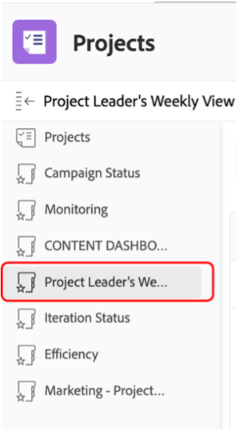

This covers a rich array of reportings, always clickable/actionable for further details:

- The **tasks Due This Week By Project**

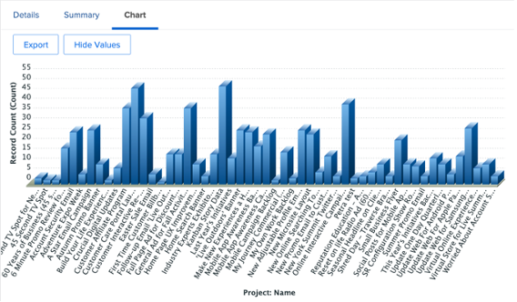

- The **Project Management's upcoming Milestones** :

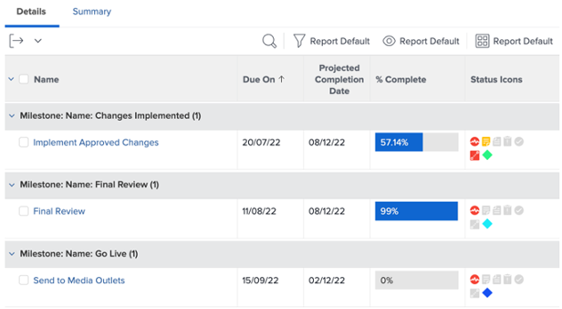

- The **Open Issues by Priority**

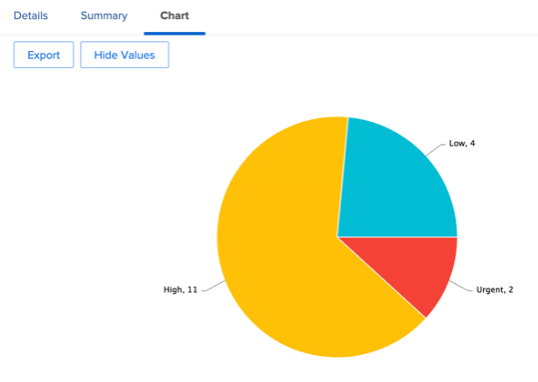

- The **Late Tasks by Department**

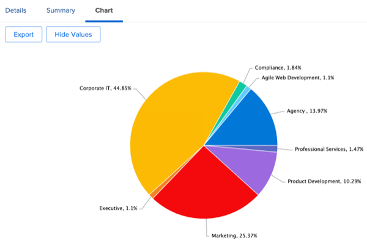

- The **Late Tasks by Individual**

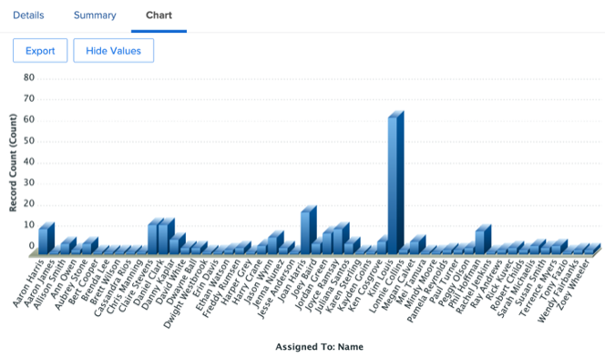

## SCRUM-related insights

On the left column, click on 'Iteration Status'

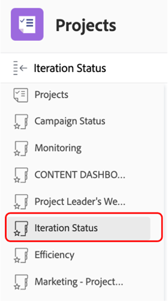

If your Teams work with the SCRUM Methodology, this is an interesting Management set of reports:

- **Velocity by Iteration**

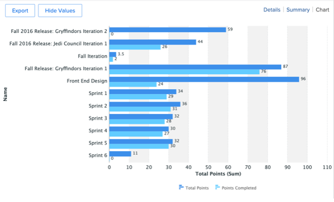

- **Average Velocity by Team**

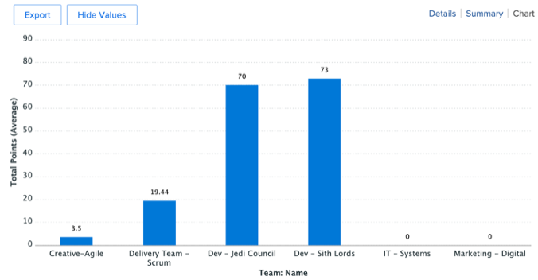

- **Current Iterations Completed Hour Totals by Assignee**

- **Iterations by Team**

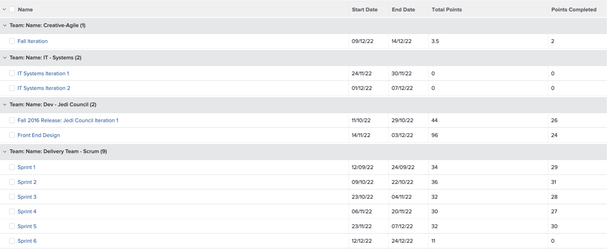

## Efficiency Reporting

Still on the left column, click on 'Efficiency'

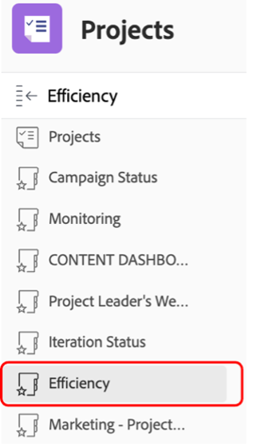

- **Planned/Un-Planned Ratio** (of the work done)

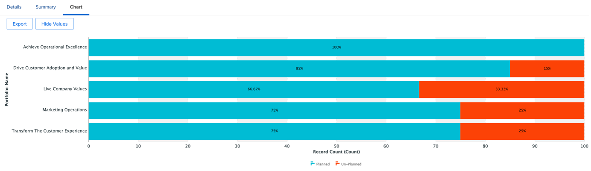

- **Completed Requests by Week**

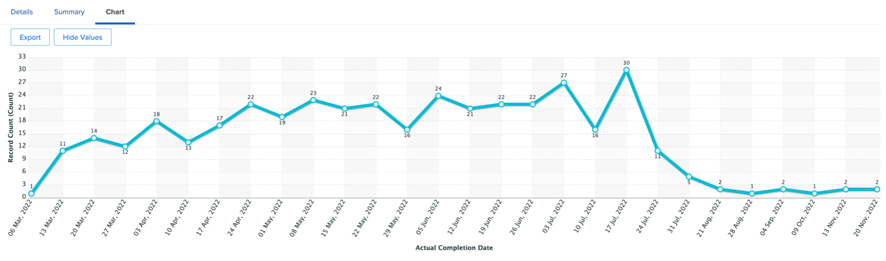

## In-flight Project Insights

Still on the left column, click on 'Marketing – Projects In-flight'

- **Status of In-Flight Projects**

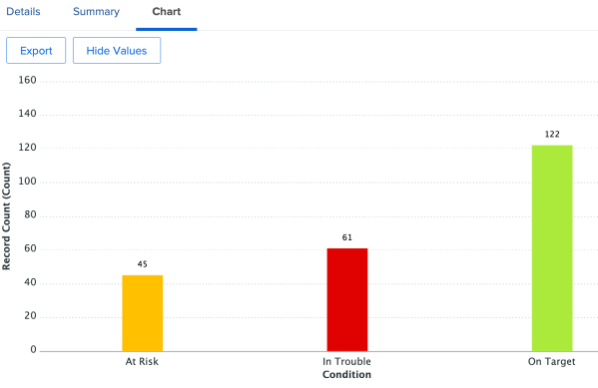

- **Projects By Condition By Month**

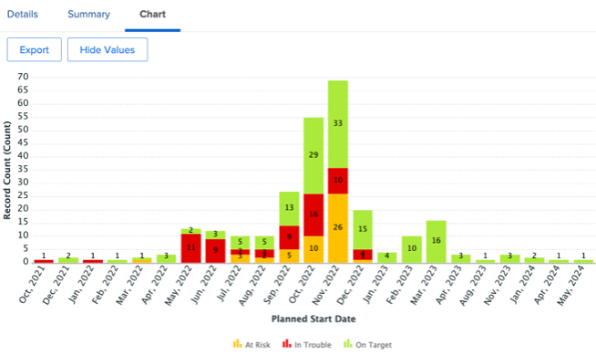

- List, progress and financial details of the **In-Flight Projects**

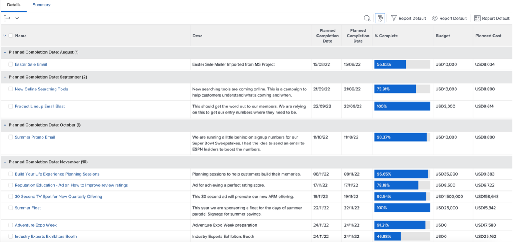

## Visualize (Cross-project) Dependencies

Back to the 'PIN' line, click on 'Portfolio Gant View':

Here you have a **Gant Chart view of a group of projects** with possible dependencies (predecessors) between projects

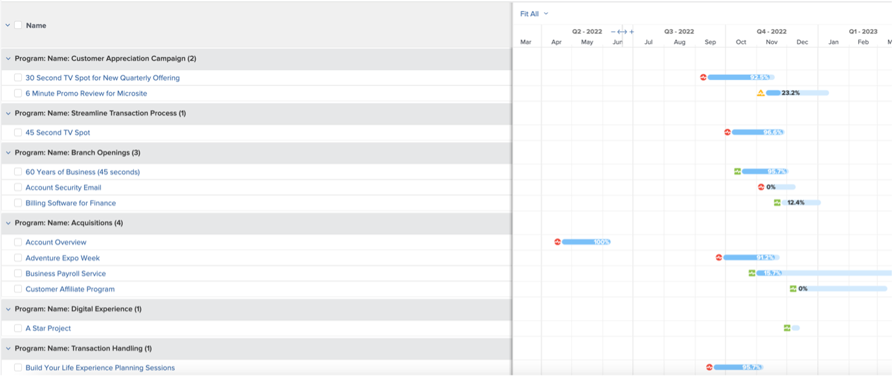

## Third Party Integration Insights

>[!NOTE]
>
> This is an example of an integration with a 3rd party software. This is an integration with Adobe Campaign as an illustration. It imports results of the completed campaigns in Adobe Campaigns.

On the 'PIN' line, click on 'Campaign Summary':

- **Adobe Campaign Summary**

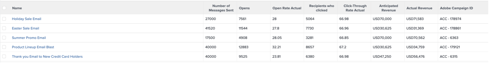

- **Adobe Campaign Sent to Opens**

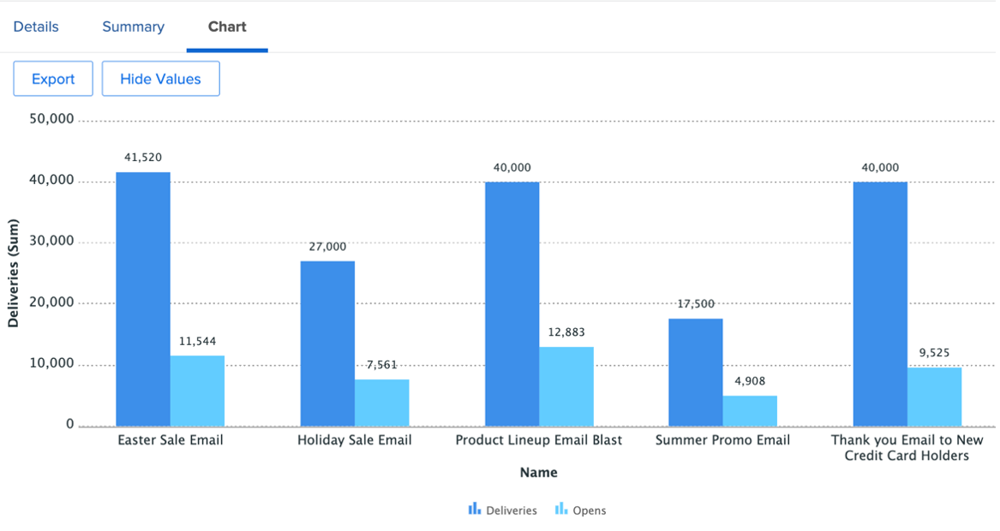

- **Adobe Campaign Opens to Clicks**

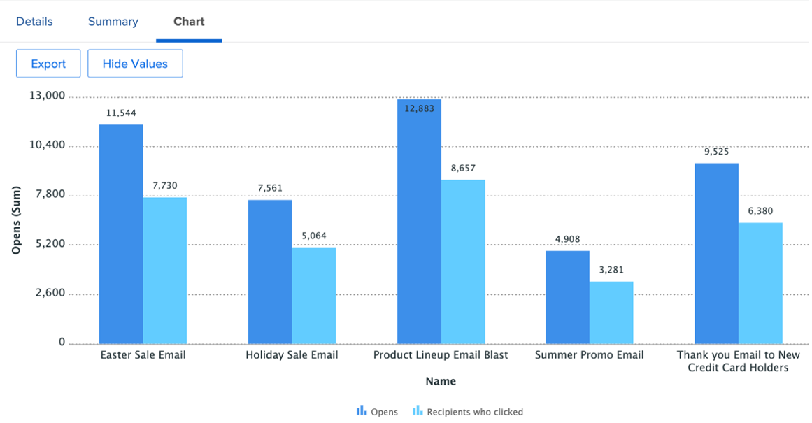

Next Step: [Conclusion](../../conclusion.md)

[Go Back to Phase 4 - Insights for a Project Manager](./project-manager.md)

[Go Back to All Modules](../../overview.md)
