# Insights for a Project Manager

## Interactive Project Progress Reports

On the 'PIN' line, click on 'Mobile App Awareness', then click on 'Metrics':

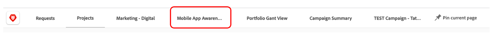

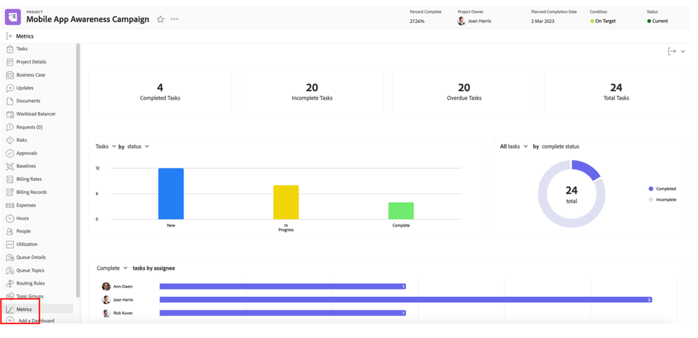

Here, you have a graphical view of the status of one single project/campaign. 

>[!NOTE]
>
> Each area is clickable for further details, this is the case for most insights in Workfront. Give it a go!

## Campaign-specific reports

On the 'PIN' line, click on 'Projects:

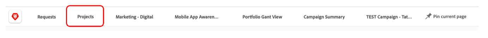

On the left hand column, click on 'Campaign Status':

The top part gives you insights on 1 single campaign about 1/ Campaign **planned vs. actual** hours spent and 2/ The **Campaign Condition** for each channel:

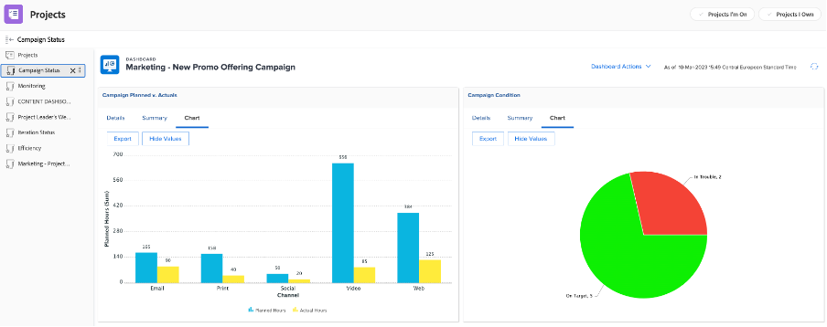

The bottom part gives you insights about the **Campaign Deliverables** status:

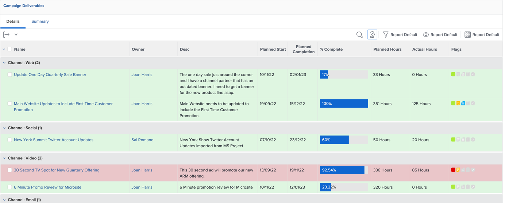

## Insights based on multiple projects

Still on the left column, click on 'Monitoring'

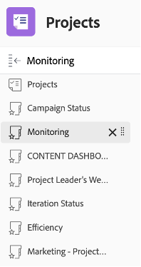

The top part gives you insights about the status of a group of projects, both from the **Tasks status** point of view and from the **Project condition** point of view:

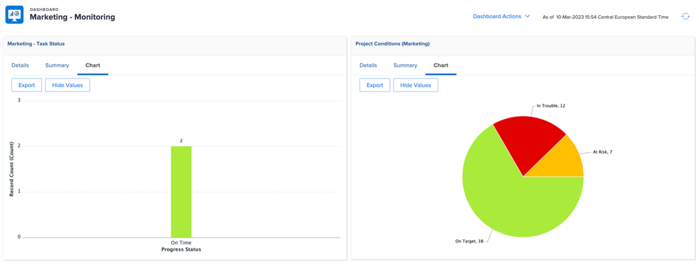

The bottom part shows all **at risk approvals** and will need chasing:

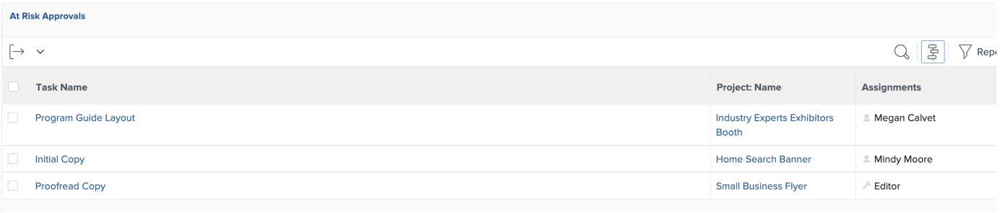

## The Content Dashboard

Still on the left column, click on 'CONTENT DASHBOARD':

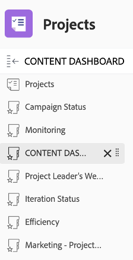

The top part gives good insight about all your **document's proof approval** status (is it approved, how many versions did we need, etc.)

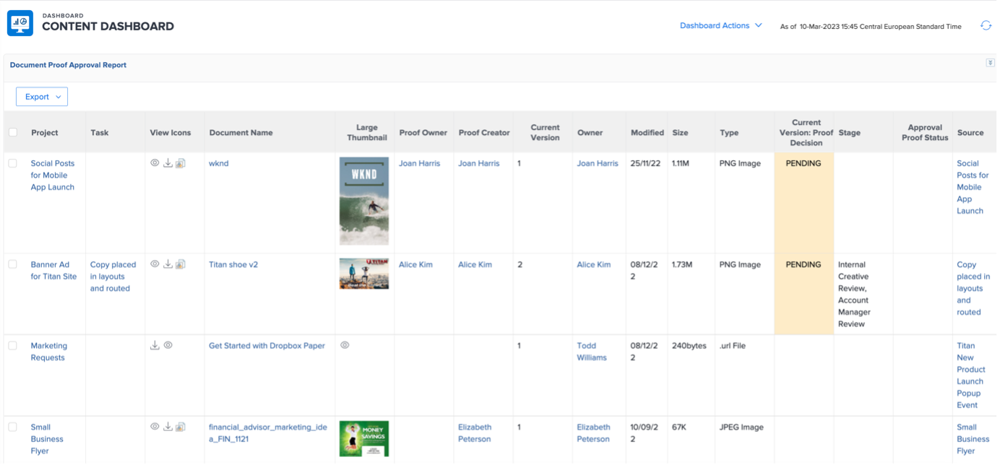

The bottom part is a **Proof Approval Review** that gives another angle of vision to the proof approval statuses:

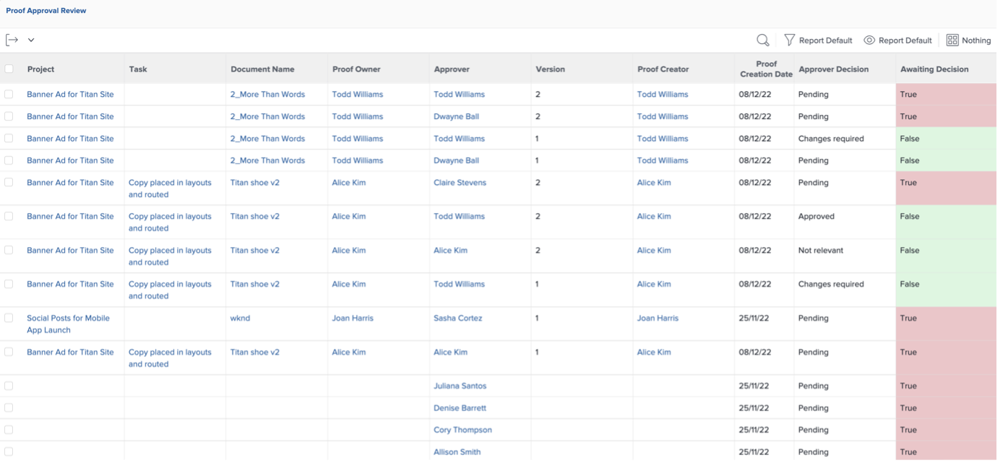

Next Step: [Phase 4 - Insights for a Marketing Manager](./marketing-manager.md)

[Go Back to Phase 4 - Insights: Overview](./overview.md)

[Go Back to All Modules](../../overview.md)
