# Other pre-work

## Select Brand Assets

As described in the creative brief, there are some assets that will be needed in order to effectively launch our campaign. These brand assets will be added to the campaign in Workfront so we have access to them centrally.

- Expand task 1, 'INITIAL TASKS', then open the task 'Select 5 brand assets (front, back, …)' by clicking it.

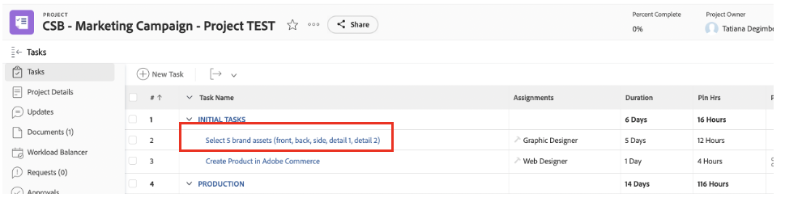

- Click on 'Documents' and then 'Add new:

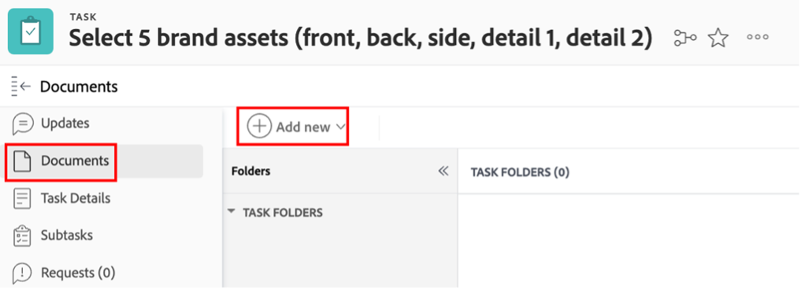

- Select "From experience-manager"; this will allow us to pick brand assets that are already available on AEM Assets:

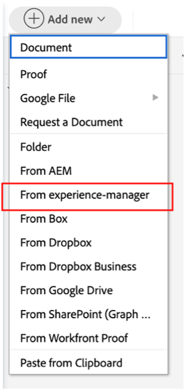

- Once the AEM Folder hierarchy shows up, navigate to the following path: experience-manager > Adobike Assets > Bike shots Select 5 assets and then click on 'Link'.

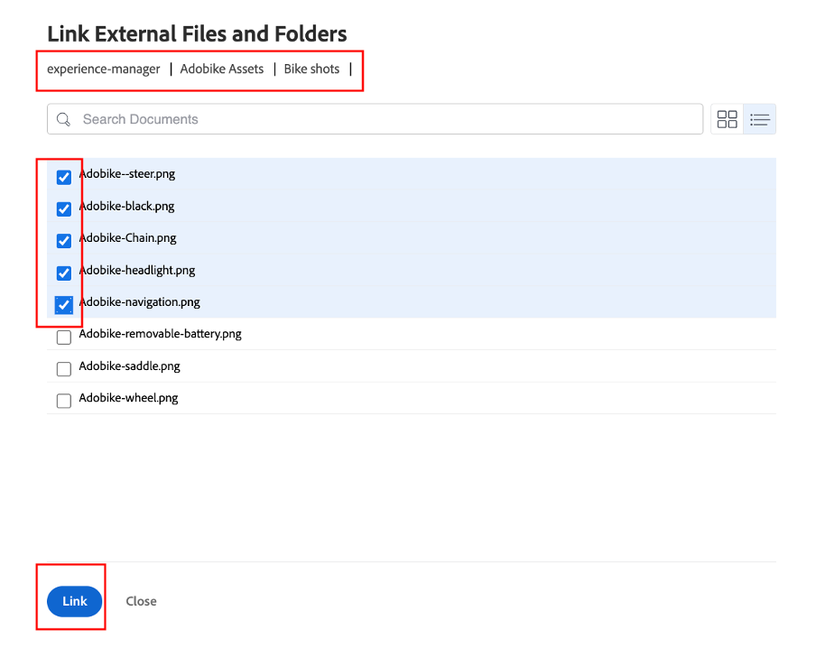

- We now have our Brand assets on our task. This means we can set task 2 as 100% complete:

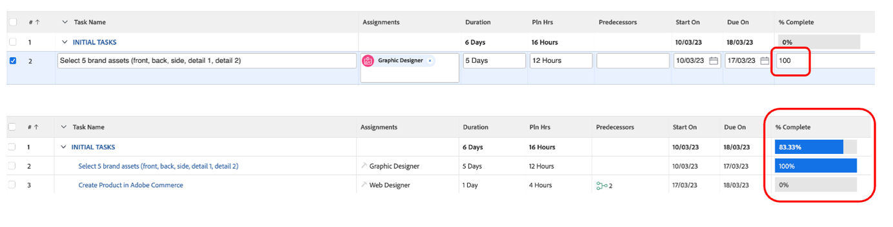

## Demo of Adobe Commerce

Adobe Commerce is one of the many products in the Adobe Experience Cloud that can help you to deliver the best digital experiences to your customers. However, there was simply too little time to do everything together during the bootcamp. 

This video makes you familiar with Adobe Commerce and shows the product we created to use during the bootcamp. In a real-life scenario, you would upload the previously selected brand assets to Adobe Commerce to the product configuration.

>[!VIDEO](https://video.tv.adobe.com/v/3418945?quality=12&learn=on)

Once this task is completed, you can mark task 3 as 100% complete in Workfront.

## Flexible campaigns are a prerequisite

While reviewing our work plan, we noticed a little issue: our Product Manager (the Requestor) has put an update that he forgot to request for a 'Product Homepage Banner'.  We will add this to our project plan.

- Go to the Tasks list and add our 'Create Product Homepage Banner' task just below task 4 'PRODUCTION'. To do that, select the 'Prepare Mobile App Content' task and click on the 'add task above icon':

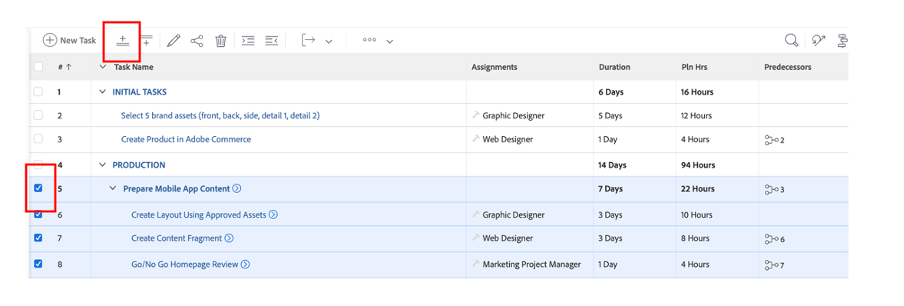

- Give the added task a meaningful name, like "Create product homepage banner".

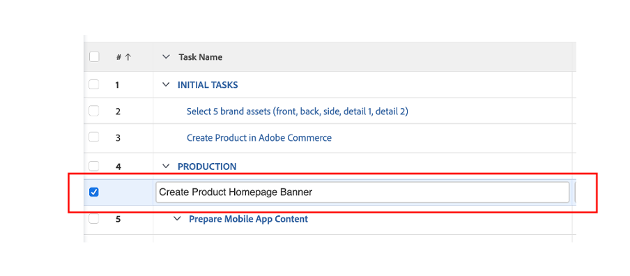

- Now that we've created the task, let's add some content to it. Click on the three dots on the right of your Project title and select 'Attach Template':

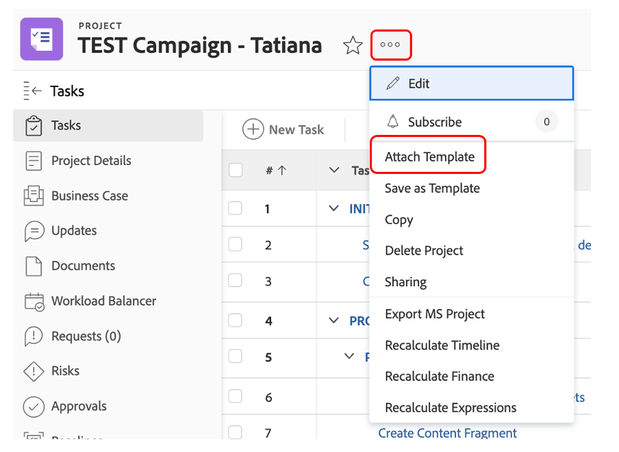

- Select 'Create Product Homepage Banner' and click on 'Customize and attach':

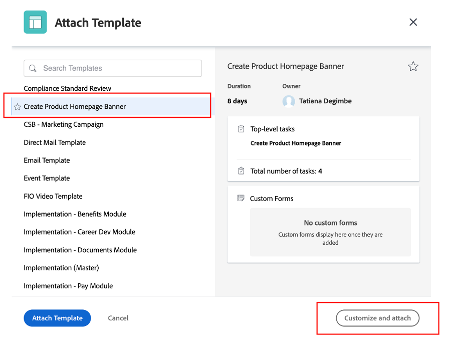

- In the customization screen, ensure you mention the 'Create Product Home Page Banner' task as the parent:

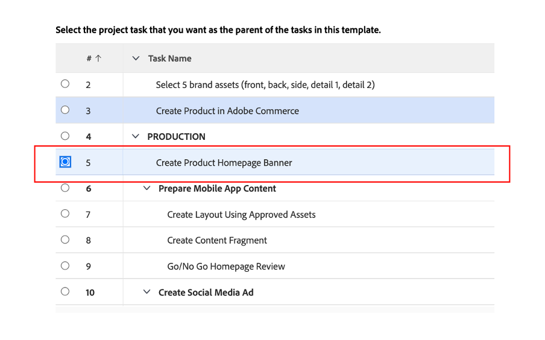

- Finally, make sure that you mark the parent task 'Create Product Home Page' with a Predecessor of task 3 as no production can be started until the product is created in Adobe Commerce:

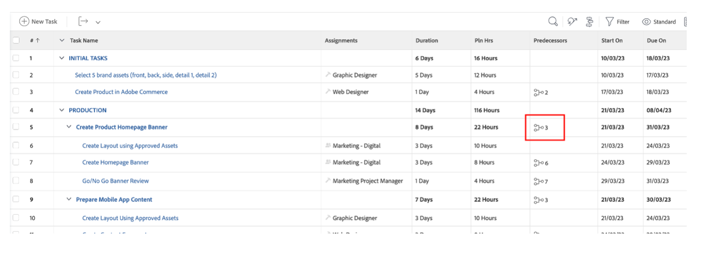

We now have a campaign that is complete and planned out, which means we can now start with the production and delivery of our campaign!

Next Step: [Phase 2 - Production: Create product homepage banner](../production/banner.md)

[Go Back to Phase 1 - Planning: Planning](./planning.md)

[Go Back to All Modules](../../overview.md)