# Create mobile app content

## What is headless content delivery?

With a headless content management system, the backend and frontend are now decoupled. The headless part is the content backend, as a headless CMS is a back-end only content management system, designed and built explicitly as a content repository that makes content accessible via an API, for display on any device.

The frontend, which is developed and maintained independently, fetches content from the headless backend using a Content Delivery API, typically in JSON format. For example, this could be as a web app, or in our case as a mobile application.

A headless CMS backend usually requires the content to be structured, based on a model or schema. This facilitates client applications requesting the right content for rendering an experience. Some CMS, like AEM, can expose both structured and unstructured content in JSON format.

A key characteristic of this topology is that content served by the headless CMS in JSON format is pure content, without design or layout information. In a headless CMS implementation, all formatting and layout is maintained by the decoupled frontend application.

A key benefit of a headless CMS topology is the ability to reuse content across multiple channels, which may use different client-side frontend implementations. This can make the frontend development process more efficient. But it also means the frontend experience development process can become very code and IT-centric, with IT essentially owning the experience.

## How does headless content delivery work in AEM?

AEM as a Cloud Service is a flexible tool for the headless implementation model by offering three powerful features:

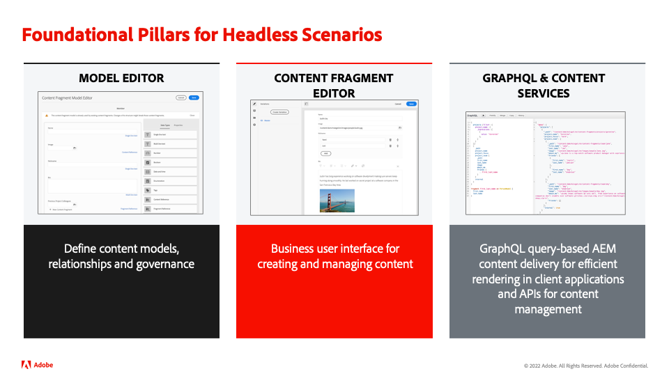

1.  Content Models
    - Content Models are structured representation of content.
    - Content Models are defined by information architects in the AEM Content Fragment Model editor.
    - Content Models serve as a basis for Content Fragments.
1.  Content Fragments
    - Content Fragments are created based on a Content Model.
    - Created by content authors using the AEM Content Fragment editor.
    - Content Fragments are stored in AEM Assets and managed in Assets Admin UI.
1.  Content API for delivery
    - The AEM GraphQL API supports Content Fragment delivery.
    - The AEM Assets REST API supports Content Fragment CRUD operations.
    - Direct content delivery is also possible with the [JSON export of the Content Fragment Core Component](https://experienceleague.adobe.com/docs/experience-manager-core-components/using/components/content-fragment-component.html?lang=en).

## Exercise

For this bootcamp, we'll be focussing on the "content" part – after all, it's the content supply chain we're after. We've already foreseen a content model, as well as the necessary delivery APIs, so that you can focus on what's important.

Let's explore our content model first: it's the "contract" that we have with the headless CMS, so we know what content can come our way and in what format.

-   Go to the AEM author on [https://author-p105462-e991028.adobeaemcloud.com/](https://author-p105462-e991028.adobeaemcloud.com/) and log in with the credentials we provided.

-   From the AEM Start Menu, select Tools \> General \> Content Fragment Models

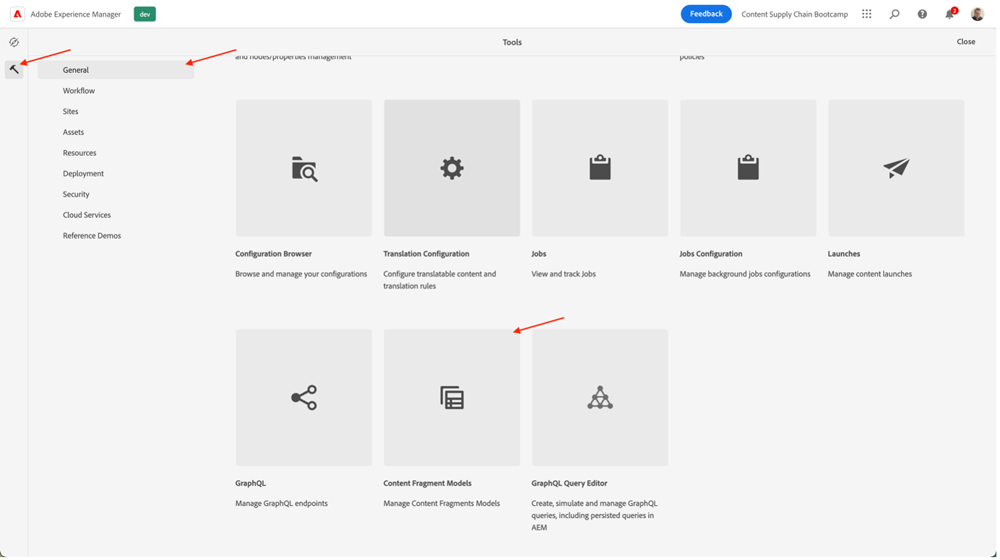

- On the next screen, you'll get an overview of all sites that are using headless content. This allows you to keep governance over multiple headless sites, without having to fear they will interfere with each other. In our case, we're working with our Adobike site, so select that model.

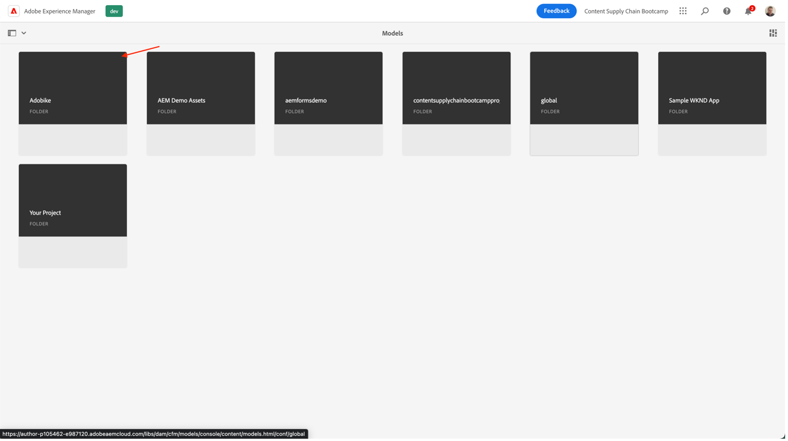

- In this folder, we can see some technical headless content that we're using in the Adobike website. Interested in knowing more? Feel free to reach out. For now, let's focus on the task before hands: the mobile app. Hover over the Mobile App Homepage card, and click the pencil icon to open up the content model.

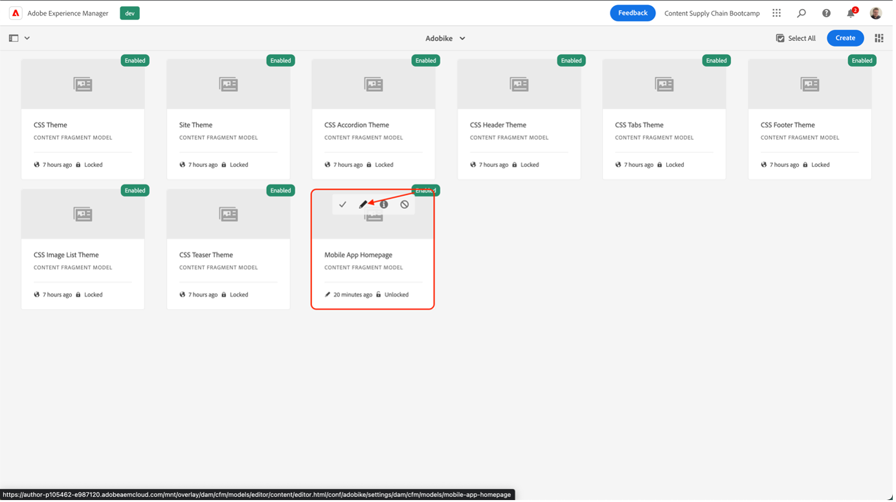

- In the Content Fragment Model Editor, you can see the details of a certain Content Model. In our case, we can see the homepage of our mobile app exists of the Adobike logo, a heading, some optional free text, and an optional featured product. All these items are easy to configure and update, so that if your content model needs extra elements, this can be done without developer interference on the CMS side.

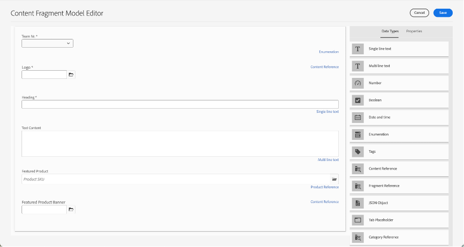

>[!WARNING]
>
> **Please do note that changing the content model has implications further down the line**, as the mobile app relies on receiving certain information in order to be able to display the correct elements. Be extra careful when updating or removing fields, adding fields should have no impact.

Now that we have an idea of what our content should exist of, we can make our content fragment.

- Click the AEM Logo in the top left corner to open the navigation, then navigate to Navigation \> Content Fragments.

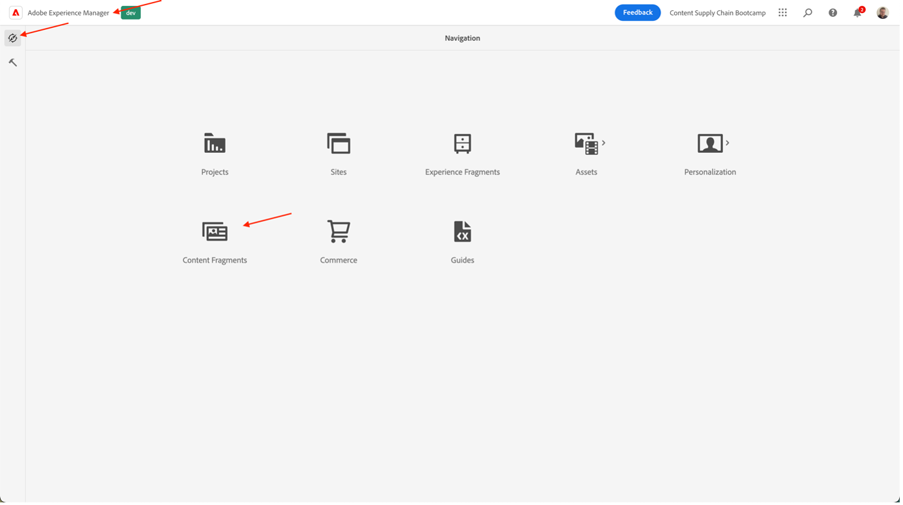

- In the following interface, you get an overview of all the existing content within AEM. The filters on the left can be used to narrow down if you're searching for a specific content fragment. To create a new content fragment, we'll click the "Create" button on the top right.

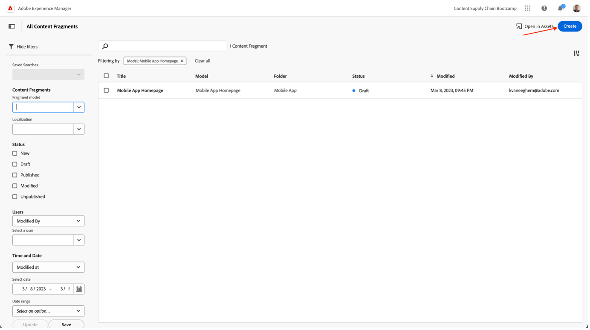

-   In the modal that opens, you'll see that some fields are not yet editable. This is logical: based on where we create our fragment, different models will be available.
    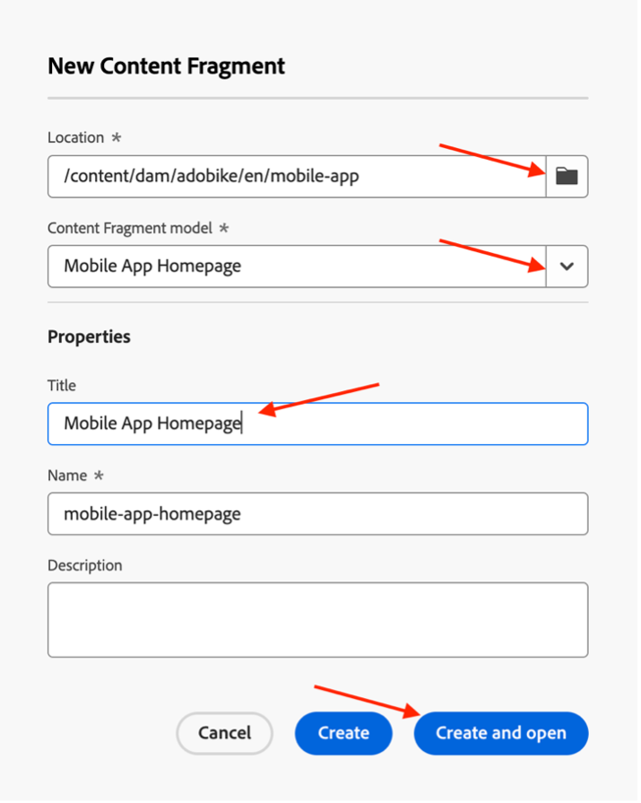
    -   First, select where we will create our fragment by clicking the folder icon next to the "Location" field. Expand the content tree by clicking on the folders "adobike" \> "en" \> "mobile-app", then confirm your selection by clicking the "Choose" button.
    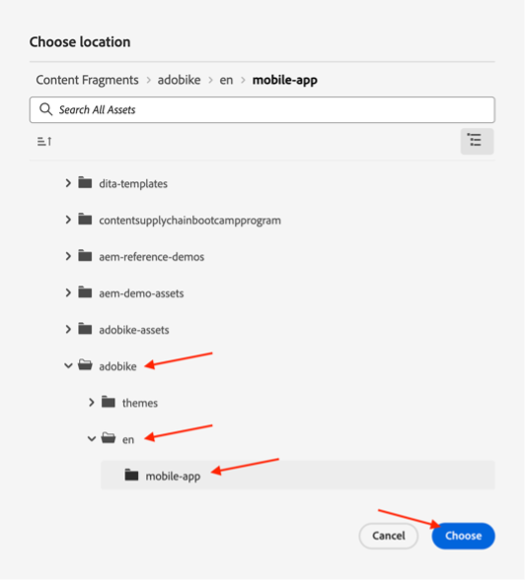
    -   You'll notice that the "Content Fragment Model" field is now editable. Click the arrow next to the field to open the dropdown and select the content model that we looked at earlier: "Mobile App Homepage".
    -   Next, give your content fragment a meaningful title (tip: include your team number to find back your content easily). You'll notice that the "Name" field automatically populates - this is to make your life easier: it's the name the system uses to identify your fragment and should not be touched.
    -   Finally, click the "Create and open" button, which will as the name indicates create the content fragment and open it so you can immediately edit it.

-   In here, your team can decide what content you want to show in the mobile app. 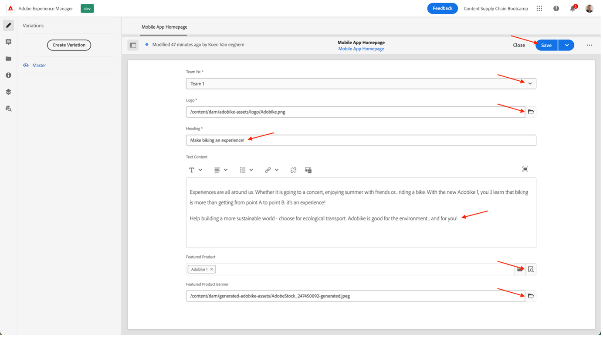
    -   Be sure to select your team nr, so you can check your content later in the mobile app.
    -   For selecting image assets, click the folder icon to browse AEM Assets for the correct image.
    -   For the featured product, click the product lookup icon so you can easily select our "Adobike 1" Commerce product, so the commerce-related details get loaded in the app.
    -   Be sure to click the "Save" button when you're finished to save all your authored content and publish your changes.
    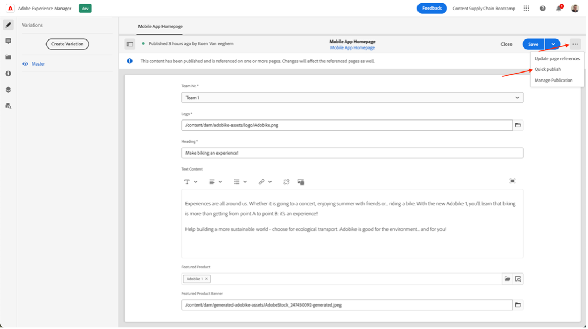

Now that we've foreseen the mobile app with some content, we are ready to deliver our campaign.

Next Step: [Phase 3 - Delivery: Verify mobile app](../delivery/app.md)

[Go Back to Phase 2 - Production: Create social media ad](./social.md)

[Go Back to All Modules](../../overview.md)
