# Create product homepage banner

## Production of the banner

Content automation brings the power of Adobe Creative Cloud to Experience Manager Assets giving marketers the ability to automate asset production at scale, dramatically speeding the creation of variations. Let's use these functionalities to generate a banner to be used on the homepage!

-   Go to the AEM author on [https://author-p105462-e991028.adobeaemcloud.com/](https://author-p105462-e991028.adobeaemcloud.com/) and log in with the credentials we provided.

-   From the homepage, navigate to Tools \> Assets \> Processing Profiles.

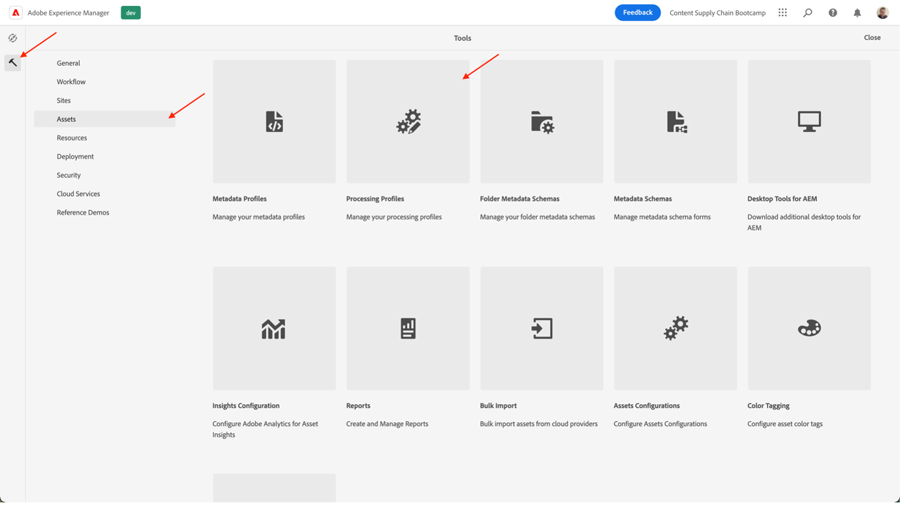

- In the interface, you'll see all the existing processing profiles. These can be used up to enable certain automations.

 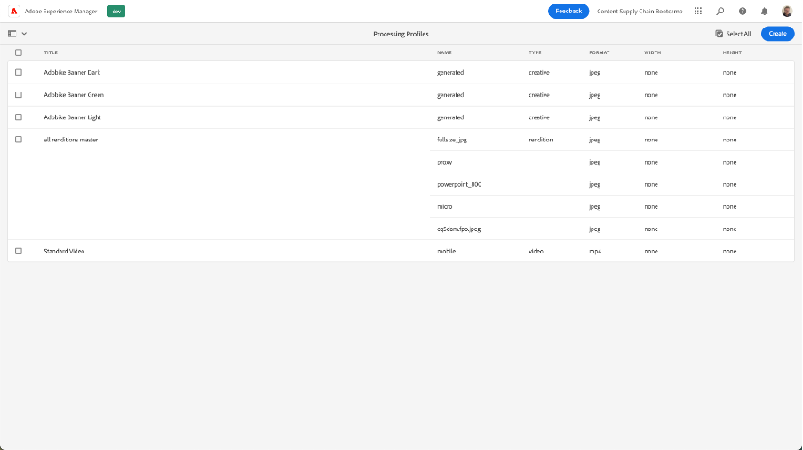

-   The following ones are of interest to you:
    -   Adobike Banner Dark: creates an Adobike banner with a dark overlay, based on the selected asset
    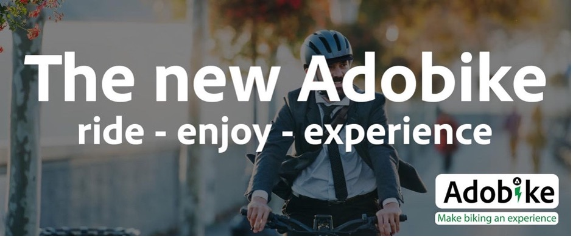
    -   Adobike Banner Light: creates an Adobike banner with a light overlay, based on the selected asset
    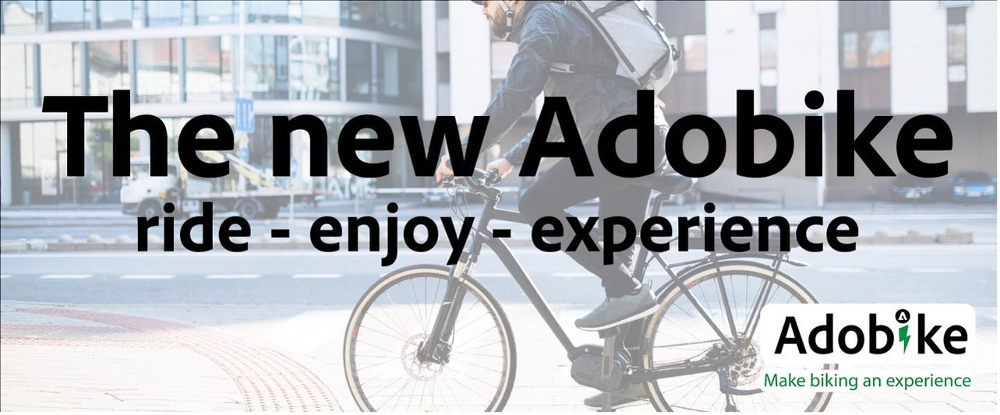
    -   Adobike Banner Green: creates an Adobike banner with a green overlay, based on the selected asset
    

-   Once you've chosen the type of banner you want to create, select that processing profile, then select "Apply Profile to Folder(s)".

 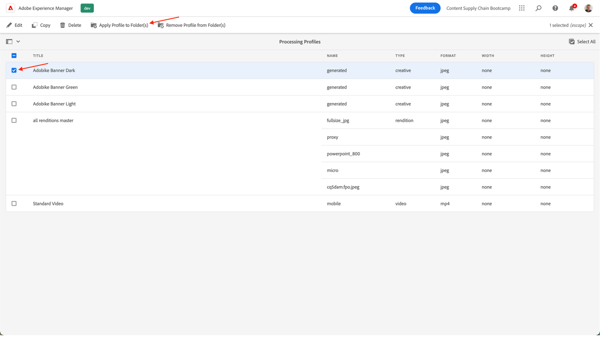

- On the next screen, browse to your team's folder in AEM Assets. Then, from the left top, select the "Create" button to create a new folder and give it a meaningful name, e.g. "Create Dark Banner".

 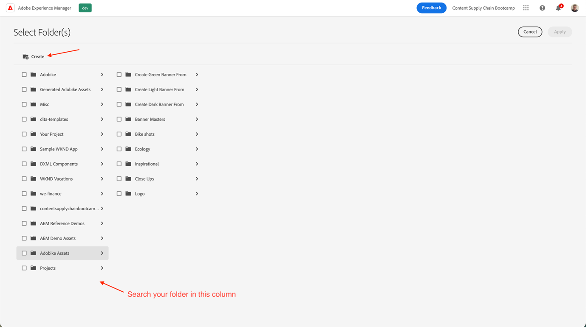

 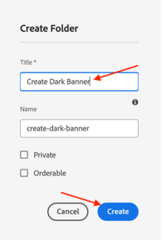

- After creating the folder, check the box next to its name, then click the "Apply" button on the right top.

 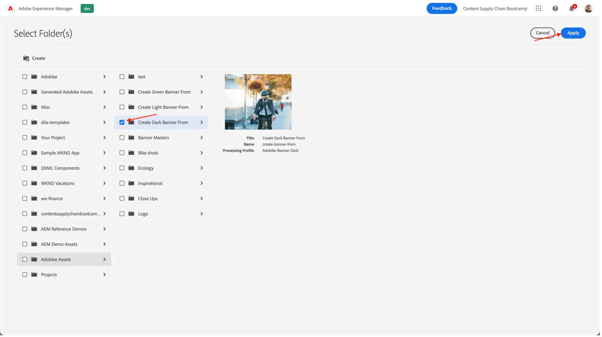

Now that we've done the necessary configuration, let's generate our banner.

- Click the AEM Logo in the top left corner to open the navigation, then navigate to Navigation \> Assets \> Files.

 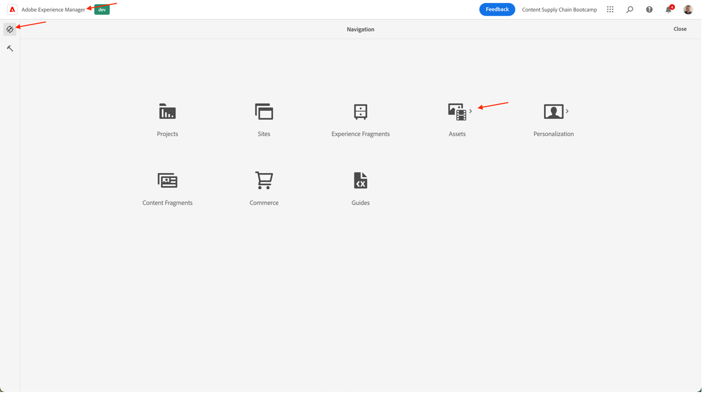
 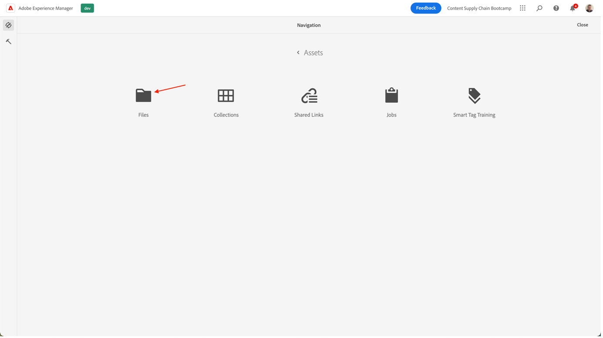

- Locate the "Generated Adobike Assets" folder and open it by clicking on the card. This is where the generated banners will appear.

 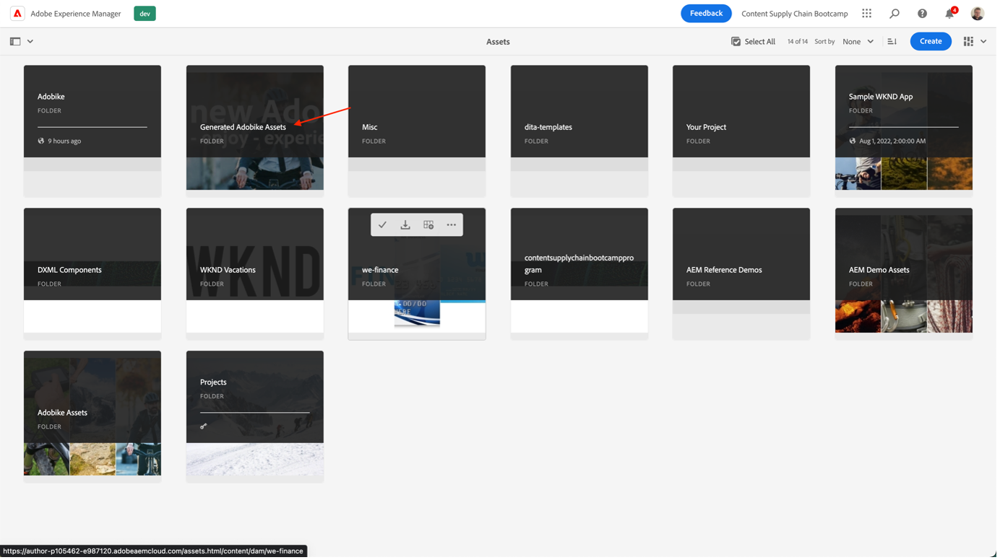

-   Open a new tab and Navigate to AEM Assets again. Then, navigate to the folder we applied the processing profile to.

-   In the folder, upload the image for which you want to create a banner either by dragging and dropping it to your browser, or by clicking Create \> Files in the top righthand corner of the interface. 

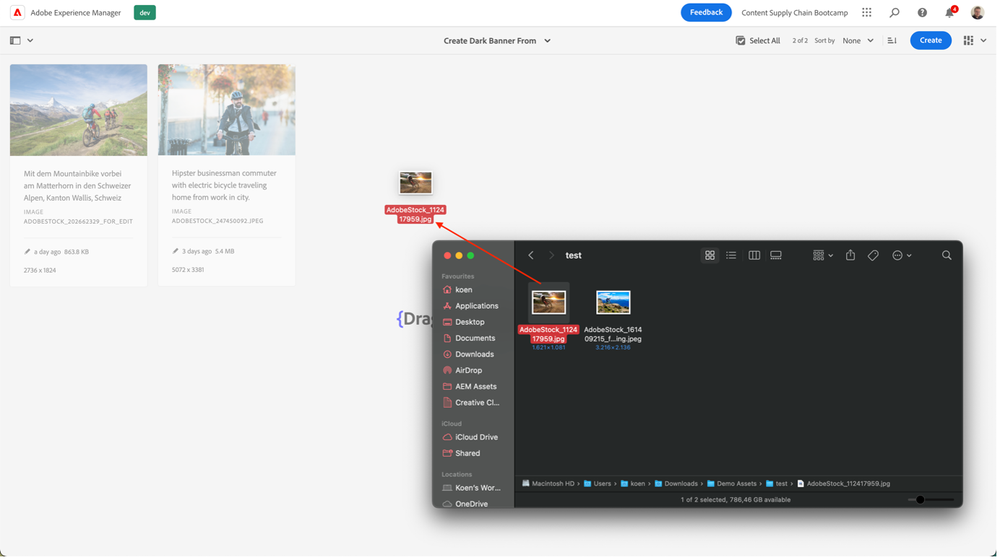

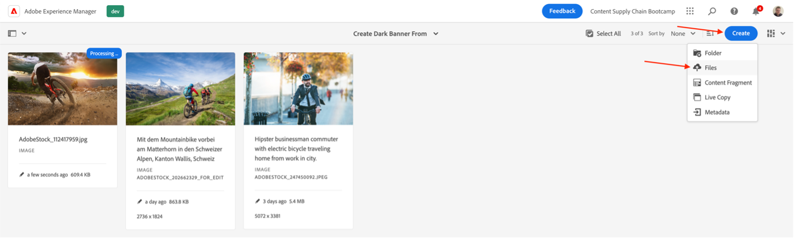

- Wait for a minute for your asset to process, then reload your screen. If you see your asset in state "New", you know it's done processing.

- Navigate back to the previous tab and reload the screen here too. You should notice a new asset in state "New". This is our generated banner, all from the DAM! Don't see it yet? Wait another minute, then reload your screen.

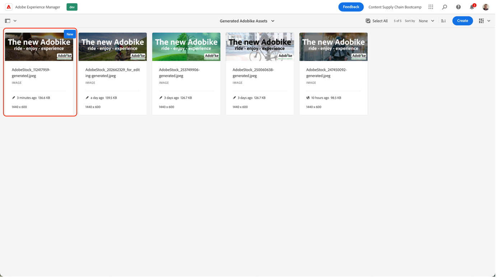

>[!NOTE]
>
> Not satisfied with the result? Feel free to apply another processing profile to your folder and re-uploading your asset to generate a different banner (or uploading another asset of course). During the re-uploading, the system will ask you what you want to do with the existing asset, select "Replace".
> 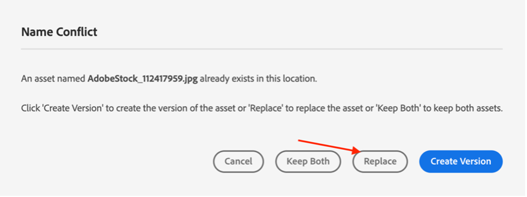

We now have our generated banner that we can use later during the delivery of our campaign. Be sure to publish the banner by selecting it, then clicking the "Quick Publish" button on the ribbon.

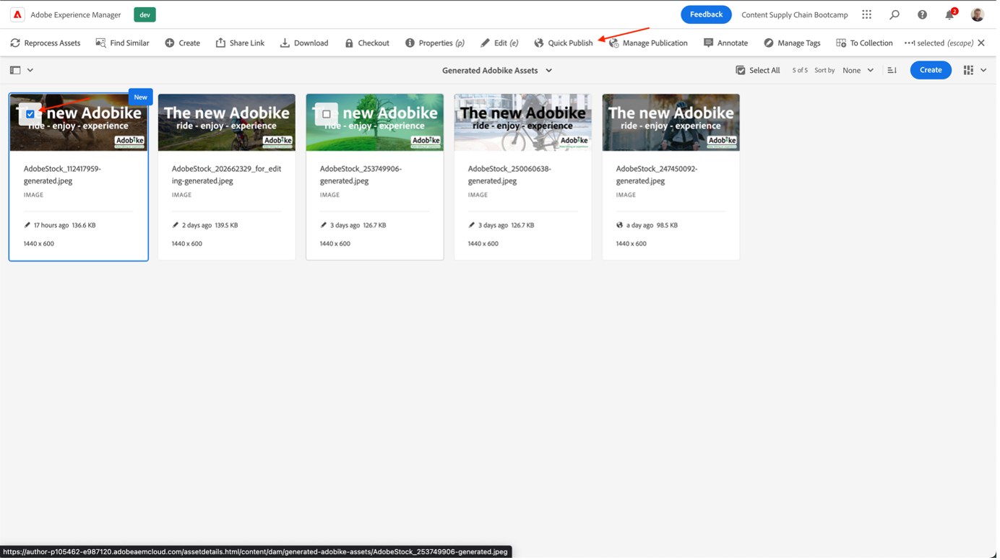

## Follow-up in Workfront

If you need a formal and auditable review and approval process of your Assets, Workfront is the place to be.

>[!NOTE]
>
> Although we mention it here explicitly, it is the intension to update the tasks in Workfront after you finished them. You should always strive for a Create > Review > Approve flow.

- Let's go back to our project and expand the 'Go/No Go Banner Review' accordion to open the said task by clicking it:

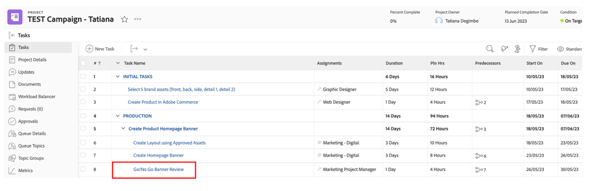

- Click on the documents section of the task (left column), then click on the AEM Assets linked folder 'Final'. Select our asset by clicking on its zone and Click on 'Create Proof'. A proof is the ability to proofread content, e.g. picture, text, video, website, etc., in a structured and collaborative manner, where comments, corrections, modifications of the involved stakeholders are collected, versions and outcomes can be compared and final approved generated by one click.

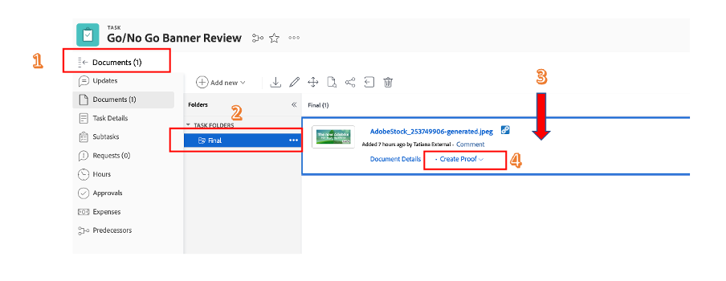

- As we want an elaborate approval process, select "Advanced Proof".

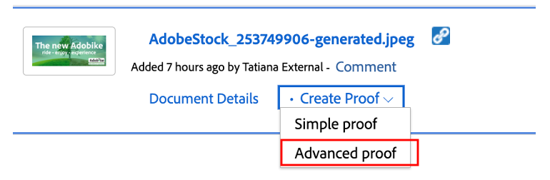

>[!NOTE]
>
> We are going to decide manually who will be reviewing and/or approving our proof in this bootcamp. In most real use-cases, we would use a pre-set template of approval flow(s) already defined for each type of proof.

- By default, we are in a workflow type 'basic' and we are going to select your Workfront Bootcamp Specialist as reviewer & approver. Type your Bootcamp Workfront Specialist's name where it says 'Type contact name or email address to add a recipient:

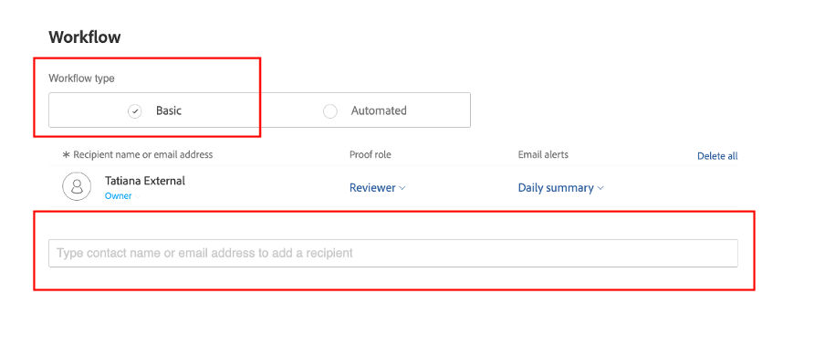

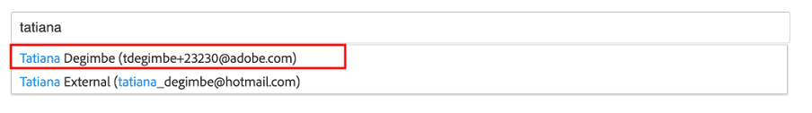

- Set them as 'Reviewer & Approver':

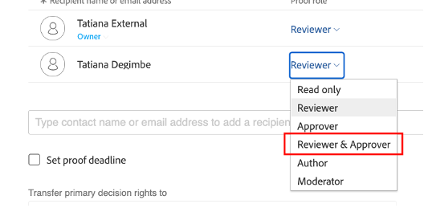

- Click on 'Create Proof'. Workfront will take a few moments to generate the proof:

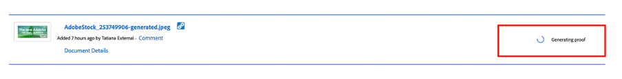

- Your Workfront Specialist will now have received a new notification informing them that they have a proof to review and/or approve:

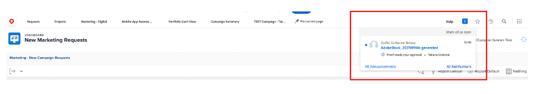

-   After clicking on the notification, they will face your proof and be able to make some comments and/or approve this proof. 

    - They can click on 'Add comment' on the top of the screen if they have remarks:

    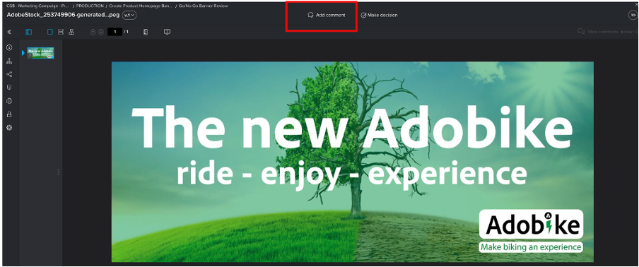

    - They will then be able to not only add comments but also use the little pointers-toolbar to clearly define what area needs changing.

    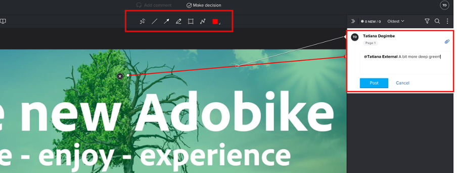

    - By adding the comment, they can let you know that you need to do some extra work on a new version of the proof. Refresh your Workfront tab and you will have a new notification letting you know exactly that. Once you know what changes you have to do, make your changes in AEM and then come and upload your new version here:

    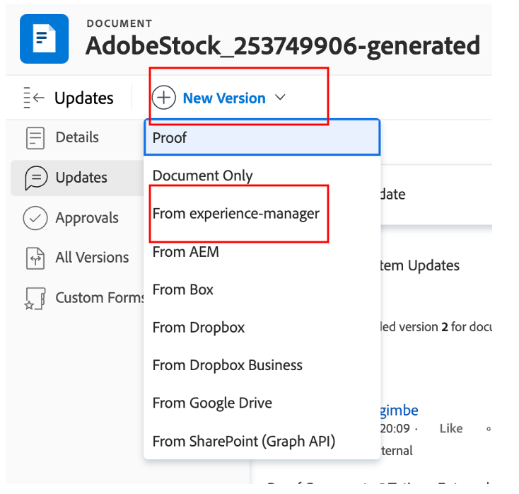

    - Select your updated asset (if no changes are needed in the bootcamp scenario, just upload the same asset again) and click 'Link':

    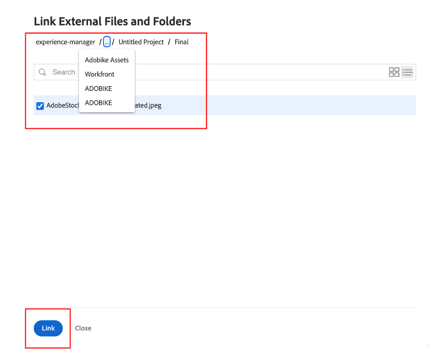

    - Then, click on 'create proof' on the right hand side.

    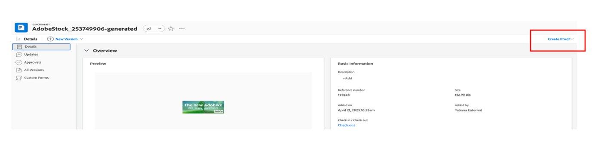

    - Once the proof is generated (this can take a few moments), your Workfront Specialist will receive a notification and will be able to review and hopefully approve this new version.  For example by using the proof comparison button, they can see a side-by-side comparison of V1 and V2 with all the comments that have been made.

    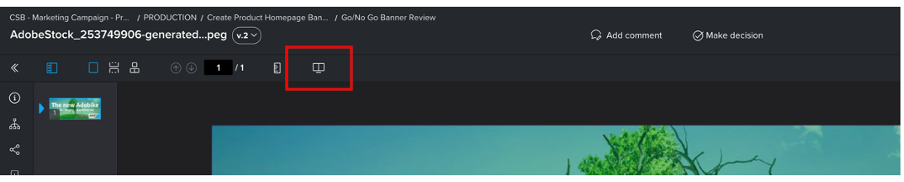

    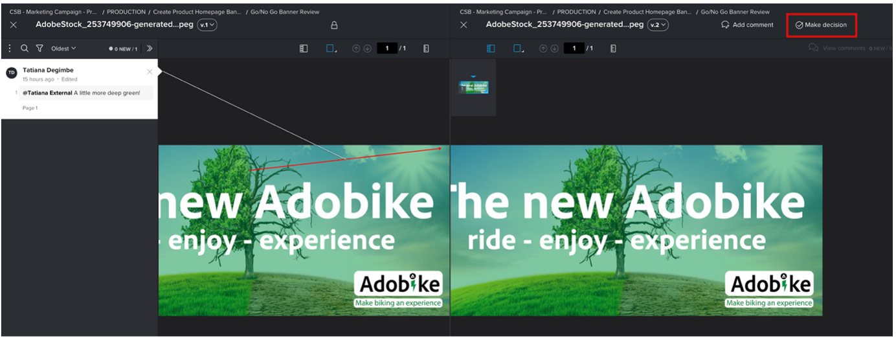

    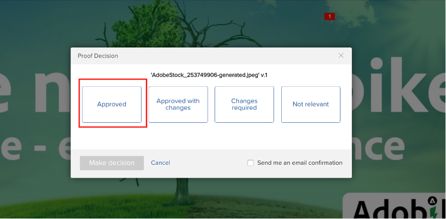

We now have a formal approval for the use of our banner. It's easy to follow where in the process we are, and the updates you do automagically trigger notifications, so you can work in an as efficient way as possible.

Next Step: [Phase 2 - Production: Create social media ad](./social.md)

[Go Back to Phase 1 - Planning: Other pre-work](../planning/prework.md)

[Go Back to All Modules](../../overview.md)
