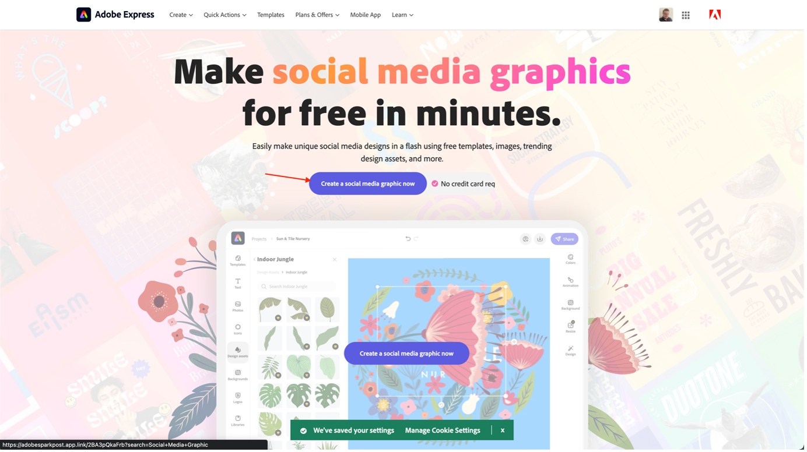
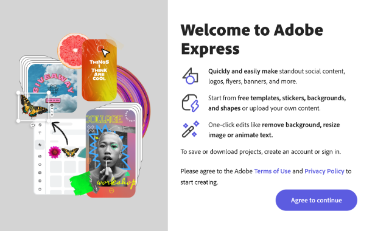
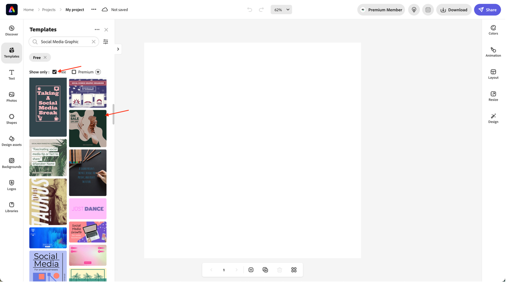
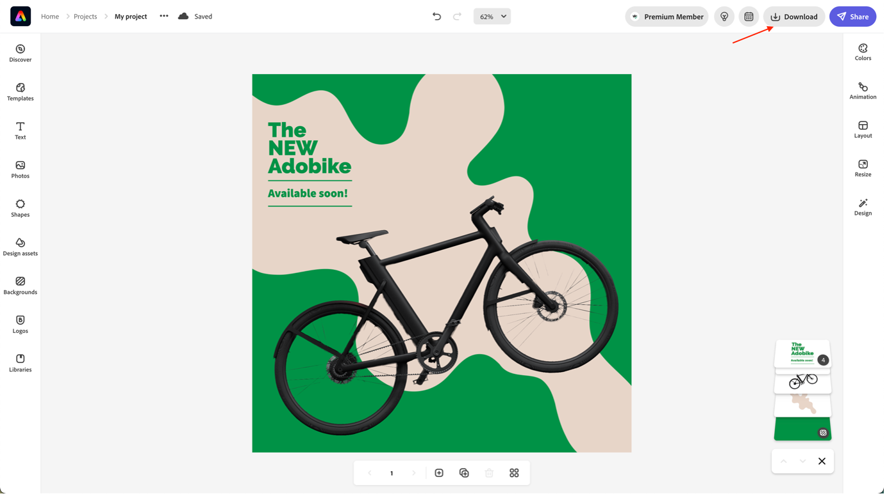

# Create social media ad

Whether you're a business trying to reach out to your target audience or just an individual sharing your vibe, Adobe Express can help you create amazing social media images for any platform. If you find yourself short on ideas, explore the template library to kickstart your creativity. Adobe Express comes loaded with thousands of professionally designed social media graphics like the examples below, along with free images, icons, and graphics you can drag and drop right onto your design.

- Navigate to [Adobe Express](https://www.adobe.com/express/create/social-media-graphic) and click the "Create a social media graphic now" button to get started.

 

- If this is your first time using Adobe Express, click the "Agree to continue" button in the modal that pops up to get started.

- From the sidebar on the left, check the box "Free" to get an overview of Adobe Express' free templates, then select the type of graphic you decided on with your team. In our case, we're going to make an Instagram post; simply click the template you like to load it into the editor.

- Once you're happy with your post, click the "Download" button on the top right to download your social media post in your preferred format. Keep it somewhere safe, we'll need it later!

 

>[!NOTE]
>
>**Did you know?**  
>Adobe Express is always evolving, as are all our products at Adobe. That's why we're really excited to announce our upcoming integration between Adobe Express and AEM Assets. This will allow you to use your brand's assets in Adobe Express, as well as directly saving the result to Adobe Express.

Next Step: [Phase 2 - Production: Create mobile app content](./app.md)

[Go Back to Phase 2 - Production: Create product homepage banner](./banner.md)

[Go Back to All Modules](../../overview.md)
