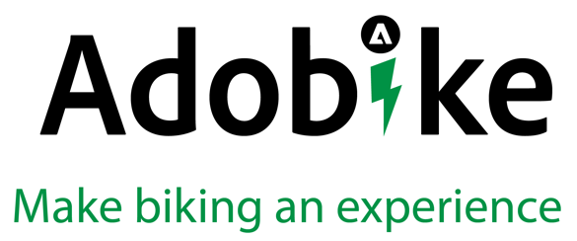

# Reference Material

## Slide deck

This documentation can help you to get familiar with the concept of this bootcamp, as well as a content supply chain. However, there's always some things that we wanted to show but couldn't include anymore. You can find this information back in the [following slide deck](https://adobe.sharepoint.com/:p:/r/sites/SWEnterpriseMarketingTeam/Shared%20Documents/Bootcamps/Content%20Supply%20Chain%20Bootcamp/Experience%20Makers%20Content%20Supply%20Chain%20Slide%20Deck.pptx?d=w1a3787d39c3a43ab941cfd0069f8383a&csf=1&web=1&e=57aFUU) and our [Art of the Possible demo](https://xd.adobe.com/view/45ea642f-69fb-4bbe-bba6-6915a3709a6d-10b9/?fullscreen).

## Meet Adobike

Adobike is a company based in Brussels and already has an established presence in the market. They have a community of 50.000 riders beside them. They have recently developed a new revolutionary e-bike, and in that process the company is also transforming their marketing team's setup, as well as related processes and technologies. 

With the launch of their new bike, they are seeing challenges with work efficiency issues. It is crucial for them to have complete visibility into the entire life cycle of work from initial request to final delivery in a single solution. Functioning at a high level of orchestration, they need to enable cross- team collaboration. 

For the new product launch, they want to create new visuals, a new landing page and want to personalize the touchpoints they have with their customers. For personalization at scale, they need a lot of content and variations, and they also need content for their social media presence. 

Adobike also wants it to be easy for customers to order the bike online. They realize that they need the right tools to orchestrate the launch and to create and deliver the necessary content at scale and that on-time delivery is at risk without clear status of department workload and budgets. 

## Useful links

### Content Supply Chain

- [Building a Content Supply Chain That Scales](https://business.adobe.com/resources/webinars/building-a-content-supply-chain-that-scales.html)

### Adobe Experience Manager

- [Overview of Content Automation with Creative Cloud services](https://experienceleague.adobe.com/docs/experience-manager-learn/assets/content-automation/overview.html?lang=en)
- [Getting started with AEM Commerce as a Cloud Service](https://experienceleague.adobe.com/docs/experience-manager-cloud-service/content/content-and-commerce/storefront/getting-started.html)
- [Introduction to Adobe Experience Manager as a Headless CMS](https://experienceleague.adobe.com/docs/experience-manager-cloud-service/content/headless/introduction.html?lang=en)

### Adobe Express

- [Getting started with Adobe Express templates](https://helpx.adobe.com/express/using/work-with-templates.html)

### Adobe Workfront

- [Product Documentation Adobe Workfront](https://experienceleague.adobe.com/docs/workfront/using/home.html?lang=en)
- [Workfront for AEM Assets](https://exchange.adobe.com/apps/ec/101385/workfront-for-aem-assets)

[Go Back to All Modules](./overview.md)
