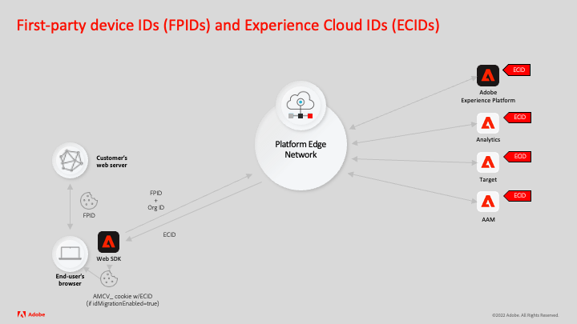

# Generate first-party device IDs

Adobe Experience Cloud applications have traditionally generated cookies to store device ids using different technologies, including:

1. Third-party cookies
1. First-party cookies set by an Adobe server using a domain name's CNAME configuration
1. First-party cookies set by JavaScript

Recent browser changes restrict the duration of these types of cookies. First-party cookies are most effective when they are set using a customer-owned server using a DNS A-record as opposed to a DNS CNAME. The first-party device ID (FPID) functionality allows customers implementing Adobe Experience Platform Web SDK to use device IDs in cookies from servers using DNS A-records. These IDs can then be sent to Adobe and used as seeds to generate Experience Cloud IDs (ECIDs), which will continue to be the primary identifier in Adobe Experience Cloud applications.

Here is a quick example of how the functionality works:



1. An end-user's browser requests a web page from a customer's web server or CDN.
1. Customer generates a device id (FPID) on their web server or CDN (the web server should be listed in the domain name's DNS A-record).
1. Customer sets a first-party cookie to store the FPID in the end user's browser.
1. Customer's Adobe Experience Platform Web SDK implementation makes a request to the Platform Edge Network, including the FPID in the identity map.
1. Experience Platform Edge Network receives the FPID and uses it to generate an Experience Cloud ID (ECID).
1. Platform Web SDK response sends the ECID back to the end-user's browser.
1. Platform Web SDK uses JavaScript to store the ECID as the `AMCV_` cookie in the end-user's browser.
1. In the event the `AMCV_` cookie expires, the process repeats itself. As long as the same first-party device ID is available, a new `AMCV_` cookie will be created with the same ECID value as before.

For this tutorial, a specific example using the PHP scripting language will be used to show how to: 

* Generate a UUIDv4
* Write UUIDv4 value to a cookie 
* Include the cookie value in the identity map
* Validate the ECID generation

Further documentation related to first-party device IDs can be found in the product documentation.

## Generate a UUIDv4

PHP does not have a native library for UUID generation, so these code examples will be more extensive than what would likely be required if another programming language was used. PHP was chosen for this example because it is a widely supported server-side language. 


When the following function is called, it will generate a random UUID version-4:

```
<?php
    
    function guidv4($data)
    {
        $data = $data ?? random_bytes(16);

        $data[6] = chr(ord($data[6]) & 0x0f | 0x40); // set version to 0100
        $data[8] = chr(ord($data[8]) & 0x3f | 0x80); // set bits 6-7 to 10

        return vsprintf('%s%s-%s-%s-%s-%s%s%s', str_split(bin2hex($data), 4));
    }

?>
```

## Write UUIDv4 value to a cookie 

The following code makes a request to the function above to generate a UUID. It then sets the cookie flags decided upon by your organization. If a cookie has already been generated, then the expiration is extended. 

```
<?php

    if(!isset($_COOKIE['FPID'])) {
        $cookie_value = guidv4(openssl_random_pseudo_bytes(16));        
        $arr_cookie_options = array (
        'expires' => time() + 60*60*24*30*13,
        'path' => '/',
        'domain' => 'mysiteurl.com',
        'secure' => true,
        'httponly' => true,
        'samesite' => 'lax'
        );
        setcookie($cookie_name, $cookie_value, $arr_cookie_options);
        $_COOKIE[$cookie_name] = $cookie_value;
    }
    else {
        $cookie_value = $_COOKIE[$cookie_name];
        $arr_cookie_options = array (
        'expires' => time() + 60*60*24*30*13,
        'path' => '/',
        'domain' => 'mysiteurl.com',
        'secure' => true,
        'httponly' => true,
        'samesite' => 'lax'
        );
        setcookie($cookie_name, $cookie_value, $arr_cookie_options);
    }

?>
```

>[!NOTE]
>
>The cookie which contains the first-party device ID does not need to be called `FPID` but can have any name. 

## Include the Cookie Value in the Identity Map

The final step is to use PHP to echo the cookie value to the Identity Map.


```
{
    "identityMap": {
        "FPID": [
                    {
                        "id": "<? echo $_COOKIE[$cookie_name] ?>",
                        "authenticatedState": "ambiguous",
                        "primary": true
                    }
                ]
        }
}
```

>[!IMPORTANT]
>
>The identity namespace symbol used in the identity map, must be called `FPID`. 
>
> `FPID` is a reserved identity namespace which is not visible in the interface lists of identity namespaces.


## Validate ECID generation

Validate the implementation by confirming that the same ECID will be generated from your first-party device ID:

1. Generate an FPID cookie.
1. Send a request to Platform Edge Network using Platform Web SDK.
1. A cookie with the format `AMCV_<IMSORGID@AdobeOrg>` will be generated. This cookie contains the ECID. 
1. Make a note the cookie value that is generated and then delete all cookies for your site except the `FPID` cookie. 
1. Send another request to Platform Edge Network.
1. Confirm the value in the `AMCV_<IMSORGID@AdobeOrg>` cookie is the same `ECID` value as in the `AMCV_` cookie that was just deleted. If the cookie value is the same for a given FPID, you can assume the seeding process for the ECID was successful. 

<!--
// how to pass with the tag extension
//Can't set the FPID namespace in tag extension
//This seems really weird to set the FPID as the primary namespace if this is not sent to Platform. The primary namespace
//Migration concerns?
//What to say about the CNAME of the web sdk request

-->