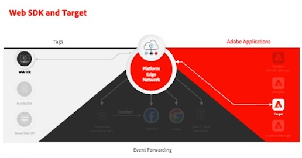
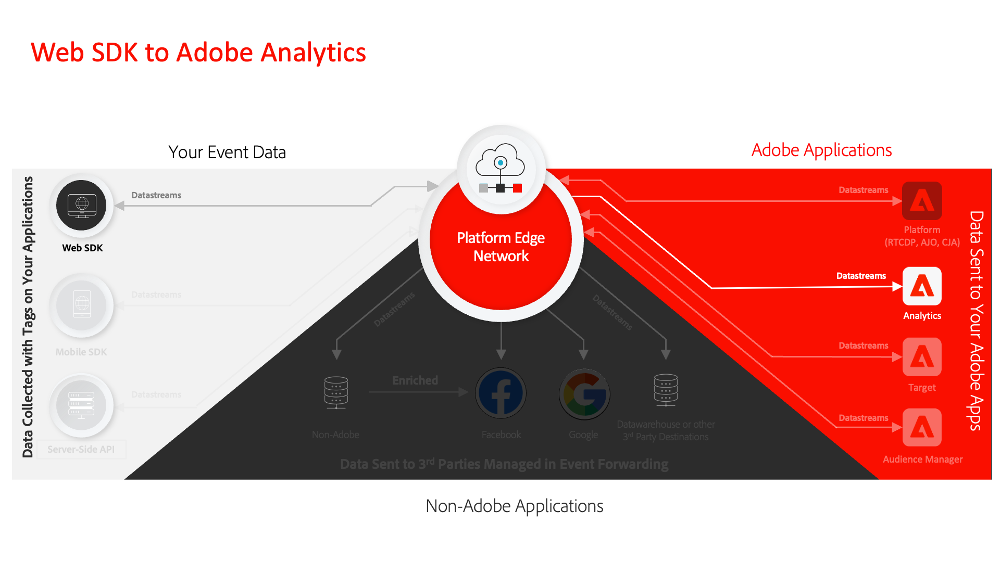
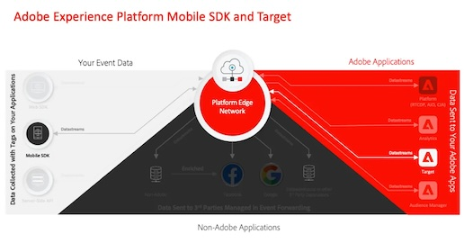
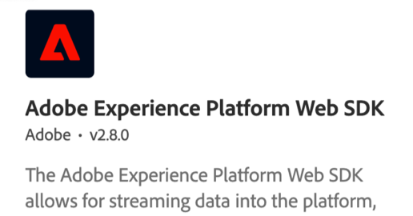
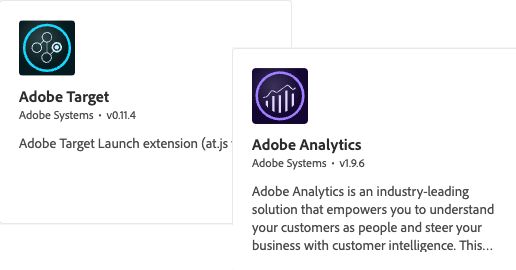

# Data Collection Tutorials

Data Collection is the next generation of website tag and mobile SDK management capabilities from Adobe. Data Collection gives customers a simple way to deploy and manage the analytics, marketing, and advertising solutions necessary to power relevant customer experiences. Use these videos and tutorials to help learn this critical technology.

## Migration Guides

<table>
<tr>
  <td>
    
    

      <a href="https://experienceleague.adobe.com/en/docs/platform-learn/migrate-target-to-websdk/introduction" target="_blank">
    <strong>Migrate Adobe Target to Web SDK</strong>
    </a>
    

    

    <em>Replace at.js with Web SDK</em>
    

  </td>
  <td>
    
    

      <a href="https://experienceleague.adobe.com/en/docs/platform-learn/migrate-analytics-to-websdk/migration-to-websdk-overview" target="_blank">
    <strong>Migrate Adobe Analytics to Web SDK in tags</strong>
    </a>
    

    

    <em>Replace AppMeasurement.js with Web SDK with tags</em>
    

  </td>
  <td>
      
    </a>
    

      <strong>Migrate Adobe Audience Manager to Web SDK</strong>
    

    

    <em>Replace <a href="https://experienceleague.adobe.com/en/docs/audience-manager/user-guide/migrate-to-web-sdk/dil-extension-to-web-sdk" target="_blank">dil.js</a> or <a href="https://experienceleague.adobe.com/en/docs/audience-manager/user-guide/migrate-to-web-sdk/appmeasurement-to-web-sdk" target="_blank">update server side forwarding</a></em>
    

  </td>
</tr>
<tr>
  <td>
    
    

      <a href="https://experienceleague.adobe.com/en/docs/platform-learn/migrate-target-to-mobile-sdk-decisioning/overview" target="_blank">
    <strong>Migrate Adobe Target to Mobile SDK on Edge Network</strong>
    </a>
    

    

    <em>Replace the Target extension with the Journey Optimizer - Decisioning extension</em>
    

  </td>
  <td>
  </td>
  <td>
  </td>
  </tr>
</table>

## Implementation Guides

<table>
<tr>
  <td>
    
    

      <a href="https://experienceleague.adobe.com/en/docs/platform-learn/implement-web-sdk/overview" target="_blank">
    <strong>Implement the Experience Cloud with Web SDK</strong>
    </a>
    

    

    <em>Use tags to implement Platform Web SDK</em>
    

  </td>
  <td>
    
    

      <a href="https://experienceleague.adobe.com/en/docs/platform-learn/implement-mobile-sdk/overview" target="_blank">
    <strong>Implement the Experience Cloud in mobile apps</strong>
    </a>
    

    

    <em>Use tags to implement Platform Mobile SDK</em>
    

  </td>
  <td>
    
    

      <a href="https://experienceleague.adobe.com/en/docs/platform-learn/migrate-target-to-websdk/introduction" target="_blank">
    <strong>Implement legacy libraries with tags</strong>
    </a>
    

    

    <em>Use tags to implement legacy Analytics, Target, and Audience Manager libraries</em>
    

  </td>
</tr>
</table>

*Apple, the Apple logo, iPad, iPhone, iPod, and iPod touch are trademarks of Apple Inc., registered in the U.S. and other countries. Swift and the Swift logo are trademarks of Apple Inc.*
