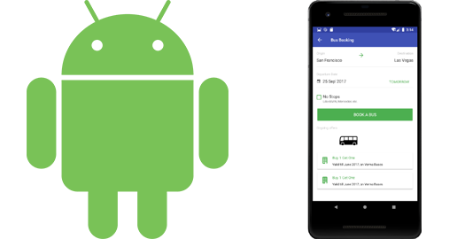

# Adobe Experience Platform Launch Tutorials

Adobe Experience Platform Launch is the next generation of website tag and mobile SDK management capabilities from Adobe. Experience Platform Launch gives customers a simple way to deploy and manage all of the analytics, marketing, and advertising solutions necessary to power relevant customer experiences. Use these videos and tutorials to help master this critical technology.

>[!NOTE]
>
>Adobe Experience Platform Launch is being integrated into Adobe Experience Platform as a suite of data collection technologies. Several terminology changes have rolled out in the interface which you should be aware of while using this content:
>
> * Platform Launch (Client Side) is now **[[!DNL tags]](https://experienceleague.adobe.com/docs/launch/using/home.html)** 
> * Platform Launch Server Side is now **[[!DNL event forwarding]](https://experienceleague.adobe.com/docs/launch/using/server-side-info/server-side-overview.html)** 
> * Edge configurations  are now **[[!DNL datastreams]](https://experienceleague.adobe.com/docs/experience-platform/edge/fundamentals/datastreams.html)**

## What's New

* **[Experience Platform Launch Server Side overview (Video)](launch-server-side/overview.md)**
    *Forward data to non-Adobe solutions from Experience Platform Edge Network.*

* **[Implement the Adobe Experience Cloud in websites with Launch (Tutorial)](https://experienceleague.adobe.com/docs/launch-learn/implementing-in-websites-with-launch/index.html)**
    *A step-by-step tutorial to learn how to implement Experience Cloud applications with Experience Platform Launch.*

* **[Implement the Adobe Experience Platform Mobile SDK in Android Apps (Tutorial)](https://experienceleague.adobe.com/docs/launch-learn/implementing-in-mobile-android-apps-with-launch/index.html)**
    *A step-by-step tutorial to learn how to implement the Adobe Experience Platform Mobile SDK in Android&trade; apps with Experience Platform Launch.*

## Staff Picks

<table>
<tr>
  <td>
    
    

      <a href="https://experienceleague.adobe.com/docs/launch-learn/implementing-in-websites-with-launch/index.html">
    <strong>Implement in Websites with Launch</strong>
    </a>
    

    

    <em>Implement the Adobe Experience Cloud solutions in your website</em>
    

  </td>
  <td>
    
    

      <a href="https://experienceleague.adobe.com/docs/launch-learn/implementing-in-mobile-android-apps-with-launch/index.html">
    <strong>Implement in Android&trade; Apps</strong>
    </a>
    

    

    <em>Use Launch to implement the new mobile SDK</em>
    

  </td>
  <td>
    
    

      <a href="https://experienceleague.adobe.com/docs/launch-learn/implementing-in-mobile-ios-swift-apps-with-launch/index.html">
    <strong>Implement in iOS Swift&trade; Apps</strong>
    </a>
    

    

    <em>Use Launch to implement the new mobile SDK</em>
    

  </td>
</tr>
</table>

*Apple, the Apple logo, iPad, iPhone, iPod, and iPod touch are trademarks of Apple Inc., registered in the U.S. and other countries. Swift and the Swift logo are trademarks of Apple Inc.
Android is a trademark of Google LLC.*
