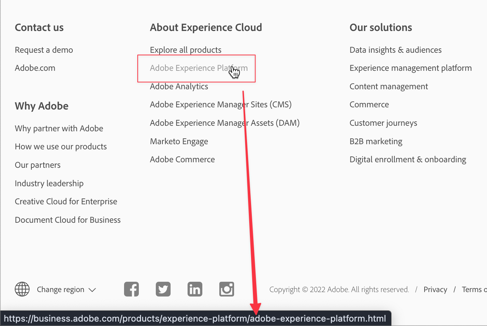
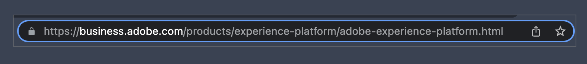
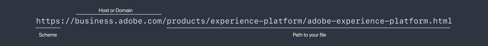

# API 101 - A basic introduction to APIs

API stands for Application Programming Interface. It means just what it says&mdash;there are interfaces between programs and these interfaces allow those programs to communicate. When programmers develop software applications, they often need their software to communicate with other software or hardware. The API defines the what, how, when, where, and why for those communications and interactions.

APIs are a way to solve business challenges with software. In most businesses, that's a collaborative effort. Collaborating is always easier with a shared understanding of key terms, concepts, and steps.

If you think about clicking a link in a web page, the browser uses quite a few APIs when you click the link. The browser recognizes the click, makes the request for the page you want to visit, retrieves the page over the internet, and then displays it on your screen. There are many smaller steps in-between, but your browser is software that communicates and interacts with a variety of APIs just to show you a web page. In this article we'll highlight terms, concepts, and steps that are important when using or discussing APIs.

By the end of this article you should have a clear understanding of these foundational terms, concepts, and steps. API documentation can be extensive, and discussions about using APIs to address specific use cases can get very detailed. Navigating documentation and discussing APIs is easier and more productive with clear fundamentals and shared understanding.

>[!NOTE]
>
> While there are many APIs, the focus here will be on Web and browser APIs: basically, when one software application interacts with another over the internet.

## API Terms and concepts

What does a word or phrase mean, and how can I think about it simply and easily? In an API, the "application" part means a software application, or program. The "programming interface" part refers to how and where an application interacts with another application for certain purposes. In our web page example, when you click a link, the browser sends a request to a server for the web page.



In this screenshot the mouse cursor is hovering over the Adobe Experience Platform link. At the bottom is the web browser status bar which shows the "address" of the page the browser will get. In other words, clicking the Adobe Experience Platform link tells the browser to "get that page for me so I can see it here on my screen".

When a link is clicked, the browser makes a request to a server to get a page. This is a `GET` request, one of the request methods commonly used with web APIs. One thing the browser needs to fulfill the request is the page "address" - where is it on the web?

### Parts of a URL



Most browsers have an "address bar" that shows some or all of the "address" for a web page. When the browser "gets" the page for the link we clicked, it displays the "address" of the page in this address bar. So what's the "address" for a web page?

That `https://business.adobe.com/products/experience-platform/adobe-experience-platform.html` above is the address of a page on the web, and it's called a URL or Uniform Resource Locator. URLs can refer to a page like this one or an image file, or a video, or other file types.



This address, the URL, has specific parts that are very relevant to web and browser APIs.

**Scheme**

The `scheme` above is also called a `protocol` with web APIs and it's typically either `http` or `https`. HTTP or HyperText Transfer Protocol is how resources like web pages are transferred from a web server to a web browser. HTTPS is the secure version, where the transfer happens over the internet using security intended to prevent interference with the resource being transferred. It's common to see a little lock icon in the browser address bar when viewing a page over HTTPS.

For web APIs, the transfers of these resources happen through HTTP requests&mdash;requests over HTTP in other words.

**Hosts and Domains**

The `business.adobe.com` is the host of the resource being requested. When our example link is clicked, the browser uses this part of the URL to find the server where the page is hosted. It's not always exactly the same as the web server, but at a basic level we can think of it as the server where the browser will get the page we requested.

Domain names are part of the Domain Name System, better known as DNS. Most people think of `adobe.com` or `example.com` as a "domain name", but there are parts relevant to APIs. `www.adobe.com` and `business.adobe.com` can be called domain names, but the `www.` and the `business.` parts are called subdomains. APIs often interact with a URL that includes a subdomain like `api.example.com` or `sub.www.example.com`.

It's very common to see the term _host_ refer to a full domain name including any subdomain like `business.adobe.com`. It's also common to see the terms _domain_ or _domain name_ when referring to a host without the subdomain like `adobe.com`. Memorizing the specific terms for every part and variation of a host is not important here. But being aware that these terms are commonly used is important so you can clarify any relevant specifics for your business and discussions.

**Origin**

Origin is another term to be aware of that's closely related to the parts of a URL. At a basic level, an origin is roughly the `scheme` plus the `host` plus the `domain` like `https://business.adobe.com`. Different values often represent different origins like `https://business.adobe.com` and `http://business.adobe.com` are not the same origin because they have different schemes. `https://www.adobe.com` and `https://business.adobe.com` are also not the same origin in many uses because of the different subdomains.

**Path**

The last bit in the URL example above is the `path` to the resource&mdash;the page in our example. The `/products/experience-platform/` part typically represents folders or directories on the web server. Just like we have folders or directories on our computers for documents and photos, we also have folders on web servers to organize content. And finally, the `/adobe-experience-platform.html` part is the name of the file&mdash;the web page.

There are other more detailed parts of a URL that will be highlighted in the next part of this series.

### Third-party APIs

Web APIs are sometimes called Third-party APIs. Think of this like the parties involved in a transaction. In our link example, you&mdash;or more specifically, your browser&mdash;is the first party in the request for the page. The web server is the second party. So where's the third?

It's common for a web page to include content or resources from other hosts or sources. In those cases, when your browser starts to display the page, it makes another set of requests to those other hosts, or "third parties", that host those resources. This is very common, especially for media content like videos or images, but also for data that needs to be updated at the time it's viewed or used. Getting the current time of day, the current weather, or a personalized welcome message for a specific person are all examples where a third-party API can supply the right resource at the right time. It's common for those requests to come from these third-party APIs.

## Common uses for web APIs

Aside from the time of day, the weather, or personalized content, there are many uses for web APIs. Social media platforms like Twitter, TikTok, Facebook, LinkedIn, Snapchat, Pinterest and others have a variety of APIs that programmers can use with their applications. And of course, Adobe also has [a wide variety of APIs](https://developer.adobe.com/apis) that programmers use so their software can interact with Adobe products and services. Software products and services access other software products and services through these APIs.

## Example APIs

Browser APIs allow programmers to interact with features of the browser directly. The Battery API lets software check the battery status of a device so it can alert you if needed. The Clipboard API lets software copy or paste with the clipboard of your device. The Fullscreen API lets software present the option to expand the view to the full screen of the device, like YouTube.

Adobe Experience Platform Data Access API is a web API that lets programmers access and download dataset files from Adobe Experience Platform so they can use customer profile data in their own programs. It's very common for APIs like this to be part of a software automation process where software is programmed to perform a sequence of steps using several APIs in combination. This can often be a significant cost savings compared to manually performing those same steps.

## API Endpoints

When programmers "use" a browser or web API in their programs, they typically make requests to send or receive resources, like our example browser requesting a web page. API documentation often lists "endpoints" for those requests, for example: `https://platform.adobe.io/data/foundation/export/files/{dataSetFileId}`. This is the specific pattern or "endpoint" of the Platform Data Access API a programmer will use to get a dataset file.

The `{dataSetFileId}` surrounded by those curly braces represents a value the programmer needs to send in the request. So the URL in the actual API request would look something like `https://platform.adobe.io/data/foundation/export/files/xyz123brb` where the `xyz123brb` needs to be a valid ID of the dataset file the programmer wants to receive.

In other words, just like the browser gets a page at a specific URL, API requests get resources from, or send resources to, a specific endpoint like this dataset example.

## HTTP request methods

At this point, it should be clear that web APIs make requests for resources like web pages or datasets. Like most software concepts, these HTTP requests follow repeatable patterns. A request is sent from a software application to another software application that evaluates the request and then responds: the browser requests a page from a web server and responds with the page contents.

The whole process from request to response involves many smaller and very detailed steps, but the request methods are straightforward. Request methods define the operation being requested.

**`GET`**

The `GET` request method is used when requesting a response that supplies a resource, like our web page and dataset examples. When we click a link in a browser or tap a link on a mobile device, we're making a `GET` request behind the scenes.

**`POST`**

The `POST` method sends data with the request. It may sound odd that a "request" sends data, but the idea is that making the API request is asking the endpoint&mdash;the receiving software&mdash;to accept the request, and in the case of a `POST`, to also accept the data being sent. The data sent is typically written to a data store like a database or file so it can be saved.

**`PUT`**

The `PUT` request method is similar to `POST` since it sends data, but if the data being sent already exists at the endpoint, a `PUT` will update the existing data by replacing it. A `POST` does not update, it simply sends, so multiple `POST` requests can create multiple records of the data sent, instead of updating any existing record.

**`PATCH`**

The `PATCH` request method is used to send data that updates part of an existing record, like when we change our address by updating our account profile. With a `POST` request an additional profile could be created, and with a `PUT`, the existing profile could be replaced, but by using the `PATCH` method we simply update the relevant part of the existing record, like our address.

**`DELETE`**

The `DELETE` request method removes a resource specified in the request, like if we click a link to delete our account profile entirely.

There are several others, but this is a list of the most common methods when working with APIs.

### Request example

Now that you have the basic terms, concepts, and steps involved with APIs, we can look at an example API request in practice.

The page from our browser example has a URL of `https://business.adobe.com/products/experience-platform/adobe-experience-platform.html`. When the Adobe Experience Platform link is clicked, the browser makes a `GET` request for this page. Since we have the browser to do the work for us, all we have to do is click, but if a programmer wants that request to happen in a software application, they have to provide all the required details for the API request to be successfully fulfilled.

Here is how that might look in the code:

```js
fetch(
  "https://business.adobe.com/products/experience-platform/adobe-experience-platform.html",
  {
    headers: {
      accept:
        "text/html,application/xhtml+xml,application/xml;q=0.9,image/webp,image/apng,*/*;q=0.8,application/signed-exchange;v=b3;q=0.9",
      "accept-language": "en-US,en;q=0.9",
      "sec-ch-ua":
        '" Not A;Brand";v="99", "Chromium";v="101", "Microsoft Edge";v="101"',
      "sec-fetch-dest": "document",
      "sec-fetch-mode": "navigate",
      "sec-fetch-site": "none",
      "sec-fetch-user": "?1",
      "upgrade-insecure-requests": "1",
    },
    referrerPolicy: "strict-origin-when-cross-origin",
    body: null,
    method: "GET",
    mode: "cors",
    credentials: "include",
  }
);
```

In the code above, you can see the `URL` the browser is requesting, and down near the bottom is the `method: "GET"` request method. The other lines of code are also parts of the request, but are beyond the scope of this article.


*[API]: Application Programming Interface
*[URL]: Uniform Resource Locator
*[HTTP]: HyperText Transfer Protocol
*[DNS]: Domain Name System
