# Implement consent with a consent management platform (CMP) using the Platform Web SDK extension

Many legal privacy regulations have introduced requirements for active and specific consent when it comes to data collection, personalization, and other marketing use cases. In order to meet these requirements, Adobe Experience Platform allows you to capture consent information in individual customer profiles and use those preferences as a determining factor in how each customer's data is used in downstream Platform workflows.  

>[!NOTE]
>
>Adobe Experience Platform Launch is being integrated into Adobe Experience Platform as a suite of data collection technologies. Several terminology changes have rolled out in the interface which you should be aware of while using this content:
>
> * Platform Launch (Client Side) is now **[[!DNL tags]](https://experienceleague.adobe.com/docs/experience-platform/tags/home.html)** 
> * Platform Launch Server Side is now **[[!DNL event forwarding]](https://experienceleague.adobe.com/docs/experience-platform/tags/event-forwarding/overview.html)** 
> * Edge configurations  are now **[[!DNL datastreams]](https://experienceleague.adobe.com/docs/experience-platform/edge/fundamentals/datastreams.html)**

This tutorial demonstrates how to implement and activate consent data obtained from a Consent Management Platform (CMP) using the Platform Web SDK extension in Data Collection. We'll do this using both of the Adobe standards and the IAB TCF 2.0 consent standard, with OneTrust or Sourcepoint as example CMPs.
 
This tutorial uses the Platform Web SDK extension to send consent data to Platform. For an overview of the Web SDK, see [this page](https://experienceleague.adobe.com/docs/experience-platform/edge/home.html?lang=en).
 
## Prerequisites
 
The prerequisites for using the Web SDK are listed [here](https://experienceleague.adobe.com/docs/experience-platform/edge/fundamentals/prerequisite.html?lang=en#fundamentals). 
 
On that page, there's a requirement for an "Event Dataset" and, just like it sounds, this is a dataset to hold your experience event data. To send consent information with events, the [Privacy Details field group](https://github.com/adobe/xdm/blob/master/docs/reference/field groups/experience-event/experienceevent-privacy.schema.md) needs to be added to your Experience Event schema:

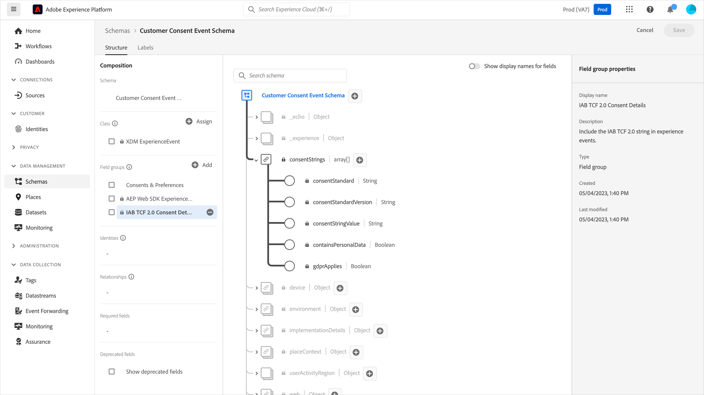

For the Platform consent standard v2.0, we'll also need access to Adobe Experience Profile to create an XDM Individual Profile schema and dataset. For a tutorial on schema creation, see [Create a schema using the Schema Editor](https://experienceleague.adobe.com/docs/experience-platform/xdm/tutorials/create-schema-ui.html?lang=en#tutorials) and for the required Preference Details profile field group see [XDM documentation](https://experienceleague.adobe.com/docs/experience-platform/landing/governance-privacy-security/overview.html?lang=en).

This tutorial assumes you have access to Data Collection and have created a client-side tag property with the Web SDK extension installed and a working library created and built for development. These topics are detailed and demonstrated in these documents:

* [Create or configure a property](https://experienceleague.adobe.com/docs/experience-platform/tags/admin/companies-and-properties.html?lang=en#create-or-configure-a-property)
* [Overview of libraries](https://experienceleague.adobe.com/docs/experience-platform/tags/publish/libraries.html)
* [Publishing overview](https://experienceleague.adobe.com/docs/experience-platform/tags/publish/overview.html)
 
We'll also use the [Platform Debugger](https://chrome.google.com/webstore/detail/adobe-experience-platform/bfnnokhpnncpkdmbokanobigaccjkpob) Chrome extension to inspect and validate our implementation.
 
To implement the IAB TCF example with a CMP on your own site, you'll need access to a CMP like OneTrust or Sourcepoint to generate the data they provide, or you can simply follow along here and see the results below.
 
## Using the Web SDK with the Adobe Consent Standard (v1.0 or v2.0)

>[!NOTE]
>
>The 1.0 standard is being phased out in favor of v2.0. The 2.0 standard allows you to add additional consent data that can be used to manually enforce consent preferences. The screenshots below of the Platform Web SDK extension are from version [2.4.0](https://experienceleague.adobe.com/docs/experience-platform/edge/release-notes.html?lang=en#version-2.4.0) of the extension which is compatible with either v1.0 or v2.0 of the Adobe Consent Standard.

For more information on these standards, see [Supporting customer consent preferences](https://experienceleague.adobe.com/docs/experience-platform/edge/consent/supporting-consent.html).
 
### Step 1: Configure Consent in the Web SDK extension
 
After we've installed the Platform Web SDK extension in a tag property, we can configure the options for addressing consent data on the extension configuration screen:
 
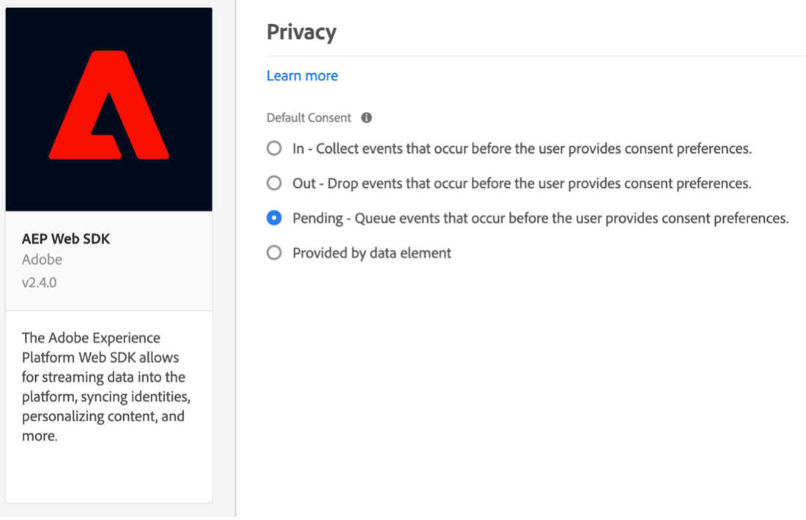
 
The "Privacy" section sets the consent level for the SDK if the user has not previously provided consent preferences. This sets the default state for consent and event data collection in the SDK. The chosen setting answers the question of "what should the SDK do if the user has not yet provided explicit consent preferences?"
 
* In - Collect events that occur before the user provides consent preferences.
* Out - Drop events that occur before the user provides consent preferences.
* Pending - Queue events that occur before the user provides consent preferences.
* Provided by data element
 
If the default consent setting is "In", this tells the SDK that it should not wait for explicit consent and it should collect the events that occur before the user provides consent preferences. These preferences are typically handled and stored in a CMP.

If the default consent setting is "Out", this tells the SDK that it should not collect any events that occur before the user opt-in preferences are set. Visitor activity that occurs before setting the consent preference will not be included in any data sent by the SDK after consent is set. For example, if you scroll and view a web page before you select the consent banner, and this "Out" setting is used, that scroll activity and viewing time will not be sent if the user later provides explicit consent for data collection.

If the default consent setting is "Pending", the SDK will queue any events that occur before the user provides consent preferences, so the events may be sent after consent preferences are set, and after the SDK is initially configured during a visit.
 
With this "Pending" setting, attempting to execute any commands that require user opt-in preferences (for example, the event command) will result in the command being queued within the SDK. These commands are not processed until you have communicated the user's opt-in preferences to the SDK.
 
Once a CMP collects the user's preferences, then we can communicate those preferences to the SDK. In a later section below, we'll see how to obtain that opt-in data and use it with the Web SDK extension.

"Provided by data element" allows us to access a data element containing any consent preference data captured by custom code or a CMP on your site, or in your data layer. A data element used for this purpose should resolve to "in", "out", or "pending".

Please note: this configuration setting for the SDK is not persisted to users' profiles, it is specific to setting the behavior of the SDK before explicit consent preferences are provided by the visitor.
 
To learn more about configuring the Web SDK extension see the [Platform Web SDK extension overview](https://experienceleague.adobe.com/docs/experience-platform/edge/extension/web-sdk-extension-configuration.html?lang=en#configure-the-extension) and [Supporting customer consent preferences](https://experienceleague.adobe.com/docs/experience-platform/edge/consent/supporting-consent.html).
 
For this example, let's choose the option for "Pending" and select **Save** to save our configuration settings.

### Step 2: Communicating Consent Preferences 

Now that we've set the default behavior of the SDK, we can use tags to send a visitor's explicit consent preferences to Platform. Sending consent data using the Adobe 1.0 or 2.0 standard is easily implemented using the setConsent action of the Web SDK in your tag rules.

#### Setting Consent with the Platform Consent Standard 1.0

Let's create a rule to demonstrate this. In your Platform tag property, select Rules, then on the blue Add Rules button. Let's name the Rule "setAdobeConsent" and select to add an Event. For the Event Type, choose "Window Loaded" which will trigger this rule whenever a page is loaded on our website. Next, under "Actions" select "Add" to open the action configuration screen. This is where we'll set the consent data. Select the "Extension" dropdown and select "Platform Web SDK", then select the "Action Type" and select "Set Consent".

Under "Consent Information", choose "Fill out a form". In this rule action, we'll use the Web SDK to set consent for the Adobe 1.0 consent standard by filling in the form displayed:
 
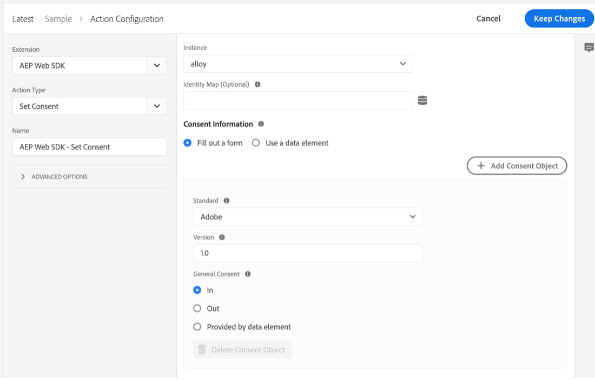
 
We can choose to pass "In", "Out", or "Provided by data element" with this Set Consent action. A data element here should resolve to "in" or "out".

In this example, we'll select "In" to indicate the visitor has consented to allowing the Web SDK to send data to Platform. Select the blue "Keep Changes" button to save this action, then "Save" to save this rule.

Note:  Once a website visitor has opted out, the SDK will not allow you to set the users consent to in.
 
Your tag rules can be triggered by a variety of built-in or custom [events](https://experienceleague.adobe.com/docs/experience-platform/tags/extensions/adobe/core/overview.html?lang=en) which can be used to pass this consent data at the appropriate time during a visitor session. In the above example, we used the window loaded event to trigger the rule. In a later section, we'll use a consent preference event from a CMP to trigger a Set Consent action. You can use a Set Consent action in a rule triggered by any event you prefer that indicates an opt-in preference setting.

#### Setting Consent with the Platform Consent Standard 2.0

Version 2.0 of the Platform consent standard works with [XDM](https://experienceleague.adobe.com/docs/platform-learn/tutorials/schemas/schemas-and-experience-data-model.html) data. It also requires adding a Privacy Details field group to your profile schema in Platform. See [Consent processing in Platform](https://experienceleague.adobe.com/docs/experience-platform/landing/governance-privacy-security/consent/adobe/overview.html) for more information on the Adobe standard version 2.0 and this field group.

We'll create a custom code data element to pass data to the collect and metadata properties of the consents object shown in the schema below:

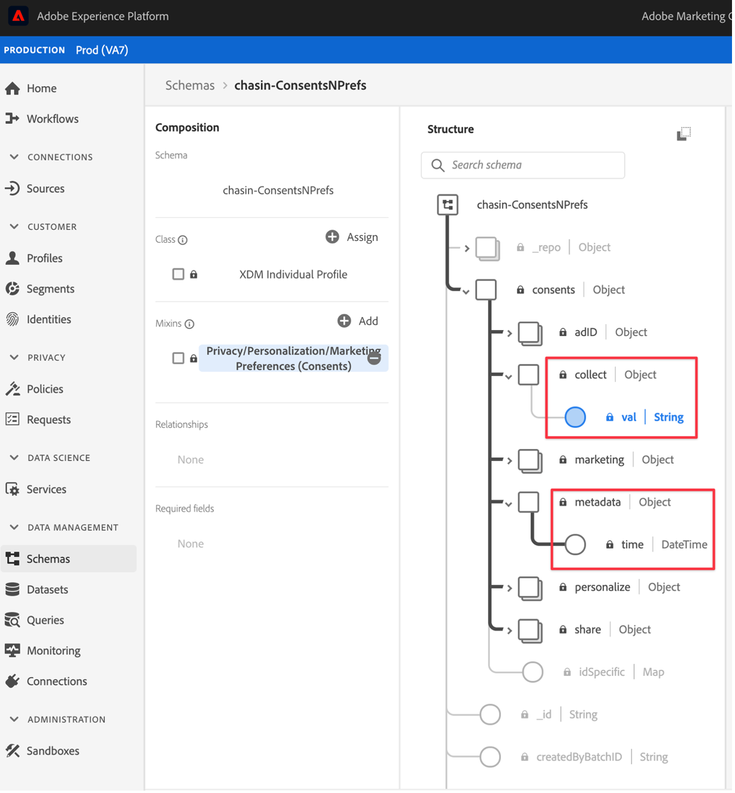

This Preference Details field group contains fields for the [Consents & Preferences XDM data type](https://experienceleague.adobe.com/docs/experience-platform/xdm/data-types/consents.html?lang=en#prerequisites) which will contain the consent preference data we send to Platform with the Platform Web SDK extension in our rule action. Currently, the only required properties to implement the Platform Consent Standard 2.0 are the collect value (val) and the metadata time value, highlighted above in red.

Let's create a data element for this data. Select Data Elements and the blue Add Data Element button. Let's call this "xdm-consent 2.0" and using the Core extension, we'll select a Custom Code type. You can enter or copy and paste the following data into the custom code editor window:

```js
var dateString = new Date().toISOString();

return {
  collect: {
    val: "y"
  },
  metadata: {
    time: dateString
  }
}
```

The time field should specify when the user last updated their consent preferences. We're creating a timestamp here as an example using a standard method on the JavaScript Date object. Select save to save the custom code and select save again to save the data element.

Next, let's select Rules, and then the blue Add Rule button and enter the name "setConsent onLoad - Consent 2.0". Let's choose the Window Loaded event as our rule trigger, then select Add under Actions. Choose the Platform Web SDK Extension, and for Action Type, choose Set Consent. The Standard should be Adobe and Version should be 2.0. For Value, we'll use the data element we just created that contains the collect and time values we need to send to Platform:


To review this example action, we're calling Set Consent from the Platform Web SDK extension and passing in the Standard and the Version from the form, while passing the values for collect and time from the data element we created earlier.

Select the blue Save button, and again to save the rule.

We now have two rules, one for each of the Platform Consent standards. In practice, you will likely choose one standard across your site(s). Next, we'll create an example using the IAB TCF 2.0 consent standard.
 
## Using the Web SDK with the IAB TCF 2.0 Consent Standard 
 
You can learn more about version 2.0 of the IAB Transparency and Consent Framework at the [IAB Europe website](https://iabeurope.eu/transparency-consent-framework/).

To set the consent preference data using this standard, we need to add the Privacy Details field group to our Experience Event schema in Platform:

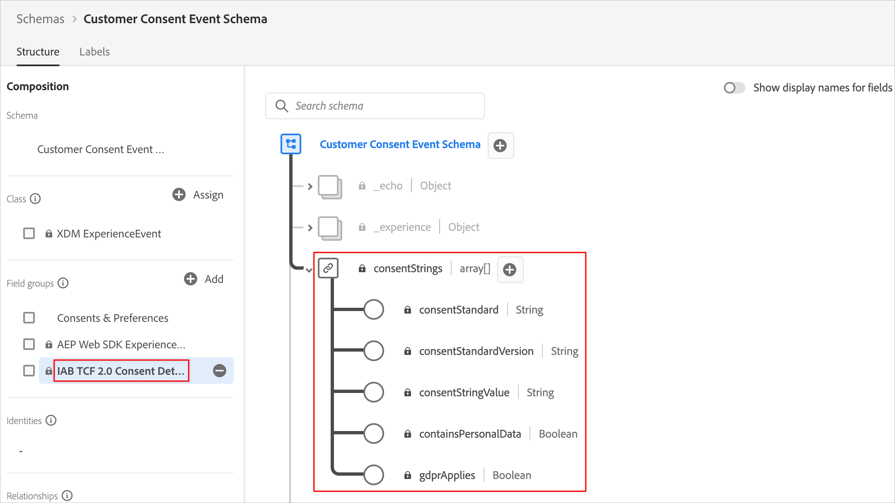

This field group contains the consent preference fields required by the IAB TCF 2.0 standard. For more on schemas and field groups, see the [XDM System Overview](https://experienceleague.adobe.com/docs/experience-platform/xdm/home.html?lang=en).

### Step 1: Create a Consent Data Element
 
In order to send consent event data from tags using the IAB TCF 2.0 consent standard, we first set up an xdm data element with the required consent fields:
 
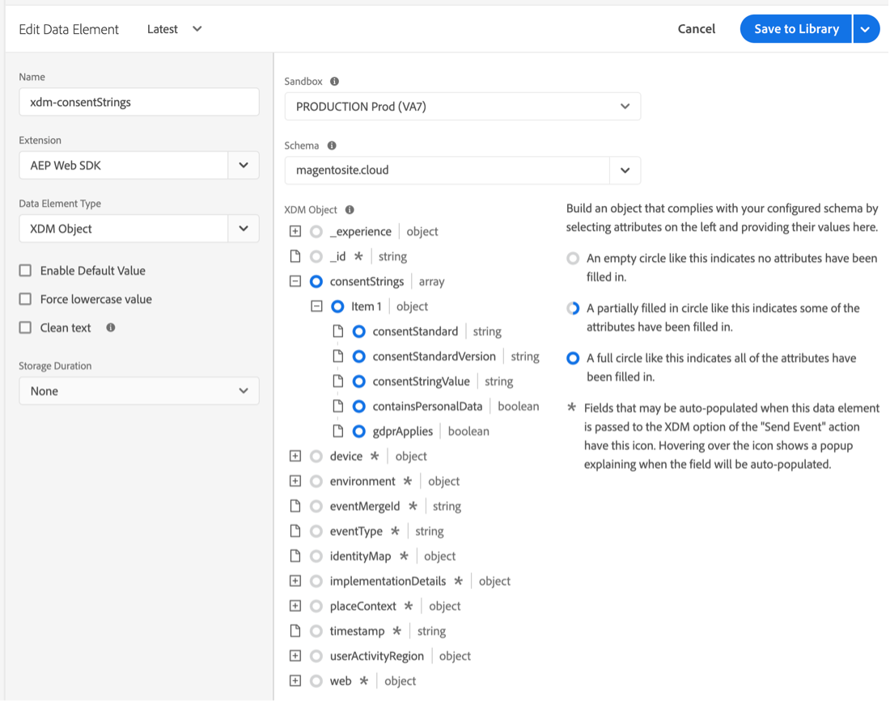
 
In your tags client-side property, select Data Elements and the blue "Add Data Element" button. We'll name this data element "xdm-consentStrings" for this example. These xdm fields will contain the user consent data required for the IAB TCF 2.0 standard.
 
In the Extension dropdown menu, choose "Platform Web SDK", and for Data Element Type, choose "XDM Object". The xdm mapper should appear, allowing you to select and expand the "consentStrings" item as shown in the screenshot above.
 
We'll set each of the consentStrings as follows:
 
* **`consentStandard`**:  `IAB TCF`
* **`consentStandardVersion`**:  `2.0`
* **`consentStringValue`**:  `%IAB TCF Consent String%`
* **`containsPersonalData`**:  `False` (chosen from the Select Value button)
* **`gdprApplies`**:  `%IAB TCF Consent GDPR%`
 
The consentStandard and consentStandardVersion are both just strings of text for the standard we're using, which is IAB TCF version 2.0. The consentStringValue references a data element named "IAB TCF Consent String". The percent signs surrounding the text indicate the name of a data element, and we'll look at that in a moment. The containsPersonalData property indicates whether the IAB TCF 2.0 consent string contains any personal data with either "True" or "False". The gdprApplies field indicates either "true" for GDPR applies, "false" for GDPR does not apply, or "undefined" for unknown whether GDPR applies. Currently, the Web SDK will treat "undefined" as "true", so consent data sent with "gdprApplies: undefined" will be treated as if the visitor is located in an area where GDPR does apply.

See the [consent documentation](https://experienceleague.adobe.com/docs/experience-platform/edge/consent/iab-tcf/with-launch.html?lang=en#getting-started) for more on these properties and on IAB TCF 2.0 in tags.
 
### Step 2: Create a Rule to Set Consent with the IAB TCF 2.0 Standard
 
Next, we create a rule to set consent with the Web SDK when consent data for this standard is set or changed by a website visitor. In this rule, we'll also see how to capture those consent change signals from a CMP like [OneTrust](https://www.onetrust.com/products/cookie-consent/) or [Sourcepoint](https://www.sourcepoint.com/cmp/).
 
#### Add a rule event
 
Select the Rules section in your Platform tag property, then on the blue Add Rule button. Let's name the rule setConsent – IAB and select Add under Events. Let's name this event tcfapi addEventListener and select Open Editor to open the custom code editor.
 
Copy and paste the following code into your editor window:

```js
// Wait for window.__tcfapi to be defined, then trigger when the customer has completed their consent and preferences.
function addEventListener() {
  if (window.__tcfapi) {
    window.__tcfapi("addEventListener", 2, function (tcData, success) {
      if (success && (tcData.eventStatus === "useractioncomplete" || tcData.eventStatus === "tcloaded")) {
        // save the tcData.tcString properties in data elements
        _satellite.setVar("IAB TCF Consent String", tcData.tcString);
        _satellite.setVar("IAB TCF Consent GDPR", tcData.gdprApplies);
        trigger();
      }
    });
  } else {
    // window.__tcfapi wasn't defined. Check again in 100 milliseconds
    setTimeout(addEventListener, 100);
  }
}
addEventListener();
```

This code simply creates and executes a function called addEventListener. The function checks to see if the window.__tcfapi object exists, and if it does, it adds an event listener according to the specifications of the API. You can read more about those specs in the [IAB repo](https://github.com/InteractiveAdvertisingBureau/GDPR-Transparency-and-Consent-Framework) on GitHub. If this event listener is added successfully, and the website visitor has completed their consent and preferences choices, the code sets tags custom variables for the tcData tcString, and the indicator for GDPR regions. Again, to learn more about the IAB TCF, see the IAB [website](https://iabeurope.eu/transparency-consent-framework/) and [GitHub repo](https://github.com/InteractiveAdvertisingBureau/GDPR-Transparency-and-Consent-Framework) for technical details. After setting those values, the code executes the trigger function which triggers this rule to run.
 
If the window.__tcfapi object did not exist the first time this function was executed, the function will check for it again every 100 milliseconds, so the event listener can be added. The last line of code simply executes the addEventListener function defined in the lines of code above it.

To summarize, we created a function to check for the status of consent that a website visitor sets using a CMP (or custom) consent banner. When that consent preference is set, this code creates two custom variables (custom code data elements) that we can use in our rule action. After pasting the above code into the custom code editor window of our event, select the blue Save button to save the rule event.

Let's now set up the Set Consent rule action to use these values and send them to Platform. 

#### Add a rule action

Select Add in the Actions section. Under Extension, choose Platform Web SDK from the dropdown. Under Action Type, choose Set Consent. Let's name this action setConsent.
 
In the action configuration under Consent Information, choose Fill out a form. For Standard, choose IAB TCF, and for Version enter 2.0. For the Value, we'll use the custom variable from our event and enter %IAB TCF Consent String% which comes from the [tcData](https://github.com/InteractiveAdvertisingBureau/GDPR-Transparency-and-Consent-Framework/blob/master/TCFv2/IAB%20Tech%20Lab%20-%20CMP%20API%20v2.md#tcdata) we captured in our rule event custom function above.
 
Under GDPR Applies we'll use the other custom variable from our event and enter %IAB TCF Consent GDPR% which also comes from the tcData we captured in our rule event custom function above. If you know that GDPR definitely will or will not apply for visitors to this website, you can select Yes or No, as applicable, instead of using the custom variable (data element) choice. You could also use conditional logic in a data element to check if GDPR applies and return the appropriate value.
 
Under GDPR Contains Personal Data, select the option to indicate whether or not the data for this user contains personal data. A data element here should resolve to true or false.

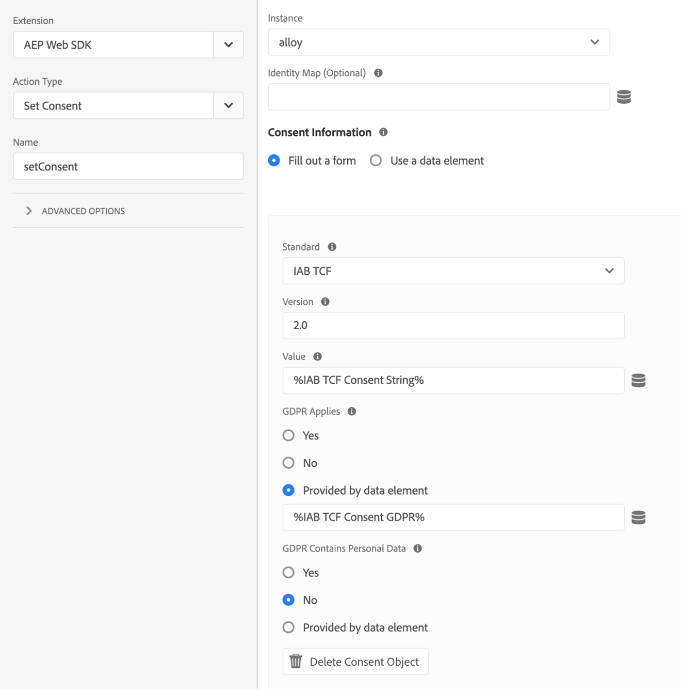
 
Select the blue Save button to save the action and the blue Save (or Save to Library) button to save the rule. At this point you have successfully implemented the data element and rule in tags to set consent using the Web SDK extension with the IAB TCF 2.0 consent standard.
 
### Step 3: Save to Library and Build
 
If you're using the [working library](https://experienceleague.adobe.com/docs/platform-learn/implement-in-websites/configure-tags/add-data-elements-rules.html?lang=en#use-the-working-library-feature) prerequisite, you have already saved these changes and built your development library:
 
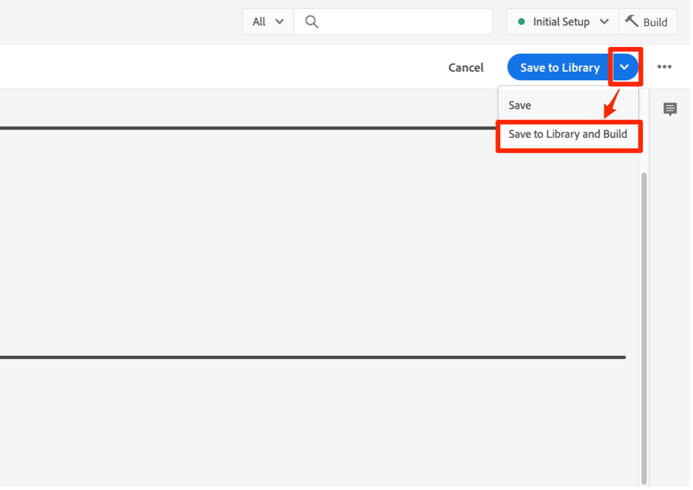
 
### Step 4: Inspect and validate data collection
 
On our site, we refresh the page and confirm the library build in the [Debugger](https://chrome.google.com/webstore/detail/adobe-experience-cloud-de/ocdmogmohccmeicdhlhhgepeaijenapj) Chrome extension, in the tags menu section:
 
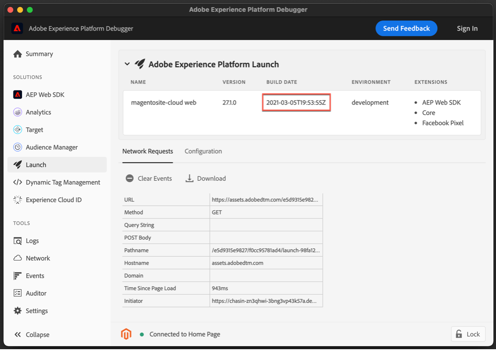
 
We can also inspect the setConsent call for the Adobe 1.0 or 2.0 standards in the debugger Platform Web SDK section, by selecting on the POST Body line in the network request where you see `{"consent":[{"value":{"general":"in"},"version…`:
 
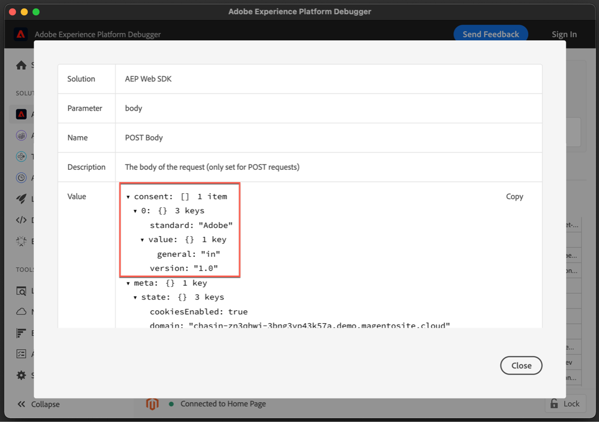
 
To validate the setConsent call and our rule for the IAB TCF 2.0 standard, we'll use the OneTrust consent banner on our test site to set our consent preferences and create the tcData described earlier:
 
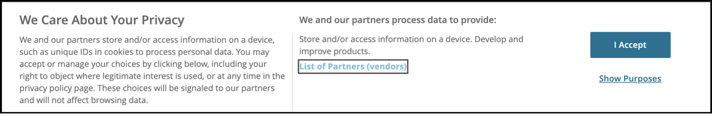
 
After selecting "I Accept", we can inspect the setConsent call for the IAB TCF 2.0 standard in the debugger Platform Web SDK section, by selecting on the POST Body line in the network request where you see `{"consent":[{"value":"someAlphaNumericCharacters…`.

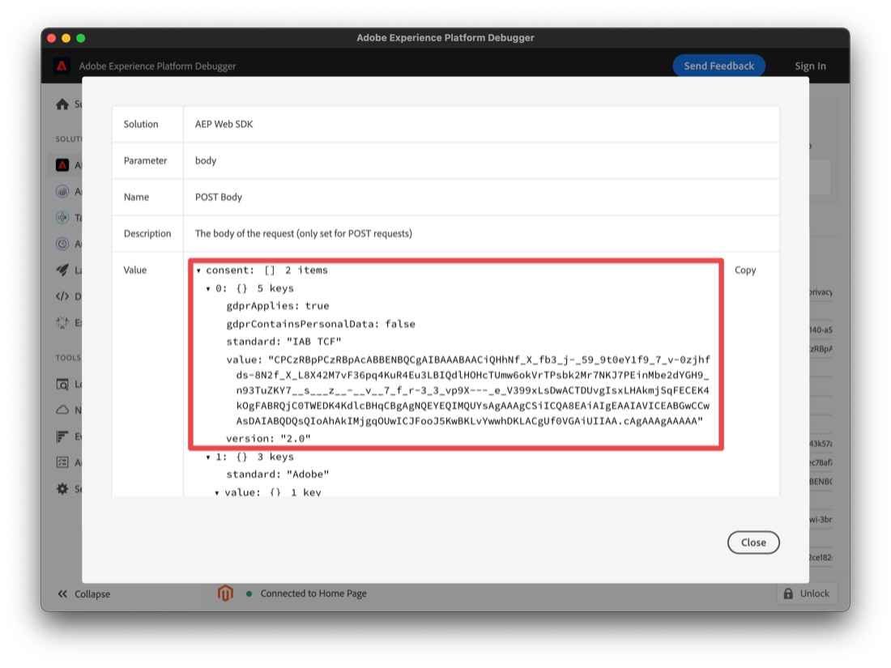
 
Here we see the data we set up earlier in our data elements and tag rule. The value property contains the encoded tcString data we saw earlier.

OneTrust, Sourcepoint and other CMPs that implement the IAB TCF 2.0 standard will all produce similar data in our pages. We can capture that data and use it with the Web SDK extension in tags using the custom code event in the rule we created above. The custom code will be the same regardless of the CMP used to generate the IAB TCF 2.0 data. The custom code can also be used with either of the Platform Consent standards (1.0 or 2.0).

## Sending Consent Data with Experience Events 

You may have noticed that we did not reference the "xdm-consentStrings" data element we created earlier in a data element field in either of our rules. This data element is for use when you need to send consent data with an Experience Event.


Since this data element contains all of the fields required for the IAB TCF 2.0 standard, you can simply reference the data element when sending this xdm data with your Experience Events:

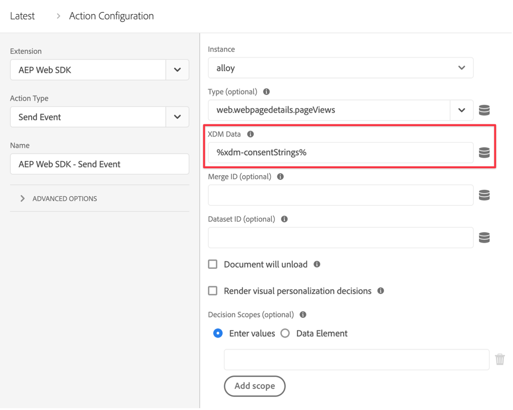

## Conclusion
 
Now that we have inspected and validated the data, you should see how to implement and activate consent data obtained from a CMP using the Platform Web SDK extension for Platform.
