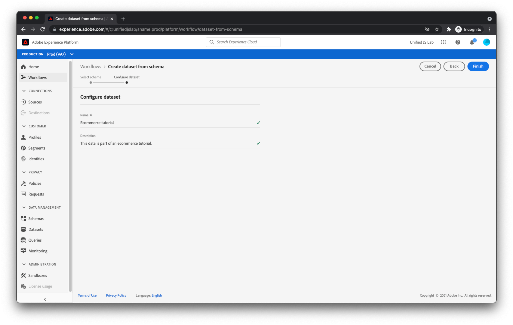

# Create a dataset

In addition to describing the data you'll be sending into Adobe Experience Platform, you need a place to persist the data. In Adobe Experience Platform, these buckets where you can put data are called datasets. 

To create a dataset, navigate to the [!UICONTROL Datasets] view inside Adobe Experience Platform.

Click [!UICONTROL Create dataset] in the top-right corner.

During the dataset creation process, select [!UICONTROL Create dataset from schema] and select [the schema you previously created](create-a-schema.md).

Click [!UICONTROL Next] and provide a name and a description.

Click [!UICONTROL Finish]. Your dataset has been created and is ready to receive data.

As you begin to send data into a dataset, Adobe Experience Platform will validate that the data you're attempting to place into the dataset conforms to the applied schema. If the data does not conform to the schema, the data is rejected and is not placed into the dataset. As a result of this validation step, consumers of the dataset (Adobe products, third parties, or your own company) can have some level of certainty regarding the structure and cleanliness of the dataset's data.

For more information about creating datasets, see [Datasets UI guide](https://experienceleague.adobe.com/docs/experience-platform/catalog/datasets/user-guide.html).
