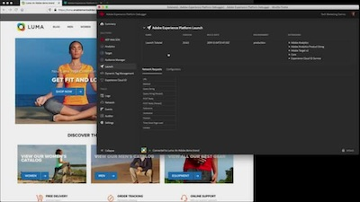
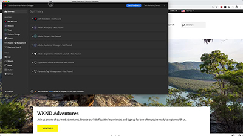
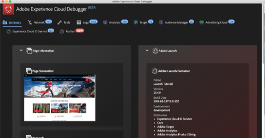

# Adobe Experience Platform Debugger Tutorials

## What's New

* **[Introduction to the Experience Platform Debugger (Video)](platform-debugger/introduction-to-the-experience-platform-debugger.md)**
    *Power end-to-end engagement in your mobile apps.*

* **[Debug a Launch Implementation (Tutorial)](https://experienceleague.adobe.com/docs/experience-manager-learn/sites/integrations/experience-platform-launch/debug-launch-implementation.html)**
    *An introduction to common tools and techniques used to debug a Launch implementation*

## Staff Picks

<table>
<tr>
  <td>
    
    

      <a href="platform-debugger/introduction-to-the-experience-platform-debugger.md">
    <strong>Introduction to the Experience Platform Debugger</strong>
    </a>
    

    

    <em>Examine your web implementations with the new extension for Chrome and Firefox</em>
    

  </td>
  <td>
    
    

      <a href="https://experienceleague.adobe.com/docs/experience-manager-learn/sites/integrations/experience-platform-launch/debug-launch-implementation.html">
    <strong>Debug a Launch Implementation</strong>
    </a>
    

    

    <em>An introduction to common tools and techniques used to debug a Launch implementation</em>
    

  </td>
  <td>
    
    

      <a href="cloud-debugger/use-the-experience-cloud-debugger.md">
    <strong>Use the Adobe Experience Cloud Debugger</strong>
    </a>
    

    

    <em>Examine your web implementations</em>
    

  </td>
</tr>
</table>