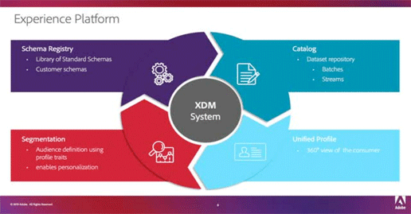
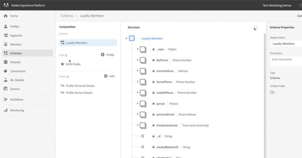
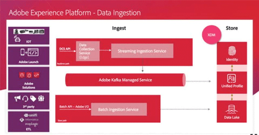
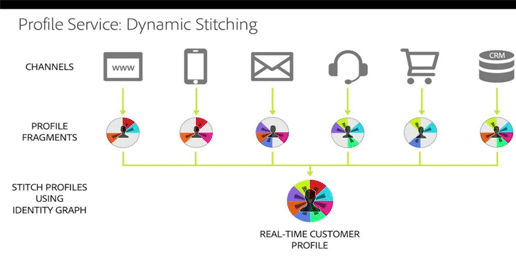
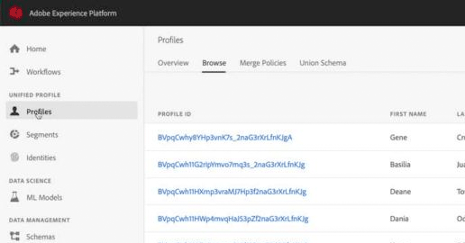
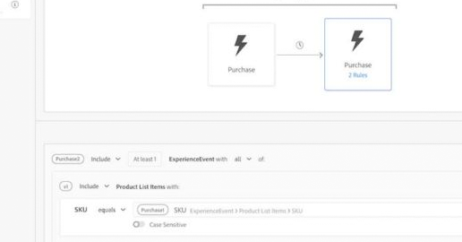

# Adobe Experience Platform Tutorials

## Schemas

<table>
<tr>
  <td> <a href="schemas/understanding-the-xdm-system-and-experience-data-model.md">Understanding the XDM System</a></td>
  <td> <a href="schemas/create-your-first-schema-with-out-of-the-box-components.md">Create your first Schema</a></td>
  <td> <a href="schemas/create-your-own-mixins-and-classes.md">Create your own Mixins and Classes</a></td>
  <td> </td>
</tr>
</table>

## Data Ingestion

<table>
<tr>
  <td> <a href="datasets/understanding-data-ingestion.md">Understanding Data Ingestion</a></td>
  <td> <a href="datasets/create-datasets-and-ingest-data.md">Create Datasets and Ingest Data</a></td>
  <td> </td>
  <td> </td>
</tr>
</table>

## Profiles

<table>
<tr>
  <td> <a href="profiles/understanding-the-real-time-customer-profile.md">Understanding the Real-time Customer Profile</a></td>
  <td> <a href="profiles/bring-data-into-the-real-time-customer-profile.md">Bring Data into Unified Profile</a></td>
  <td> </td>
  <td> </td>
</tr>
</table>

## Segments

<table>
<tr>
  <td> <a href="segments/create-segments.md">Create Segments</a></td>
  <td> <a href="segments/create-advanced-segments.md">Create Dynamic Segments</a></td>
  <td> </td>
  <td> </td>
</tr>
</table>